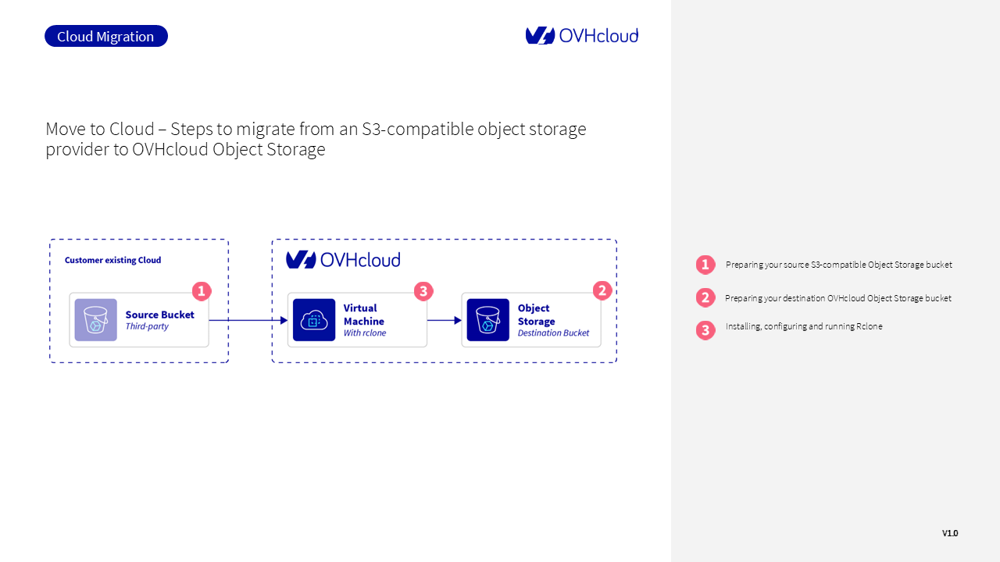

## Objectif
  
Ce guide fournit des étapes détaillées pour vous aider à migrer d'un fournisseur de stockage objet tiers compatible S3 vers OVHcloud Object Storage en utilisant  [Rclone](https://rclone.org/){.external}, un outil en ligne de commande très populaire qui peut être utilisé pour gérer les ressources de stockage cloud.

> [!warning]
>
> OVHcloud fournit des services dont vous êtes responsable en ce qui concerne leur configuration et leur gestion. Vous êtes donc responsable de vous assurer qu'ils fonctionnent correctement.
>
> Ce guide est conçu pour vous aider dans les tâches courantes autant que possible. Si vous rencontrez des difficultés pour effectuer ces actions, veuillez contacter un [fournisseur de services spécialisés](/links/partner) et/ou discuter du problème avec notre [communauté d'utilisateurs](/links/community). OVHcloud ne peut pas vous fournir de support technique à cet égard.
>

## Exigences

-	Un **bucket source compatible S3** dans votre stockage objet actuel avec :
    - Le nom de votre bucket
    - Les clés d'accès et secrètes associées
    - L'ID de la région associée

- Un **bucket de destination OVHcloud Object Storage** avec :
  - Le nom de votre bucket
  - Les clés d'accès et secrètes associées
  - L'ID de la région associée

- **Une machine virtuelle OVHcloud** avec Rclone installé en tant que station de contrôle dans notre scénario. Pour obtenir les meilleurs résultats, et en prenant en compte votre budget, nous suggérons au moins les spécifications suivantes :

    - b3-16 : 4 v-cores et 16 Go de RAM
    - c3-16 : 8 v-cores et 16 Go de RAM


> [!primary]
>
> Si c'est la première fois que vous créez un bucket Object Storage, consultez [Premiers pas avec Object Storage](/pages/storage_and_backup/object_storage/s3_getting_started_with_object_storage).
>
  
## Processus de migration

{.thumbnail}

Voir le diagramme ci-dessus pour une illustration de l'architecture. Une machine virtuelle OVHcloud Public Cloud agit en tant que point d'entrée, sur laquelle Rclone (installé avec SSH et sudo activé) déplace les données vers OVHcloud Object Storage.
 
## Considérations

### Egress
Des frais d'egress peuvent s'appliquer lors de la migration de votre plateforme actuelle, selon votre fournisseur source. Le terme « egress » décrit le volume de données transférées du réseau de ce fournisseur. **Nous vous recommandons vivement de consulter les tarifs d'egress de votre fournisseur actuel** avant de commencer la migration.

### Optimisation de la vitesse de migration
Gardez à l'esprit que plusieurs facteurs peuvent impacter la durée de la migration. Considérez non seulement le volume de données que vous prévoyez de migrer, mais également la quantité et la taille des objets individuels. Les limitations d'infrastructure et de réseau (bande passante, puissance de calcul, interfaces réseau, etc.) peuvent également affecter les performances.

### Volume de données
Ce guide se concentre principalement sur la **migration de données pour des volumes petits à moyens (généralement inférieurs à 200 To)**. Pour les applications nécessitant la migration de centaines ou de milliers de téraoctets, nous suggérons de contacter notre équipe de services professionnels pour identifier les meilleures approches pour migrer vos données.

## Instructions 

### Étape 1 - Préparation de votre bucket source S3-compatible

Comme expliqué précédemment, vous aurez besoin de votre `access key`, `secret key` mais également du `region ID` de la région dans laquelle se trouve votre bucket. Connectez-vous à la console de votre fournisseur de bucket source pour obtenir ces détails.


### Étape 2 - Préparation de votre bucket de destination OVHcloud

De même que pour votre bucket source, vous aurez besoin de votre clé d'accès, clé secrète mais également du `region ID` de la région dans laquelle se trouve votre bucket de destination. Connectez-vous à la [console OVHcloud](/links/manager) et accédez à la section `Object Storage`{.action} pour collecter ces détails.

### Étape 3 - Installation, configuration et exécution de Rclone

#### Étape 3.1 - Installation de Rclone
Si vous ne l'avez pas déjà fait, installez **Rclone** en suivant les instructions de la [documentation](https://rclone.org/install/){.external}, en fonction de votre configuration de système d'exploitation.

#### Étape 3.2 - Configuration de Rclone
Après avoir installé **Rclone** sur votre machine virtuelle, configurez sa connexion aux buckets source et de destination.

```bash
$ rclone config
```
Cette commande ouvrira le menu de configuration et vous guidera étape par étape pour la configuration. La configuration du fournisseur OVHcloud est disponible et vous guidera étape par étape. Suivez les étapes disponibles [ici](https://rclone.org/s3/#ovhcloud){.external}. Vous pouvez également créer/modifier le fichier de configuration vous-même avec la commande suivante :

```bash
$ rclone config file
```
Si le fichier de configuration n'existe pas, vous serez invité à ajouter les blocs de configuration suivants en utilisant votre éditeur préféré. Par exemple, sous Linux, vous pouvez utiliser `nano` :

```bash
$ nano /home/<your linux user>/.config/rclone/rclone.conf
```
Ajoutez ensuite vos blocs de configuration :

```bash
[<your source remote provider name>]
type = s3
provider = <name of your source provider in rclone list>
env_auth = false
access_key_id = <your source provider access key>
secret_access_key = <your source provider secret key>
region = <your source provider region name>

[ovhcloud]
type = s3
provider = OVHcloud
env_auth = false
access_key_id = OVH-ACCESS-KEY
secret_access_key = OVH-SECRET-KEY
endpoint = s3.<region>.io.cloud.ovh.net
region = <region>
```

> [!primary]
>
> Pour obtenir la liste des endpoints des régions OVHcloud, consultez [Object Storage - Endpoints and disponibilités géographiques](/pages/storage_and_backup/object_storage/s3_locations).
>

Vous pouvez ensuite tester vos connexions source et OVHcloud en utilisant la commande `rclone config`  comme suit :

```bash
$ rclone config
```
#### Étape 3.3 - Exécution de Rclone

En fonction de votre stratégie, vous pouvez utiliser deux commandes différentes pour démarrer la migration. Vous pouvez utiliser la commande `rclone sync` pour démarrer la migration d'un ou de plusieurs buckets. Comme expliqué dans la documentation, la commande `rclone sync` rendra les buckets source et de destination identiques. 
Vous pouvez également utiliser la commande `rclone copy` pour copier les fichiers de votre source vers votre destination.
Dans les deux cas, n'oubliez pas de remplacer `source-bucket-name` et `ovh-bucket-name` par les noms de vos buckets source et de destination, respectivement :


```bash
$ rclone sync <your source provider name>:source-bucket-name/ ovhcloud:ovh-bucket-name/ --progress
```
ou

```bash
$ rclone copy <your source provider name>:source-bucket-name/ ovhcloud:ovh-bucket-name/ --progress
```
`--progress` affiche la progression pendant le transfert

Pour utiliser la WebUI de Rclone, vous pouvez également utiliser la commande suivante :

```bash
$ rclone copy <your source provider name>:source-bucket-name/ ovhcloud:ovh-bucket-name/ --transfers 50 --rc --rc-addr :5572 --rc-web-gui --rc-user USERNAME --rc-pass PASSWORD
```
Dans cette commande, nous avons ajouté des options spécifiques pour optimiser et surveiller la copie :

- `--transfers` représente le nombre de transferts de fichiers à exécuter en parallèle (par défaut 4). Testez différentes valeurs en fonction de votre cas d'utilisation et de votre configuration, car des valeurs élevées peuvent augmenter l'utilisation du processeur, par exemple.
- `--rc` active le serveur de contrôle à distance
- `--rc-addr :5572` représente l'adresse et le port utilisés pour accéder à l'interface web de Rclone. Le port 5572 est le port par défaut utilisé par Rclone pour accéder de manière sécurisée à l'interface web.
- `--rc-web-gui` lance l'interface web sur localhost
- `--rc-user USERNAME` `--rc-pass PASSWORD`  sont vos identifiants et mot de passe pour l'authentification. Assurez-vous de saisir les informations d'identification correctes.

> [!primary]
>
> De nombreuses autres options sont disponibles avec Rclone. Vous pouvez les consulter dans la [documentation](https://rclone.org/commands/rclone/){.external}.
>
 
Avec le processus désormais configuré, vous pouvez maintenant commencer à surveiller le processus de migration en utilisant l'interface web de Rclone.

Dans votre navigateur web préféré, utilisez le port 5572 pour accéder à l'adresse de votre instance : `http://IP-ADDRESS:5572`{.action} 

Vous devrez vous connecter en utilisant vos identifiants Rclone : `--rc-user` and `–rc-pass`.
Une fois connecté, vous pouvez suivre la progression de la commande `rclone copy` : vérifiez le statut de la tâche, le débit, la bande passante, le nombre d'objets et le volume total de données. À partir de l'interface web, vous pouvez également gérer de nouveaux remotes et de nouvelles actions.

#### État de la migration

Nous vous recommandons de comparer les buckets source et de destination après la migration. Vos buckets source et de destination OVHcloud peuvent être comparés via la ligne de commande ou leurs consoles respectives.

Vous pouvez également vérifier la taille des deux buckets et le nombre d'objets en utilisant cette commande :

```bash
rclone size <your source provider name>:source-bucket-name/
rclone size ovhcloud:ovh-bucket-name/
```

## Allez plus loin
 
Si vous avez besoin d'une formation ou d'une assistance technique pour la mise en oeuvre de nos solutions, contactez votre commercial ou cliquez sur [ce lien](/links/professional-services) pour obtenir un devis et demander une analyse personnalisée de votre projet à nos experts de l’équipe Professional Services.

Échangez avec notre [communauté d'utilisateurs](/links/community).

