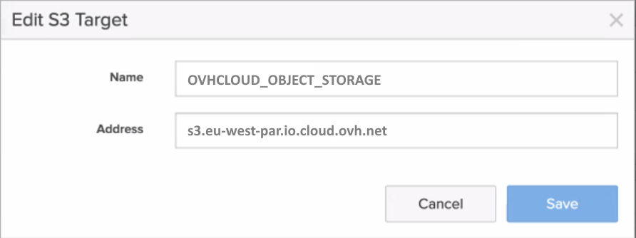

 
## Objective

This guide aims to help you configure and use OVHcloud Object Storage as a replication target for Pure Storage "[Flashblade unified storage platform](https://www.purestorage.com/uk/products/unstructured-data-storage/flashblade-s.html){.external}".

It covers how you can easily configure, manage and start replicating Pure Storage FlashBlade S31-compatible objects to OVHcloud Object Storage.

## Requirements

- An OVHcloud Object Storage container/bucket.
- A user with the required access rights on the bucket.
- Your Object Storage credentials (access_key and secret_access_key).

See our [Getting started with Object Storage](/pages/storage_and_backup/object_storage/s3_getting_started_with_object_storage) guide.
  
## Instructions
  
### Create an S3-compatible Target Connection

1\. Sign in to the PureStorage FlashBlade GUI.

2\. Go to the `Storage`{.action} section and then `Array`{.action}.

3\. Click the "+" button next to `S3 Target Connections` to create a cloud object storage Target Connections.

4\. Name the connection, for example with OVHCLOUD_OBJECT_STORAGE and add the associated OVHcloud Object Storage endpoints in the `Address` field.

{.thumbnail}

The list of all OVHcloud Object Storage endpoints can be found [here](/pages/storage_and_backup/object_storage/s3_location).

### Add Remote Cloud Object Storage Credentials

5\. Go to the `Protection`{.action} section and then click on `Object Replica Links`{.action}.

6\. Click the "+" button to add remote credentials for object replication.

7\. Select `OVHCLOUD_OBJECT_STORAGE`{.action} for Remote Array.

8\. Add the name of your connection, for example "OVHcloud_credentials", and add your Access and Secret keys from the OVHcloud control panel.

9\. Confirm by clicking on `Create`{.action} and your remote credentials will be created. 

{.thumbnail}

### Create a bucket that will be replicated to OVHcloud Object Storage

10\. If not already done, go to the `Storage`{.action} section, then `Object Storage`{.action} and finally `Accounts`{.action} to create the account.

11\. Configure the different parameters: `account name`, `quota limit` and `bucket default quota limit` to create the account.

12\. Click the `Buckets`{.action} section and select the account name.

13\. Enter a bucket name "OVHcloud-source-2025" and click on `Create`{.action}.

### Setup the Bucket Replication to OVHcloud Object Storage

14\. Go to `Protection`{.action} > `Object Replication`{.action} and `Bucket Replication Link`{.action}.

15\. Click the "+" button to create a bucket replica link.

16\. Select the bucket you just created.

17\. Select `OVHCLOUD_OBJECT_STORAGE`{.action} for Remote Array.

18\. Add the name of your OVHcloud Object Storage bucket, "OVHcloud-dest-2025"

19\. Add your remote credentials "OVHcloud_credentials". The bucket replica link will be created.

{.thumbnail}

20\. You can now test and validate the bucket replication from Pure Storage Flashblade platform to OVHcloud Object Storage.

## Go further
 
Join our [community of users](/links/community).

1: S3 is a trademark of Amazon Technologies, Inc. OVHcloud’s service is not sponsored by, endorsed by, or otherwise affiliated with Amazon Technologies, Inc.
