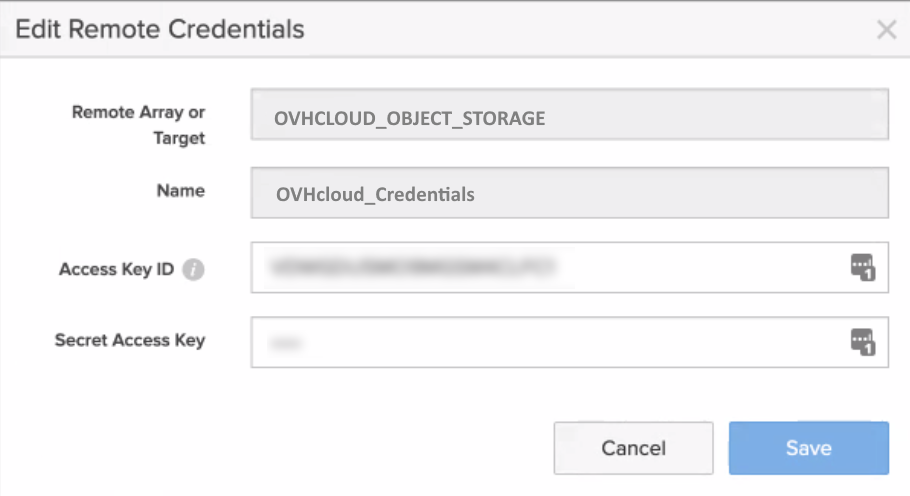
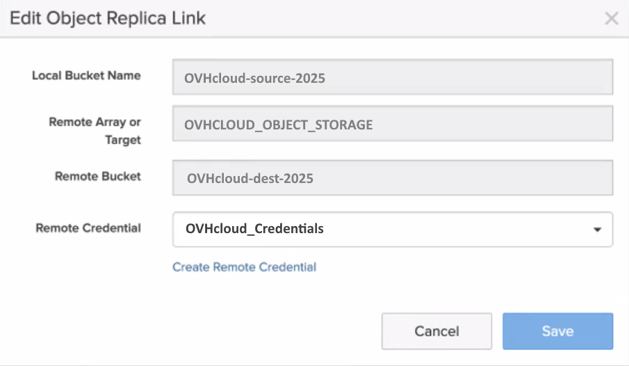

## Objectif

Ce guide a pour but de vous aider à configurer et à utiliser OVHcloud Object Storage comme cible de réplication pour Pure Storage « [Flashblade unified storage platform](https://www.purestorage.com/fr/products/unstructured-data-storage/flashblade-s.html){.external} ».

Il explique comment configurer, gérer et répliquer facilement des objets compatibles Pure Storage Flashblade S31 vers OVHcloud Object Storage.

## Prérequis

- Un conteneur/bucket OVHcloud Object Storage.
- Un utilisateur avec les droits d'accès requis sur le bucket.
- Vos identifiants Object Storage (access_key et secret_access_key).

Consultez notre guide [Object Storage - Premiers pas avec Object Storage](/pages/storage_and_backup/object_storage/s3_getting_started_with_object_storage).

## En pratique

### Créer une connexion cible compatible S3

1\. Connectez-vous à l'interface utilisateur de Pure Storage Flashblade.

2\. Rendez-vous dans la section `Storage`{.action}, puis `Array`{.action}.

3\. Cliquez sur le bouton « + » à côté de `S3 Target Connections` pour créer un stockage d'objets cloud *Target Connections*.

4\. Nommez la connexion, par exemple « OVHCLOUD_OBJECT_STORAGE » et ajoutez les endpoints OVHcloud Object Storage associés dans le champ `Address`.

{.thumbnail}

La liste de tous les endooints OVHcloud Object Storage se trouve [ici](/pages/storage_and_backup/object_storage/s3_location).

### Ajouter des informations d'identification pour le stockage d'objets distant

5\. Rendez-vous dans la section `Protection`{.action} puis cliquez sur `Object Replica Links`{.action}.

6\. Cliquez sur le bouton « + » pour ajouter des informations d'identification et de connexion distantes pour la réplication d'objets.

7\. Sélectionnez `OVHCLOUD_OBJECT_STORAGE`{.action} dans `Remote Array`{.action}.

8\. Ajoutez le nom de votre connexion, par exemple « OVHcloud_credentials », et ajoutez votre clé d'accès et votre clé secrète disponibles depuis l'espace client OVHcloud.

9\. Confirmez en cliquant sur `Create`{.action} et vos identifiants distants seront créés.

{.thumbnail}

### Créer un bucket qui sera répliqué sur l’Object Storage OVHcloud

10\. Si ce n'est pas déjà fait, rendez-vous dans la section `Storage`{.action} puis `Object Storage`{.action} et enfin `Accounts`{.action} pour créer le compte.

11\. Configurez les différents paramètres suivants : `account name`, `quota limit` et `bucket default quota limit` pour créer le compte.

12\. Cliquez sur la section `Buckets`{.action} et sélectionnez le nom du compte.

13\. Entrez un nom de conteneur « OVHcloud-source-2025 » et cliquez sur `Create`{.action}.

### Configurer la réplication de conteneurs vers l’Object Storage OVHcloud

14\. Accédez à `Protection`{.action} > `Object Replication`{.action} et `Bucket Replication Link`{.action}.

15\. Cliquez sur le bouton « + » pour créer un lien de réplica de conteneur.

16\. Sélectionnez le conteneur que vous venez de créer.

17\. Sélectionnez `OVHCLOUD_OBJECT_STORAGE`{.action} dans `Remote Array`{.action}.

18\. Ajoutez le nom de votre conteneur Object Storage OVHcloud, « OVHcloud-dest-2025 ».

19\. Ajoutez vos identifiants « OVHcloud_credentials ». Le lien vers le conteneur réplica va être créé.

{.thumbnail}

20\. Vous pouvez maintenant tester et valider la réplication du conteneur de la plateforme Pure Storage Flashblade vers OVHcloud Object Storage.

## Aller plus loin

Rejoignez notre [communauté d'utilisateurs](/links/community).

1 : S3 est une marque déposée appartenant à Amazon Technologies, Inc. Les services de OVHcloud ne sont pas sponsorisés, approuvés, ou affiliés de quelque manière que ce soit.

