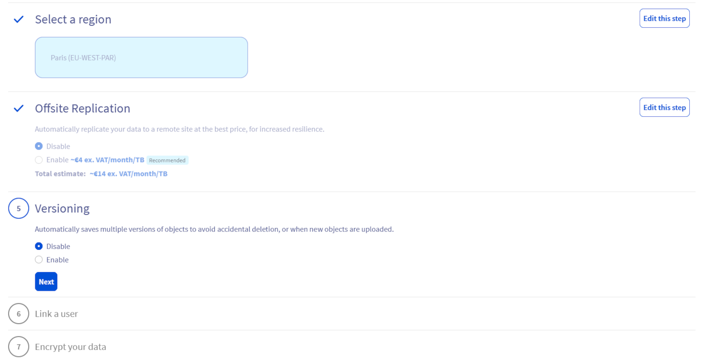
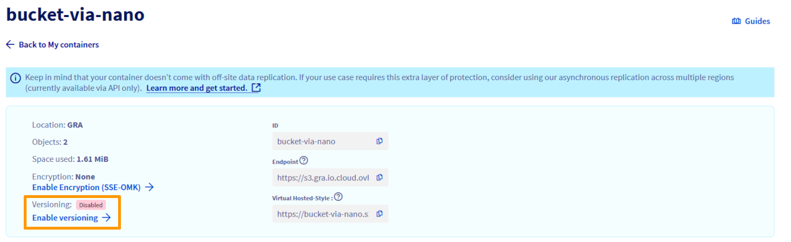
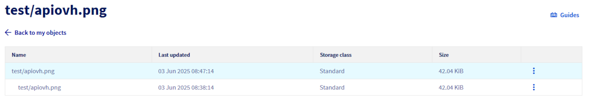
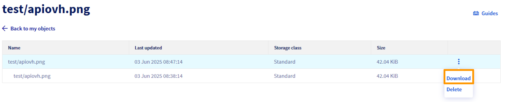

> [!primary]
> This guide documents API usage only. Future updates will cover the OVHcloud Control Panel.

## Objective

**This guide explains how to enable and manage versioning for your OVHcloud Object Storage buckets using APIs.**

## Requirements

- A [Public Cloud project](/pages/public_cloud/public_cloud_cross_functional/create_a_public_cloud_project) in your OVHcloud account
- Access to the [OVHcloud Control Panel](/links/manager)
- An [Object Storage user](/pages/storage_and_backup/object_storage/s3_identity_and_access_management) already created
- [AWS CLI installed and configured](/pages/storage_and_backup/object_storage/s3_getting_started_with_object_storage)

## Instructions

### Concept

Versioning in Object Storage allows you to keep multiple variants of an object in the same bucket. This feature helps preserve, retrieve, and restore every version of every object stored in your buckets, making it easier to recover from unintended user actions or application failures. By default, versioning is disabled on buckets, and you must explicitly enable it.

### General Information

An Object Storage bucket can be in one of three states:

1. **Unversioned** (default state): No versions are kept for the objects.
2. **Versioning-enabled**: Multiple versions of each object are kept.
3. **Versioning-suspended**: Versions are not created for new objects, but existing versions are retained.

> [!warning]
> Once versioning is enabled, it cannot be disabled, it can only be suspended.

{.thumbnail}

Enabling and suspending versioning is done at the bucket level. Once enabled, all objects in the bucket will receive a unique version ID. Existing objects will have a version ID of null until they are modified.

#### How Versioning Works

Versioning adds a layer of protection to your data by keeping multiple versions of an object in the same bucket. When you enable versioning for a bucket, every object in the bucket gets a unique version ID. This means that every time an object is modified or deleted, a new version is created, and the old version is retained. This allows you to recover previous versions of an object if necessary.

- **Uploading new objects:** A unique version ID is assigned to each object.
- **Modifying objects:** A new version ID is generated, and the previous version is retained.
- **Deleting objects:** The deletion operation creates a delete marker but does not remove the previous versions. The object can be restored by removing the delete marker.

#### Version IDs

Each object has a unique version ID, whether or not Versioning is enabled. In a versioning-enabled bucket, this version ID distinguishes one version from other versions of the same object.

- **Current version:** The most recently created version of an object (with the most recent `LastModifiedDate` metadata value).
- **Noncurrent versions:** Versions previously created (with their own unique version IDs).

When versioning is not enabled:

- There are no noncurrent versions as OVHcloud Object Storage will always overwrite the current version with the latest created version when you PUT the same object (i.e., with the same key).

{.thumbnail}

- If you delete an object, it will be permanently deleted as only one version of your object exists at any given time.

{.thumbnail}

### With Versioning Enabled

When versioning is enabled:

- Each time you upload the same object, a noncurrent version of the object is created, and the latest created version becomes the current version. Old versions are kept, and data is protected from accidental deletions or application failures. You can retrieve them anytime.

{.thumbnail}

- If you delete an object, by default, OVHcloud will create a Delete Marker (DM) as the new current version, and all previous versions remain. The object is thus considered "deleted," and a GET object operation on that object will return a 404 error.

{.thumbnail}

- You can still download or delete a specific version of an object by specifying a version ID. Please note that deleting an object by specifying a version number is irreversible.

{.thumbnail}

### How to Enable Versioning

> [!tabs]
> Via AWS CLI
>> To enable versioning on an Object Storage bucket, use the following command:
>>
>> ```sh
>> aws s3api put-bucket-versioning --bucket my-bucket --versioning-configuration Status=Enabled
>> ```
>>
>> **Explications :**
>>
>> - **put-bucket-versioning :** AWS CLI command to configure version management.
>> - **--bucket my-bucket :** replace `my-bucket` with the name of your bucket.
>> - **--versioning-configuration Status=Enabled :** enable versioning for the specified bucket.
>>
>> After enabling versioning, all objects added to the bucket will have a unique version identifier. This means that each time an object is modified or deleted, a new version is created, which can be restored if necessary.
>>
> Via the OVHcloud Control Panel
>> There are two ways to activate versioning on an Object Storage bucket:
>>
>> When creating the bucket, simply activate the versioning option in the associated step:
>>
>> {.thumbnail}
>>
>> On an existing bucket, by modifying its parameters via the OVHcloud dashboard.
>>
>> {.thumbnail}
>>

### How to Suspend Versioning

> [!tabs]
> Via AWS CLI
>> To suspend versioning, set the versioning configuration status to `Suspended`:
>>
>> ```sh
>> aws s3api put-bucket-versioning --bucket my-bucket --versioning-configuration Status=Suspended
>> ````
>>
>> **Explanations:**
>>
>> - **put-bucket-versioning :** AWS CLI command to configure versioning.
>> - **--bucket my-bucket :** replace `my-bucket` with the name of your bucket.
>> - **--versioning-configuration Status=Suspended :** suspend versioning for the specified bucket.
>>
>> Suspending versioning prevents new objects from receiving a version identifier. Existing objects and their versions remain unchanged, but new objects will not have version identifiers until versioning is reactivated.
>>

### Manage and access object versions

#### View object versions

> [!tabs]
> Via the OVHcloud Control Panel
>> You can show or hide object versions in an Object Storage bucket by `clicking`{.action} on the following button:
>>
>> [enable version objects](images/bucket_enable_versions.png)
>>

#### View the different versions of an object

> ![tabs]
> Via the OVHcloud Control Panel
>> To view the different versions of an object, `click`{.action} directly on the object concerned. You'll be redirected to a page detailing the information and versions available for this object:
>>
>> 
>>

#### Download a current or previous version of an object

> [!tabs]
> Via the OVHcloud Control Panel
>> From the main page of your Object Storage bucket (if version display is enabled) or from the object details page (see previous step), you can download the desired version by `clicking`{.action} on the three dots, then on `Download`{.action}.
>>
>> 
>>

### Important Considerations

- **Storage Costs:** Each version of an object is stored as a full object, incurring Standard Object Storage costs.
- **Application:** When versioning is enabled, it applies to all objects in the bucket, including those added before versioning was enabled.
- **Suspension:** Suspending versioning does not delete existing versions, it only stops new versions from being created.
- **Permissions:** Only the bucket owner can enable or suspend versioning.

## Go Further

Join our [community of users](/links/community).
