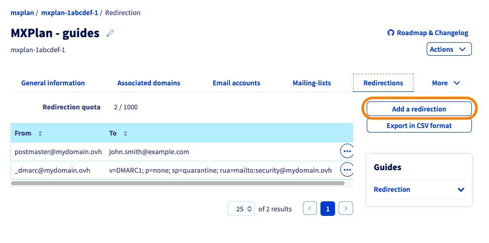
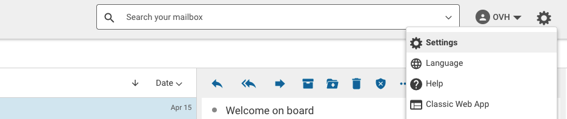
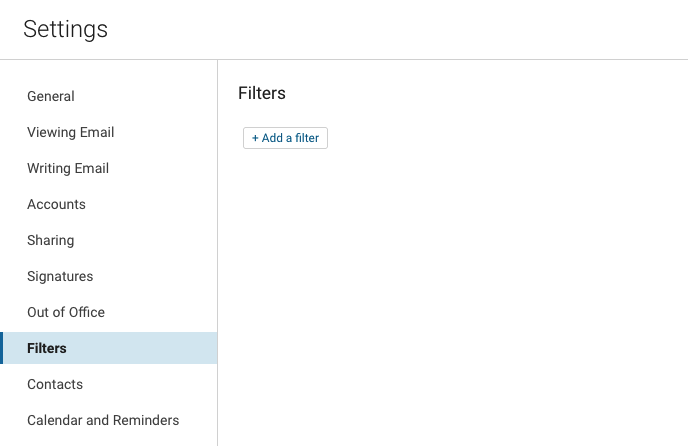
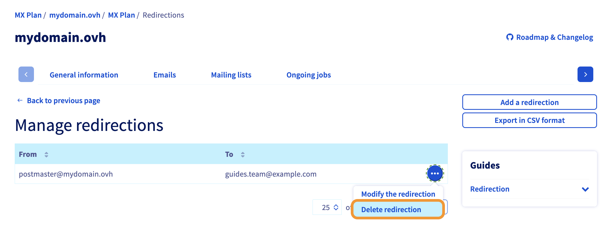
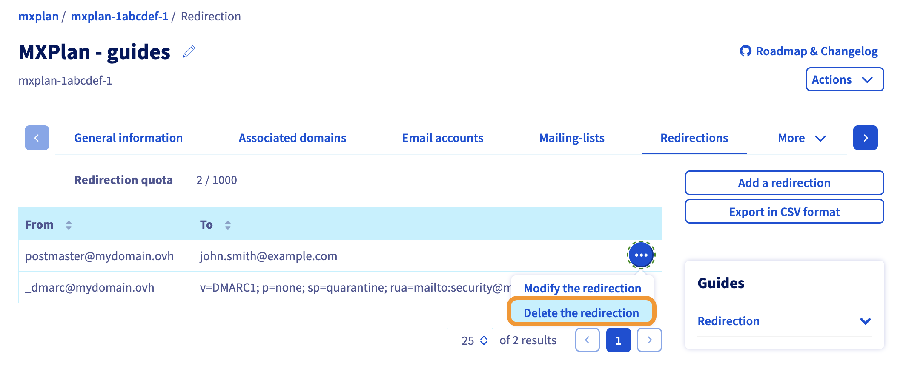
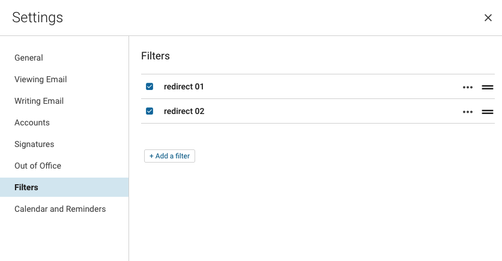
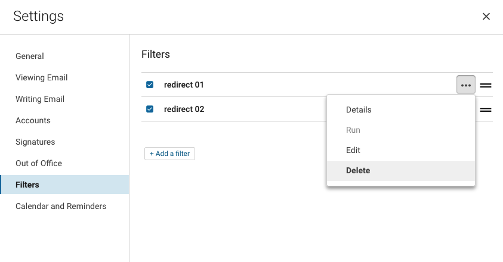
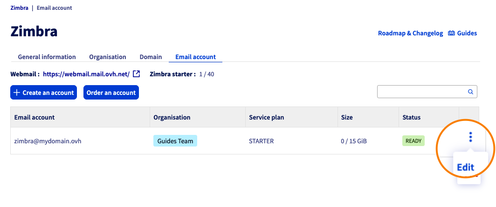
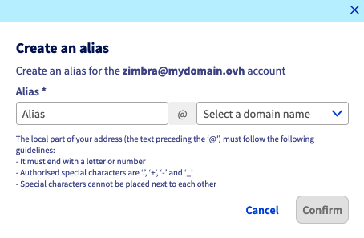

## Ziel

In dieser Anleitung finden Sie Informationen und Instruktionen zur Konfiguration von **Weiterleitungen** und **Aliasen** für Ihre E-Mail-Lösung, zum Beispiel um auf einem Account A empfangene E-Mails an eine Adresse B weiterzuleiten.

{.thumbnail .w-640}

**Diese Anleitung erklärt, wie Sie E-Mail Aliase und Weiterleitungen konfigurieren.**

/// details | Was ist eine E-Mail-Weiterleitung?

Mit einer Weiterleitung können Sie den ursprünglichen Weg einer E-Mail zu einer oder mehreren anderen E-Mail-Adressen ändern.

Zum Beispiel: Sie möchten, dass eine E-Mail, die Sie auf **kontakt@mydomain.ovh** erhalten, auch an **john.smith@otherdomain.ovh** weitergeleitet wird. Mit einer Weiterleitung können Sie automatisch eine E-Mail an **kontakt@mydomain.ovh** an **john.smith@otherdomain.ovh** senden.

///

/// details | Was ist ein E-Mail-Alias?

Im Gegensatz zur Weiterleitung handelt es sich bei der dem Alias zugeordneten E-Mail-Adresse nicht um eine angezeigte Adresse, sondern um eine „Maske“.

Wenn Sie einen Alias für Ihre E-Mail-Adresse erstellen, können Sie Ihren Kontakten eine Maskenadresse übermitteln, ohne dem Absender Ihre persönliche E-Mail-Adresse mitteilen zu müssen. Eine E-Mail-Adresse kann mehrere Aliase haben.

Zum Beispiel: Ihre E-Mail-Adresse ist **john.smith@mydomain.ovh** und Ihr Alias ist **information@mydomain.ovh**. Sie können dann Ihre Kontakte unter der Adresse **information@mydomain.ovh** kontaktieren und Ihre E-Mails auf **john.smith@mydomain.ovh** empfangen, ohne dass der Absender Kenntnis von **john.smith@mydomain.ovh** hat.

///

/// details | Weiterleitung und Alias im Bild 

Klicken Sie auf die Tabs, um die Funktionsweise von Aliasnamen und Weiterleitungen anzuzeigen.

- `From` ist die Absenderadresse.
- `To` ist die Adresse des Empfängers.
- `Redirect to` ist die Ziel-E-Mail-Adresse der Weiterleitung.

> [!tabs]
> **1. Einfache Weiterleitung**
>>
>> Die E-Mail wird direkt an die Weiterleitungsadresse gesendet, der ursprüngliche Empfänger-Account erhält die E-Mail nicht.
>>
>> {.thumbnail .w-640}
>>
> **2. Weiterleitung mit lokaler Kopie**
>>
>> Sowohl der ursprüngliche Empfänger als auch der Ziel-Account der Weiterleitung erhalten die E-Mail.
>>
>> {.thumbnail .w-640}
>>
> **3. E-Mail Alias**
>>
>> Die E-Mail wird an die Alias-Adresse gesendet und von dem E-Mail-Account empfangen, für den der Alias konfiguriert wurde. Die Angabe `Received by` ist der Account, der die E-Mail empfängt.
>>
>> {.thumbnail .w-640}
>>

> [!primary]
>
> Es ist möglich, eine Weiterleitung auf mehrere E-Mail-Adressen einzurichten. Dazu müssen die Weiterleitungen zu jedem Empfängern einzeln erstellt werden.

///

## Voraussetzungen

- Sie haben Zugriff auf Ihr [OVHcloud Kundencenter](/links/manager).
- Sie verfügen über eine vorkonfigurierte OVHcloud E-Mail-Lösung, darunter:
    - **MX Plan** mit unseren [Webhosting Angeboten](/links/web/hosting) oder in einem [100M Gratis-Hosting](/links/web/domains-free-hosting) inklusive.
    - [Exchange](/links/web/emails).
    - [Email Pro](/links/web/email-pro).
    - [Zimbra](/links/web/emails-zimbra).

## In der praktischen Anwendung

Diese Anleitung gilt für alle unsere E-Mail-Angebote. Je nach Angebot können Sie die Alias und Weiterleitungen über das OVHcloud Kundencenter oder per Webmail verwalten. Zur besseren Übersicht geben wir in jedem Kapitel dieses Handbuchs an, welche Arten von E-Mail-Angeboten betroffen sind. Die verschiedenen OVHcloud E-Mail-Angebote sind:

- **MX Plan Roundcube**: Entspricht dem MX Plan Angebot, das Roundcube Webmail verwendet.
- **MX Plan Zimbra**: entspricht dem MX Plan Angebot mit Zimbra Webmail.
- **MX Plan OWA**: Entspricht dem MX Plan Angebot, das Outlook Web App (OWA) Webmail verwendet.
- **Exchange**: Gilt für Angebote **Hosted**, **Private** und **Dedicated** Exchange, die Outlook Web App (OWA) Webmail verwenden.
- **Email Pro**: Exchange-basiertes E-Mail-Angebot mit Outlook Web App (OWA) Webmail.
- **Zimbra**: Dediziertes Angebot mit Zimbra Webmail.
- **Redirect**: Dieses kostenlose Angebot ist automatisch verfügbar, wenn Sie einen Domainnamen in Ihrem Kundencenter haben und kein E-Mail-Angebot dazugehört. Sie erlaubt die Erstellung von E-Mail-Weiterleitungen.

> [!primary]
>
> Die E-Mail-Technologie Ihres MX Plan Angebots kann je nach Aktivierungsdatum Ihres Angebots oder nach einer kürzlich erfolgten Migration variieren. Diese Technologie zeichnet sich insbesondere durch das Interface ihres Webmail aus. Gehen Sie folgendermaßen vor, um die Domain über Ihr Kundencenter zu identifizieren:
>
> 1. Verbinden Sie sich mit Ihrem [OVHcloud Kundencenter](/links/manager).
> 1. Gehen Sie in den Bereich `Web Cloud`{.action}.
> 1. Klicken Sie auf `MX Plan`{.action}.
> 1. Wählen Sie die betreffende Domain aus.
> 1. Die Registerkarte `Allgemeine Informationen`{.action} ist standardmäßig ausgewählt.
> 1. Notieren Sie die unter **Webmail** verwendete Technologie in der Box `Abonnement`.
>
> {.thumbnail .w-640}
>

**Inhalt**

- [Weiterleitung erstellen](#redirect)
    - [Über das Kundencenter](#redirect-manager)
        - [MX Plan / Redirect](#redirect-manager-mxplan)
    - [Aus Webmail](#redirect-webmail)
        - [Outlook Web App (OWA)](#redirect-webmail-owa)
        - [Zimbra](#redirect-webmail-zimbra)
- [Weiterleitung löschen](#redirect-delete)
    - [MX Plan via Kundencenter](#redirect-delete)
    - [Outlook Web App (OWA)](#redirect-delete-owa)
    - [Zimbra](#redirect-delete-zimbra)
- [Alias erstellen](#alias)
    - [Exchange / E-Mail Pro / MX Plan](#alias-exchange-emp-mxplan)
    - [MX Plan Roundcube](#alias-mxplan-roundcube)
    - [Zimbra](#alias-mxplan-roundcube)
- [Alias löschen](#alias-delete)
    - [Exchange / E-Mail Pro / MX Plan](#alias-delete-exchange-emp-mxplan)
    - [MX Plan Roundcube](#alias-delete-mxplan-roundcube)
    - [Zimbra](#alias-delete-zimbra)

### Weiterleitung erstellen 

#### Über das Kundencenter 

Derzeit verfügen nur die Angebote **MX plan** und **Redirect** über ein Interface zur Verwaltung der Weiterleitungen über das OVHcloud Kundencenter.

##### MX Plan / redirect 

1. Verbinden Sie sich mit Ihrem [OVHcloud Kundencenter](/links/manager).
1. Gehen Sie in den Bereich `Web Cloud`{.action}.
1. Klicken Sie auf `MX Plan`{.action}.
1. Wählen Sie die betreffende Domain aus.

In unserem Beispiel ist dies eine **Weiterleitung mit lokaler Kopie** (siehe [Schema 2](#diagram) am Anfang dieser Anleitung). Wenn dies Ihren Bedürfnissen entspricht, folgen Sie den nachstehenden Schritten, indem Sie auf den Tab für die Webmail-Technologie klicken, die von Ihrem MX Plan verwendet wird:

> [!tabs]
> **MX Plan Roundcube / MX Plan Outlook Web App / Redirect**
>>
>> Standardmäßig befinden Sie sich im Tab `Allgemeine Informationen`{.action} Ihres MX Plan. Klicken Sie auf den Tab `E-Mails`{.action} und dann rechts auf den Button `Verwaltung der Weiterleitungen`{.action}.
>>
>> {.thumbnail .w-640}
>>
>> Die Tabelle der bereits aktiven Weiterleitungen wird angezeigt. Rechts klicken Sie auf den Button `Weiterleitung hinzufügen`{.action}.
>>
>> {.thumbnail .w-640}
>>
>> Geben Sie im Formular `Weiterleitung erstellen` Folgendes ein:
>>
>> - **Von der Adresse** : Geben Sie hier die E-Mail-Adresse ein, die Sie weiterleiten möchten.
>> - **An die Adresse** : Geben Sie hier die Zieladresse Ihrer Weiterleitung ein. Dabei kann es sich um eine Ihrer OVHcloud E-Mail-Adressen oder um eine externe E-Mail-Adresse handeln.
>> - **Wählen Sie einen Kopiermodus aus**: Wählen Sie aus, ob Sie:
>>      - **Eine Kopie der E-Mail bei OVHcloud aufbewahren**: Die E-Mail an Ihre Haupt-E-Mail-Adresse sowie die Weiterleitungsadresse senden (siehe [Schema 2](#diagram) am Anfang dieser Anleitung).
>>      - **Keine Kopie der Mail aufbewahren**: direkt an die Weiterleitungsadresse weiterleiten, ohne dass diese von der Hauptadresse empfangen wird (siehe [Schema 1](#diagram) am Anfang dieser Anleitung).
>>
>> Klicken Sie anschließend auf `Bestätigen`{.action}, um das Hinzufügen dieser Weiterleitung zu bestätigen.
>>
>> {.thumbnail .w-640}
>>
>> > [!primary]
>> >
>> > Um die Zieladresse zu ändern oder eine Weiterleitung zu löschen, klicken Sie auf `...`{.action} rechts neben der betreffenden Weiterleitung.
>>
> **Zimbra MX Plan**
>>
>> Standardmäßig befinden Sie sich im Tab `Allgemeine Informationen`{.action} Ihres MX Plan. Klicken Sie auf den Tab `Weiterleitungen`{.action}.
>>
>> Die Tabelle der bereits aktiven Weiterleitungen wird angezeigt. Rechts klicken Sie auf den Button `Weiterleitung hinzufügen`{.action}.
>>
>> {.thumbnail .w-640}
>>
>> Geben Sie im Formular `Weiterleitung erstellen` Folgendes ein:
>>
>> - **Von der Adresse** : Geben Sie hier die E-Mail-Adresse ein, die Sie weiterleiten möchten.
>> - **An die Adresse** : Geben Sie hier die Zieladresse Ihrer Weiterleitung ein. Dabei kann es sich um eine Ihrer OVHcloud E-Mail-Adressen oder um eine externe E-Mail-Adresse handeln.
>> - **Wählen Sie einen Kopiermodus aus**: Wählen Sie aus, ob Sie:
>>      - **Eine Kopie der E-Mail bei OVHcloud aufbewahren**: Die E-Mail an Ihre Haupt-E-Mail-Adresse sowie die Weiterleitungsadresse senden (siehe [Schema 2](#diagram) am Anfang dieser Anleitung).
>>      - **Keine Kopie der Mail aufbewahren**: direkt an die Weiterleitungsadresse weiterleiten, ohne dass diese von der Hauptadresse empfangen wird (siehe [Schema 1](#diagram) am Anfang dieser Anleitung).
>>
>> Klicken Sie anschließend auf `Bestätigen`{.action}, um das Hinzufügen dieser Weiterleitung zu bestätigen.
>>
>> {.thumbnail .w-640}
>>

> [!primary]
>
> Wenn Sie den Kopiermodus „**Eine Kopie der Mail bei OVHcloud aufbewahren**“ auswählen, wird in der Liste der Weiterleitungen automatisch eine Weiterleitung von der E-Mail-Adresse zu sich selbst erstellt, die diese lokale Kopie materialisiert.
>

#### Aus dem Webmail 

Gehen Sie auf das [webmail](/links/web/email). Geben Sie **E-Mail-Adresse** und **Passwort** ein, um sich anzumelden.

{.thumbnail}

Die Erstellung einer Weiterleitung erfolgt über Posteingangsregeln, im Webmail auch als „Filter“ bezeichnet. Diese Regeln, die beim Empfang einer E-Mail angewendet werden, erlauben es, eine eingehende E-Mail weiterzuleiten oder umzuleiten.

#### Outlook Web App (OWA) 

> [!success]
>
> Dieses Kapitel betrifft die folgenden Angebote:
>
> - **MX PLAN OWA**.
> - **Exchange**.
> - **E-Mail Pro**.
>

Outlook Web App ist ein Interface, das für unsere Angebote **Exchange**, **E-Mail Pro** und einen Teil der Accounts **MX Plan** verwendet wird.

Durchsuchen Sie die folgenden Registerkarten, um Ihre Weiterleitung über Outlook Web App einzurichten:

> [!tabs]
> **Schritt 1**
>>
>> Nachdem Sie sich über das [webmail](/links/web/email) mit Ihrer E-Mail-Adresse verbunden haben, klicken Sie oben rechts auf das Zahnrad-Symbol und dann auf `Optionen`{.action}.
>>
>> {.thumbnail .w-640}
>>
> **Schritt 2**
>>
>> Gehen Sie im Fenster **Optionen** in der linken Spalte in die Kategorie **Automatische Verarbeitung** im Abschnitt **Post** und klicken Sie dann auf `Posteingangs- und Aufbewahrungsregeln`{.action}.
>>
>> {.thumbnail .w-640}
>>
>> In diesem Fenster können Sie Ihre Weiterleitungen verwalten und Filter auf alle eingehenden E-Mails anwenden.
>>
> **Schritt 3**
>>
>> Klicken Sie im Verwaltungsfenster für die **Posteingangsregeln** oben links auf das Symbol `+`{.action}.
>>
>> {.thumbnail .w-640}
>>
> **Schritt 4**
>>
>> Geben Sie im angezeigten Fenster Folgendes ein:
>> - **Name**: Legen Sie den Namen Ihrer Weiterleitung fest.
>> - **Wenn die Nachricht eintrifft und alle Bedingungen erfüllt**: Wenn Ihre Weiterleitung für alle Nachrichten gilt, wählen Sie `[Auf alle Nachrichten anwenden]`{.action}.
>>
>> {.thumbnail .w-640}
>>
> **Schritt 5**
>>
>> Im selben Fenster:
>>
>> **Alle folgenden Aktionen ausführen**: Hier wird die Weiterleitung angewendet. Wählen Sie `Weiterleiten, Weiterleiten oder Senden`{.action} und dann `Nachricht weiterleiten an...`{.action}.
>>
>> {.thumbnail .w-640}
>>
> **Schritt 6**
>>
>> Geben Sie dann die Adresse ein, an die Sie die E-Mail weiterleiten möchten, und gehen Sie zu „**Nachricht weiterleiten an...**“. Klicken Sie dann auf `Speichern`{.action}. Klicken Sie anschließend auf `OK`{.action} (Diskettensymbol), um die Weiterleitung abzuschließen.
>>
>> {.thumbnail .w-640}
>>

> [!primary]
>
> Um eine einfache **Weiterleitung** anzuwenden (siehe [Schema 1](#diagram) am Anfang dieser Anleitung), fügen Sie in diesem Fenster eine zusätzliche Regel zu Ihrer **Weiterleitung mit lokaler Kopie** hinzu. Klicken Sie auf `Aktion hinzufügen`{.action} (Box 1), dann auf `Verschieben, Kopieren oder Löschen`{.action} und schließlich auf `Nachricht löschen`{.action}. Mit dieser Regel wird die Nachricht direkt in den Papierkorb verschoben, nachdem sie an die Weiterleitungsadresse weitergeleitet wurde.
>
> {.thumbnail .w-640}
>

#### Zimbra 

> [!success]
>
> Dieses Kapitel betrifft die folgenden Angebote:
>
> - **MX Plan** mit Zimbra-Kennzeichnung für Webmail.
> - **Zimbra**.
>

Um die E-Mails Ihres Zimbra-Accounts an eine andere E-Mail-Adresse weiterzuleiten, wenden wir eine Transferregel an.

> [!primary]
>
> In unserem Beispiel unten haben wir ausgewählt, alle eingehenden E-Mails an eine andere E-Mail-Adresse weiterzuleiten. Um das Beispiel in den Screenshots zu verstehen, sind wir unter **zimbra@mydomain.ovh** angemeldet und möchten die E-Mails dieses Accounts an die Adresse **address@example.com** weiterleiten.
>

Führen Sie die folgenden Schritte aus, indem Sie auf die Registerkarten klicken, um Ihre Weiterleitung einzurichten:

> [!tabs]
> **Schritt 1**
>>
>> Klicken Sie auf die Schaltfläche &#9881; oben rechts in Ihrem Webmail-Fenster und dann auf `Einstellungen`{.action}.
>>
>> {.thumbnail .w-640}
>>
> **Schritt 2**
>>
>> Klicken Sie im Parameterfenster auf den Abschnitt `Filter`{.action} und dann auf die Schaltfläche `Filter hinzufügen`{.action}.
>>
>> {.thumbnail .w-640}
>>
> **Schritt 3**
>>
>> - Klicken Sie oben rechts auf <u>Erweiterter Modus</u>, um diese Regel zu implementieren.
>> - Geben Sie einen Namen für Ihren Filter in das Feld `Filtername` ein.
>> - Lassen Sie das Dropdown-Menü auf `Alle` im Satz „Wenn eine eingehende Nachricht ... dieser Bedingungen entspricht“.
>> - Wählen Sie im ersten Pop-up-Menü der Regeln `Bis` (To) aus, lassen Sie `enthält` (contains) und geben Sie die E-Mail-Adresse, mit der Sie verbunden sind, in das Feld rechts ein.
>> - Wählen Sie unter „Dann“ (Then) im Drop-down-Menü `Weiterleiten an` (Forward to) aus und geben Sie die Ziel-E-Mail-Adresse ein.
>> - Klicken Sie unten auf `+ Aktion hinzufügen`{.action} (Add an action) und wählen Sie `In Empfangsordner verschieben` (Keep in Inbox).
>> - Klicken Sie auf `Speichern`{.action} aus dem Fenster Ihres Filters und auch aus dem Fenster der Einstellungen.
>>
>> {.thumbnail .w-640}
>>

Weitere Informationen zur Verwendung von Zimbra Webmail finden Sie in unserer Anleitung „[Zimbra Webmail verwenden](/pages/web_cloud/email_and_collaborative_solutions/mx_plan/email_zimbra)“.

#### Weiterleitung löschen 

#### MX Plan über das Kundencenter 

1. Verbinden Sie sich mit Ihrem [OVHcloud Kundencenter](/links/manager).
1. Gehen Sie in den Bereich `Web Cloud`{.action}.
1. Klicken Sie auf `MX Plan`{.action}.
1. Wählen Sie die betreffende Domain aus.

Wählen Sie unten den Tab für die E-Mail-Technologie, die von Ihrem MX Plan Dienst verwendet wird:

> [!tabs]
> **MX Plan Roundcube / MX Plan OWA / Redirect**
>>
>> - Standardmäßig befinden Sie sich im Tab `Allgemeine Informationen`{.action} Ihres MX Plan.
>> - Klicken Sie auf den Tab `E-Mails`{.action} und dann rechts auf den Button `Verwaltung der Weiterleitungen`{.action}.
>>
>>    {.thumbnail .w-640}
>>
>> - Klicken Sie auf `...`{.action} rechts neben der betreffenden Weiterleitung und dann auf `Weiterleitung löschen`{.action}.
>>
>>    {.thumbnail .w-640}
>>
> **Zimbra MX Plan**
>>
>> - Standardmäßig befinden Sie sich im Tab `Allgemeine Informationen`{.action} Ihres MX Plan.
>> - Klicken Sie auf den Tab `Weiterleitungen`{.action}.
>> - Klicken Sie auf `...`{.action} rechts neben der betreffenden Weiterleitung und dann auf `Weiterleitung löschen`{.action}.
>>
>>    {.thumbnail .w-640}
>>

#### Outlook Web App (OWA) 

Gehen Sie auf das [webmail](/links/web/email). Geben Sie **E-Mail-Adresse** und **Passwort** ein, um sich anzumelden. Folgen Sie den Anweisungen im OWA Webmail-Interface, indem Sie auf die folgenden Tabs klicken:

> [!tabs]
> **Schritt 1**
>>
>> Nachdem Sie sich im OWA Webmail-Interface eingeloggt haben, klicken Sie oben rechts auf das Zahnrad-Symbol und dann auf `Optionen`{.action}.
>>
>> {.thumbnail .w-640}
>>
> **Schritt 2**
>>
>> Gehen Sie im Fenster **Optionen** in der linken Spalte in die Kategorie **Automatische Verarbeitung** im Abschnitt **Post** und klicken Sie dann auf `Posteingangs- und Aufbewahrungsregeln`{.action}.
>>
>> {.thumbnail .w-640}
>>
>> Hier finden Sie ein Fenster, in dem Sie Ihre Weiterleitungen und Filter verwalten können.
>>
> **Schritt 3**
>>
>> Klicken Sie im Verwaltungsfenster für die **Posteingangsregeln** auf die Weiterleitung, die Sie löschen möchten. Sie sollte hervorgehoben sein. Klicken Sie dann auf das Papierkorbsymbol.
>>
>> {.thumbnail .w-640}
>>

#### Zimbra 

Gehen Sie auf das [webmail](/links/web/email). Geben Sie **E-Mail-Adresse** und **Passwort** ein, um sich anzumelden. Folgen Sie den Anweisungen im Zimbra Webmail-Interface und klicken Sie auf die Tab unten:

> [!tabs]
> **Schritt 1**
>>
>> Nachdem Sie sich im Zimbra Webmail-Interface eingeloggt haben, klicken Sie auf den Button &#9881; oben rechts in Ihrem Webmail-Fenster und dann auf `Einstellungen`{.action}.
>>
>> {.thumbnail .w-640}
>>
> **Schritt 2**
>>
>> Klicken Sie im Parameterfenster auf den Abschnitt `Filter`{.action}.
>>
>> {.thumbnail .w-640}
>>
> **Schritt 3**
>>
>> Klicken Sie auf den Button `...`{.action} rechts neben dem betreffenden Filter und dann auf `Löschen`{.action}.
>>
>> {.thumbnail .w-640}
>>

### Alias erstellen 

Wenn Sie einen Alias für Ihre E-Mail-Adresse erstellen, können Sie Ihren Kontakten eine Maskenadresse übermitteln, ohne dem Absender Ihre persönliche E-Mail-Adresse mitteilen zu müssen.

### Exchange / E-Mail Pro / MX Plan 

Verbinden Sie sich mit Ihrem [OVHcloud Kundencenter](/links/manager) und gehen Sie in den Bereich `Web Cloud`. Wählen Sie dann das Menü abhängig von Ihrem E-Mail-Angebot aus:

- **Exchange**: Gehen Sie in den Bereich `Microsoft`{.action}, klicken Sie auf `Exchange`{.action} und wählen Sie die betreffende Plattform aus. Klicken Sie auf den Tab `E-Mail-Accounts`{.action}.

- **E-Mail Pro**: Gehen Sie in den Bereich `E-Mail Pro`{.action}, wählen Sie die betreffende Plattform aus und klicken Sie dann auf den Tab `E-Mail-Accounts`{.action}.

- **MX Plan**: Gehen Sie in den Bereich `MX Plan`{.action}, wählen Sie die betreffende Plattform aus und klicken Sie dann auf den Tab `E-Mail-Accounts`{.action}.

Um einen Alias zu Ihrem E-Mail-Account hinzuzufügen, folgen Sie den Anweisungen, indem Sie unten auf jede Registerkarte klicken:

> [!tabs]
> **Schritt 1**
>>
>> In der angezeigten Tabelle finden Sie eine Spalte `Alias`.
>>
>> {.thumbnail .w-640}
>>
> **Schritt 2**
>>
>> Klicken Sie auf den Button `...`{.action} und dann auf `Alias konfigurieren`{.action} (oder `Alias verwalten`{.action}).
>>
>> {.thumbnail .w-640}
>>
> **Schritt 3**
>>
>> Klicken Sie auf `Alias hinzufügen`{.action} und geben Sie die Adresse ein, die Sie für Ihren Alias ausgewählt haben, und bestätigen Sie Ihre Auswahl.
>>
>> {.thumbnail .w-640}

#### MX Plan Roundcube 

Um einen Alias für einen MX Plan Roundcube E-Mail-Account zu erstellen, müssen Sie dies auf die gleiche Weise tun wie eine Weiterleitung. Legen Sie einfach eine E-Mail-Adresse fest, die nicht in Ihrem Domainnamen existiert, und verweisen Sie auf eine bestehende Adresse. Folgen Sie dem Kapitel [MX Plan / MX Redirect](#redirect-manager-mxplan) im Abschnitt „Weiterleitung erstellen“ dieser Anleitung.

### Zimbra 

1. Verbinden Sie sich mit Ihrem [OVHcloud Kundencenter](/links/manager).
1. Gehen Sie in den Bereich `Web Cloud`{.action}.
1. Klicken Sie auf `Zimbra Mail`{.action}.
1. Klicken Sie in Ihrem Zimbra Dienst auf den Tab `E-Mail-Accounts`{.action}.

> [!tabs]
> **Schritt 1**
>>
>> - Klicken Sie auf den Button `⁝`{.action} rechts neben dem betreffenden E-Mail-Account.
>> - Klicken Sie auf `Bearbeiten`{.action}.
>>
>> {.thumbnail .w-640}
>>
> **Schritt 2**
>>
>> Das Fenster zur Konfiguration Ihres E-Mail-Accounts wird angezeigt. Klicken Sie oben auf den Tab `Alias`{.action}.
>>
>> {.thumbnail .w-640}
>>
> **Schritt 3**
>>
>> Das folgende Fenster enthält eine Liste der Aliase, die Sie dem betreffenden Account zuordnen können. Klicken Sie auf den Button `Alias erstellen`{.action}.
>>
>> {.thumbnail .w-640}
>>
> **Schritt 4**
>>
>> Legen Sie die Adresse Ihres Alias fest und wählen Sie einen der mit Ihrem Zimbra Dienst verbundenen Domainnamen aus.
>>
>> {.thumbnail .w-640}
>>

### Alias löschen 

### Exchange / E-Mail Pro / MX Plan 

Verbinden Sie sich mit Ihrem [OVHcloud Kundencenter](/links/manager) und gehen Sie in den Bereich `Web Cloud`. Wählen Sie dann das Menü abhängig von Ihrem E-Mail-Angebot aus:

- **Exchange**: Gehen Sie in den Bereich `Microsoft`{.action}, klicken Sie auf `Exchange`{.action} und wählen Sie die betreffende Plattform aus. Klicken Sie auf den Tab `E-Mail-Accounts`{.action}.

- **E-Mail Pro**: Gehen Sie in den Bereich `E-Mail Pro`{.action}, wählen Sie die betreffende Plattform aus und klicken Sie dann auf den Tab `E-Mail-Accounts`{.action}.

- **MX Plan**: Gehen Sie in den Bereich `MX Plan`{.action}, wählen Sie die betreffende Plattform aus und klicken Sie dann auf den Tab `E-Mail-Accounts`{.action}.

Klicken Sie im Tab `E-Mail-Accounts`{.action} auf den Button `...`{.action} rechts neben der betreffenden E-Mail-Adresse. Klicken Sie dann auf `Alias konfigurieren`{.action} (oder `Alias verwalten`{.action}).

Klicken Sie auf den Button `...`{.action} rechts neben dem betreffenden Alias im Alias-Verwaltungsmenü. Klicken Sie abschließend auf `Alias löschen`{.action}

{.thumbnail .w-640}

#### MX Plan Roundcube 

Um einen Alias eines MX Plan Roundcube E-Mail-Accounts zu löschen, müssen Sie dies auf die gleiche Weise tun wie eine Weiterleitung. Begeben Sie sich also in die Verwaltung der Weiterleitungen Ihres MX Plan Dienstes.

Klicken Sie im Tab `E-Mails`{.action} auf `Verwaltung der Weiterleitungen`{.action} rechts im Fenster.

Klicken Sie auf den Button `...`{.action} rechts neben der betreffenden Weiterleitung und dann auf `Weiterleitung löschen`{.action}.

> [!warning]
>
> Weiterleitung oder Alias können nicht geändert werden. Sie müssen sie löschen und dann neu erstellen.
>

{.thumbnail .w-640}

### Zimbra 

1. Verbinden Sie sich mit Ihrem [OVHcloud Kundencenter](/links/manager).
1. Gehen Sie in den Bereich `Web Cloud`{.action}.
1. Klicken Sie auf `Zimbra Mail`{.action}.
1. Klicken Sie in Ihrem Zimbra Dienst auf den Tab `E-Mail-Accounts`{.action}.

> [!tabs]
> **Schritt 1**
>>
>> - Klicken Sie auf den Button `⁝`{.action} rechts neben dem betreffenden E-Mail-Account.
>> - Klicken Sie auf `Bearbeiten`{.action}.
>>
>> {.thumbnail .w-640}
>>
> **Schritt 2**
>>
>> Das Fenster zur Konfiguration Ihres E-Mail-Accounts wird angezeigt. Klicken Sie oben auf den Tab `Alias`{.action}.
>>
>> {.thumbnail .w-640}
>>
> **Schritt 3**
>>
>> Das folgende Fenster enthält eine Liste der Aliase, die Sie dem betreffenden Account zuordnen können. Klicken Sie auf den Button `Alias erstellen`{.action}.
>>
>> {.thumbnail .w-640}
>>

## Weiterführende Informationen

[Erste Schritte mit MX Plan](/pages/web_cloud/email_and_collaborative_solutions/mx_plan/email_generalities)

[Erste Schritte mit Hosted Exchange](/pages/web_cloud/email_and_collaborative_solutions/microsoft_exchange/exchange_starting_hosted)

[Erste Schritte mit Private Exchange](/pages/web_cloud/email_and_collaborative_solutions/microsoft_exchange/exchange_starting_private)

[Erste Schritte mit der E-Mail Pro Lösung](/pages/web_cloud/email_and_collaborative_solutions/email_pro/first_config)

[Erste Schritte mit Zimbra](/pages/web_cloud/email_and_collaborative_solutions/zimbra/getting_started_zimbra)

Für spezielle Dienstleistungen (Referenzierung, Entwicklung usw.) wenden Sie sich bitte an die [OVHcloud Partner](/links/partner).

Wenn Sie Hilfe bei der Verwendung und Konfiguration Ihrer OVHcloud Lösungen benötigen, empfehlen wir Ihnen unsere verschiedenen [Support-Angebote](/links/support).

Für den Austausch mit unserer [User Community](/links/community).