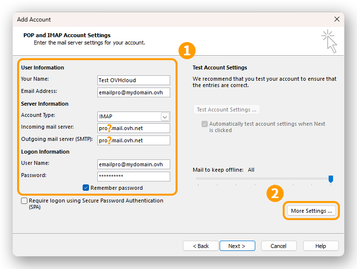
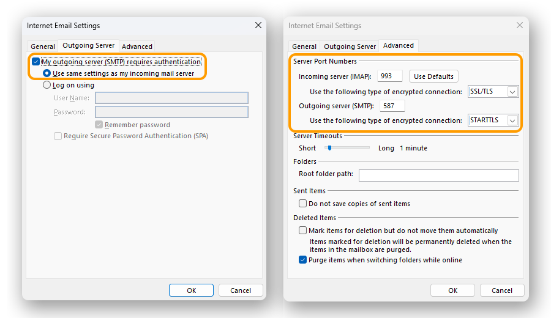
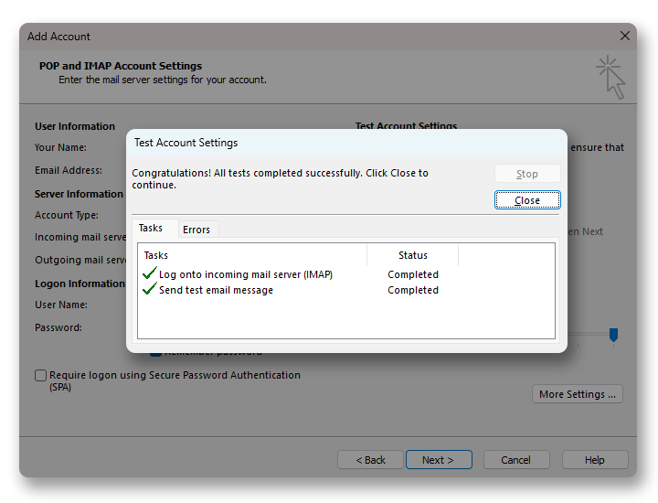

## Ziel

E-Mail Pro Accounts können auf verschiedenen, kompatiblen E-Mail-Clients eingerichtet werden. So können Sie Ihr bevorzugtes Gerät für Ihre E-Mail-Adressen verwenden.

**Diese Anleitung erklärt, wie Sie Ihre E-Mail Pro Adresse in Windows Outlook oder neuer einrichten.**

## Voraussetzungen

- Sie verfügen über einen [E-Mail Pro Account](/links/web/email-pro).
- Die Anwendung [klassisches Outlook](https://support.microsoft.com/de-de/office/outlook-classic-installieren-oder-neu-installieren-5c94902b-31a5-4274-abb0-b07f4661edf5) auf Windows besitzen.
- Sie verfügen über Anmeldeinformationen für die E-Mail-Adresse, die Sie konfigurieren möchten.

/// details | Informationen zur Verwaltung und Konfiguration der OVHcloud-Dienste

In dieser Anleitung erläutern wir die Verwendung einer oder mehrerer OVHcloud Lösungen mit externen Tools. Die durchgeführten Aktionen werden in einem bestimmten Kontext beschrieben. Denken Sie daran, diese an Ihre Situation anzupassen.

Wir empfehlen Ihnen jedoch, sich bei Schwierigkeiten an einen [spezialisierten Dienstleister](/links/partner) zu wenden, und/oder Ihre Fragen in der OVHcloud Community zu stellen. Leider können wir Ihnen für externe Dienstleistungen keine weitergehende Unterstützung anbieten. Weitere Informationen finden Sie am [Ende dieser Anleitung](#go-further).

///

## In der praktischen Anwendung

> [!warning]
>
> Diese Dokumentation gilt ausschließlich für **Klassisches Outlook**, der in der Microsoft 365-Suite erhältlich ist. Wenn Sie die neue Outlook-Version verwenden, konsultieren Sie bitte unseren Leitfaden „[Email Pro - Konfigurieren Ihres Email Pro Accounts im neuen Outlook für Windows](/pages/web_cloud/email_and_collaborative_solutions/email_pro/how_to_configure_windows_10)“.
>
> Um Klassisches Outlook auf Ihrem Windows-Computer zu installieren, laden Sie es von der Microsoft-Seite „[Installieren oder Erneutes Installieren des klassischen Outlook auf einem Windows-PC](https://support.microsoft.com/de-de/office/outlook-classic-installieren-oder-neu-installieren-5c94902b-31a5-4274-abb0-b07f4661edf5)“ herunter und installieren Sie es.
>
> Nach Abschluss der Installation können Sie die beiden Versionen unterscheiden, wenn sie installiert sind, indem Sie „Outlook“ in der Windows-Suchleiste eingeben. Sie können dann den Unterschied wie unten sehen.
>
> {.thumbnail .h-500}

### Account hinzufügen 

> [!primary]
>
> In dieser Anleitung verwenden wir als Serverbezeichnung: pro?.mail.ovh.net. Das „?“ muss mit der jeweils passenden Nummer Ihres zuständigen Servers für den einzurichtenden Email Pro Dienst ersetzt werden.
>
> 1. Loggen Sie sich in Ihr [OVHcloud Kundencenter](/links/manager) ein.
> 1. Öffnen Sie den Bereich `Web Cloud`{.action}.
> 1. Klicken Sie auf `E-Mail Pro`{.action}.
> 1. Wählen Sie den gewünschten Dienst aus.
> 1. Der Servername wird im Kasten **Verbindung** auf der Seite `Allgemeine Informationen`{.action} angezeigt.

- **Wenn Sie die Anwendung zum ersten Mal starten**: Es öffnet sich ein Konfigurationsassistent und Sie werden dazu aufgefordert, Ihre E-Mail-Adresse einzugeben.

- **Falls Sie bereits einen Account eingerichtet haben**: Klicken Sie am oberen Rand Ihres Bildschirms auf `Datei`{.action} und anschließend auf `Konto hinzufügen`{.action}.

{.thumbnail .h-500}

Um Ihre E-Mail-Adresse einzurichten, folgen Sie den Schritten, indem Sie auf die untenstehenden Registerkarten klicken.

> **Schritt 1**
>>
>> - Wählen Sie in dem Fenster **Konto hinzufügen** die Option `Manuelle Konfiguration oder zusätzliche Servertypen`{.action} aus.
>> - Klicken Sie auf `Weiter`{.action}, um fortzufahren.
>> - Wählen Sie `POP oder IMAP`{.action} aus.
>> - Klicken Sie auf `Weiter`{.action}, um fortzufahren.
>>
>> {.thumbnail .h-500}
>>
> **Schritt 2**
>>
>> Geben Sie die Anmeldeinformationen für Ihr Konto ein **(1)**:
>>
>> Benutzerinformationen  
>> **Ihr Name**: Legen Sie einen Anzeigename fest. 
>> **E-Mail-Adresse**: Geben Sie Ihre vollständige E-Mail-Adresse ein. 
>>
>> Serverinformationen  
>> **Kontotyp**: Wählen Sie IMAP aus. 
>> **Eingehender E-Mail-Server**: pro?.mail.ovh.net (ersetzen Sie das **„?“** durch die Nummer Ihres Servers). 
>> **Ausgehender E-Mail-Server (SMTP)**: pro?.mail.ovh.net (ersetzen Sie das **„?“** durch die Nummer Ihres Servers). 
>>
>> Anmeldeinformationen  
>> **Benutzername**: Geben Sie Ihre vollständige E-Mail-Adresse ein. 
>> **Passwort**: Geben Sie das Passwort ein, das mit Ihrer E-Mail-Adresse verknüpft ist. 
>>
>> Klicken Sie auf `Weitere Einstellungen...`{.action} **(2)** und wechseln Sie zum nächsten Schritt.
>>
>> {.thumbnail .h-500}
>>
> **Schritt 3**
>>
>> Wählen Sie im Reiter `Ausgehender Server` die Option `Mein ausgehender Server (SMTP) erfordert eine Authentifizierung`{.action} aus und lassen Sie `Die gleichen Einstellungen wie bei meinem eingehenden E-Mail-Server verwenden`{.action} ausgewählt.
>>
>> Im Reiter `Erweiterte Optionen`:
>>
>> - **Eingehender Server (IMAP)**: 993
>> - **Verwenden Sie den folgenden verschlüsselten Verbindungstyp**: SSL/TLS
>> - **Ausgehender E-Mail-Server (SMTP)**: 587
>> - **Verwenden Sie den folgenden verschlüsselten Verbindungstyp**: STARTTLS
>>
>> Klicken Sie auf `OK`{.action}, um die Informationen zu bestätigen. Klicken Sie auf `Weiter`{.action}, um die Einrichtung des Kontos zu starten.
>>
>> {.thumbnail .h-500}
>>
> **Schritt 4**
>>
>> Klicken Sie auf `Weiter`{.action}, um die Einrichtung des Kontos zu starten. Wenn die Einstellungen bestätigt werden, erhalten Sie das untenstehende Fenster.
>>
>> {.thumbnail .h-500}
>>

### E-Mail-Adresse verwenden

Sobald Ihre E-Mail-Adresse eingerichtet ist, können Sie sie verwenden. Sie können ab sofort E-Mails versenden und empfangen.

OVHcloud bietet auch eine Webanwendung an, mit der Sie über Ihren Webbrowser auf Ihre E-Mail-Adresse zugreifen können:[Webmail](/links/web/email). Sie können sich mit den Login-Daten Ihrer E-Mail-Adresse anmelden. Bei Fragen zu dessen Verwendung können Sie unsere Anleitung zur [Outlook Web App](/pages/web_cloud/email_and_collaborative_solutions/using_the_outlook_web_app_webmail/email_owa) heranziehen.

### Backup Ihrer E-Mail-Adresse

Wenn Sie eine Änderung vornehmen, die den Verlust der Daten Ihres E-Mail-Accounts zur Folge haben könnte, empfehlen wir Ihnen eine vorherige Sicherung des betreffenden E-Mail-Accounts. Lesen Sie hierzu den Abschnitt zu **Über Windows exportieren** in unserer Anleitung „[E-Mail-Adresse manuell migrieren](/pages/web_cloud/email_and_collaborative_solutions/migrating/manual_email_migration#uber-windows-exportieren)“.

### Bestehende Einstellungen ändern

Wenn Ihr E-Mail-Account bereits eingerichtet ist und Sie auf die Account-Einstellungen zugreifen müssen, um diese zu ändern:

- Gehen Sie in `Datei`{.action} in der Menüleiste oben auf Ihrem Bildschirm.
- Wählen Sie das zu ändernde Konto im Dropdown-Menü **(1)** aus.
- Klicken Sie auf `Kontoeinstellungen`{.action} **(2)** darunter.
- Klicken Sie auf `Kontoeinstellungen...`{.action} **(3)**, um zum Einstellungsfenster zu gelangen.

{.thumbnail}

- Das Kontoeinstellungsfenster wird angezeigt, wählen Sie das betreffende E-Mail-Konto aus und klicken Sie auf `Ändern...`{.action}.

{.thumbnail .h-500}

Folgen Sie den Anweisungen zum Einrichten Ihres Accounts ab **Schritt 2** im Bereich [Account hinzufügen](#add-account) dieser Anleitung.

### Allgemeine Einstellungen zum Senden und Empfangen 

#### Einstellungen zum Empfangen von IMAP und POP 

Beim Empfang von E-Mails empfehlen wir Ihnen bei der Auswahl des Kontotyps die Verwendung von **IMAP**. Sie können jedoch auch **POP** auswählen.

Wählen Sie das Registerblatt entsprechend Ihrer Konfiguration aus:

> [!tabs]
> **IMAP-Konfiguration**
>>
>> - **Benutzername**: Geben Sie die **vollständige** E-Mail-Adresse ein.
>> - **Passwort**: Geben Sie das Passwort der E-Mail-Adresse ein.
>> - **Eingehender Server**: pro?.mail.ovh.net (ersetzen Sie das „?“ durch die Nummer Ihres Servers).
>> - **Port**: 993.
>> - **Sicherheitstyp**: SSL/TLS.
>>
> **POP-Konfiguration**
>>
>> - **Benutzername**: Geben Sie die **vollständige** E-Mail-Adresse ein.
>> - **Passwort**: Geben Sie das Passwort der E-Mail-Adresse ein.
>> - **Eingehender Server**: pro?.mail.ovh.net (ersetzen Sie das „?“ durch die Nummer Ihres Servers).
>> - **Port**: 995.
>> - **Sicherheitstyp**: SSL/TLS.

#### Einstellungen zum Senden von SMTP 

Für das Senden von E-Mails finden Sie unten die zu verwendenden **SMTP**-Einstellungen:

**SMTP-Konfiguration**

- **Benutzername**: Geben Sie die **vollständige** E-Mail-Adresse ein.
- **Passwort**: Geben Sie das Passwort der E-Mail-Adresse ein.
- **Ausgehender Server**: pro?.mail.ovh.net (ersetzen Sie das „?“ durch die Nummer Ihres Servers).
- **Port**: 587.
- **Sicherheitstyp**: STARTTLS.ama

## Weiterführende Informationen 

> [!primary]
>
> Weitere Informationen zum Einrichten einer E-Mail-Adresse über die Outlook-App auf macOS finden Sie im [Microsoft Help Center](https://support.microsoft.com/de-de/office/add-mail-account-in-outlook-6e27792a-9267-4aa4-8bb6-c84ef146101b).

[Konfiguration Ihrer MX Plan Adresse mit Outlook für Windows](/pages/web_cloud/email_and_collaborative_solutions/mx_plan/how_to_configure_outlook_2016)

[Konfiguration von Exchange auf Outlook für Windows](/pages/web_cloud/email_and_collaborative_solutions/microsoft_exchange/how_to_configure_outlook_2016)

Treten Sie unserer [User Community](/links/community) bei.