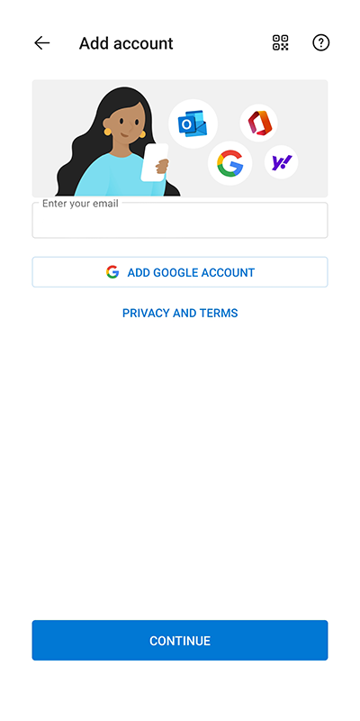
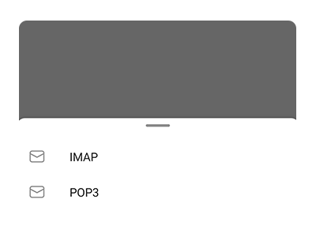
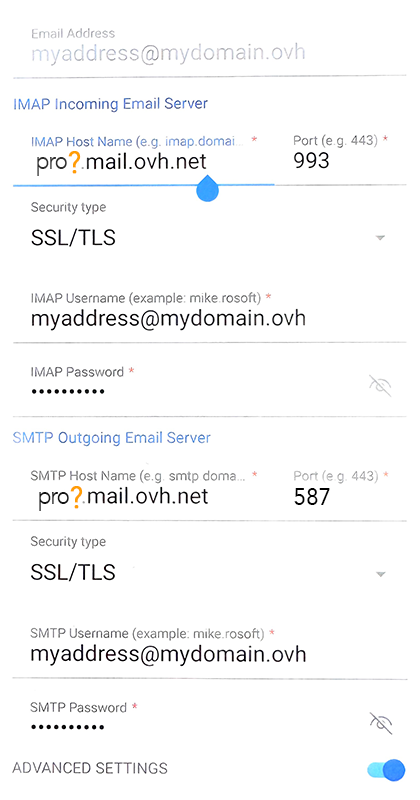
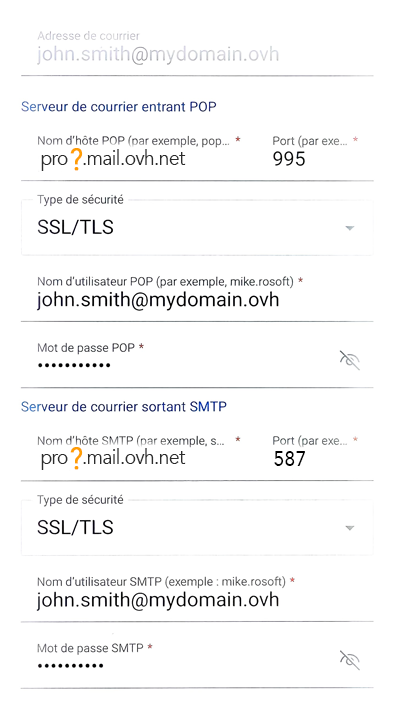
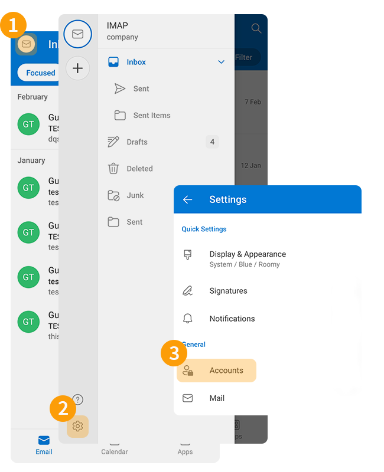

## Objetivo

Las cuentas Email Pro pueden configurarse en distintos programas de correo compatibles. para que pueda utilizar su dirección de correo desde cualquier dispositivo. La aplicación Outlook de Microsoft en Android está disponible gratuitamente desde Google Play Store.

**Descubra cómo configurar una cuenta Email Pro en Android con la aplicación Microsoft Outlook.**

> [!warning]
>
> La configuración, la gestión y la responsabilidad de los servicios que OVHcloud pone a su disposición recaen sobre usted. Por lo tanto, usted deberá asegurarse de que estos funcionan correctamente.
> 
> Ponemos a su disposición esta guía para ayudarle a realizar las tareas más habituales. No obstante, si necesita ayuda, le recomendamos que contacte con un [proveedor especializado](/links/partner) o con el editor del servicio. Nosotros no podremos asistirle. Para más información, consulte el apartado [Más información](#go-further) de esta guía.

## Requisitos

- Disponer de una solución [Email Pro](/links/web/email-pro).
- Tener la aplicación Outlook en su dispositivo móvil [Android](https://play.google.com/store/apps/details?id=com.microsoft.office.outlook&hl=es).
- Disponer del nombre de usuario y la contraseña de la dirección de correo electrónico que quiera configurar.

## Procedimiento

### Añadir la cuenta 

> [!warning]
>
> En nuestros ejemplos, utilizamos la mención servidor: pro?.mail.ovh.net. Deberá sustituir el «?» por el número que designa el servidor del servicio Email Pro.
>
> Encontrará esta cifra en su [área de cliente de OVHcloud](/links/manager), en la sección `Web Cloud`{.action}, y en la columna izquierda, `E-mail Pro`{.action}. El nombre del servidor puede verse en el recuadro **Conexión** de la pestaña `Información general`{.action}.

- **Cuando inicie la aplicación por primera vez**, aparecerá un asistente de configuración y pulse `Añadir cuenta`{.action}.

{.thumbnail .w-400 .h-600}

- **Si ya tiene una cuenta configurada**:
    - Presione el sobre « &#9993;» en la parte superior izquierda de la pantalla.
    - A continuación, pulse el botón `+`{.action} en la barra vertical izquierda.
    - Pulsa `Añadir cuenta`{.action}.

{.thumbnail .w-400 .h-600}

Siga los pasos de instalación haciendo clic en las fichas siguientes:

> [!tabs]
> **Etapa 1**
>>
>> Introduzca su dirección de correo electrónico y pulse `Continuar`{.action}.
>>
>> {.thumbnail .w-400 .h-600}
>>
> **Etapa 2**
>>
>> Seleccione el protocolo de recepción, **IMAP**(recomendado) o **POP3**.
>>
>> {.thumbnail .w-400 .h-600}
>>
>> > [!warning]
>> >
>> > Si no aparece la ventana de selección de protocolo, pulse el botón `?` en la esquina superior derecha de la pantalla y seleccione `Cambiar proveedor de cuenta`{.action}. Seleccione `IMAP`(recomendado) o `POP3`. 
>> > {.thumbnail .w-400 .h-600}
>>
> **Etapa 3 - IMAP**
>>
>> En la siguiente ventana, marque `Parámetros avanzados`{.action} e introduzca la siguiente información:
>>
>> - **Dirección de correo electrónico**
>> - **Nombre completo** : Introduzca su dirección de correo electrónico completa
>> - **Descripción**
>> - **Servidor de correo electrónico de entrada IMAP**: - **Nombre de host IMAP**: introduzca pro?.mail.ovh.net (sustituya «?» por el número de su servidor). - **Puerto**: 993 - **Tipo de seguridad**: SSL/TLS - **Nombre de usuario IMAP**: su dirección de correo electrónico completa - **Contraseña IMAP**: la de su dirección de correo electrónico
>> - **Servidor de correo saliente SMTP**: - **Nombre de host SMTP**: introduzca pro?.mail.ovh.net (sustituya «?» por el número de su servidor). - **Puerto**: 587 - **Tipo de seguridad**: STARTTLS - **Nombre de usuario SMTP**: su dirección de correo electrónico completa - **Contraseña SMTP**: la de su dirección de correo electrónico
>>
>> Para finalizar la configuración, haga clic en el botón « &#10003;».
>>
>> {.thumbnail .w-400 .h-600}
>>
> **Etapa 3 - POP3**
>>
>> En la siguiente ventana, marque `Parámetros avanzados`{.action} e introduzca la siguiente información:
>>
>> - **Dirección de correo electrónico**
>> - **Nombre completo** : Introduzca su dirección de correo electrónico completa
>> - **Descripción**
>> - **Servidor de correo entrante POP3**: - **Nombre de host POP3**: introduzca pro?.mail.ovh.net (sustituya bien «?» por el número de su servidor). - **Puerto**: 995 - **Tipo de seguridad**: SSL/TLS - **Nombre de usuario POP3**: su dirección de correo electrónico completa - **Contraseña POP3**: la de su dirección de correo electrónico
>> - **Servidor de correo saliente SMTP**: - **Nombre de host SMTP**: introduzca pro?.mail.ovh.net (sustituya «?» por el número de su servidor). - **Puerto**: 587 - **Tipo de seguridad**: STARTTLS - **Nombre de usuario SMTP**: su dirección de correo electrónico completa - **Contraseña SMTP**: la de su dirección de correo electrónico
>>
>> Para finalizar la configuración, haga clic en el botón « &#10003;».
>>
>> {.thumbnail .w-400 .h-600}
>>

> [!warning]
>
> Si, tras haber seguido los pasos de configuración anteriores, detecta un fallo de envío o recepción, consulte el apartado «[Modificar los parámetros existentes](#modify-settings)».

### Utilizar la dirección de correo electrónico

Una vez que haya configurado la dirección de correo electrónico, ¡ya puede empezar a utilizarla! Ya puede enviar y recibir mensajes.

OVHcloud ofrece una aplicación web con la que podrá acceder a su dirección de correo electrónico desde el navegador. Puede consultarla en el siguiente enlace: [Webmail](/links/web/email). Puede conectarse con las claves de su dirección de correo electrónico. Si tiene cualquier duda relativa a su uso, consulte nuestra guía [Consultar su cuenta en la interfaz OWA](/pages/web_cloud/email_and_collaborative_solutions/using_the_outlook_web_app_webmail/email_owa).

### Cambiar la configuración existente 

La aplicación Outlook no permite modificar la configuración del servidor de su cuenta de correo.

Si su cuenta de correo ya está configurada y quiere volver a configurarla, deberá eliminarla y volver a crearla:

1. Pulse el sobre « &#9993;» en la parte superior izquierda de la pantalla.
2. Pulse el icono de configuración « &#9965;» en la parte inferior de la columna izquierda.
3. En la sección «General», haga clic en `Cuentas` para ver todas las direcciones de correo electrónico configuradas en la aplicación.

{.thumbnail .w-400 .h-600}

- Seleccione la cuenta de correo correspondiente.
- Pulsa `Eliminar la cuenta`{.action}.
- Pulsa `Eliminar`{.action} en la pregunta «¿Quieres eliminar la cuenta?».

{.thumbnail .w-400 .h-600}

> [!success]
>
> Una vez que haya eliminado su cuenta de correo, siga las instrucciones que se indican en el apartado «[Añadir cuenta](#add-account)» de esta guía.

### Aviso de los parámetros POP, IMAP y SMTP 

#### Parámetros de recepción IMAP y POP

Para la recepción de mensajes de correo, al elegir el tipo de cuenta, le recomendamos que utilice **IMAP**. Sin embargo, puede seleccionar **POP**.

Haga clic en la pestaña correspondiente a su protocolo de recepción:

> [!tabs]
> **Configuración IMAP**
>>
>> - **Nombre de usuario**: Introduzca la dirección de correo electrónico **completa**
>> - **Contraseña**: Introduzca la contraseña de la dirección de correo
>> - **Servidor (entrante)** : pro?.mail.ovh.net
>> - **Puerto**: 993
>> - **Tipo de seguridad**: SSL/TLS
>>
> **Configuración POP**
>>
>> - **Nombre de usuario**: Introduzca la dirección de correo electrónico **completa**
>> - **Contraseña**: Introduzca la contraseña de la dirección de correo
>> - **Servidor (entrante)** : pro?.mail.ovh.net
>> - **Puerto**: 995
>> - **Tipo de seguridad**: SSL/TLS

#### Parámetros de envío SMTP

Para el envío de mensajes de correo electrónico, si debe introducir manualmente los parámetros **SMTP** en las preferencias de la cuenta, consulte a continuación los parámetros que debe utilizar:

**Configuración SMTP**

- **Nombre de usuario**: Introduzca la dirección de correo electrónico **completa**
- **Contraseña**: Introduzca la contraseña de la dirección de correo
- **Servidor (entrante)**: pro?.mail.ovh.net
- **Puerto**: 587
- **Tipo de seguridad**: STARTTLS

> [!primary]
>
> **Cambiar la configuración**
>
> Si su dirección de correo electrónico está configurada en **IMAP** y desea cambiar esta configuración a **POP**, debe eliminar la cuenta y volver a crearla en **POP**. Consulte el capítulo «[Modificar la configuración existente](#modify-settings)» de esta guía.

## Más información 

> [!primary]
>
> Para más información sobre la configuración de una dirección de correo electrónico desde la aplicación Outlook en Android, consulte [el Centro de ayuda de Microsoft](https://support.microsoft.com/es-es/office/configurar-el-correo-electr%C3%B3nico-en-la-aplicaci%C3%B3n-de-outlook-para-android-886db551-8dfa-4fd5-b835-f8e532091872).

Para servicios especializados (posicionamiento, desarrollo, etc.), contacte con [partners de OVHcloud](/links/partner).

Si quiere disfrutar de ayuda para utilizar y configurar sus soluciones de OVHcloud, puede consultar nuestras distintas soluciones [pestañas de soporte](/links/support).

Interactúe con nuestra [comunidad de usuarios](/links/community).