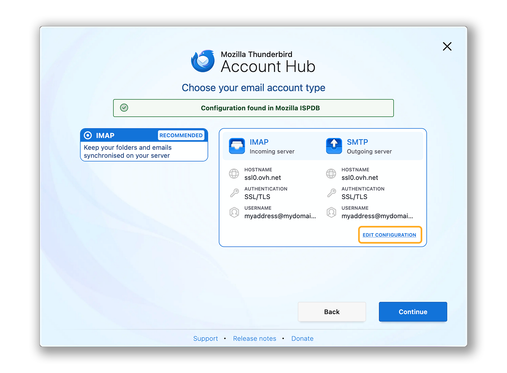
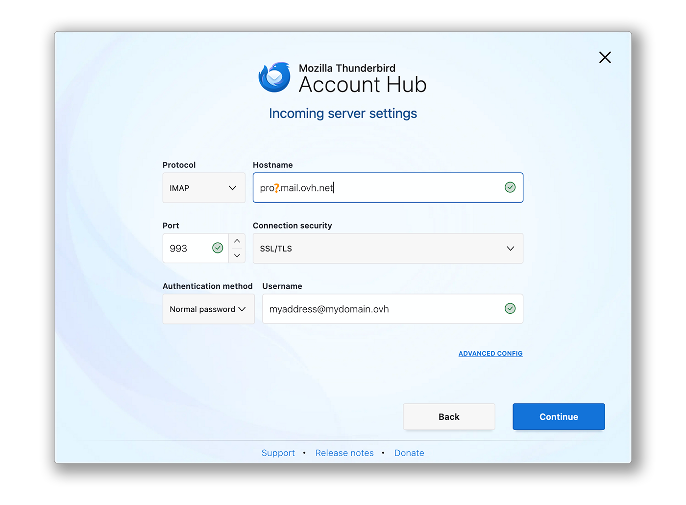
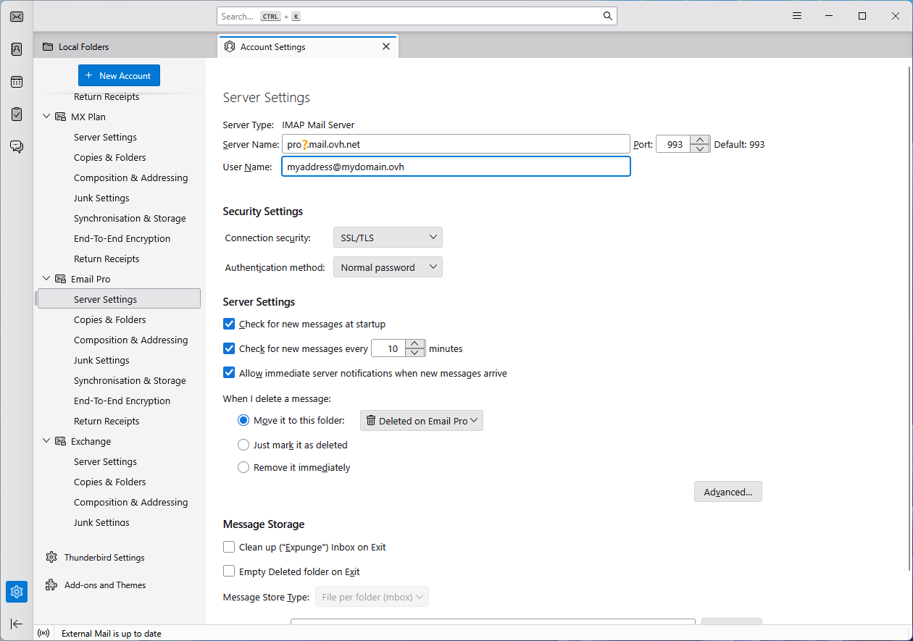
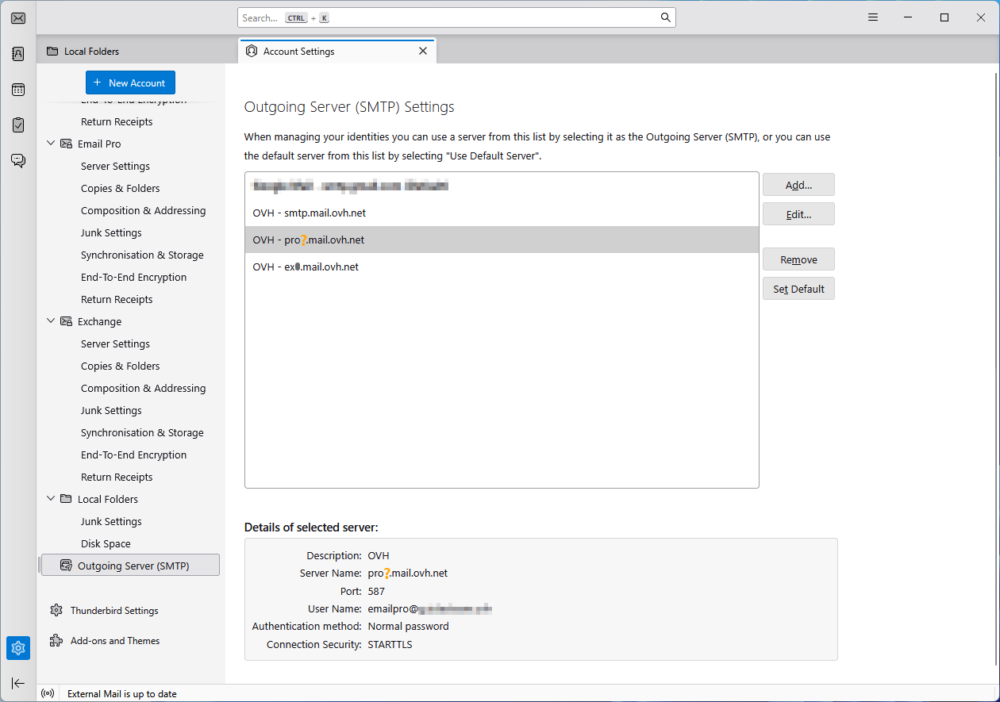

## Ziel

E-Mail Pro Accounts können auf verschiedenen kompatiblen E-Mail-Clients eingerichtet werden. So können Sie Ihr bevorzugtes Gerät für Ihre E-Mail-Adressen verwenden. Thunderbird ist ein freie E-Mail-Software.

**Diese Anleitung erklärt, wie Sie Ihre E-Mail Pro Adresse in Windows einrichten.**

## Voraussetzungen

- Sie verfügen über einen [E-Mail Pro Account](/links/web/email-pro).
- Thunderbird ist auf Ihrem Windows-System installiert.
- Sie verfügen über Anmeldeinformationen für den E-Mail-Account, die Sie konfigurieren möchten.

/// details | Informationen zur Verwaltung und Konfiguration von OVHcloud Diensten

In dieser Anleitung erläutern wir die Verwendung einer oder mehrerer OVHcloud Lösungen mit externen Tools. Die durchgeführten Aktionen werden in einem bestimmten Kontext beschrieben. Denken Sie daran, diese an Ihre Situation anzupassen.  
Wir empfehlen, sich bei Schwierigkeiten an einen [spezialisierten Dienstleister](/links/partner) zu wenden, oder Ihre Fragen in der OVHcloud Community zu stellen. OVHcloud kann keine technische Unterstützung für die Nutzung externer Tools anbieten.

Weitere Informationen finden Sie am [Ende dieser Anleitung](#gofurther).

///

## In der praktischen Anwendung

> [!warning]
>
>  In dieser Anleitung verwenden wir als Serverbezeichnung: pro?.mail.ovh.net. Das "?" muss mit der jeweils passenden Nummer Ihres zuständigen Servers für den einzurichtenden Email Pro Dienst ersetzt werden.
>
> 1. Loggen Sie sich in Ihr [OVHcloud Kundencenter](/links/manager) ein.
> 1. Gehen Sie in den Bereich `Web Cloud`{.action}.
> 1. Klicken Sie auf `E-Mail Pro`{.action}.
> 1. Wählen Sie die betreffende Plattform aus.
> 1. Der Servername ist im Bereich **Verbindung** des Tabs `Allgemeine Informationen`{.action} sichtbar.

### Account hinzufügen

- **Wenn Sie die Anwendung zum ersten Mal starten**: Es öffnet sich ein Konfigurationsassistent und Sie werden dazu aufgefordert, Ihre E-Mail-Adresse einzugeben.

- **Wenn bereits ein Konto in der Anwendung eingerichtet ist**:

    1. Klicken Sie auf das Menü `☰`{.action} in der oberen horizontalen Leiste.
    2. Klicken Sie auf `Neues Konto`{.action}.
    3. Klicken Sie auf `E-Mail-Adresse`{.action}.

{.thumbnail .w-600}

Folgen Sie den Konfigurationsschritten, indem Sie nacheinander auf die folgenden **5** Tabs klicken:

> [!tabs]
> **Schritt 1**
>>
>> Geben Sie in dem angezeigten Fenster die folgenden Informationen ein:
>>
>>  - Ihren vollständigen Namen (Anzeigename).
>>  - Die zu konfigurierende E-Mail-Adresse.
>>
>> Klicken Sie auf `Weiter`{.action}, um die Einstellungen abzuschließen.
>>
>> {.thumbnail .w-600}
>>
> **Schritt 2**
>>
>> Wenn Thunderbird einen OVHcloud Domainnamen erkennt, wird eine automatische Konfiguration für einen MX Plan Dienst vorgeschlagen. Klicken Sie auf `KONFIGURATION ÄNDERN`{.action}.
>>
>> {.thumbnail .w-600}
>>
> **Schritt 3**
>>
>> Empfangsservereinstellungen:
>>
>>  - **Protokoll**: IMAP
>>  - **Hostname**: pro?.mail.ovh.net (ersetzen Sie das "?" durch die Nummer Ihres Servers)
>>  - **Port**: 993
>>  - **Verbindungssicherheit**: SSL/TLS
>>  - **Authentifizierungsart**: Normales Passwort
>>  - **Benutzername**: Ihre vollständige E-Mail-Adresse
>>
>> {.thumbnail .w-600}
>>
> **Schritt 4**
>>
>> Einstellungen des Sendeservers:
>>
>>  - **Protokoll**: SMTP 
>>  - **Hostname**: pro?.mail.ovh.net (ersetzen Sie das "?" durch die Nummer Ihres Servers)
>>  - **Port**: 587
>>  - **Verbindungssicherheit**: STARTTLS
>>  - **Authentifizierungsart**: Normales Passwort
>>  - **Benutzername**: Ihre vollständige E-Mail-Adresse
>> 
>> 1\. Klicken Sie auf `Testen`{.action}, um die eingegebenen Einstellungen zu überprüfen. 
>> 2\. Klicken Sie auf `Weiter`{.action}, um diese Einstellungen zu bestätigen.
>>
>> {.thumbnail .w-600}
>>
> **Schritt 5**
>>
>> Geben Sie das Passwort des E-Mail-Accounts ein und klicken Sie auf `Weiter`{.action}, um die Konfiguration abzuschließen.
>>
>> {.thumbnail .w-600}
>>

> [!primary]
>
> **POP-Konfiguration**
>
> Wenn Sie eine POP-Konfiguration für Ihren E-Mail-Account wünschen, ersetzen Sie die Einstellungen von **Schritt 3** durch die folgenden:
>
> Empfangsservereinstellungen:
>
> - **Protokoll**: POP3
> - **Hostname**: pro?.mail.ovh.net (ersetzen Sie das "?" durch die Nummer Ihres Servers)
> - **Port**: 995
> - **Verbindungssicherheit**: SSL/TLS
> - **Authentifizierungsart**: Normales Passwort
> - **Benutzername**: Ihre vollständige E-Mail-Adresse

### E-Mail-Adresse nutzen

Sobald Ihre E-Mail-Adresse konfiguriert ist, können Sie damit beginnen, sie zu nutzen! Sie können nun E-Mails senden und empfangen.

OVHcloud bietet außerdem eine Webanwendung an, mit der Sie Ihre E-Mail-Adresse über einen Webbrowser nutzen können. Um auf den OVHcloud Webmail-Zugriff zu erhalten, klicken Sie auf [diesen Link](/links/web/email). Sie können sich dort mit den Zugangsdaten Ihres E-Mail-Accounts anmelden.

### Sicherung Ihrer E-Mail-Adresse erstellen

Wenn Sie eine Aktion durchführen müssen, die zu einem Datenverlust Ihres E-Mail-Accounts führen könnte, empfehlen wir Ihnen, vorher eine Sicherung des betreffenden E-Mail-Accounts durchzuführen. Dazu konsultieren Sie den Abschnitt "**Exportieren**" im Bereich "**Thunderbird**" unserer Anleitung "[Manuelle Migration Ihrer E-Mail-Adresse](/pages/web_cloud/email_and_collaborative_solutions/migrating/manual_email_migration)".

### Vorhandene Einstellungen ändern

Wenn Ihren E-Mail-Account bereits eingerichtet ist und Sie auf die Kontoeinstellungen zugreifen müssen, um sie zu ändern:

1. Klicken Sie auf das Menü `☰`{.action} in der oberen horizontalen Leiste.
2. Klicken Sie auf `Kontoeinstellungen`{.action}.

{.thumbnail .w-600}

- Um die Einstellungen, die sich auf den **Empfang** Ihrer E-Mails beziehen, zu ändern, klicken Sie auf `Servereinstellungen`{.action} in der linken Spalte unter Ihrer E-Mail-Adresse.

{.thumbnail .w-600}

- Um die Einstellungen, die sich auf den **Versand** Ihrer E-Mails beziehen, zu ändern, klicken Sie auf `Ausgehender Server (SMTP)`{.action} ganz unten in der linken Spalte.
- Klicken Sie auf die betreffende E-Mail-Adresse in der Liste und dann auf `Ändern`{.action}.

{.thumbnail .w-600}

## Weiterführende Informationen 

> [!primary]
>
> Weitere Informationen zur Konfiguration einer E-Mail-Adresse über den Thunderbird-E-Mail-Client finden Sie im [Mozilla-Hilfezentrum](https://support.mozilla.org/products/thunderbird).

[Erste Schritte mit E-Mail Pro](/pages/web_cloud/email_and_collaborative_solutions/email_pro/first_config)

Kontaktieren Sie für spezialisierte Dienstleistungen (SEO, Web-Entwicklung etc.) die [OVHcloud Partner](/links/partner).

Wenn Sie Hilfe bei der Nutzung und Konfiguration Ihrer OVHcloud Lösungen benötigen, beachten Sie unsere [Support-Angebote](/links/support).

Treten Sie unserer [User Community](/links/community) bei.
