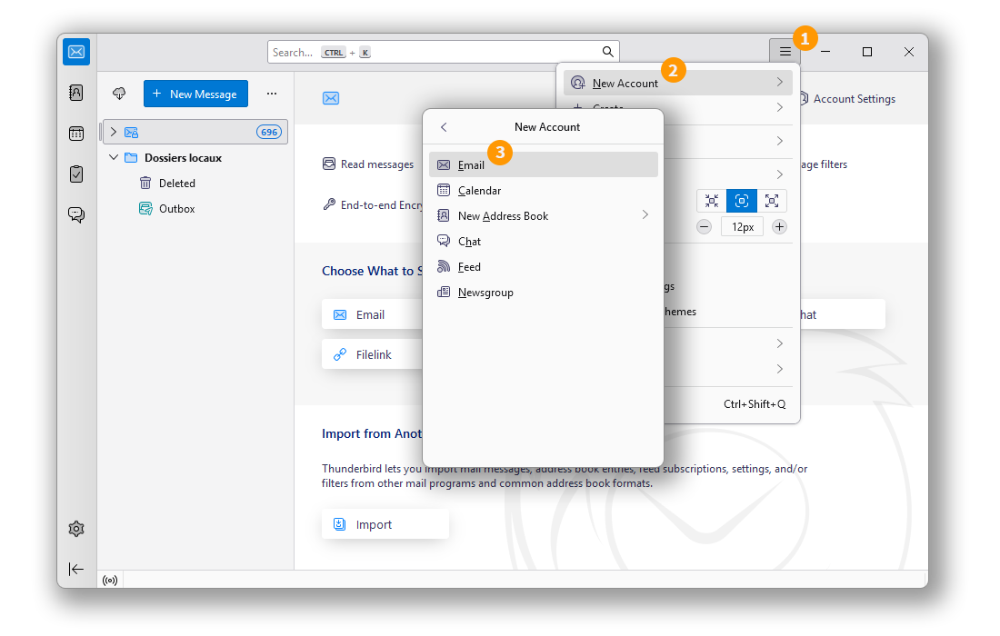
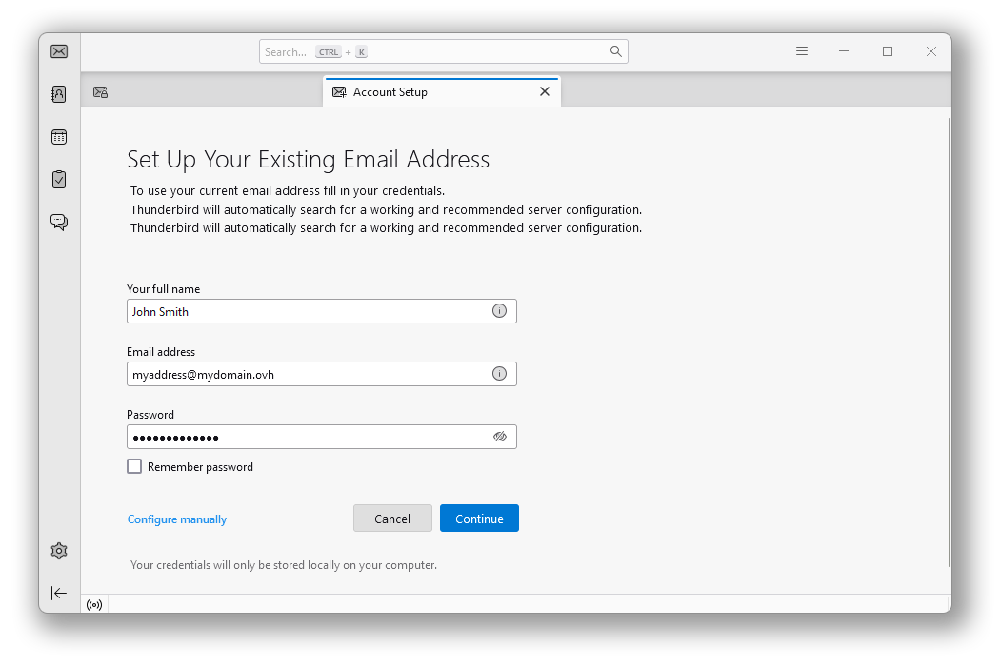
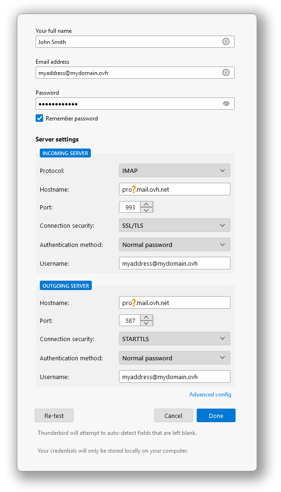
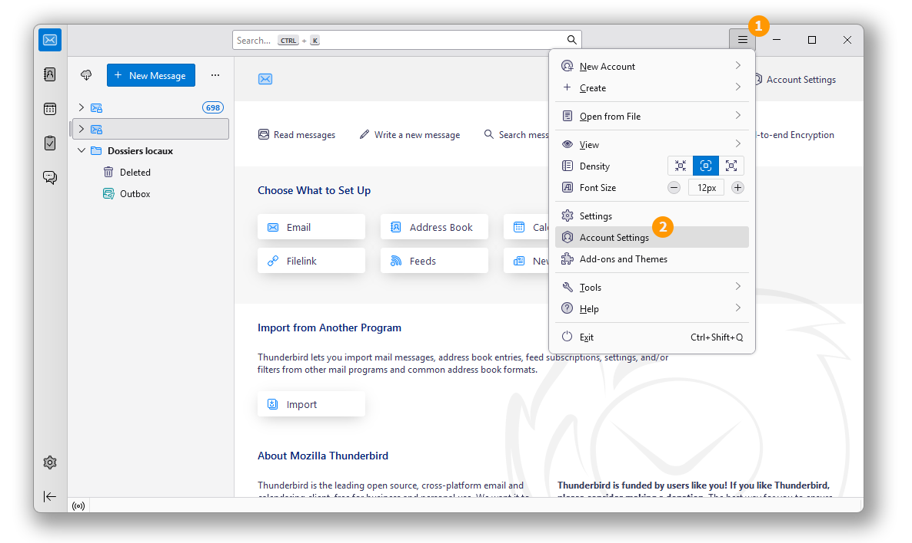
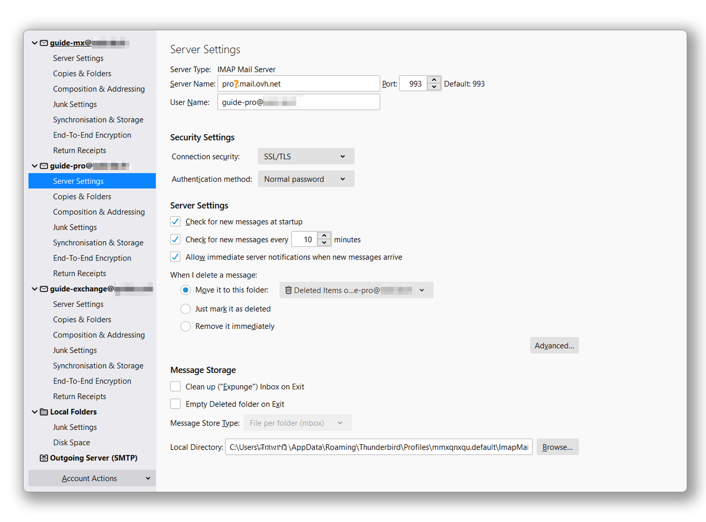
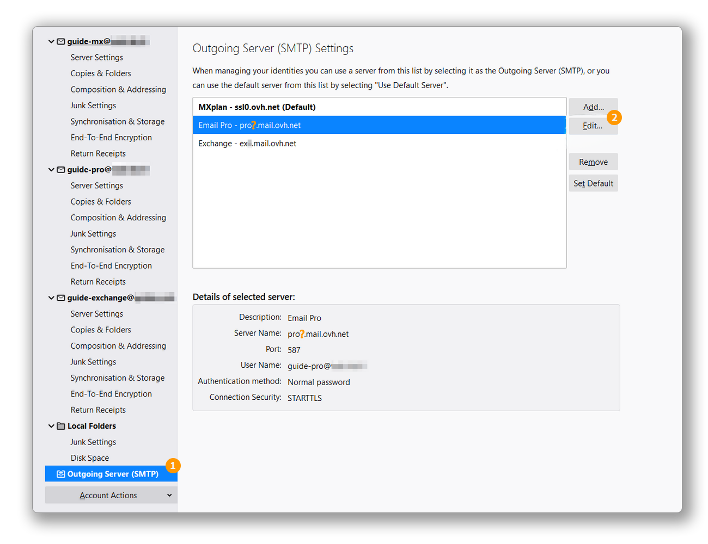

## Objectif

Les comptes E-mail Pro peuvent être configurés sur différents logiciels de messagerie compatibles. Cela vous permet d’utiliser votre adresse e-mail depuis l’appareil de votre choix. Thunderbird est un client de messagerie libre et gratuit.

**Découvrez comment configurer votre adresse E-mail Pro sur Thunderbird pour Windows.**

## Prérequis

- Disposer d’une adresse [E-mail Pro](/links/web/email-pro).
- Disposer du logiciel Thunderbird installé sur votre Windows.
- Posséder les identifiants relatifs à l'adresse e-mail que vous souhaitez paramétrer.

/// details | Informations relatives à la gestion et configuration des services OVHcloud

OVHcloud met à votre disposition des services dont la configuration, la gestion et la responsabilité vous incombent. Il vous revient de ce fait d'en assurer le bon fonctionnement.

Nous mettons à votre disposition ce guide afin de vous accompagner au mieux sur des tâches courantes. Néanmoins, nous vous recommandons de faire appel à un [partenaire spécialisé](https://marketplace.ovhcloud.com/c/support-collaboration) et/ou de contacter l'éditeur du service si vous éprouvez des difficultés. En effet, nous ne serons pas en mesure de vous fournir une assistance. Plus d'informations dans la section « Aller plus loin » de ce guide.

///

## En pratique

> [!primary]
>
> Dans notre exemple, nous utilisons la mention serveur : pro?.mail.ovh.net. Vous devrez remplacer le « ? » par le chiffre désignant le serveur de votre service E-mail Pro.
> 
> Retrouvez ce chiffre dans votre [espace client OVHcloud](/links/manager), dans la rubrique `Web Cloud`{.action} puis `E-mail Pro`{.action}. Le nom du serveur est visible dans le cadre **Connexion** de l'onglet `Informations Générales`{.action}.
> 

### Ajouter le compte

- **Lors du premier démarrage de l'application** : un assistant de configuration s'affiche et vous invite à renseigner votre adresse e-mail.

- **Si un compte a déjà été paramétré** :

    1. Cliquez sur le menu « &#9776; » dans la barre horizontale supérieure.
    2. Cliquez sur `Nouveau Compte`{.action}.
    3. Cliquez sur `Adresse E-mail`{.action} .

{.thumbnail .w-400}

Dans la fenêtre qui s'affiche, saisissez les 3 informations suivantes:

- Votre nom complet (Nom d'affichage)
- Adresse E-mail 
- Mot de passe.

Cliquez sur `Configuration Manuelle`{.action} pour compléter les paramètres.

{.thumbnail .w-400}

Complétez les paramètres du serveur :

> [!tabs]
> **SERVEUR ENTRANT (IMAP)**
>> - **Protocole** IMAP
>> - **Nom d'hôte** pro?.mail.ovh.net (remplacez bien «?» par le numéro de votre serveur)
>> - **Port** 993
>> - **Sécurité de la connexion** SSL/TLS
>> - **Authentification** Mot de passe normal
>> - **Identifiant** votre adresse e-mail complète
>>
> **SERVEUR ENTRANT (POP)**
>> - **Protocole** POP3
>> - **Nom d'hôte** pro?.mail.ovh.net (remplacez bien «?» par le numéro de votre serveur)
>> - **Port** 995
>> - **Sécurité de la connexion** SSL/TLS
>> - **Authentification** Mot de passe normal
>> - **Identifiant** votre adresse e-mail complète

**SERVEUR SORTANT** (SMTP)
- **Nom d'hôte** pro?.mail.ovh.net (remplacez bien «?» par le numéro de votre serveur)
- **Port** 587
- **Sécurité de la connexion** STARTTLS
- **Méthode d'authentification** Mot de passe normal
- **Identifiant** votre adresse e-mail complète

Cliquez sur `Terminé`{.action} pour finaliser la configuration.

{.thumbnail .w-400}

### Utiliser l'adresse e-mail

Une fois l'adresse e-mail configurée, il ne reste plus qu’à l'utiliser ! Vous pouvez dès à présent envoyer et recevoir des messages.

OVHcloud propose également une application web permettant d'accéder à votre adresse e-mail depuis un navigateur internet. Celle-ci est accessible à l’adresse [Webmail](/links/web/email). Vous pouvez vous y connecter grâce aux identifiants de votre adresse e-mail.

### Récupérer une sauvegarde de votre adresse e-mail

Si vous devez effectuer une manipulation qui risquerait d'entrainer la perte des données de votre compte e-mail, nous vous conseillons d'effectuer une sauvegarde préalable du compte e-mail concerné. Pour ce faire, consultez le paragraphe « **Exporter** » dans la partie « **Thunderbird** » de notre guide [Migrer manuellement votre adresse e-mail](/pages/web_cloud/email_and_collaborative_solutions/migrating/manual_email_migration#exporter).

### Modifier les paramètres existants

> [!primary]
>
> Dans notre exemple, nous utilisons la mention serveur : pro?.mail.ovh.net. Vous devrez remplacer le « ? » par le chiffre désignant le serveur de votre service E-mail Pro.
> 
> Retrouvez ce chiffre dans votre [espace client OVHcloud](/links/manager), dans la rubrique `Web Cloud`{.action} puis `E-mail Pro`{.action}. Le nom du serveur est visible dans le cadre **Connexion** de l'onglet `Informations Générales`{.action}.
> 

Si votre compte e-mail est déjà paramétré et que vous devez accéder aux paramètres du compte pour les modifier :

1. Cliquez sur le menu « &#9776; » dans la barre horizontale supérieure.
2. Cliquez sur `Paramètre du compte`{.action}.

{.thumbnail}

- Pour modifier les paramètres liés à la **réception** de vos e-mails, cliquez sur `Paramètres serveur`{.action} dans la colonne de gauche sous votre adresse e-mail.

{.thumbnail}

- Pour modifier les paramètres liés à **l'envoi** de vos e-mails, cliquez sur `Serveur sortant (SMTP)`{.action} tout en bas de la colonne de gauche.
- Cliquez sur l'adresse e-mail concernée dans la liste , puis cliquez sur `Modifier`{.action}.

{.thumbnail}

## Aller plus loin

> [!primary]
>
> Pour plus d'informations sur la configuration d'une adresse e-mail depuis le client de messagerie Nouvel Outlook sur Windows, consultez [le centre d'aide de Mircrosoft](https://support.microsoft.com/office/start-using-new-outlook-for-windows-4395454d-cb2f-4c16-bb24-fa4bb36650ae).

[Premiers pas avec la solution E-mail Pro](/pages/web_cloud/email_and_collaborative_solutions/email_pro/first_config)

Pour des prestations spécialisées (référencement, développement, etc.), contactez les [partenaires OVHcloud](/links/partner).

Si vous souhaitez bénéficier d'une assistance à l'usage et à la configuration de vos solutions OVHcloud, nous vous proposons de consulter nos différentes [offres de support](/links/support).

Échangez avec notre [communauté d'utilisateurs](/links/community).