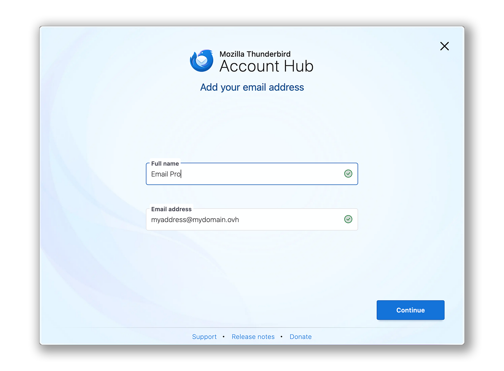
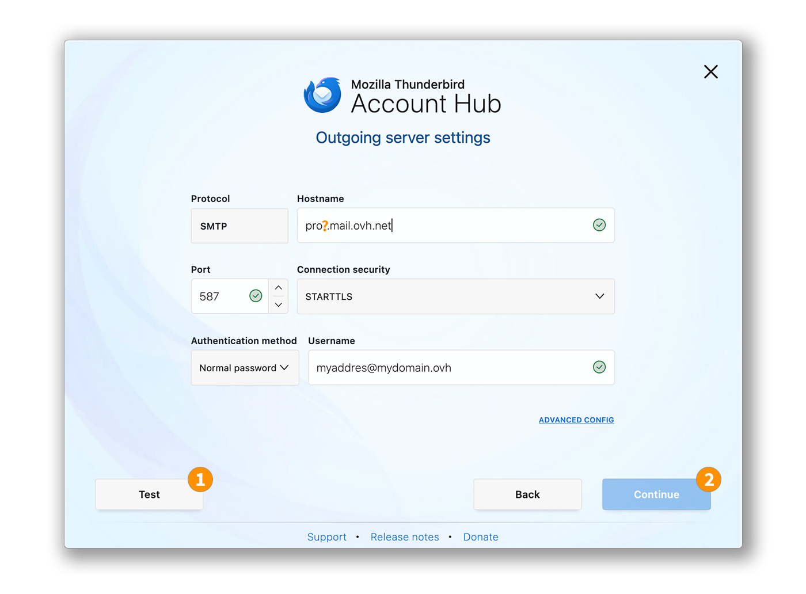
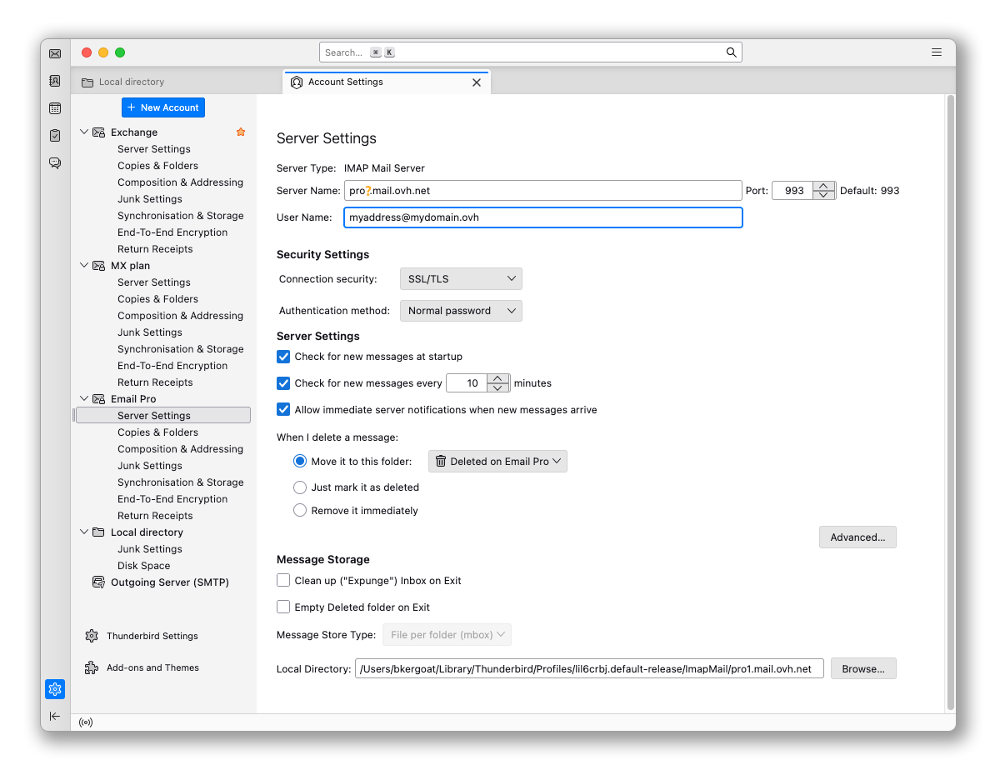
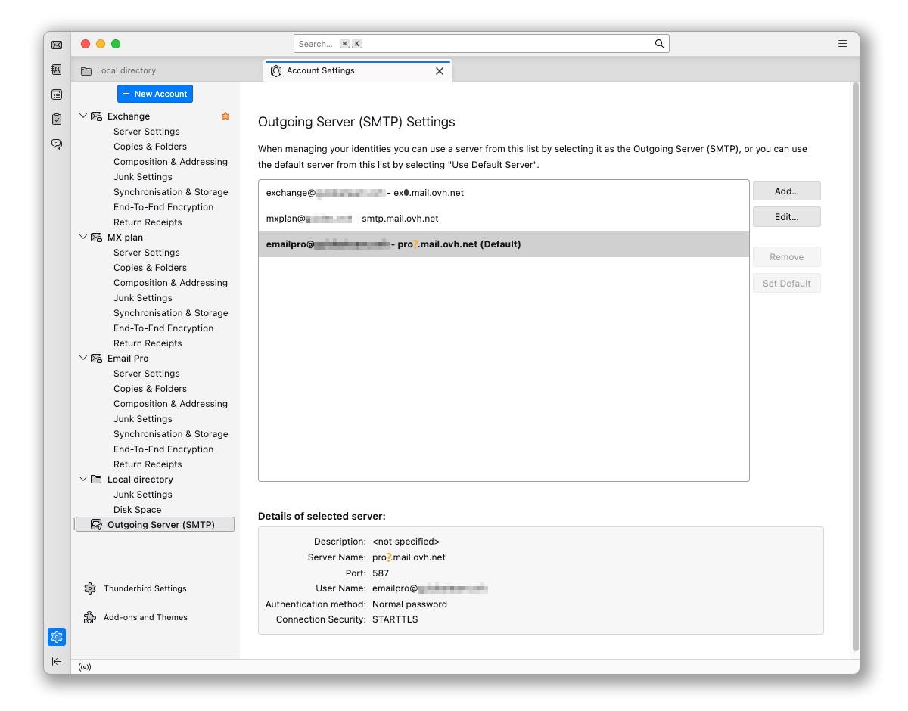

## Objetivo

Las cuentas de Email Pro se pueden configurar en diferentes clientes de correo electrónico compatibles. Esto le permite utilizar su dirección de correo electrónico desde el dispositivo de su elección. Thunderbird es un cliente de correo electrónico libre y gratuito.

**Aprenda a configurar su dirección de correo electrónico Email Pro en Thunderbird para macOS.**

## Requisitos

- Debe tener una dirección de correo electrónico [Email Pro](/links/web/email-pro).
- Debe tener el software Thunderbird instalado en su Mac.
- Debe tener las credenciales para la dirección de correo electrónico que desea configurar.

/// details | Información sobre la gestión y configuración de los servicios de OVHcloud

Esta guía le muestra cómo utilizar soluciones de OVHcloud con herramientas externas y los cambios que debe realizar en contextos específicos. Es posible que deba adaptar las instrucciones según su situación.

Si tiene dificultades para realizar estas operaciones, le recomendamos que contacte a un [proveedor de servicios especializado](/links/partner) y/o que discuta con nuestra comunidad. OVHcloud no puede proporcionarle asistencia técnica sobre el uso de herramientas externas. Más información en la sección [Más información](#go-further) de esta guía.

///

## Procedimiento

> [!warning]
>
> En nuestro ejemplo, utilizamos la mención del servidor: pro?.mail.ovh.net. Debe reemplazar el "?" con el número que designa el servidor de su servicio de Email Pro.
>
> 1. Inicie sesión en su [área de cliente de OVHcloud](/links/manager).
> 1. Vaya a la sección `Web Cloud`{.action}.
> 1. Haga clic en `Email Pro`{.action}.
> 1. Seleccione la plataforma correspondiente.
> 1. El nombre del servidor es visible en el marco **Conexión** de la pestaña `Información general`{.action}.

### Agregar la cuenta

- **Al iniciar la aplicación por primera vez**: Asistente de configuración se muestra y le pide que ingrese su dirección de correo electrónico.

- **Si una cuenta ya está configurada en la aplicación**:

    1. Haga clic en el menú `☰`{.action} en la barra horizontal superior.
    2. Haga clic en `Nueva cuenta`{.action}.
    3. Haga clic en `Dirección de correo electrónico`{.action}.

{.thumbnail .w-600}

Siga los pasos de configuración haciendo clic sucesivamente en las **5** pestañas a continuación:

> [!tabs]
> **Paso 1**
>>
>> En la ventana que aparece, ingrese las siguientes dos piezas de información:
>>
>>  - Su nombre completo (nombre de visualización).
>>  - La dirección de correo electrónico que desea configurar.
>>
>> Haga clic en `Continuar`{.action} para completar la configuración.
>>
>> {.thumbnail .w-600}
>>
> **Paso 2**
>>
>> Cuando Thunderbird detecta un nombre de dominio de OVHcloud, se propone una configuración automática relacionada con la oferta de MX Plan. Haga clic en `MODIFICAR LA CONFIGURACIÓN`{.action}.
>>
>> {.thumbnail .w-600}
>>
> **Paso 3**
>>
>> Configuración del servidor de recepción:
>>
>>  - **Protocolo**: IMAP
>>  - **Nombre de host**: pro?.mail.ovh.net (reemplace el "?" con el número de su servidor)
>>  - **Puerto**: 993
>>  - **Seguridad de la conexión**: SSL/TLS
>>  - **Método de autenticación**: Contraseña normal
>>  - **Nombre de usuario**: Su dirección de correo electrónico completa
>>
>> {.thumbnail .w-600}
>>
> **Paso 4**
>>
>> Configuración del servidor de envío:
>>
>>  - **Protocolo**: SMTP
>>  - **Nombre de host**: pro?.mail.ovh.net (reemplace el "?" con el número de su servidor)
>>  - **Puerto**: 587
>>  - **Seguridad de la conexión**: STARTTLS
>>  - **Método de autenticación**: Contraseña normal
>>  - **Nombre de usuario**: Su dirección de correo electrónico completa
>> 
>> 1. Haga clic en `Probar`{.action} para verificar la configuración ingresada.
>> 2. Haga clic en `Continuar`{.action} para validar esta configuración.
>>
>> {.thumbnail .w-600}
>>
> **Paso 5**
>>
>> Ingrese la contraseña asociada con la dirección de correo electrónico, luego haga clic en `Continuar`{.action} para finalizar la configuración.
>>
>> {.thumbnail .w-600}
>>

> [!primary]
>
> **Configuración POP**
>
> Si desea una configuración POP para su dirección de correo electrónico, reemplace los parámetros de **paso 3** con los siguientes:
>
> Configuración del servidor de recepción:
>
> - **Protocolo**: POP3
> - **Nombre de host**: pro?.mail.ovh.net (reemplace el "?" con el número de su servidor)
> - **Puerto**: 995
> - **Seguridad de la conexión**: SSL/TLS
> - **Método de autenticación**: Contraseña normal
> - **Nombre de usuario**: Su dirección de correo electrónico completa

### Utilizar la dirección de correo electrónico

Una vez que su dirección de correo electrónico esté configurada, puede comenzar a utilizarla. Ahora puede enviar y recibir correos electrónicos.

OVHcloud también ofrece una aplicación web que le permite acceder a su dirección de correo electrónico desde un navegador de Internet. Para acceder al Webmail de OVHcloud, haga clic en [este enlace](/links/web/email). Puede iniciar sesión utilizando las credenciales de su dirección de correo electrónico.

### Recuperar una copia de seguridad de su dirección de correo electrónico

Si debe realizar una operación que pueda resultar en la pérdida de datos de su cuenta de correo electrónico, le recomendamos que cree una copia de seguridad de la cuenta de correo electrónico correspondiente antes de realizar la operación. Para hacer esto, consulte el párrafo "**Exportar**" en la parte "**Thunderbird**" de nuestra guía "[Migrar manualmente una dirección de correo electrónico](/pages/web_cloud/email_and_collaborative_solutions/migrating/manual_email_migration)".

### Modificar los parámetros existentes

Si su cuenta de correo electrónico ya está configurada y necesita acceder a los parámetros de la cuenta para modificarlos:

1. Haga clic en el menú `☰`{.action} en la barra horizontal superior.
2. Haga clic en `Configuración de cuentas`{.action}.

{.thumbnail .w-600}

- Para modificar los parámetros relacionados con la **recepción** de sus correos electrónicos, haga clic en `Configuración del servidor`{.action} en la columna izquierda debajo de su dirección de correo electrónico.

{.thumbnail .w-600}

- Para modificar los parámetros relacionados con el **envío** de sus correos electrónicos, haga clic en `Servidor de envío (SMTP)`{.action} en la parte inferior de la columna izquierda.
- Haga clic en la dirección de correo electrónico correspondiente en la lista, luego haga clic en `Modificar`{.action}.

{.thumbnail .w-600}

## Más información 

> [!primary]
>
> Para obtener más información sobre la configuración de una dirección de correo electrónico en el cliente de correo electrónico Thunderbird, visite el [centro de ayuda de Mozilla](https://support.mozilla.org/products/thunderbird).

[Primeros pasos con la solución Email Pro](/pages/web_cloud/email_and_collaborative_solutions/email_pro/first_config)

Para servicios especializados (posicionamiento, desarrollo, etc.), contacte con los [partners de OVHcloud](/links/partner).

Si quiere disfrutar de ayuda para utilizar y configurar sus soluciones de OVHcloud, puede consultar nuestras distintas soluciones [pestañas de soporte](/links/support).

Interactúe con nuestra [comunidad de usuarios](/links/community).