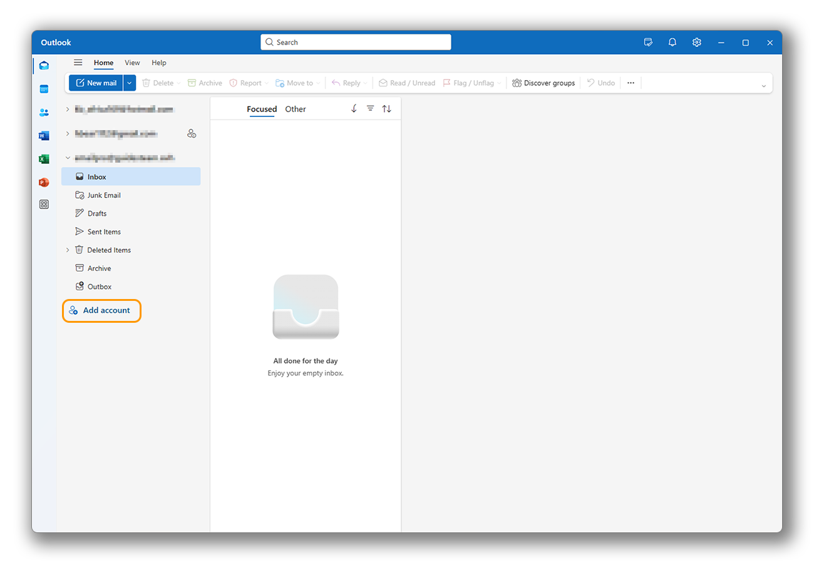
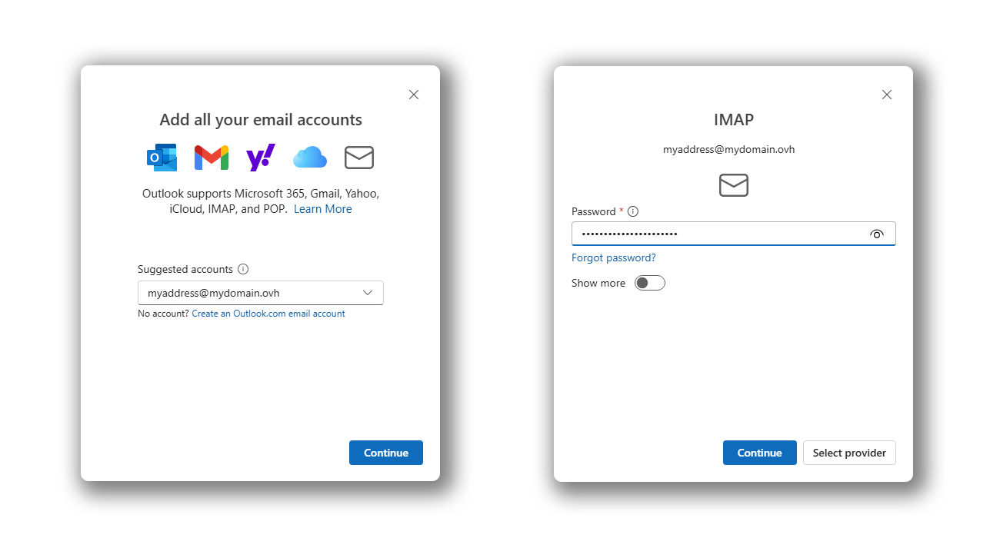
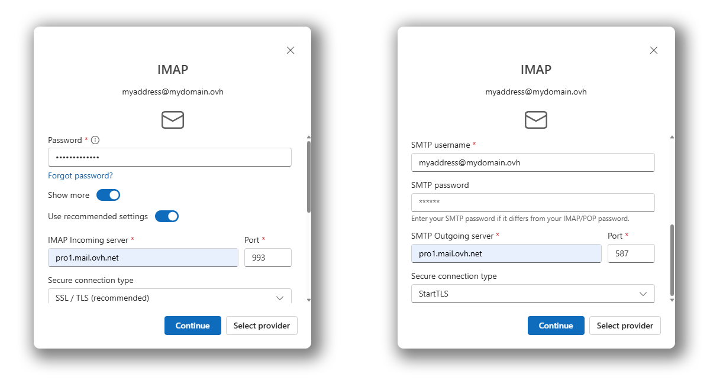
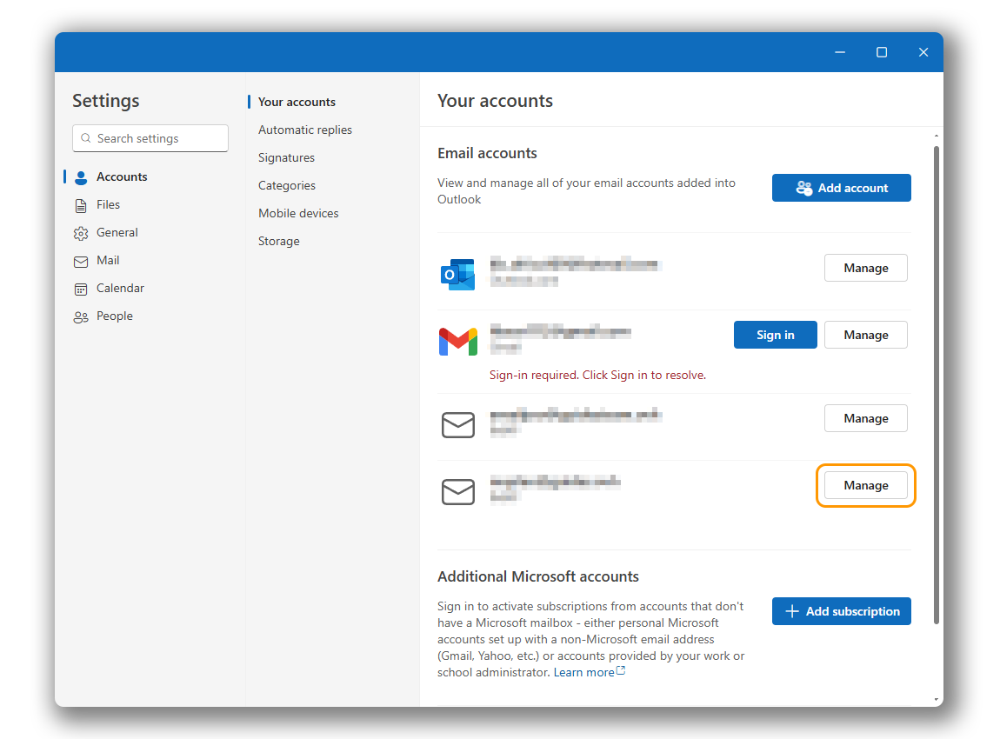
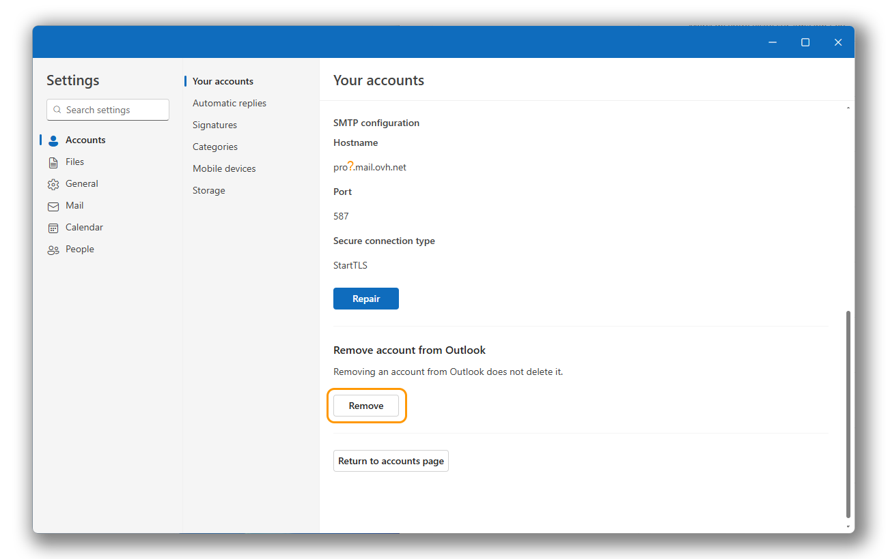

## Objective

The email addresses from the [Email Pro](/links/web/email-pro) offer can be configured on a compatible email client. This allows you to send and receive messages from the application of your choice.

The **New Outlook** has replaced the **Mail** application on Windows since January 1, 2025. For more information on this topic, please refer to Microsoft's official page:  
[Outlook for Windows: The Future of Mail, Calendar, and People on Windows 11](https://support.microsoft.com/en-gb/office/outlook-for-windows-the-future-of-mail-calendar-and-people-on-windows-11-715fc27c-e0f4-4652-9174-47faa751b199)

**Learn how to configure your Email Pro account on the New Outlook for Windows.**

## Requirements

- An [Email Pro](/links/web/email-pro) account
- The [New Outlook](https://support.microsoft.com/office/getting-started-with-the-new-outlook-for-windows-656bb8d9-5a60-49b2-a98b-ba7822bc7627) for Windows
- The credentials for the email account you wish to configure

/// details | Information related to the management and configuration of OVHcloud services

This guide will show you how to use OVHcloud solutions with external tools, and the changes you need to make in specific contexts. You may need to adapt the instructions according to your situation.

If you experience any difficulties carrying out these operations, we recommend that you contact a [specialist service provider](/links/partner) or discuss the issue with our [community](/links/community). OVHcloud cannot provide you with technical support in this regard. You can find more information in the [Go further](#go-further) section of this guide.

///

## Instructions

> [!warning]
>
> This documentation applies only to the **new Outlook** and not to "[Classic Outlook](https://support.microsoft.com/office/installer-ou-r%C3%A9installer-outlook-classique-sur-un-pc-windows-5c94902b-31a5-4274-abb0-b07f4661edf5)" available in the Microsoft 365 suite or previously installed on your computer.
>
> To distinguish the two versions of Outlook when both are installed, type "Outlook" in the Windows search bar. You will then be able to see the difference as shown below. The new Outlook has no special mention.
>
> {.thumbnail .h-500}
>
> To configure your E-mail Pro address on Classic Outlook, refer to our guide "[E-mail Pro - Configure an e-mail account on Classic Outlook for Windows](/pages/web_cloud/email_and_collaborative_solutions/email_pro/how_to_configure_outlook_2016)".

### Add the account 

> [!warning]
>
> In our example, we use the server name: pro?.mail.ovh.net. You will need to replace the "?" with the number corresponding to your E-mail Pro service server.
>
> 1. Log in to your [OVHcloud Control Panel](/links/manager).
> 1. Go to the `Web Cloud`{.action} section.
> 1. Click on `Email Pro`{.action}.
> 1. Select the relevant platform.
> 1. The server name is visible in the **Connection** section of the `General information`{.action} tab.
>

> [!tabs]
> **Step 1**
>> - Open Outlook. In the left column, click on `Add an account`{.action} to start the configuration.
>>
>> {.thumbnail .w-400}
>>
> **Step 2**
>> - Enter your email address, then click `Continue`{.action}.
>> - Enter your password and click the `Show more`{.action} button.
>>
>> {.thumbnail .w-400}
>>
> **Step 3**
>> - Enter the following parameters:
>>    - **IMAP incoming server**: pro?.mail.ovh.net
>>    - **Port**: 993
>>    - **Secure connection type**: SSL/TLS
>>    - **SMTP username**: The email address you are adding.
>>    - **SMTP outgoing server**: pro?.mail.ovh.net
>>    - **Port**: 587
>>    - **Secure connection type**: STARTTLS
>>    - **Password**: Do not enter anything; the password entered earlier will be used.
>> - Click `Continue`{.action} to finalize the configuration.
>>
>> {.thumbnail .w-400}

### Using the email address 

Once the email address is configured, you can start using it! You can now send and receive messages.

OVHcloud also provides a web application that allows you to access your email account from your web browser at [Webmail](/links/web/email). You can log in using the credentials for your email account.

### Modifying existing settings 

The Outlook application does not allow you to modify the server settings for your email account.

If your email account is already configured and you wish to reconfigure it, you will need to delete it and recreate it:

- Click on the settings icon (&#9965;) at the bottom of the left column.
- In the "Your accounts" section, click on `Manage`{.action} to the right of the relevant email account.

{.thumbnail .w-400}

- Scroll to the bottom of the page.
- Click on `Delete`{.action} to start the deletion process.
- Determine whether you want to delete it only from this device or from all devices using Outlook.

{.thumbnail .w-400}

> [!success]
>
> Once your email account is deleted, follow the instructions in the "[Add the account](#add-account)" section of this documentation.

### General sending and receiving settings 

#### IMAP and POP receiving settings 

For receiving emails, we recommend using **IMAP** when choosing the account type. However, you can also select **POP**.

Select the tab corresponding to your configuration type:

> [!tabs]
> **IMAP Configuration**
>>
>> - **Username**: Enter the **complete** email address.
>> - **Password**: Enter the email account password.
>> - **Incoming server**: pro?.mail.ovh.net (replace "?" with your server number).
>> - **Port**: 993.
>> - **Security type**: SSL/TLS.
>>
> **POP Configuration**
>>
>> - **Username**: Enter the **complete** email address.
>> - **Password**: Enter the email account password.
>> - **Incoming server**: pro?.mail.ovh.net (replace "?" with your server number).
>> - **Port**: 995.
>> - **Security type**: SSL/TLS.

#### SMTP sending settings 

For sending emails, find the **SMTP** settings to use below:

**SMTP Configuration**

- **Username**: Enter the **complete** email address.
- **Password**: Enter the email account password.
- **Outgoing server**: pro?.mail.ovh.net (replace "?" with your server number).
- **Port**: 587.
- **Security type**: STARTTLS.

## Go further 

> [!primary]
>
> For more information on configuring an email address from the New Outlook messaging client on Windows, please refer to [Microsoft's help center](https://support.microsoft.com/office/start-using-new-outlook-for-windows-4395454d-cb2f-4c16-bb24-fa4bb36650ae).

[First steps with the Email Pro solution](/pages/web_cloud/email_and_collaborative_solutions/email_pro/first_config)

For specialized services (SEO, development, etc.), contact [OVHcloud partners](/links/partner).

If you would like assistance using and configuring your OVHcloud solutions, please refer to our [support offers](/links/support).

Join our [community of users](/links/community).