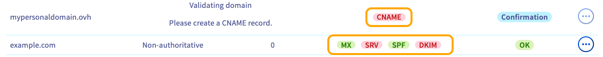
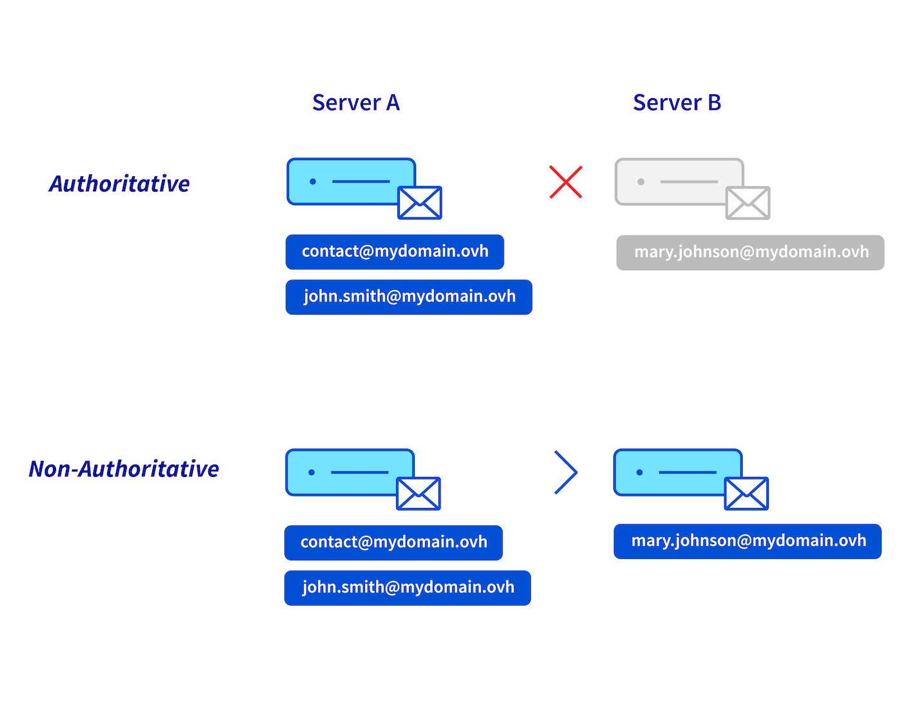

## Ziel

Um die in Ihrer Exchange Lösung enthaltenen Accounts nutzen zu können, benötigen Sie einen Domainnamen. Es ist auch möglich, mehrere Domainnamen zu einer Exchange oder E-Mail Pro Dienstleistung hinzuzufügen.

**Diese Anleitung erklärt, wie Sie einen Domainnamen zu Ihrer Exchange oder E-Mail Pro Plattform hinzufügen.**

## Voraussetzungen

- Sie verfügen über einen [Exchange Dienst](/links/web/emails-hosted-exchange) oder [E-Mail Pro Dienst](/links/web/email-pro).
- Sie verfügen über einen oder mehrere Domainnamen.
- Sie haben administrativen Zugang zur Verwaltung der Domainkonfiguration (zum [Bearbeiten der DNS Zone](/pages/web_cloud/domains/dns_zone_edit)).
- Sie haben Zugriff auf Ihr [OVHcloud Kundencenter](/links/manager).

## In der praktischen Anwendung

### Zugang zur Verwaltung Ihrer Dienstleistung

> [!tabs]
> **Exchange**
>>
>> 1. Loggen Sie sich in Ihr [OVHcloud Kundencenter](/links/manager) ein.
>> 1. Öffnen Sie den Bereich `Web Cloud`{.action}.
>> 1. Klicken Sie auf `Microsoft`{.action}.
>> 1. Klicken Sie auf `Exchange`{.action}.
>> 1. Wählen Sie den gewünschten Dienst aus.
>>
> **Email Pro**
>>
>> 1. Loggen Sie sich in Ihr [OVHcloud Kundencenter](/links/manager) ein.
>> 1. Öffnen Sie den Bereich `Web Cloud`{.action}.
>> 1. Klicken Sie auf `E-Mail Pro`{.action}.
>> 1. Wählen Sie den gewünschten Dienst aus.
>>

### Eine Domain hinzufügen

1. Klicken Sie auf den Tab `Assoziierte Domains`{.action} Ihrer Exchange oder E-Mail Pro Plattform.
1. Die angezeigte Tabelle listet die Domainnamen auf, die aktuell mit Ihrer Dienstleistung verbunden sind.
1. Klicken Sie auf den Button `Domain hinzufügen`{.action}.

{.thumbnail .w-400}

> [!warning]
>
> Standardmäßig sind alle E-Mail-Accounts einer Plattform miteinander verbunden. Alle in Ihrem E-Mail-Dienst erstellten Adressen können alle Adressen dieses Dienstes im Verzeichnis anzeigen, einschließlich der Adressen mit einer anderen Domain. Um die Anzeige der Domains zu entkoppeln, ist es notwendig, für die betreffende Domain(s) eine andere plattform [Exchange oder Email Pro](/links/web/emails) zu bestellen.
>

Im Fenster zum Hinzufügen einer Domain :

- **Eine Domain aus der Liste auswählen**: In der Liste finden Sie die Domainnamen, für die Sie die vollständige Verwaltung (oder zumindest die Verwaltung der DNS-Zone) in Ihrem OVHcloud Kundencenter haben.

- **Einen Domainnamen eingeben, der nicht in Ihrem OVHcloud Account verwaltet wird**: Sie müssen in der Lage sein, die Konfiguration der Domain zu ändern, insbesondere ihre DNS-Zone, damit der Dienst konfiguriert werden kann.

Wenn Sie Ihre Auswahl getroffen haben, klicken Sie auf den Button `Weiter`{.action}.

{.thumbnail .w-400}

Das Fenster zeigt nun Informationen zur Konfiguration der Modi an.

- **Wenn Sie in der Liste eine von OVHcloud verwaltete Domain ausgewählt haben**: Sie haben die Wahl zwischen zwei Modi.
    - **Empfohlene Konfiguration**: Ihre DNS-Zone wird automatisch konfiguriert. Passend, wenn Sie in Ihrer DNS-Zone keine spezifische Konfiguration für MX-, SPF-, DKIM- und SRV-Einträge haben.
    - **Personalisierte Konfiguration**: Passt, wenn Sie bereits ein E-Mail-Angebot für Ihre Domain eingerichtet haben. Sie können die Elemente auswählen, die Sie interessieren.
        - Wenn Sie einen privaten oder externen E-Mail-Dienst von OVHcloud als Ergänzung zu dieser E-Mail-Plattform verwenden möchten, geben Sie den Hostnamen des E-Mail-Servers im Feld `URL des Ziel-E-Mail-Servers` ein.
        - *MX-Eintrag automatisch konfigurieren*: Ermöglicht die automatische Erfassung der Empfangsserver von OVHcloud (gilt für alle E-Mail-Angebote von OVHcloud).
        - *SPF-Eintrag automatisch konfigurieren*: Ermöglicht die automatische Eingabe des SPF-Eintrags, damit die Server von OVHcloud für den Versand von E-Mails Ihre E-Mails übertragen können. Diese Registrierung gilt für alle OVHcloud E-Mail-Angebote.
        - *DKIM-Eintrag automatisch konfigurieren*: Ermöglicht die automatische Eingabe der für die Authentifizierung Ihrer E-Mail-Sendungen erforderlichen Einträge.
        - *SRV-Eintrag automatisch konfigurieren*: Ermöglicht es dem E-Mail-Client, Exchange-Konten automatisch für Ihre Domain zu konfigurieren.

{.thumbnail .w-400}

- **Wenn Sie eine Domain angegeben haben, die nicht in Ihrem OVHcloud Account verwaltet wird** : Dies bedeutet, dass die Domain, insbesondere ihre DNS-Zone, nicht über Ihr OVHcloud Kundencenter verwaltet wird. Es kann auch bei einem anderen Registrar registriert werden. In diesem Fall muss die Konfiguration unabhängig von der nächsten Auswahl direkt im Verwaltungsinterface vorgenommen werden.
    - **Empfohlene Konfiguration**: Geeignet, wenn Sie nur die E-Mail-Angebote von OVHcloud verwenden.  
    - **Personalisierte Konfiguration**: Wenn Sie einen privaten oder externen E-Mail-Dienst von OVHcloud als Ergänzung zu dieser E-Mail-Plattform verwenden möchten, geben Sie den Hostnamen des E-Mail-Servers im Feld `URL des Ziel-E-Mail-Servers` ein.

{.thumbnail .w-400}

Am Ende der Konfiguration werden Sie aufgefordert, die angezeigten Informationen zu überprüfen und auf den Button `Bestätigen`{.action} zu klicken, um das Hinzufügen der Domain zu bestätigen.

### Domainnamen konfigurieren (DNS-Zone)

Nachdem die Domain als assoziierte Domain hinzugefügt wurde, überprüfen Sie in der angezeigten Tabelle, dass die Konfiguration korrekt ist. Ein grünes Kästchen zeigt an, dass die Domain korrekt konfiguriert ist. 

Wenn das Kästchen rot ist:

- **Wenn Sie beim Hinzufügen der Domain die automatische Konfiguration gewählt haben**: Es kann einige Minuten dauern, bis die Anzeige im OVHcloud Kundencenter aktualisiert ist.

- **Wenn Sie einen Domainnamen angegeben haben, der nicht von Ihrem OVHcloud Account verwaltet wird**:
- Klicken Sie auf das rote Kästchen `MX`, `SRV`, `SPF` und `DKIM`, um die gewünschten Änderungen anzuzeigen. Verwendet diese Domain nicht die OVHcloud Konfiguration (die DNS-Server von OVHcloud), nehmen Sie die Änderungen über das Verwaltungsinterface Ihrer Domain vor.
- Als Teil eines roten `CNAME` Kästchens lesen Sie unsere Anleitung, wie Sie [einen CNAME Eintrag erstellen und eine dazugehörige Domain hinzufügen](/pages/web_cloud/email_and_collaborative_solutions/microsoft_exchange/exchange_dns_cname).

{.thumbnail .w-400}

> [!primary]
>
> Die Änderung der Konfiguration einer Domain erfordert eine Propagationszeit von 4 bis maximal 24 Stunden, bis sie voll wirksam ist.
>

Um zu überprüfen, dass die Konfiguration einer Domain korrekt ist, gehen Sie zurück in die Tabelle `Assoziierte Domains`{.action} Ihres Dienstes. Wenn das grüne Kästchen nun angezeigt wird, ist die Domain korrekt konfiguriert. Andernfalls ist die Propagierung möglicherweise noch nicht abgeschlossen.

### den Modus einer assoziierten Domain ändern

Sie können den Modus einer assoziierten Domain auf Ihrer Plattform ändern. Zuvor ist es notwendig, den Unterschied zwischen dem autoritativen und dem nicht-autoritativen Modus zu verstehen.

> [!primary]
>
> **Autoritativ / nicht-autoritativ**
>
> - Wenn Sie den **autoritativen Modus** auf Ihrer E-Mail-Plattform (*Server A*) auswählen, werden alle E-Mail-Adressen Ihrer Domain auf dieser Plattform gehostet. Wenn Sie beispielsweise eine E-Mail an die Adresse "*mary.johnson@mydomain.ovh*" senden, sendet "*Server A*" eine Fehlermeldung an den Absender, da diese Adresse auf dem "*Server A*" nicht vorhanden ist.  
>
> - Der **nicht-autoritative** Modus auf Ihrer E-Mail-Plattform (*Server A*) erlaubt die Aufteilung der E-Mail-Adressen Ihres Domainnamens zwischen Ihrer Haupt-E-Mail-Plattform (*Server A*) und einem anderen E-Mail-Dienst (*Server B*). Wenn Sie zum Beispiel eine E-Mail an die Adresse "*mary.johnson@mydomain.ovh*" senden, leitet der *Server A* die E-Mail zur Zustellung an den "*Server B*" weiter. 
>
> {.thumbnail .w-400}

1. Klicken Sie auf den Tab `Assoziierte Domains`{.action}.
1. Klicken Sie auf den Button `...`{.action} in der Zeile der betreffenden Domain.
1. Klicken Sie auf `Konfiguration`{.action}.
1. Wählen Sie den gewünschten Modus.

> [!warning]
>
> Wenn Sie beim Hinzufügen Ihres Domainnamens zu Ihrer E-Mail-Plattform die Nachricht "**autoritative domain detected**" erhalten, bedeutet dies, dass dieser Domainname auf einer anderen E-Mail-Plattform im **autoritativen** Modus deklariert ist. Sie müssen auf beiden Plattformen in den **nicht-autoritativen** Modus wechseln, damit sie nebeneinander bestehen können.

### Accounts konfigurieren und verwenden

Nachdem Sie die gewünschten Domainnamen zu Ihrem Dienst hinzugefügt haben, können Sie Ihre E-Mail-Accounts mit diesen konfigurieren. Gehen Sie hierzu in den Tab `E-Mail-Accounts`{.action}. Bei Bedarf können Sie weitere Accounts über den Button `Aktion`{.action}/`Accounts bestellen`{.action} oder `Einen Account hinzufügen`{.action} bestellen.

Zur Erinnerung: Alle für Ihren Dienst erstellten Adressen können im Adressbuch alle Adressen dieses Dienstes einsehen, auch die Adressen mit einem anderen Domainnamen.

Sobald die Accounts vollständig eingerichtet sind, können Sie mit deren Verwendung beginnen. Hierzu stellt Ihnen OVHcloud das **webmail** zur Verfügung, auf das Sie [hier](/links/web/email) zugreifen können . Damit Ihre Adresse optimal auf einem Softwareprodukt verwendet werden kann, überprüfen Sie, ob sie mit dem Dienst kompatibel ist.

Wenn Sie Ihre E-Mail-Adresse auf einem E-Mail-Client oder einem Peripheriegerät wie einem Smartphone oder Tablet einrichten möchten oder Hilfe bei den Funktionen Ihres E-Mail-Dienstes benötigen, lesen Sie unsere Dokumentation unter [Exchange](/links/web/emails) und [E-Mail Pro](/links/web/email-pro).

Sie können Outlook-Lizenzen im [OVHcloud Kundencenter](/links/manager) und Office 365-Lizenzen auf der Seite [Microsoft 365](/links/web/ms365) erwerben. Wir empfehlen Ihnen eine dieser Lösungen, wenn Sie Outlook E-Mail-Software oder weitere Software der Office Suite nutzen möchten.

### Einen Domainnamen von einer Plattform löschen

Wenn Sie einen Domainnamen entfernen möchten, der mit Ihrem Exchange oder E-Mail Pro Dienst verbunden ist, müssen Sie sicherstellen, dass dieser nicht mit E-Mail-Accounts, Alias, Ressourcen, geteilten Accounts (nur bei Exchange), Gruppen, externen Kontakten oder Fußzeilen verbunden ist, die noch konfiguriert sind. In diesem Fall müssen **diese Accounts mit einem anderen Domainnamen** auf Ihrer Plattform verbunden werden oder **gelöscht** werden.

> [!warning]
>
> Bevor Sie E-Mail-Accounts löschen, stellen Sie sicher, dass diese nicht verwendet werden. Möglicherweise ist eine Sicherung dieser Accounts erforderlich. Lesen Sie bei Bedarf die Anleitung [E-Mail-Adresse manuell migrieren](/pages/web_cloud/email_and_collaborative_solutions/migrating/manual_email_migration), in der beschrieben wird, wie Sie die Daten eines Accounts über Ihr Kundencenter oder ein E-Mail-Programm exportieren.

Gehen Sie auf den Tab `Assoziierte Domains`{.action} Ihrer Plattform. In der Tabelle zeigt die Spalte `Accounts` die Anzahl der Accounts an, die mit den Domainnamen Ihrer Liste verbunden sind.

Wenn mit dem Domainnamen, den Sie abtrennen möchten, E-Mail-Accounts verbunden sind, haben Sie 2 Möglichkeiten:

**Die Accounts mit einem anderen Domainnamen verbinden**:

1.\ Gehen Sie in den Tab `E-Mail-Accounts`{.action}. 
2.\ Klicken Sie rechts neben den zu ändernden Konten auf die Schaltfläche `...`{.action}. 
3.\ Klicken Sie auf `Bearbeiten`{.action}.

{.thumbnail .w-400}

4.\ Im Bearbeitungsfenster können Sie den mit dem Account verbundenen Domainnamen über das Dropdown-Menü ändern.

{.thumbnail .w-400}

**Konten von Ihrer Plattform löschen**:

1. Gehen Sie in den Tab `E-Mail-Konten`{.action}.
1. Klicken Sie rechts neben dem zu löschenden Konto auf die Schaltfläche `...`{.action}.
1. Klicken Sie auf `Account zurücksetzen`{.action} oder `Zurücksetzen`{.action}.

{.thumbnail .w-400}

Sobald die Accounts einem anderen Domainnamen zugewiesen wurden oder nachdem sie zurückgesetzt wurden, kann der Domainname gelöscht werden.

Klicken Sie im Tab `Assoziierte Domains`{.action} Ihrer Plattform auf den Button `...`{.action} rechts neben der betreffenden Domain und dann auf `Diese Domain löschen`{.action}.

{.thumbnail .w-400}

## Weiterführende Informationen

[CNAME-Eintrag zu einer assoziierten Domain hinzufügen](/pages/web_cloud/email_and_collaborative_solutions/microsoft_exchange/exchange_dns_cname)

[OVHcloud DNS-Zone bearbeiten](/pages/web_cloud/domains/dns_zone_edit)

Kontaktieren Sie für spezialisierte Dienstleistungen (SEO, Web-Entwicklung etc.) die [OVHcloud Partner](/links/partner).

Wenn Sie Hilfe bei der Nutzung und Konfiguration Ihrer OVHcloud Lösungen benötigen, beachten Sie unsere [Support-Angebote](/links/support).

Treten Sie unserer [User Community](/links/community) bei.
