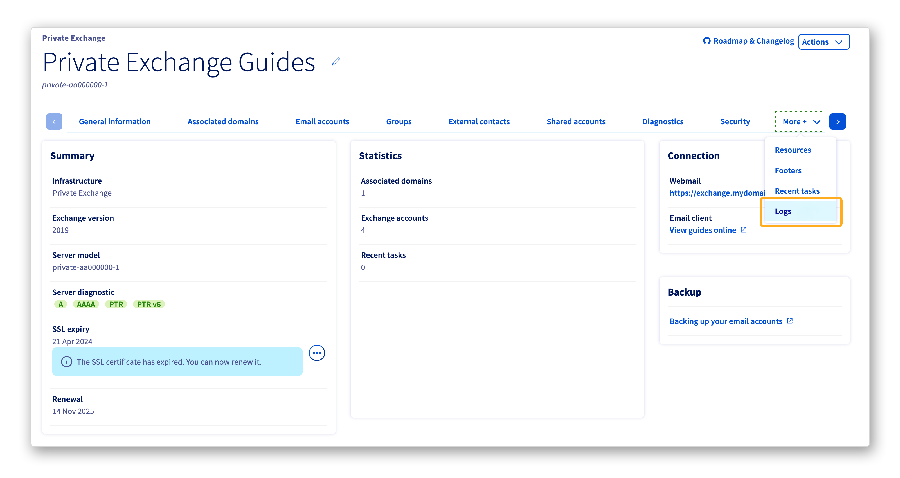
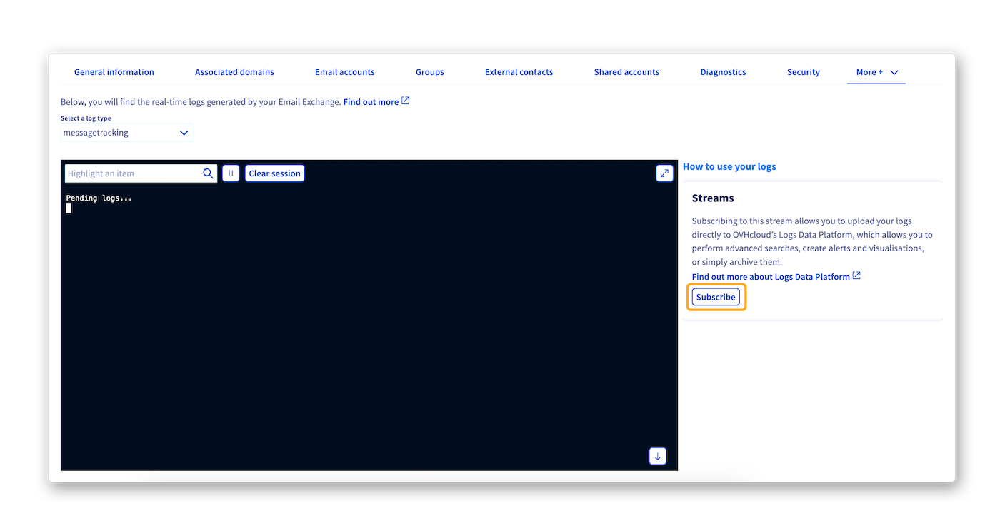
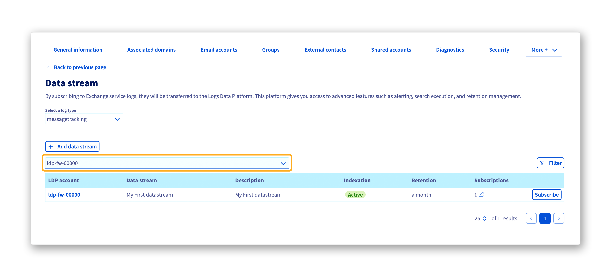
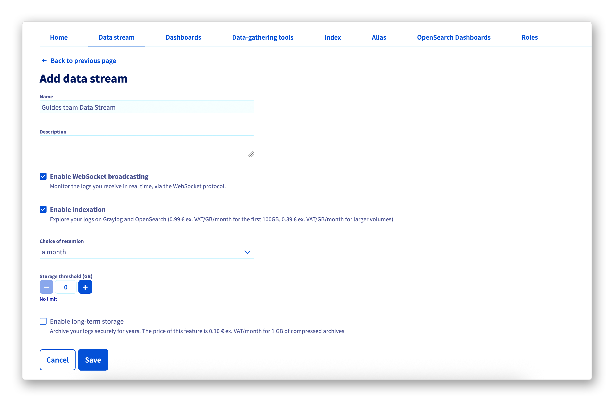

## Ziel 

Protokolle entsprechen Ereignissen, die auf einem Computersystem (Server, Computer, Anwendung, Website, Datenbank, Netzwerk usw.) auftreten. Protokolle können beispielsweise folgende Elemente aufzeichnen und enthalten:

- Das Zeitstempel (Datum, Stunde, Minute, Sekunde) des Ereignisses.
- Die Natur des Ereignisses (Anmeldung, Abmeldung, Fehler, Download, Upload, Warnung usw.).
- Zusätzliche Informationen zum Ereignis (angeforderte Seiten oder Dateien, gestartete Anwendungen, remote aufgerufene Server, Name einer hochgeladenen oder heruntergeladenen Datei usw.).
- Die Herkunft des Ereignisses (Benutzerkennung, Quell-IP-Adresse, Quellprogramm usw.).
- Der Zustand des Systems zum Zeitpunkt des Ereignisses (verfügbare Ressourcen, verbleibender Speicher, CPU-Auslastung usw.).

Im Allgemeinen werden Protokolle direkt von den Computersystemen generiert, auf denen die Ereignisse stattfinden. Sie werden in Textdateien gespeichert und archiviert, die auch als Protokolldateien bezeichnet werden.

Protokolldateien ermöglichen Ihnen folgende Aktionen:

- Analyse des Verhaltens des Computersystems, das die Protokolle generiert.
- Identifizierung von aufgetretenen Fehlern im Computersystem.
- Behebung von Fehlern, die im Computersystem aufgetreten sind.
- Optimierung des Betriebs und der Leistung des Computersystems.

Ihr Private Exchange- oder Trusted Exchange-Angebot generiert daher auch eigene Protokolle. Sie müssen möglicherweise auf diese Protokolle zugreifen oder sie abrufen, um den Zugriff auf Ihre E-Mail-Postfächer zu analysieren oder E-Mail-Flüsse zu verfolgen.

**Erfahren Sie, wie Sie Protokolle auf Ihrem Private Exchange- oder Trusted Exchange-Angebot ansehen und verwalten können**

## Voraussetzungen

- Sie haben sich für ein [Private Exchange](/links/web/emails-hosted-exchange) oder [Trusted Exchange](/links/web/emails-trusted-exchange) Angebot angemeldet.
- Ein Logs Data Platform (LDP)-Konto. Dieser Leitfaden führt Sie durch alle notwendigen Schritte: [Quick start for Logs Data Platform (EN)](/pages/manage_and_operate/observability/logs_data_platform/getting_started_quick_start).
- Zugriff auf das [OVHcloud Kundencenter](/links/manager).

## In der praktischen Anwendung

### Anzeigen der Exchange-Plattformprotokolle in Echtzeit

Um Echtzeitprotokolle auf Ihrem Private- oder Trusted Exchange-Angebot zu öffnen, gehen Sie wie folgt vor:

1. Melden Sie sich im [OVHcloud Kundencenter](/links/manager) an.
1. Gehen Sie in den Bereich `Web Cloud`{.action}.
1. Im Abschnitt `MICROSOFT` klicken Sie auf `Exchange`{.action}.
1. Wählen Sie die relevante Plattform aus.
1. Rechts neben der Reihe von Tabs klicken Sie auf den Tab `Mehr +`{.action} und dann auf `Logs`{.action}.

{.thumbnail}

> [!warning]
>
> Da dies eine Echtzeitkonsole ist, erscheinen Protokolle nur, wenn Sie sich im Tab `Logs`{.action} befinden. Wenn Sie den Tab `Logs`{.action} verlassen und darauf zurückkehren, ist die vorherige Historie verschwunden.

Exchange-Dienste bieten zwei Arten von Protokollen:

- **Access**: Ermöglicht es Ihnen, die Aktivität von Verbindungen auf Ihrem Exchange-Dienst anzuzeigen.
- **Messagetracking**: Ermöglicht es Ihnen, detaillierte Protokolle der E-Mail-Flüsse über Ihren Exchange-Dienst anzuzeigen. Sie finden folgende Informationen:
    - den Zustellstatus von E-Mails auf Ihren Exchange-Konten;
    - den Zustellstatus von E-Mails von Ihrem Exchange-Dienst;
    - die Größe der übertragenen E-Mails;
    - usw.

### Integration der Exchange-Lösungsprotokolle in Logs Data Platform

Die Logs Data Platform-Lösung kann nützlich sein, wenn Sie eine große Infrastruktur haben oder wenn Ihre Dienste eine große Menge an Protokollen generieren. Tatsächlich ist diese Plattform so konzipiert, dass sie die Aggregation und Verwaltung von Protokollen erleichtert.

Sie funktioniert, indem sie Protokolle abruft, die von Ihrer Infrastruktur, Ihren Webseiten oder Anwendungen generiert werden, um beispielsweise:

- sie zu speichern;
- sie in Echtzeit-Dashboards anzuzeigen;
- Benutzern ermöglichen, komplexe Abfragen durchzuführen;
- sie nach Datum, Anwendung, Typ oder Inhalt zu filtern.

> [!primary]
>
> Für weitere Informationen zu Logs Data Platform konsultieren Sie bitte unseren Einführungsleitfaden zu [Logs Data Platform (EN)](/pages/manage_and_operate/observability/logs_data_platform/getting_started_introduction_to_LDP).

Exchange-Lösungen sind mit verschiedenen Diensten wie Shared Hosting, VPS und Dedicated Servern kompatibel. Sie können auch durch Datenströme auf Logs Data Platform ergänzt werden, zusätzlich zu den bereits verfügbaren Echtzeitprotokollen.

Um die Protokolle Ihrer Exchange-Lösung einem Datenstrom auf Logs Data Platform hinzuzufügen, führen Sie die folgenden Aktionen aus:

1. Melden Sie sich in Ihrem [OVHcloud Kundencenter](/links/manager) an.
1. Gehen Sie in den Bereich `Web Cloud`{.action}.
1. Im Abschnitt `MICROSOFT` klicken Sie auf `Exchange`{.action}.
1. Wählen Sie die relevante Plattform aus.
1. Rechts neben der Reihe von Tabs klicken Sie auf den Tab `Mehr +`{.action} und dann auf `Logs`{.action}.
1. Auf der rechten Seite des Bereichs, in dem Ihre Echtzeitprotokolle angezeigt werden, klicken Sie auf den Button `Abonnieren`{.action}.

{.thumbnail}

Auf der Seite, die angezeigt wird, wählen Sie das gewünschte Logs Data Platform-Konto aus dem Dropdown-Menü über der Tabelle aus.

{.thumbnail}

Zwei Szenarien stehen Ihnen zur Verfügung, um Ihre Exchange-Lösung abonnieren zu können:

> [!tabs]
> **Fall n°1**
>> **Abonnieren eines vorhandenen Datenstroms auf Ihrer Logs Data Platform-Lösung**
>>
>> Wenn der relevante Datenstrom bereits existiert, wird er als Zeile in der Tabelle angezeigt. In diesem speziellen Fall können Sie Ihre Exchange-Lösung einfach durch Klicken auf den Button `Abonnieren`{.action}, der rechts neben der Zeile des relevanten Datenstroms steht, abonnieren.
>>
>> Nach einigen Momenten und wenn Sie sich auf derselben Seite befinden, erscheint eine Nachricht in Ihrem Kundencenter, um Sie darüber zu informieren, dass das Abonnement erfolgreich erstellt wurde.
>>
> **Fall n°2**
>> **Abonnieren eines neuen Datenstroms auf Ihrer Logs Data Platform-Lösung**
>>
>> Wenn der relevante Datenstrom noch nicht existiert, klicken Sie auf den Button `Stream hinzufügen`{.action}. Sie werden dann auf eine neue Seite in Ihrem OVHcloud Kundencenter weitergeleitet, auf der Sie einen neuen Datenstrom auf Ihrer Logs Data Platform-Lösung erstellen können.
>>
>> Konsultieren Sie unsere Leitfäden [Introduction to Logs Data Platform (EN)](/pages/manage_and_operate/observability/logs_data_platform/getting_started_introduction_to_LDP) und [Quick start for Logs Data Platform (EN)](/pages/manage_and_operate/observability/logs_data_platform/getting_started_quick_start), um diese Aktion durchzuführen.
>>
>> Nachdem Sie das Formular ausgefüllt haben, klicken Sie auf den Button `Speichern`{.action}.
>>
>> {.thumbnail}
>>
>> Sie werden dann auf den Tab `Streams`{.action} Ihrer Logs Data Platform-Lösung weitergeleitet.
>>
>> Sie können jetzt Ihre Exchange-Lösung Ihrem neuen Logs Data Platform-Datenstrom abonnieren, indem Sie die Anweisungen am Anfang dieses Kapitels befolgen.

## Weiterführende Informationen 

Für spezialisierte Dienstleistungen (SEO, Entwicklung usw.) kontaktieren Sie [OVHcloud Partner](/links/partner).

[Einführung in den Private Exchange-Dienst](/pages/web_cloud/email_and_collaborative_solutions/microsoft_exchange/exchange_starting_private)

[Introduction to Logs Data Platform (EN)](/pages/manage_and_operate/observability/logs_data_platform/getting_started_introduction_to_LDP)

[Quick start for Logs Data Platform (EN)](/pages/manage_and_operate/observability/logs_data_platform/getting_started_quick_start)

Wenn Sie bei der Nutzung und Konfiguration Ihrer OVHcloud-Lösungen Unterstützung benötigen, laden wir Sie ein, unsere verschiedenen [Support-Angebote](/links/support) zu konsultieren.

Treten Sie unserer [User Community](/links/community) bei.