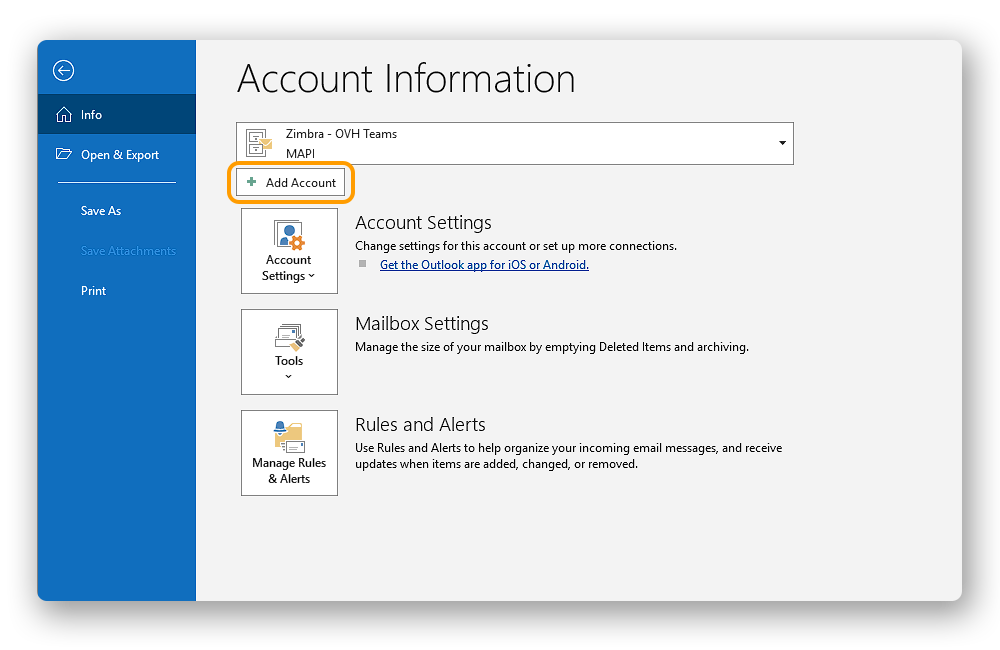
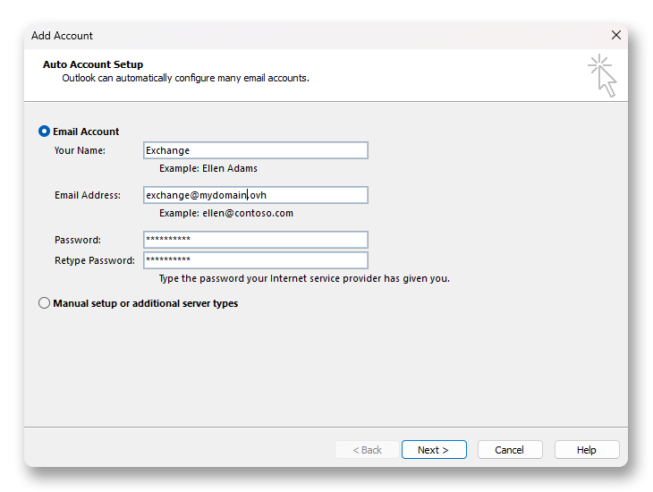
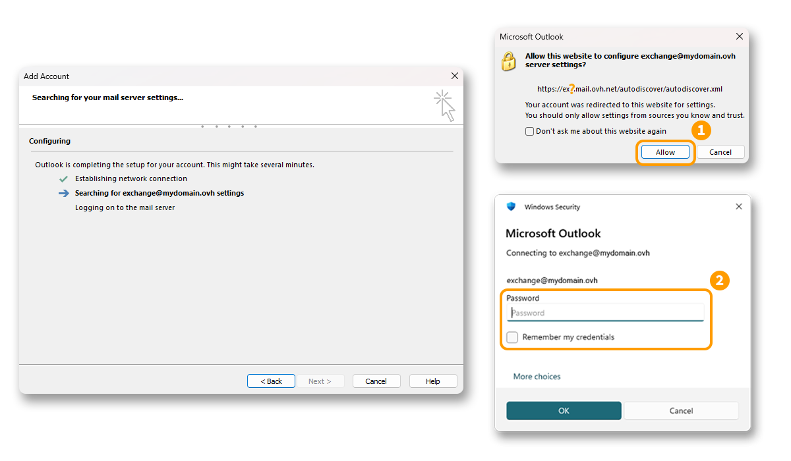
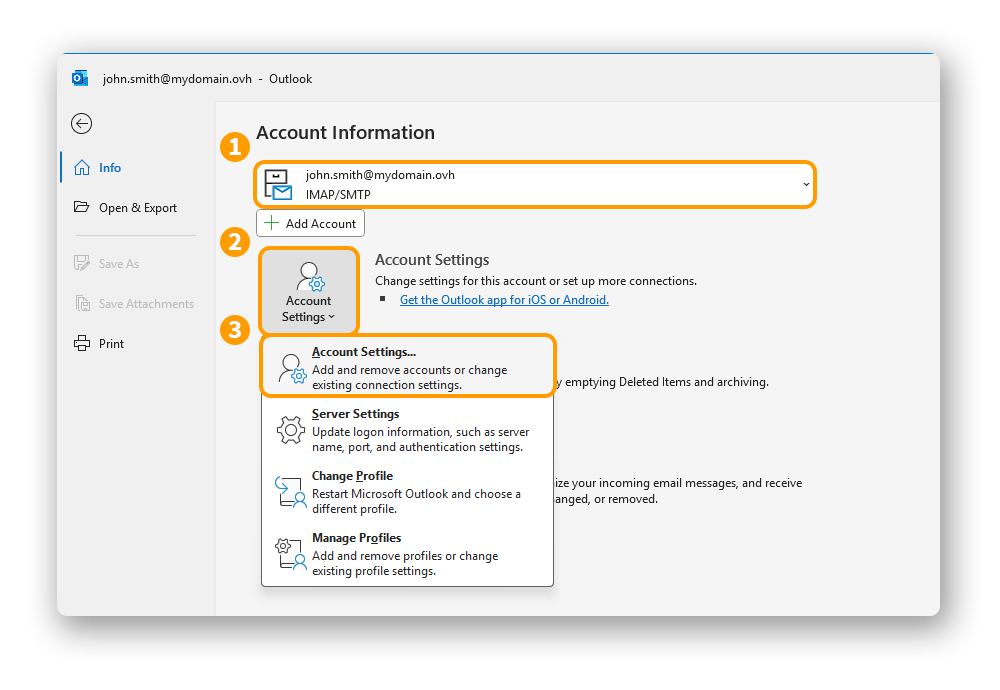
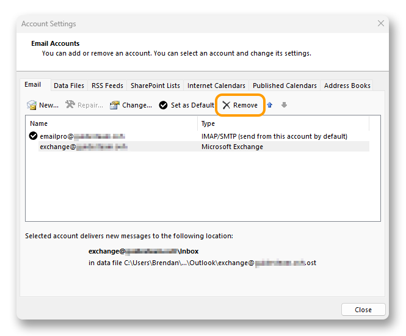

## Objectif

Les comptes Exchange peuvent être configurés sur différents logiciels de messagerie compatibles. Cela vous permet d'utiliser votre adresse e-mail depuis l'appareil de votre choix. Microsoft Outlook est le logiciel recommandé pour utiliser une adresse e-mail Exchange avec ses fonctions collaboratives.

**Découvrez comment configurer un compte Exchange sur Microsoft Outlook pour Windows.**

<iframe class="video" width="560" height="315" src="https://www.youtube-nocookie.com/embed/zx7LAzmDrFw?si=DAWV56-E1or1Vgnr" title="YouTube video player" frameborder="0" allow="accelerometer; autoplay; clipboard-write; encrypted-media; gyroscope; picture-in-picture; web-share" referrerpolicy="strict-origin-when-cross-origin" allowfullscreen></iframe>

## Prérequis

- Disposer d'une offre [Exchange](/links/web/emails).
- Disposer de l'application [Outlook classique](https://support.microsoft.com/fr-fr/office/installer-ou-r%C3%A9installer-outlook-classique-sur-un-pc-windows-5c94902b-31a5-4274-abb0-b07f4661edf5) sur Windows.
- Posséder les identifiants relatifs à l'adresse e-mail que vous souhaitez paramétrer.
- Le champ SRV d'OVHcloud doit être correctement configuré dans la zone DNS du nom de domaine, n'hésitez pas à consulter notre guide [Ajouter un nom de domaine sur son service Exchange](/pages/web_cloud/email_and_collaborative_solutions/microsoft_exchange/exchange_adding_domain).

/// details | Informations relatives à la gestion et la configuration des services OVHcloud

OVHcloud met à votre disposition des services dont la configuration, la gestion et la responsabilité vous incombent. Il vous revient de ce fait d'en assurer le bon fonctionnement.

Nous mettons à votre disposition ce guide afin de vous accompagner au mieux sur des tâches courantes. Néanmoins, nous vous recommandons de faire appel à un [partenaire spécialisé](/links/transversal/marketplace-support-collaboration) et/ou de contacter l'éditeur du service si vous éprouvez des difficultés. En effet, nous ne serons pas en mesure de vous fournir une assistance. Plus d'informations dans la section « [Aller plus loin](go-further) » de ce guide.

///

> [!primary]
>
> Vous utilisez Outlook et ultérieur pour Mac ? Consultez notre documentation : [Configurer son compte Exchange sur Outlook pour Mac](/pages/web_cloud/email_and_collaborative_solutions/microsoft_exchange/how_to_configure_outlook_2016_mac).

## En pratique

> [!warning]
>
> Avant de débuter votre configuration, il est important de noter que l'application Outlook incluse gratuitement avec Windows 11 est [incompatible](https://learn.microsoft.com/fr-fr/microsoft-365-apps/outlook/get-started/supported-account-types) avec les offres Exchange OVHcloud, dites *on-premises*. Vous devrez utiliser la version **Outlook classique**.
>
> Pour installer Outlook classique sur votre ordinateur Windows, téléchargez-le depuis la page Microsoft « [Installer ou réinstaller Outlook classique sur un PC Windows](https://support.microsoft.com/fr-fr/office/installer-ou-r%C3%A9installer-outlook-classique-sur-un-pc-windows-5c94902b-31a5-4274-abb0-b07f4661edf5) », et installez-le.
>
> Une fois l'installation terminée, pour distinguer les deux versions lorsqu'elles sont installées, tapez « Outlook » dans la barre de recherche Windows. Vous pourrez alors constater la différence comme ci-dessous.
>
> {.thumbnail .h-500}

### Ajouter le compte 

- **Lors du premier démarrage de l'application** : un assistant de configuration s'affiche et vous invite à renseigner votre adresse e-mail.

- **Si un compte a déjà été paramétré** : cliquez sur `Fichier`{.action} dans la barre de menu en haut de votre écran, puis sur `Ajouter un compte`{.action}.

{.thumbnail .h-500}

- Laissez `Compte de courrier` coché et complétez les inforamtions suivante:
    - **Nom** : Définissez un nom d'affichage.
    - **Adresse de courrier** : Saisissez votre adresse e-mail complète.
    - **Mot de passe** : Saisissez le mot de passe associé à votre adresse e-mail.
    - **Confirmer le mot de passe** : Saisissez à nouveau le mot de passe associé à votre adresse e-mail.
- Cliquez sur `Suivant`{.action} pour continuer.

{.thumbnail .h-500}

- Si la configuration de votre nom de domaine est valide, un message d'autorisation de connexion au serveur Exchange OVHcloud peut apparaître. Cliquez sur `Autoriser`{.action} **(1)** pour permettre la configuration automatique de votre compte Exchange.
- Une seconde fenêtre d'authentification apparait, saisissez le mot de passe de votre adresse e-mail **(2)**.

{.thumbnail .h-500}

Après l'autorisation et l'authentification au serveur Exchange OVhcloud, la configuration sera terminée et votre compte opérationnel.

### Utiliser l'adresse e-mail

Une fois l'adresse e-mail configurée, il ne reste plus qu’à l'utiliser ! Vous pouvez dès à présent envoyer et recevoir des messages.

Votre adresse e-mail Exchange, ainsi que toutes ses fonctions collaboratives, sont également disponibles via l'interface [OWA](/links/web/email). Pour toute question relative à son utilisation, n'hésitez pas à consulter notre guide [Consulter son compte Exchange depuis l’interface OWA](/pages/web_cloud/email_and_collaborative_solutions/using_the_outlook_web_app_webmail/email_owa).

### Modifier les paramètres existants

> [!warning]
>
> Il n'est pas possible de modifier les paramètres serveur d'un compte Exchange. Si vous rencontrez une anomalie liée à la synchronisation avec le serveur, il est nécessaire de supprimer le compte d'Outlook et de le reconfigurer. Pour ce la suivez les instructions ci-dessous.

Si votre compte e-mail est déjà paramétré et que vous devez accéder aux paramètres du compte pour le supprimer :

- Allez dans `Fichier`{.action} depuis la barre de menu en haut de votre écran.
- Sélectionnez le compte à modifier dans le menu déroulant **(1)**.
- Cliquez sur `Paramètres du compte`{.action} **(2)** en dessous.
- Cliquez sur `Paramètres du compte...`{.action} **(3)** pour accéder à la fenêtre de paramètres.

{.thumbnail .h-500}

- La fenêtre de paramètres des comptes s'affiche, sélectionnez le compte e-mail concerné et cliquez sur `Supprimer`{.action}.

{.thumbnail .h-500}

Une fois le compte Exchange supprimé, pour reconfigurer votre compte e-mail, suivez la partie « [Ajouter le compte](#add-account) » de ce guide 

### Récupérer une sauvegarde de votre adresse e-mail

Si vous devez effectuer une manipulation qui risquerait d'entrainer la perte des données de votre compte e-mail, nous vous conseillons d'effectuer une sauvegarde préalable du compte e-mail concerné. Pour ce faire, consulter le paragraphe « **Exporter depuis Windows** » sur notre guide [Migrer manuellement votre adresse e-mail](/pages/web_cloud/email_and_collaborative_solutions/migrating/manual_email_migration#exporter-depuis-windows).

## Aller plus loin

> [!primary]
>
> Pour plus d'informations sur la configuration d'une adresse e-mail depuis l'application Outlook sur Windows, consultez [le centre d'aide Microsoft](https://support.microsoft.com/fr-fr/office/ajouter-un-compte-de-courrier-dans-outlook-6e27792a-9267-4aa4-8bb6-c84ef146101b).

[Configurer son adresse e-mail comprise dans l’offre MX Plan ou dans une offre d’hébergement web sur Outlook pour Windows](/pages/web_cloud/email_and_collaborative_solutions/mx_plan/how_to_configure_outlook_2016)

[Configurer son compte E-mail Pro sur Outlook pour Windows](/pages/web_cloud/email_and_collaborative_solutions/email_pro/how_to_configure_outlook_2016)

Échangez avec notre [communauté d'utilisateurs](/links/community).
