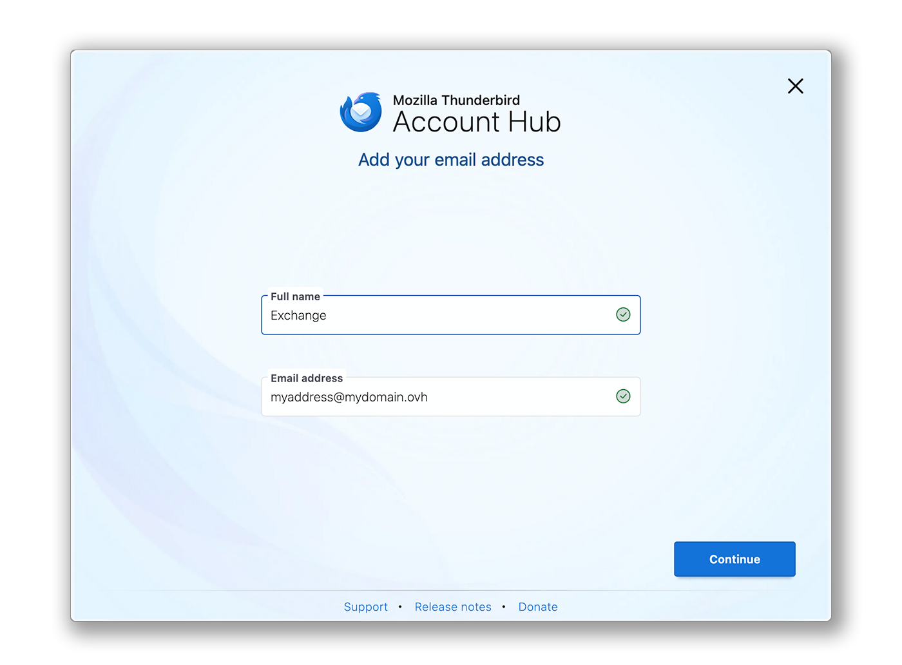
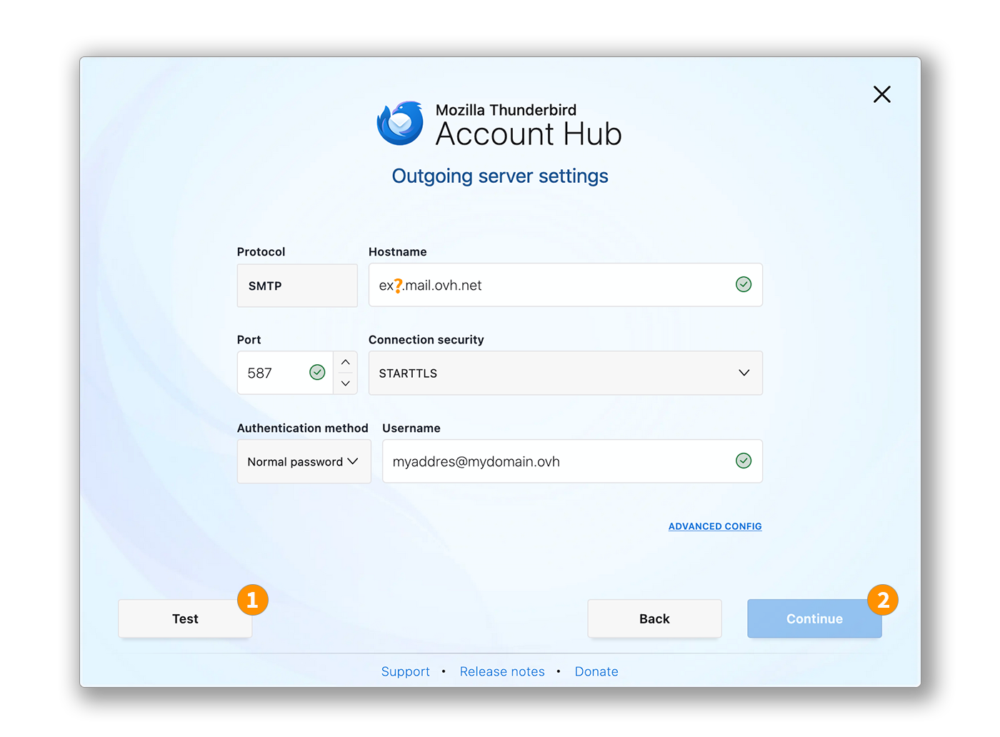
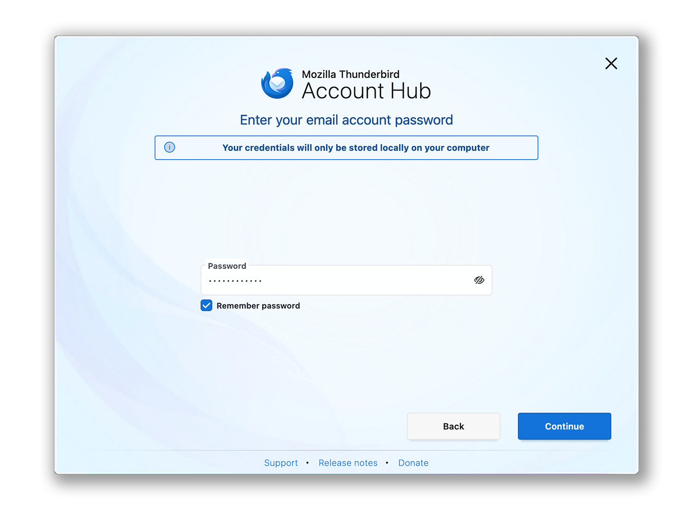
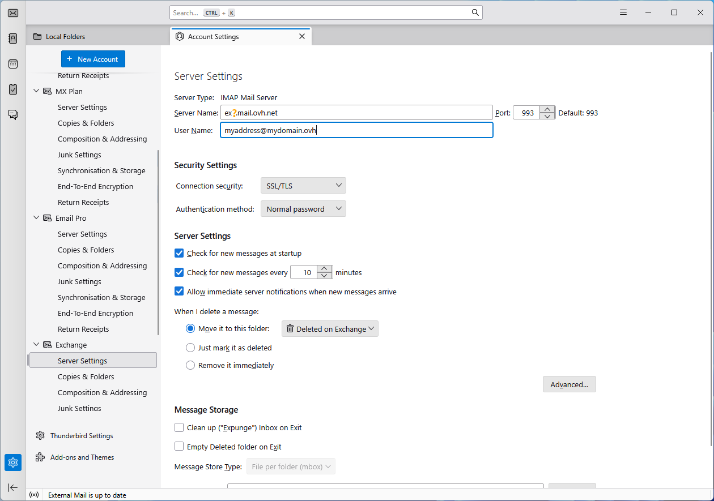
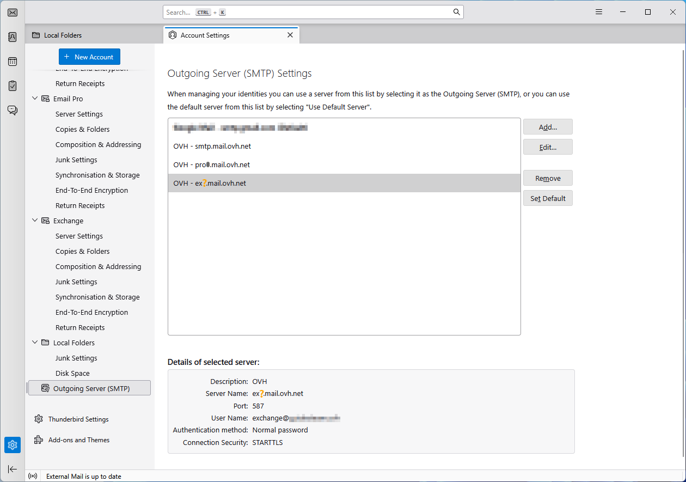

## Objetivo

Las cuentas de Exchange pueden configurarse en diferentes clientes de correo compatibles. Esto le permite utilizar su dirección de correo electrónico desde el dispositivo de su elección. Thunderbird es un cliente de correo electrónico libre y gratuito.

**Descubra cómo configurar su dirección de correo electrónico Exchange en Thunderbird para Windows.**

## Requisitos

- Tener una dirección de correo electrónico [Hosted Exchange](/links/web/emails-hosted-exchange) o [Private Exchange](/links/web/emails-private-exchange).
- Tener instalado el software Thunderbird en su dispositivo bajo Windows.
- Poseer las credenciales relacionadas con la dirección de correo electrónico que desea configurar.

/// details | Información relacionada con la gestión y configuración de los servicios OVHcloud

OVHcloud pone a su disposición servicios cuya configuración, gestión y responsabilidad le corresponden a usted. Por lo tanto, es su responsabilidad garantizar su correcto funcionamiento.

Le ofrecemos este guía para acompañarle en tareas cotidianas. Sin embargo, le recomendamos contactar a un [proveedor especializado](/links/partner) y/o al editor del servicio si experimenta dificultades. En efecto, no podremos proporcionarle asistencia. Más información en la sección [Más información](#go-further) de este guía.

///

## Procedimiento

> [!primary]
>
> En nuestro ejemplo, utilizamos la referencia del servidor: ex?.mail.ovh.net. Deberá reemplazar el "?" por el número que identifica su servidor de Exchange.
>
> Para encontrar el nombre del servidor:
>
> 1. Inicie sesión en su [área de cliente de OVHcloud](/links/manager).
> 2. Vaya a la sección `Web Cloud`{.action}.
> 3. En la sección `MICROSOFT`, haga clic en `Exchange`{.action}.
> 4. Seleccione la plataforma correspondiente.
> 5. El nombre del servidor es visible en el marco **Conexión** de la pestaña `Información general`{.action}.

### Añadir la cuenta

- **Al iniciar la aplicación por primera vez**: aparece un asistente de configuración que le pide que introduzca su dirección de correo electrónico.

- **Si ya hay una cuenta configurada en la aplicación**:

    1. Haga clic en el menú `☰`{.action} en la barra horizontal superior.
    2. Haga clic en `Nueva Cuenta`{.action}.
    3. Haga clic en `Dirección de correo electrónico`{.action}.

{.thumbnail .w-600}

Siga los pasos de configuración haciendo clic sucesivamente en los **5** siguientes pestañas:

> [!tabs]
> **Paso 1**
>>
>> En la ventana que aparece, introduzca las 2 siguientes informaciones:
>>
>>  - Su nombre completo (nombre de visualización).
>>  - La dirección de correo electrónico a configurar.
>>
>> Haga clic en `Continuar`{.action} para completar los ajustes.
>>
>> {.thumbnail .w-600}
>>
> **Paso 2**
>>
>> Cuando Thunderbird detecte un nombre de dominio OVHcloud, se propone una configuración automática relacionada con la oferta MX Plan. Haga clic en `MODIFICAR LA CONFIGURACIÓN`{.action}.
>>
>> {.thumbnail .w-600}
>>
> **Paso 3**
>>
>> Configuración del servidor de recepción:
>>
>>  - **Protocolo**: IMAP
>>  - **Nombre de host**: ex?.mail.ovh.net (reemplace el "?" por el número de su servidor)
>>  - **Puerto**: 993
>>  - **Seguridad de la conexión**: SSL/TLS
>>  - **Método de autenticación**: Contraseña normal
>>  - **Nombre de usuario**: Su dirección de correo electrónico completa
>>
>> {.thumbnail .w-600}
>>
> **Paso 4**
>>
>> Configuración del servidor de envío:
>>
>>  - **Protocolo**: SMTP 
>>  - **Nombre de host**: ex?.mail.ovh.net (reemplace el "?" por el número de su servidor)
>>  - **Puerto**: 587
>>  - **Seguridad de la conexión**: STARTTLS
>>  - **Método de autenticación**: Contraseña normal
>>  - **Nombre de usuario**: Su dirección de correo electrónico completa
>> 
>> 1. Haga clic en `Probar`{.action} para verificar los parámetros introducidos.
>> 2. Haga clic en `Continuar`{.action} para validar estos parámetros.
>>
>> {.thumbnail .w-600}
>>
> **Paso 5**
>>
>> Introduzca la contraseña asociada a la dirección de correo electrónico, luego haga clic en `Continuar`{.action} para finalizar la configuración.
>>
>> {.thumbnail .w-600}
>>

> [!primary]
>
> **Configuración POP**
>
> Si desea una configuración POP para su dirección de correo electrónico, reemplace los parámetros del **paso 3** por los siguientes:
>
> Configuración del servidor de recepción:
>
> - **Protocolo**: POP3
> - **Nombre de host**: ex?.mail.ovh.net (reemplace el "?" por el número de su servidor)
> - **Puerto**: 995
> - **Seguridad de la conexión**: SSL/TLS
> - **Método de autenticación**: Contraseña normal
> - **Nombre de usuario**: Su dirección de correo electrónico completa

### Utilizar la dirección de correo electrónico

Una vez que su dirección de correo electrónico esté configurada, puede comenzar a utilizarla. Ahora puede enviar y recibir correos electrónicos.

OVHcloud también ofrece una aplicación web para acceder a su dirección de correo electrónico desde un navegador. Para acceder al Webmail de OVHcloud, haga clic en [este enlace](/links/web/email). Puede conectarse utilizando las credenciales de su dirección de correo electrónico.

### Recuperar una copia de seguridad de su dirección de correo electrónico

Si debe realizar una operación que podría provocar la pérdida de datos de su cuenta de correo, le recomendamos hacer una copia de seguridad previa de la cuenta de correo afectada. Para ello, consulte el apartado "**Exportar**" en la sección "**Thunderbird**" de nuestra guía "[Migrar manualmente una dirección de correo electrónico](/pages/web_cloud/email_and_collaborative_solutions/migrating/manual_email_migration)".

### Modificar los ajustes existentes

Si su cuenta de correo ya está configurada y debe acceder a los ajustes de la cuenta para modificarlos:

1. Haga clic en el menú `☰`{.action} en la barra horizontal superior.
2. Haga clic en `Ajustes de cuentas`{.action}.

{.thumbnail .w-600}

- Para modificar los ajustes relacionados con la **recepción** de sus correos, haga clic en `Ajustes del servidor`{.action} en la columna izquierda bajo su dirección de correo.

{.thumbnail .w-600}

- Para modificar los ajustes relacionados con el **envío** de sus correos, haga clic en `Servidor saliente (SMTP)`{.action} al final de la columna izquierda.
- Haga clic en la dirección de correo afectada en la lista, luego haga clic en `Modificar`{.action}.

{.thumbnail .w-600}

## Más información 

> [!primary]
>
> Para más información sobre la configuración de una dirección de correo electrónico desde el cliente de correo Thunderbird, consulte [el centro de ayuda de Mozilla](https://support.mozilla.org/products/thunderbird).

[Primeros pasos con el servicio Hosted Exchange](/pages/web_cloud/email_and_collaborative_solutions/microsoft_exchange/exchange_starting_hosted)

[Primeros pasos con el servidor Private Exchange](/pages/web_cloud/email_and_collaborative_solutions/microsoft_exchange/exchange_starting_private)

Para servicios especializados (posicionamiento, desarrollo, etc.), contacte con los [partners de OVHcloud](/links/partner).

Si quiere disfrutar de ayuda para utilizar y configurar sus soluciones de OVHcloud, puede consultar nuestras distintas soluciones [pestañas de soporte](/links/support).

Interactúe con nuestra [comunidad de usuarios](/links/community).