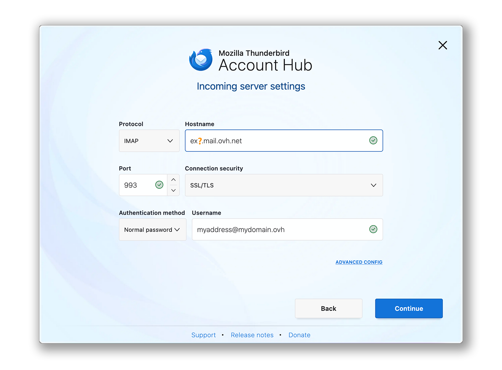
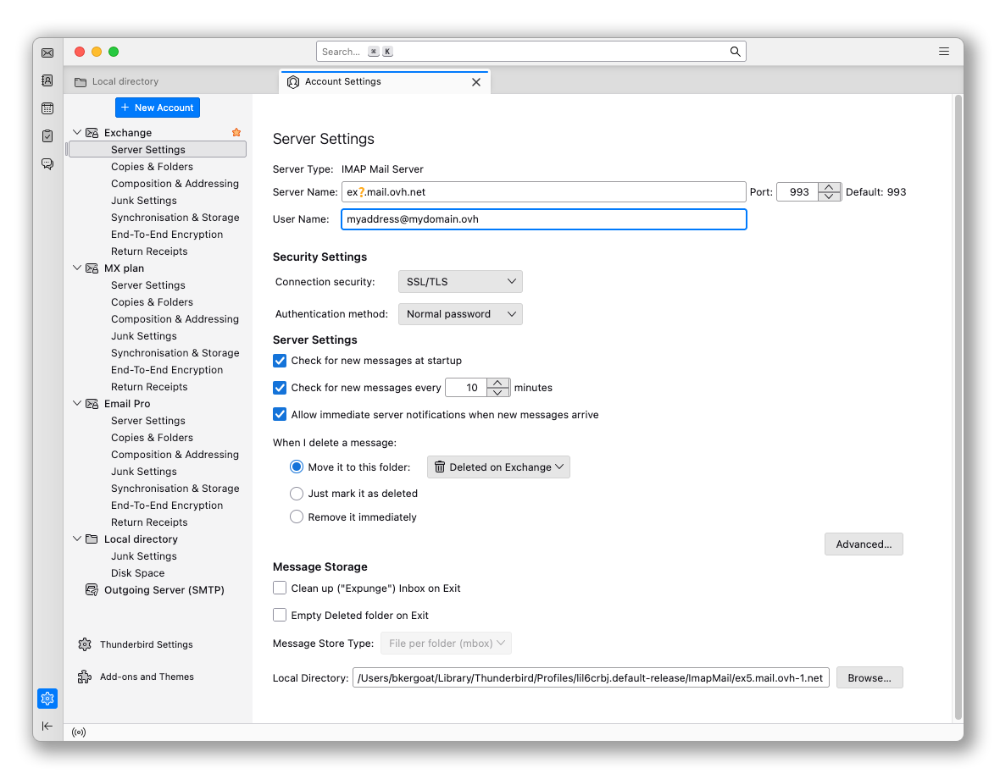
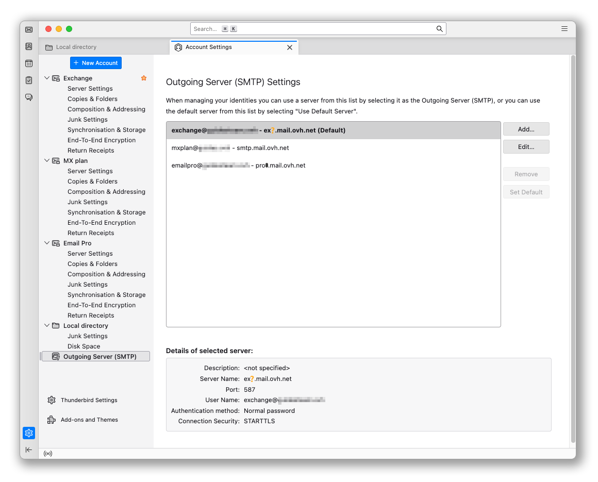

## Objectif

Les comptes Exchange peuvent être configurés sur différents logiciels de messagerie compatibles. Cela vous permet d’utiliser votre adresse e-mail depuis l’appareil de votre choix. Thunderbird est un client de messagerie libre et gratuit.

**Découvrez comment configurer votre adresse e-mail Exchange sur Thunderbird pour macOS.**

## Prérequis

- Disposer d’une adresse e-mail [Hosted Exchange](/links/web/emails-hosted-exchange) ou [Private Exchange](/links/web/emails-private-exchange).
- Disposer du logiciel Thunderbird installé sur votre Mac.
- Posséder les identifiants relatifs à l'adresse e-mail que vous souhaitez paramétrer.

/// details | Informations relatives à la gestion et configuration des services OVHcloud

OVHcloud met à votre disposition des services dont la configuration, la gestion et la responsabilité vous incombent. Il vous revient de ce fait d'en assurer le bon fonctionnement.

Nous mettons à votre disposition ce guide afin de vous accompagner au mieux sur des tâches courantes. Néanmoins, nous vous recommandons de faire appel à un [partenaire spécialisé](https://marketplace.ovhcloud.com/c/support-collaboration) et/ou de contacter l'éditeur du service si vous éprouvez des difficultés. En effet, nous ne serons pas en mesure de vous fournir une assistance. Plus d'informations dans la section [Aller plus loin](#go-further) de ce guide.

///

## En pratique

> [!warning]
>
> Dans notre exemple, nous utilisons la mention serveur : ex?.mail.ovh.net. Vous devrez remplacer le « ? » par le chiffre désignant le serveur de votre service Exchange.
>
> Pour retrouver le nom du serveur :
>
> 1. Connectez-vous à votre [espace client OVHcloud](/links/manager).
> 1. Rendez-vous dans la partie `Web Cloud`{.action}.
> 1. Dans la rubrique `MICROSOFT`, cliquez sur `Exchange`{.action}.
> 1. Sélectionnez la plateforme concernée.
> 1. Le nom du serveur est visible dans le cadre **Connexion** de l'onglet `Informations Générales`{.action}.
>

### Ajouter le compte

- **Lors du premier démarrage de l'application** : un assistant de configuration s'affiche et vous invite à renseigner votre adresse e-mail.

- **Si un compte est déjà paramétré sur l'application** :

    1. Cliquez sur le menu `☰`{.action} dans la barre horizontale supérieure.
    2. Cliquez sur `Nouveau Compte`{.action}.
    3. Cliquez sur `Adresse E-mail`{.action}.

{.thumbnail .w-400}

Suivez les étapes de configuration en cliquant successivement sur les **5** onglets ci-dessous :

> [!tabs]
> **Étape 1**
>>
>> Dans la fenêtre qui s'affiche, saisissez les 2 informations suivantes :
>>
>> - Votre nom complet (nom d'affichage).
>> - L'adresse e-mail à paramétrer.
>>
>> Cliquez sur `Continuer`{.action} pour compléter les paramètres.
>>
>> {.thumbnail .w-400}
>>
> **Étape 2**
>>
>> Lorsque Thunderbird détecte un nom de domaine OVHcloud, une configuration automatique relative à l'offre MX Plan est proposée. Cliquez sur `MODIFIER LA CONFIGURATION`{.action}.
>>
>> {.thumbnail .w-400}
>>
> **Étape 3**
>>
>> Paramètres du serveur de réception :
>>
>> - **Protocole** : IMAP
>> - **Nom d'hôte** : ex?.mail.ovh.net (remplacez le « ? » par le numéro de votre serveur)
>> - **Port** : 993
>> - **Sécurité de la connexion** : SSL/TLS
>> - **Méthode d'authentification** : Mot de passe normal
>> - **Nom d'utilisateur** : Votre adresse e-mail complète
>>
>> {.thumbnail .w-400}
>>
> **Étape 4**
>> Paramètres du serveur d'envoi :
>>
>> - **Protocole** : SMTP 
>> - **Nom d'hôte** : ex?.mail.ovh.net (remplacez le « ? » par le numéro de votre serveur)
>> - **Port** : 587
>> - **Sécurité de la connexion** : STARTTLS
>> - **Méthode d'authentification** : Mot de passe normal
>> - **Nom d'utilisateur** : Votre adresse e-mail complète
>> 
>> 1. Cliquez sur `Tester`{.action} pour vérifier les paramètres saisis.
>> 2. Cliquez sur `Continuer`{.action} pour valider ces paramètres.
>>
>> {.thumbnail .w-400}
>>
> **Étape 5**
>> Saisir le mot de passe associé à l'adresse e-mail, puis cliquez sur `Continuer`{.action} pour finaliser la configuration.
>>
>> {.thumbnail .w-400}
>>

> [!primary]
>
> **Configuration POP**
>
> Si vous souhaitez une configuration POP pour votre adresse e-mail, remplacez les paramètres de **l'étape 3** par les suivants :
>
> Paramètres du serveur de réception :
>
> - **Protocole** : POP3
> - **Nom d'hôte** : ex?.mail.ovh.net (remplacez le « ? » par le numéro de votre serveur)
> - **Port** : 995
> - **Sécurité de la connexion** : SSL/TLS
> - **Méthode d'authentification** : Mot de passe normal
> - **Nom d'utilisateur** : Votre adresse e-mail complète

### Utiliser l'adresse e-mail

Une fois votre adresse e-mail configurée, vous pouvez commencer à l'utiliser ! Vous pouvez dès à présent envoyer et recevoir des e-mails.

OVHcloud propose également une application web permettant d'accéder à votre adresse e-mail depuis un navigateur Internet. Pour accéder au Webmail OVHcloud, cliquez sur [ce lien](/links/web/email). Vous pouvez vous y connecter grâce aux identifiants de votre adresse e-mail.

### Récupérer une sauvegarde de votre adresse e-mail

Si vous devez effectuer une manipulation qui risquerait d'entrainer la perte des données de votre compte e-mail, nous vous conseillons d'effectuer une sauvegarde préalable du compte e-mail concerné. Pour ce faire, consultez le paragraphe « **Exporter** » dans la partie « **Thunderbird** » de notre guide « [Migrer manuellement votre adresse e-mail](/pages/web_cloud/email_and_collaborative_solutions/migrating/manual_email_migration#exporter) ».

### Modifier les paramètres existants

Si votre compte e-mail est déjà paramétré et que vous devez accéder aux paramètres du compte pour les modifier :

1. Cliquez sur le menu `☰`{.action} dans la barre horizontale supérieure.
2. Cliquez sur `Paramètres des comptes`{.action}.

{.thumbnail}

- Pour modifier les paramètres liés à la **réception** de vos e-mails, cliquez sur `Paramètres serveur`{.action} dans la colonne de gauche sous votre adresse e-mail.

{.thumbnail .w-400}

- Pour modifier les paramètres liés à **l'envoi** de vos e-mails, cliquez sur `Serveur sortant (SMTP)`{.action} tout en bas de la colonne de gauche.
- Cliquez sur l'adresse e-mail concernée dans la liste, puis cliquez sur `Modifier`{.action}.

{.thumbnail .w-400}

## Aller plus loin 

> [!primary]
>
> Pour plus d'informations sur la configuration d'une adresse e-mail depuis le client de messagerie Thunderbird, consultez [le centre d'aide de Mozilla](https://support.mozilla.org/products/thunderbird).

[Premiers pas avec le service Hosted Exchange](/pages/web_cloud/email_and_collaborative_solutions/microsoft_exchange/exchange_starting_hosted)

[Premiers pas avec le service Private Exchange](/pages/web_cloud/email_and_collaborative_solutions/microsoft_exchange/exchange_starting_private)

Pour des prestations spécialisées (référencement, développement, etc.), contactez les [partenaires OVHcloud](/links/partner).

Si vous souhaitez bénéficier d'une assistance à l'usage et à la configuration de vos solutions OVHcloud, nous vous proposons de consulter nos différentes [offres de support](/links/support).

Échangez avec notre [communauté d'utilisateurs](/links/community).