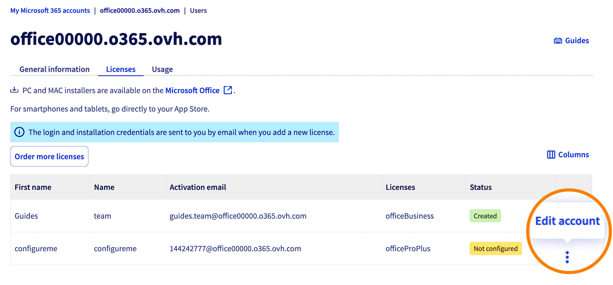
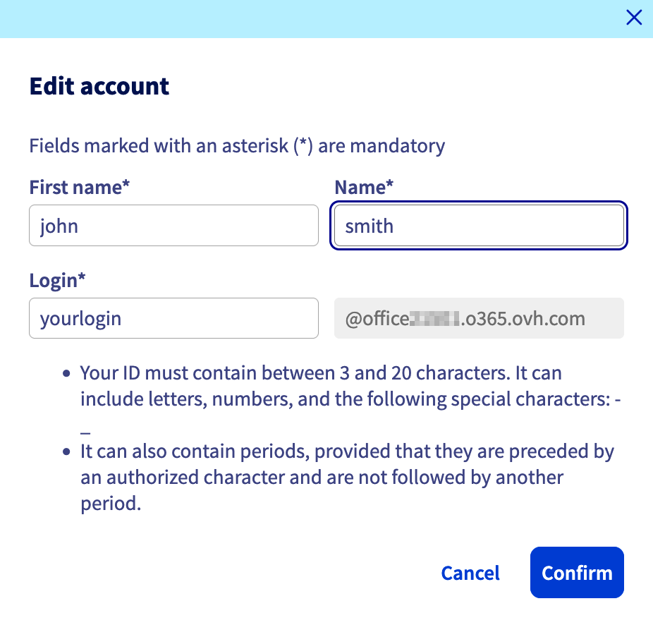
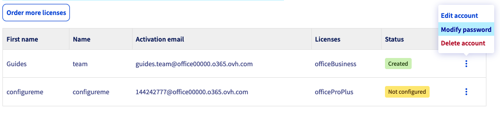
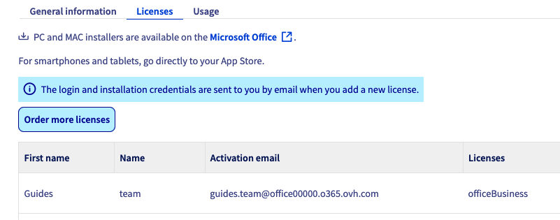
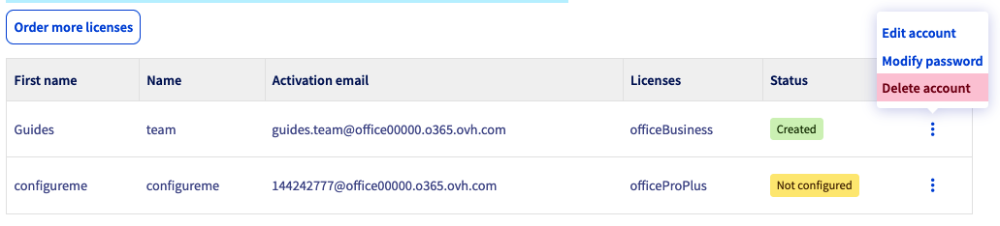

## Objectif

Souscrire aux offres OVHcloud **Microsoft 365 Apps for Business** ou **Microsoft 365 Apps for Enterprise** permet de bénéficier de plusieurs avantages. La facturation est mensuelle et vous pouvez installer une licence sur 5 PC/Mac, 5 tablettes et 5 smartphones.

Vos licences Microsoft 365 sont rassemblées dans un groupe, également appelé « Service ». Un groupe de licences Apps for Business peut contenir au maximum 300 licences, tandis qu'un groupe de licences Apps for Enterprise est illimité.

Voici la liste des logiciels compris dans la suite :

- Licences Apps for Business : Excel, Word, PowerPoint, Outlook, OneNote, Publisher.
- Licences Apps for Enterprise : Excel, Word, PowerPoint, Outlook, OneNote, Publisher, Access.

**Découvrez comment souscrire à une licence Microsoft 365 et la gérer dans votre espace client OVHcloud.**

## Prérequis

- Être connecté à l'[espace client OVHcloud](/links/manager).

## En pratique

### Commander une licence

1. Rendez-vous sur la page commerciale [Microsoft 365 OVHcloud](/links/web/ms365), ou depuis l'[espace client OVHcloud](/links/manager) :
    - Rendez-vous dans la partie `Web Cloud`{.action}.
    - Dans la rubrique `MICROSOFT`, cliquez sur `Microsoft 365`{.action}.
    - Cliquez sur `Commander`{.action}.
1. Choisissez parmi nos offres disponibles, à savoir « Apps for Business » et « Apps for Enterprise ».
1. Définissez la fréquence de renouvellement de votre groupe de licences.
1. Définissez le nombre de licences souhaitées, puis finalisez votre commande.

### Activer votre licence

Pour activer la licence commandée :

1. Connectez-vous à votre [espace client OVHcloud](/links/manager).
1. Rendez-vous dans la partie `Web Cloud`{.action}.
1. Dans la rubrique `MICROSOFT`, cliquez sur `Microsoft 365`{.action}.
1. Sélectionnez le service Microsoft 365 concerné.
1. Cliquez sur l'onglet `Licences`{.action}.
1. Cliquez sur le bouton &#8942; sur la ligne de la licence concernée par l'activation, puis sur `Editer le compte`{.action}.

    {.thumbnail .w-500}

1. Saisissez les informations relatives à l'utilisateur de la licence, puis cliquez sur `Valider`{.action}.

    {.thumbnail .w-500}

### Installer la suite Microsoft 365 sur votre machine 

Une fois la licence activée, vous recevez un e-mail sur l'adresse e-mail de contact de votre compte OVHcloud. Vous pouvez également retrouver cet e-mail depuis votre [espace client OVHcloud](/links/manager), en cliquant sur votre profil en haut à droite, puis sur `Mes communications`{.action} dans la partie `Emails reçus`.

Cet e-mail contient les informations nécessaires au téléchargement et à l'installation de votre suite Microsoft 365, à savoir **l'adresse e-mail d'activation** et le **mot de passe**.

Rendez-vous sur <https://portal.office.com/> et connectez-vous avec **l'adresse e-mail d'activation** et le **mot de passe** précédemment configurés. Vous serez dirigé vers une fenêtre vous permettant de télécharger la suite Microsoft 365 sur votre poste avec les instructions d'installation.

{.thumbnail .w-500}

#### Installer la suite 365 sur plusieurs machines

Avec une licence, l'utilisateur peut installer la suite Microsoft 365 sur **5 machines Windows et macOS**, sur **5 tablettes** et **5 smartphones**. Cela représente un total de **15 appareils** pour une licence. L'ensemble de ces appareils doivent appartenir au détenteur de la licence.

Pour installer votre licence sur plusieurs machines, il vous faut simplement reproduire [l’étape précédente](#install365) *sur chaque appareil* en vous assurant que chacun est géré *par le même utilisateur*.

### Modifier le mot de passe d'une licence

Si vous souhaitez définir vous-même le mot de passe de votre licence :

1. Connectez-vous à votre [espace client OVHcloud](/links/manager).
1. Rendez-vous dans la partie `Web Cloud`{.action}.
1. Dans la rubrique `MICROSOFT`, cliquez sur `Microsoft 365`{.action}.
1. Sélectionnez le service Microsoft 365 concerné.
1. Cliquez sur l'onglet `Licences`{.action}.
1. Cliquez sur le bouton &#8942; à droite de la licence concernée puis sur `Modifier le mot de passe`{.action}.

{.thumbnail .w-500}

### Ajouter une licence à un groupe existant

Si vous souhaitez ajouter une ou plusieurs licences à votre groupe de licences existant :

1. Connectez-vous à votre [espace client OVHcloud](/links/manager).
1. Rendez-vous dans la partie `Web Cloud`{.action}.
1. Dans la rubrique `MICROSOFT`, cliquez sur `Microsoft 365`{.action}.
1. Sélectionnez le service Microsoft 365 concerné.
1. Cliquez sur le bouton `Commander plus de licences`{.action} à droite. 
1. Déterminez le **nombre** et le **type de licence** que vous souhaitez commander, puis cliquez sur `Valider`{.action}.

{.thumbnail .w-500}

### Gérer vos abonnements 

#### Supprimer une licence dans un groupe de licences

Depuis l'onglet `Licences`{.action} de votre groupe de licences, cliquez sur le bouton &#8942; à droite de la licence que vous souhaitez résilier, puis cliquez sur `Supprimer le compte`{.action}.

{.thumbnail .w-500}

> [!primary]
> Les consommations du mois en cours seront facturées à la fin de ce dernier.

#### Résilier le groupe de licences

Pour résilier votre groupe de licence Microsoft Office 365 CSP1 :

1. Cliquez sur votre nom en haut à droite de l'espace client OVHcloud.
1. Cliquez sur `Mes offres et services`{.action}.
1. Identifiez votre groupe de licence dans le tableau de vos services.
1. Cliquez sur le bouton `...`{.action} à droite du groupe de licences que vous souhaitez résilier, puis sur `Résilier`{.action}.
1. Précisez les raisons de votre demande de résiliation puis cliquez sur `Valider`{.action}.

> [!primary]
> Les consommations du mois en cours seront facturées à la fin de ce dernier.

## Aller plus loin

[Utiliser le bureau à distance avec Microsoft 365 apps](/pages/web_cloud/email_and_collaborative_solutions/microsoft_office/office_proplus).

Échangez avec notre [communauté d'utilisateurs](/links/community).
