

## Objetivo

[OVH Mail Migrator](/links/web/omm) es una herramienta creada por OVHcloud que responde a la necesidad de reversibilidad. Permite migrar sus cuentas de correo electrónico a sus direcciones de correo electrónico de OVHcloud o a un servicio de correo electrónico externo. El proceso admite diferentes tipos de contenido, como correos electrónicos, contactos, calendarios y tareas, siempre que estos sean compatibles con sus direcciones de correo electrónico.

**Descubra cómo migrar sus cuentas de correo electrónico a OVHcloud con nuestra herramienta OVH Mail Migrator.**

## Requisitos

- Tener un servicio de correo electrónico externo o en OVHcloud, como una oferta [Zimbra](/links/web/zimbra), [Exchange](/links/web/emails), [Email Pro](/links/web/email-pro) o MX Plan (a través de la oferta MX Plan sola o incluida en una oferta de [alojamiento web de OVHcloud](/links/web/hosting)).
- Tener los identificadores relacionados con las cuentas de correo electrónico que desea migrar (las cuentas de correo electrónico de origen).
- Tener los identificadores relacionados con las cuentas de correo electrónico de destino.

## Procedimiento

Para acceder a OMM, vaya a la dirección <https://omm.ovhcloud.com/>.

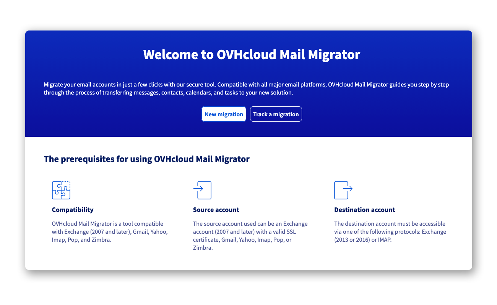{.thumbnail .w-600}

### Crear un proyecto de migración 

Antes de iniciar una migración, es necesario crear un proyecto. Este proyecto le permitirá iniciar una o varias migraciones y seguirlas.

Haga clic en `New migration`{.action} para comenzar la creación de su proyecto.

**Dirección de correo electrónico de contacto del proyecto**: Introduzca una dirección de correo electrónico que servirá para recibir los identificadores y las notificaciones de seguimiento de sus migraciones. No se recomienda introducir una de las direcciones de correo electrónico que se migrarán en su proyecto.
**Contraseña del proyecto**: Introduzca una contraseña que servirá para conectarse a su proyecto. Debe contener al menos 10 caracteres y incluir al menos 1 carácter especial, 1 número, 1 mayúscula y 1 minúscula.

Haga clic en `Create my project`{.action} para iniciar la creación del proyecto.

En la dirección de correo electrónico de contacto del proyecto, recibirá un correo electrónico de confirmación que contiene el identificador único del proyecto y un enlace para acceder a él.

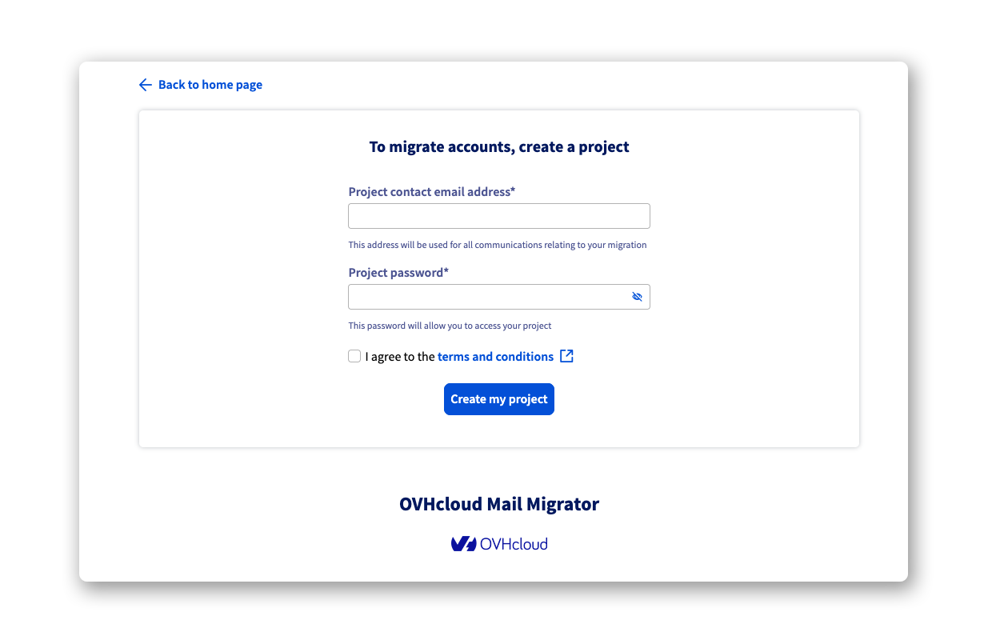{.thumbnail .w-600}

> [!primary]
>
> En caso de inactividad durante 60 días, el proyecto de migración y todos los datos asociados se eliminarán automáticamente.

### Crear una nueva migración 

Una vez creado su proyecto, conéctese a él desde la página de inicio de [OMM](/links/web/omm):

- Haga clic en `Track a migration`{.action}.
- Introduzca el `Project ID` recibido por correo electrónico.
- Introduzca la `Project password` que definió al crearlo.
- Haga clic en `Connect to project`{.action} para finalizar.

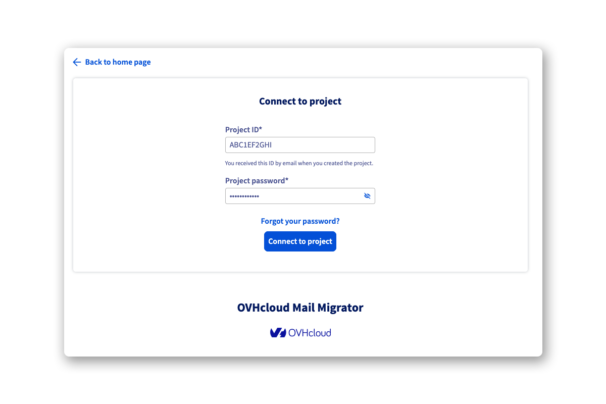{.thumbnail .w-600}

Ahora está en la página de inicio del proyecto, desde la cual podrá iniciar su primera migración.

- Haga clic en `New migration`{.action} en la parte superior izquierda de la tabla.

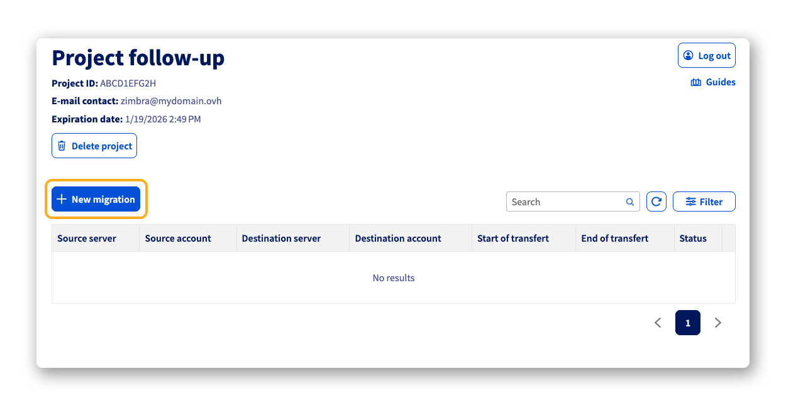{.thumbnail .w-600}

En la nueva página que aparece, introduzca las informaciones de conexión de la cuenta de origen y de la cuenta de destino para programar la migración o iniciarla inmediatamente. Para recordar, el contenido del **source account** se migrará al **destination account**.

Antes de comenzar su migración, es importante conocer bien los 3 tipos de cuentas que se pueden migrar y hacia las que puede migrar:

- **OVHcloud**: El `Autodetect` se recomienda si debe migrar una cuenta alojada en una de las ofertas de correo electrónico de OVHcloud. Si posee un gran número de cuentas de correo electrónico de OVHcloud, seleccione una de las siguientes ofertas: `MX plan`, `Email Pro`, `Exchange` o `Zimbra`. Se le pedirá que se conecte a la cuenta de OVHcloud asociada a la oferta concernida por la migración. Para más información, consulte la sección "[Migrar mediante una conexión a la cuenta cliente de OVHcloud](#sso-migration)".
- **Others**: Se trata de servicios de correo electrónico contratados fuera de OVHcloud. Una lista no exhaustiva de servicios de correo electrónico compatibles con OMM está disponible. Si el tipo de servicio de su cuenta de correo electrónico no aparece en esta lista, utilice los protocolos `IMAP` o `POP`, compatibles con la mayoría de los servidores de correo electrónico.
- **Importing files**: Es posible migrar el contenido de archivos PST, ICS, CSV y XML Rules a través de OMM a una cuenta de correo electrónico de destino. Cuando se selecciona esta función, basta con arrastrar y soltar su documento en la zona correspondiente o navegar por su terminal mediante el botón `Browse your files`{.action}.

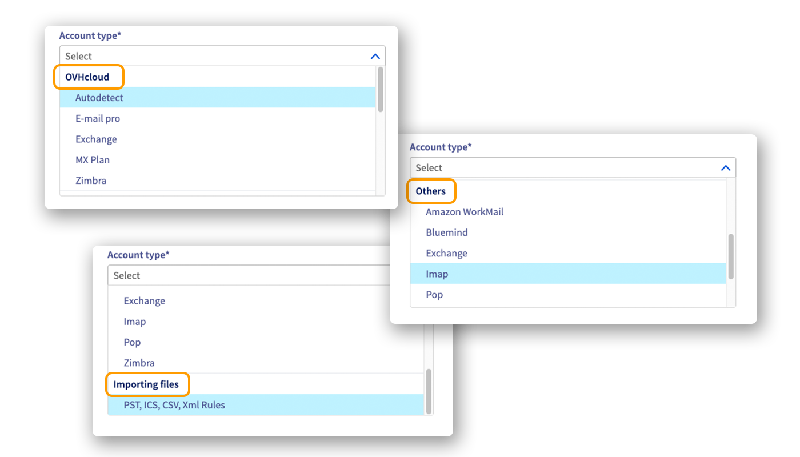{.thumbnail .w-600}

Complete las informaciones según el tipo de cuenta:

- **Source account**
    - **Account type**: Seleccione el tipo de cuenta de origen.
    - **E-mail**: Introduzca la dirección de correo electrónico de la cuenta de origen.
    - **Password**: Introduzca la contraseña de la cuenta de origen.
    - **Server URL** / **Server domain** *(según el tipo)*: Introduzca el nombre de host del servidor de correo electrónico asociado a la cuenta de correo electrónico que desea migrar.
    - **OVHcloud Account ID** *(según el tipo)*: Este campo se rellena automáticamente cuando está conectado a una cuenta de OVHcloud. Para más información, consulte la sección "[Migrar mediante una conexión a la cuenta cliente de OVHcloud](#sso-migration)".
    - **Organization** *(según el tipo)*: Seleccione la organización asociada a la cuenta de correo electrónico de origen.
    - **Platform** *(según el tipo)*: Seleccione la plataforma asociada a la cuenta de correo electrónico de origen.
    - **Service** *(según el tipo)*: Seleccione el servicio asociado a la cuenta de correo electrónico de origen.
    - **Advanced settings** > **Delegation account ID** *(según el tipo)*: Cuando la cuenta de correo electrónico que migra es una cuenta compartida, debe introducir la dirección de correo electrónico de la cuenta administradora en esta cuenta de delegación.  

- **Destination account**
    - **Account type**: Seleccione el tipo de cuenta de destino.
    - **E-mail**: Introduzca la dirección de correo electrónico de destino.
    - **Password**: Introduzca la contraseña asociada a la cuenta de destino.
    - **Server URL** / **Server domain** *(según el tipo)*: Introduzca el nombre de host del servidor de correo electrónico asociado a la cuenta de correo electrónico de destino.
    - **OVHcloud Account ID** *(según el tipo)*: Este campo se rellena automáticamente cuando está conectado a una cuenta de OVHcloud. Para más información, consulte la sección "[Migrar mediante una conexión a la cuenta cliente de OVHcloud](#sso-migration)".
    - **Organization** *(según el tipo)*: Seleccione la organización asociada a la cuenta de correo electrónico de destino.
    - **Platform** *(según el tipo)*: Seleccione la plataforma asociada a la cuenta de correo electrónico de destino.
    - **Service** *(según el tipo)*: Seleccione el servicio asociado a la cuenta de correo electrónico de destino.
    - **Advanced settings** > **Delegation account ID** *(según el tipo)*: Cuando la cuenta de correo electrónico de destino es una cuenta compartida, debe introducir la dirección de correo electrónico de la cuenta administradora en esta cuenta de delegación.  

- **Start of transfer**: Puede iniciar la migración `Immediately` o marcar `Later` para posponerla. La migración diferida le permite iniciarla automáticamente en una fecha y hora que usted defina.
- **Data to transfer**: Según el tipo de cuenta de correo electrónico que migre y la cuenta de destino, esta sección le indicará los diferentes tipos de datos que se admiten durante la migración. Esto depende de la cuenta de origen y la cuenta de destino.

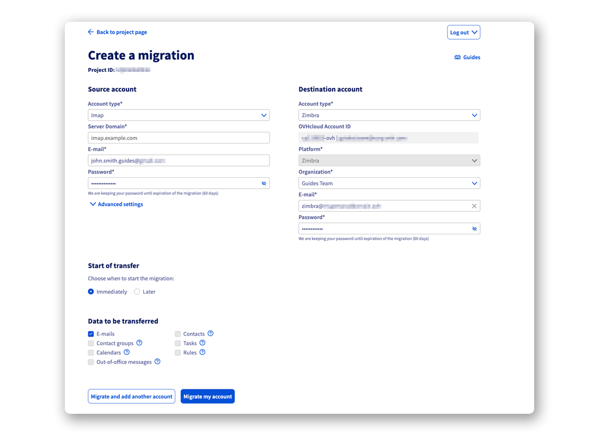{.thumbnail .w-600}

> [!warning]
>
> Si migra una cuenta que dispone de funcionalidades que la cuenta de destino no posee, **deberá guardar por sus propios medios los elementos que no puedan ser migrados por OMM**. Para ayudarle, consulte nuestro guía "[Migrar manualmente su dirección de correo electrónico](/pages/web_cloud/email_and_collaborative_solutions/migrating/manual_email_migration)".

Una vez completados los parámetros de las cuentas de origen y de destino, haga clic en:

- `Migrate and add another account`{.action} si desea añadir otra migración a la lista de su proyecto.
- `Migrate my account`{.action} para iniciar la migración configurada y volver a la página de inicio del proyecto.

### Migrar mediante una conexión a la cuenta cliente de OVHcloud 

Durante una migración hacia o desde una cuenta de OVHcloud, es posible seleccionar una de nuestras ofertas `MX plan`, `Email Pro`, `Exchange` o `Zimbra`.

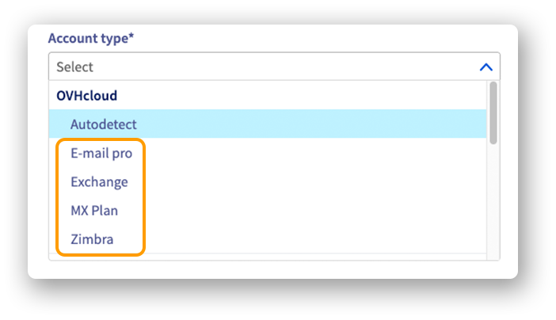{.thumbnail .w-300}

Cuando seleccione una de estas ofertas, siga los pasos siguientes:

> [!tabs]
> **Paso 1**
>>
>> - Haga clic en `Login`{.action} para mostrar la ventana de conexión al área de cliente de OVHcloud.
>>
>> 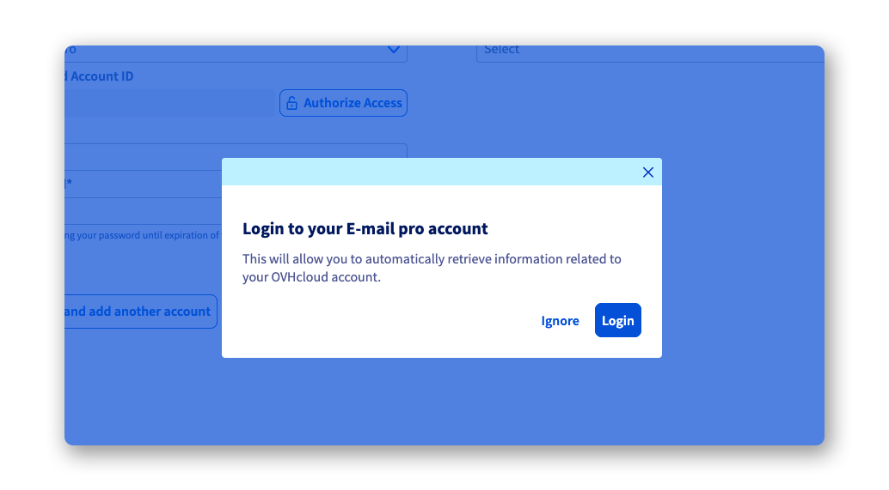{.thumbnail .w-600}
>>
> **Paso 2**
>>
>> Conéctese a la cuenta cliente de OVHcloud:
>>
>> - Introduzca el identificador o la dirección de correo electrónico asociada a la cuenta de OVHcloud, introduzca la contraseña correspondiente y haga clic en `Login`{.action} ;
>> - o haga clic en `Continue`{.action} si ya estaba identificado.
>>
>> > [!primary]
>> >
>> > La cuenta cliente de OVHcloud debe estar asociada a la oferta de correo electrónico que se somete a migración.
>>
>> 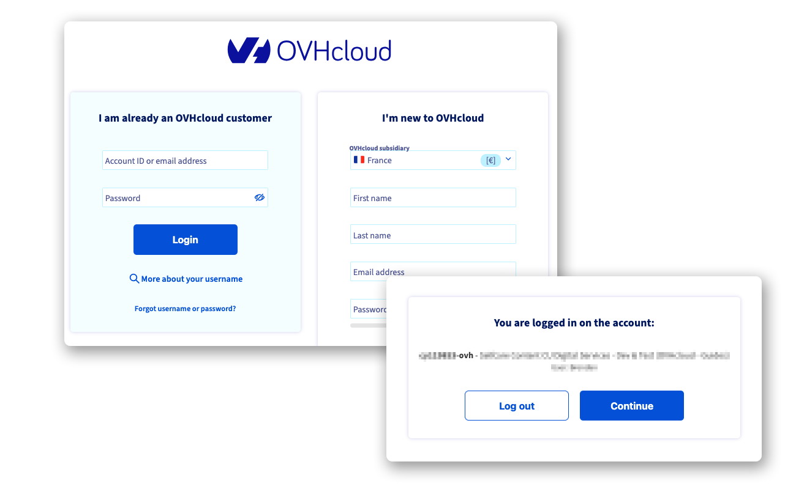{.thumbnail .w-600}
>>
> **Paso 3**
>>
>> - Aparecerá una nueva ventana. Le permite autorizar a OMM para que acceda a las funciones de su espacio cliente y liste las ofertas y cuentas de correo electrónico presentes. Por defecto, la validez (Validity) de estos derechos es de 24 horas (1 día). Defina la duración de validez que le convenga y haga clic en `Authorize`{.action}.
>>
>> 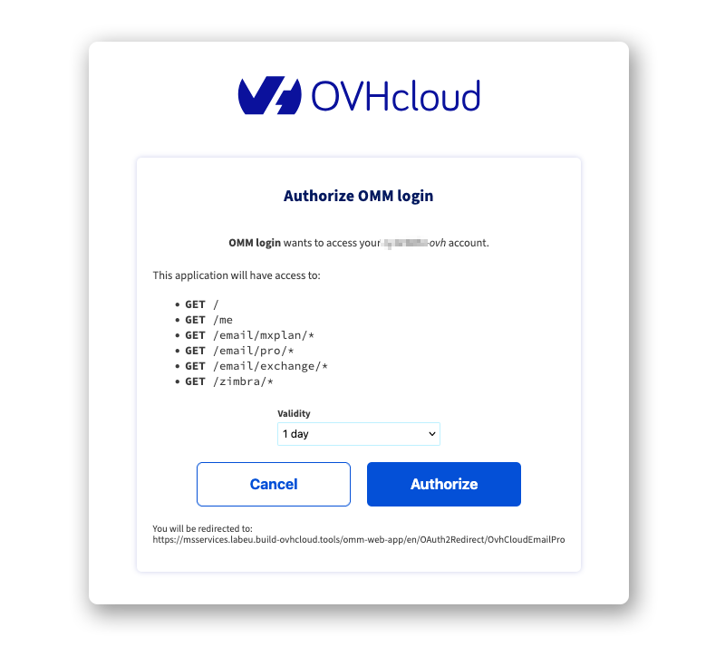{.thumbnail .w-600}
>>
> **Paso 4**
>>
>> - Ahora podrá seleccionar sus servicios y cuentas mediante menús desplegables. Esto facilita la búsqueda de los elementos y evita errores de escritura. Es, sin embargo, necesario introducir la contraseña asociada a la cuenta de correo electrónico seleccionada.
>>
>> Ejemplo con un servicio Zimbra:
>>
>> 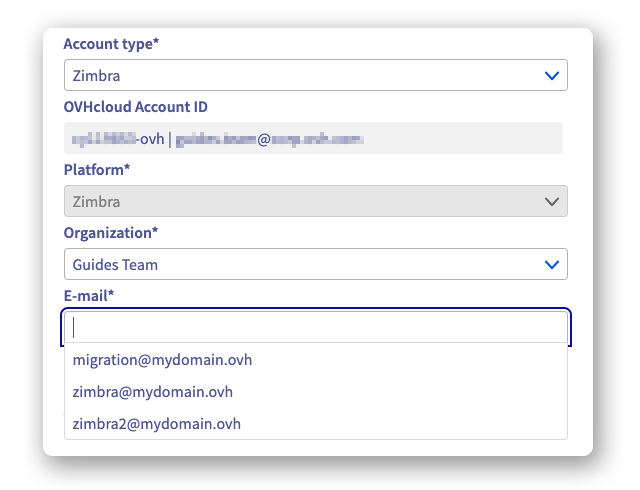{.thumbnail .w-600}

> [!warning]
>
> Es posible desconectar los accesos en curso desde un área de cliente de OVHcloud haciendo clic en `Log out`{.action}, y luego, bajo la mención `OVHcloud account ID`, haga clic en `Log out of the account`{.action}.
>
> 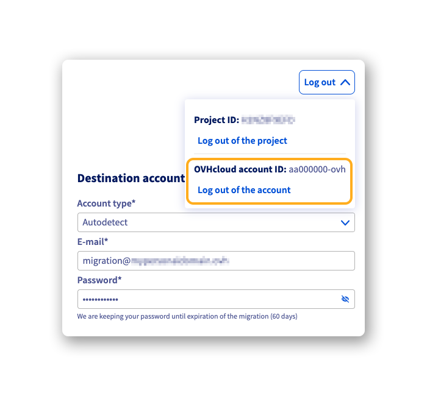{.thumbnail .w-300}

### Seguir un proyecto de migración 

Existen dos maneras de acceder al seguimiento del proyecto de migración:

- En el correo electrónico recibido durante la creación de su proyecto, encontrará un enlace que le permite acceder a la página de conexión del proyecto con el `Project ID` prellenado. Solo el `Project password` debe introducirse.
- Desde la página de inicio de [OMM](/links/web/omm), haga clic en `Track a migration`{.action}. Introduzca después su `Project ID` y su `Project password`.

Haga clic después en `Connect to project`{.action} para acceder a la página de inicio del proyecto y seguir sus migraciones.

{.thumbnail .w-600}

Desde esta página, encontrará la lista de las migraciones en curso o programadas. El estado del proyecto también se muestra a la derecha.

Haga clic en el botón `⋮`{.action} a la derecha de la línea de una migración para mostrar las Opciones:

- `See more details`{.action}: Se le redirige a una página que le permite seguir el progreso de una migración y leer el informe una vez finalizada la migración.
- `Cancel migration`{.action}: Permite cancelar la migración en curso. Los elementos ya migrados se conservarán en la cuenta de destino.
- `Delete migration data (GDPR)`{.action}: Esta opción desencadena la eliminación de todos los datos relativos a la migración de la cuenta. Sin embargo, conservará la información concerniente a los eventos ocurridos durante la migración.

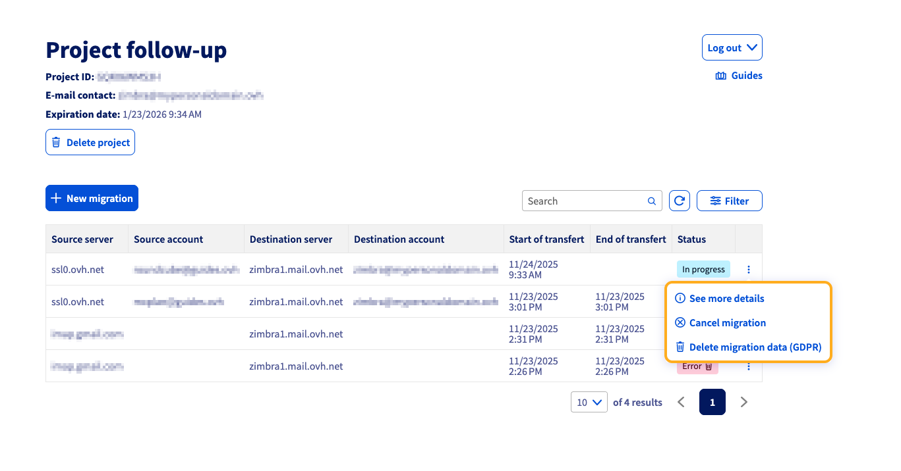{.thumbnail .w-600}

Ejemplo de seguimiento de migración:

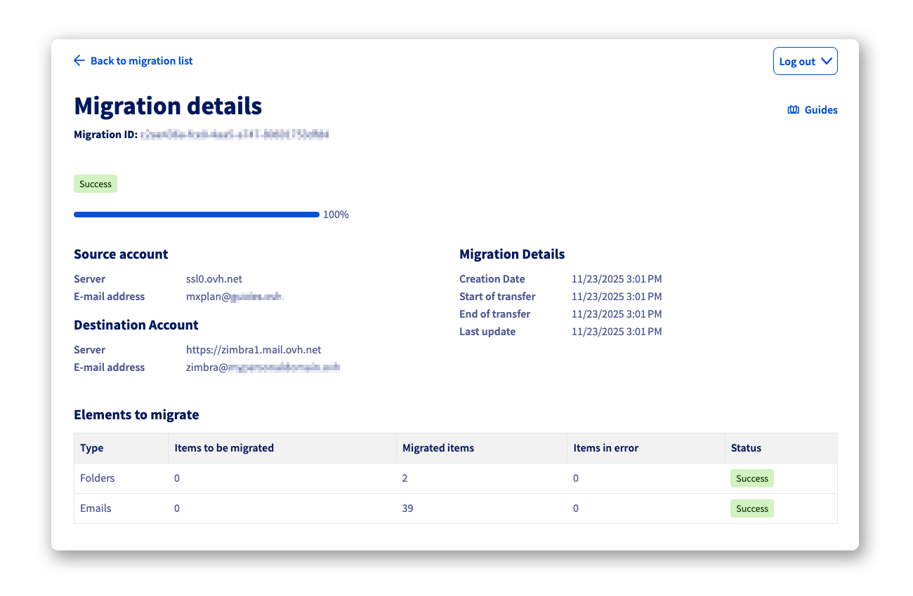{.thumbnail .w-600}

> [!primary]
>
> Si se produce un error durante la migración, se le proporcionará un enlace al registro de errores en la ventana `See more details`{.action}.

## Más información

[Migrar manualmente su dirección de correo electrónico](/pages/web_cloud/email_and_collaborative_solutions/migrating/manual_email_migration)

[Migrar una dirección de correo electrónico MX Plan a una cuenta Email Pro o Exchange](/pages/web_cloud/email_and_collaborative_solutions/migrating/migration_control_panel)

Para servicios especializados (posicionamiento, desarrollo, etc.), contacte con los [partners de OVHcloud](/links/partner).

Si quiere disfrutar de ayuda para utilizar y configurar sus soluciones de OVHcloud, puede consultar nuestras distintas soluciones [pestañas de soporte](/links/support).

Interactúe con nuestra [comunidad de usuarios](/links/community).