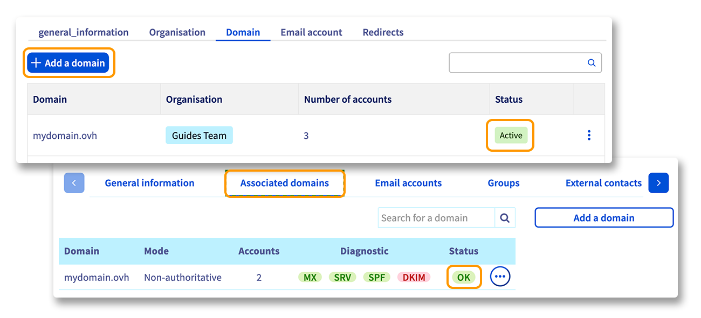

## Ziel

Sie möchten Ihre E-Mail-Adressen von einer Exchange- oder E-Mail Pro-Plattform auf eine andere Exchange-, E-mail Pro-, MX Plan- oder Zimbra-Plattform migrieren. In dieser Anleitung wird ein  zweistufiger Migrationsprozess beschrieben:

1. **Konfigurieren der Zielplattform**
2. **Migration der E-Mail-Accounts** von der bestehenden Plattform auf die neue

{.thumbnail}

> [!primary]
>
> Um eine MX Plan Lösung nach Exchange oder E-Mail Pro zu migrieren, folgen Sie unserer Anleitung [Migration einer MX Plan E-Mail-Adresse auf einen E-Mail Pro oder Exchange Account](/pages/web_cloud/email_and_collaborative_solutions/migrating/migration_control_panel).
>

**Diese Anleitung erklärt, wie Sie E-Mail-Adressen von Exchange oder E-Mail Pro auf eine andere Exchange- oder E-Mail Pro-Plattform migrieren.**

## Voraussetzungen

- Sie haben eine "**Quell-Plattform**" mit bereits eingerichteten [Exchange](/links/web/emails-hosted-exchange) oder [E-Mail Pro](/links/web/email-pro) oder [Zimbra](/links/web/zimbra) Accounts.
- Sie verfügen über eine "**Ziel-Plattform**": [Exchange](/links/web/emails-hosted-exchange), [E-Mail Pro](/links/web/email-pro) oder MX Plan (über das MX Plan Angebot oder in einem [OVHcloud Webhosting](/links/web/hosting) enthalten). Diese Plattform muss unkonfigurierte oder verfügbare Accounts haben, um die zu migrierenden E-Mail-Accounts zu empfangen.
- Sie haben Zugriff auf Ihr [OVHcloud Kundencenter](/links/manager).

## In der praktischen Anwendung

### Die Zielplattform konfigurieren

> [!warning]
>
> Vor Beginn der Migration, wenn Sie Ihr neues E-Mail-Angebot bestellt haben, fügen Sie zunächst den Domainnamen zu Ihrer E-Mail-Plattform hinzu. Wenn Sie zu einer MX Plan-Plattform migrieren, ist der angeschlossene Domainname nicht wählbar. Sie können direkt zum [nächsten Schritt](#accountsmigration) übergehen.
>
> Wählen Sie den Tab `Zugeordnete Domains`{.action} oder `Domain`{.action} auf Ihrer Plattform aus und klicken Sie auf `Domain hinzufügen`{.action}. Nachdem der Domainname hinzugefügt wurde, stellen Sie sicher, dass die Bezeichnung `OK` oder `Aktiv`{.action} in der Spalte `Status` angezeigt wird.
>
> {.thumbnail}
>
> Weitere Informationen zum Hinzufügen eines Domainnamens finden Sie im [E-mail Pro-Leitfaden](/pages/web_cloud/email_and_collaborative_solutions/email_pro/first_config#etape-2-ajouter-votre-nom-de-domaine), im [Exchange-Leitfaden](/pages/web_cloud/email_and_collaborative_solutions/microsoft_exchange/exchange_adding_domain) oder im [Zimbra-Leitfaden](/pages/web_cloud/email_and_collaborative_solutions/zimbra/getting_started_zimbra).

### E-Mail Accounts migrieren 

Die Migration Ihrer E-Mail-Accounts erfolgt in 3 großen Schritten: **Umbenennen** des ursprünglichen E-Mail-Accounts, **Erstellen** des neuen E-Mail-Accounts und **Migration** von der ursprünglichen Plattform auf die neue.

{.thumbnail}

> [!warning]
>
> Sonderfälle:
>
> - Wenn Sie **ein Exchange- oder Zimbra PRO-Konto** zu einem **E-mail Pro-** oder **Zimbra STARTER-Konto** migrieren, müssen Sie sicherstellen, dass Ihre E-Mail-Konten nicht mehr als 10 GB (E-mail Pro) oder 15 GB (Zimbra STARTER) enthalten. Die Funktionen zur Zusammenarbeit, die Synchronisierung von Kalendern und Kontakten sind bei E-mail Pro oder Zimbra STARTER nicht vorhanden und können nicht migriert werden.
> - Wenn Sie **ein Exchange-, E-mail Pro- oder Zimbra-Konto** zu einem **MX Plan-Konto** migrieren, müssen Sie sicherstellen, dass Ihr E-Mail-Konto nicht mehr als 5 GB enthält. Die Funktionen zur Zusammenarbeit, die Synchronisierung von Kalendern und Kontakten sind bei MX Plan nicht vorhanden und können nicht migriert werden.

#### Umbenennen

Geben Sie dem zu migrierenden E-Mail-Account einen temporären Namen (Beispiel: Um den E-Mail-Account *john.smith@mydomain.ovh* zu migrieren, benennen Sie diesen um zu *john.smith01@mydomain.ovh*.)

Klicken Sie dazu im Tab `E-Mail-Accounts`{.action} Ihres Dienstes auf den Button `...`{.action} und dann auf `Ändern`{.action}.

{.thumbnail}

#### Erstellen

Erstellen Sie die E-Mail-Adresse neu als Account von E-Mail Pro, Exchange oder MX Plan (in diesem Beispiel wäre das *john.smith@mydomain.ovh* auf Ihrer Ziel-Plattform).

Klicken Sie im Tab `E-Mail-Accounts`{.action} Ihrer betreffenden Plattform auf `...`{.action} rechts neben dem Ziel-Account und dann auf `Ändern`{.action}.

{.thumbnail}

#### Migrieren

> [!warning]
>
> Nur die Daten Ihrer E-Mail Accounts werden migriert (E-Mails, Kontakte, Kalender, Posteingangsregeln usw.). Die Funktionen Ihrer Plattform müssen auf der neuen Plattform neu aufgebaut werden:
>
> - [Alias](/pages/web_cloud/email_and_collaborative_solutions/common_email_features/feature_redirections)
> - [Übertragung von Rechten](/pages/web_cloud/email_and_collaborative_solutions/microsoft_exchange/feature_delegation)
> - [Gruppen](/pages/web_cloud/email_and_collaborative_solutions/microsoft_exchange/feature_groups)
> - Externe Kontakte
> - [Fußzeile](/pages/web_cloud/email_and_collaborative_solutions/microsoft_exchange/feature_footers)

Migrieren Sie den Quell-E-Mail-Account mithilfe unseres Tools [OMM](/links/web/omm) (OVHcloud Mail Migrator) auf das Konto Ihrer neuen Plattform.

Weitere Informationen zu OMM finden Sie in unserer Anleitung "[E-Mail-Accounts über den OVHcloud Mail Migrator migrieren](/pages/web_cloud/email_and_collaborative_solutions/migrating/migration_omm)".

{.thumbnail}

Die Migrationsdauer hängt davon ab, wie viele Daten auf Ihren neuen Account migriert werden sollen. Dies kann von einigen Minuten bis zu mehreren Stunden variieren.

Überprüfen Sie nach der Migration, ob alle Ihre Elemente vorhanden sind, indem Sie sich im Webmail einloggen:[Webmail](/links/web/email).

Nach der Migration können Sie den ursprünglichen Account mit dem geänderten Namen beibehalten oder löschen.

Um ihn zu löschen, gehen Sie zum Tab `E-Mail-Accounts`{.action} Ihrer Quell-Plattform, klicken Sie auf `...`{.action} und dann auf `Diesen Account zurücksetzen`{.action}.

### Die Konfiguration Ihrer Domain überprüfen oder ändern

Ihre E-Mail-Adressen sollten bereits migriert und funktionsfähig sein. Aus Sicherheitsgründen bitten wir Sie, die korrekte Konfiguration Ihrer Domain in Ihrem Kundencenter zu überprüfen.

Wählen Sie den betreffenden E-mail Pro-, Exchange- oder Zimbra-Service aus und gehen Sie zum Tab `Zugeordnete Domains`{.action} oder `Domain`{.action} auf Ihrer Plattform. Überprüfen Sie den Abschnitt oder die Spalte `Diagnose`{.action}.

{.thumbnail}

> [!primary]
>
> Wenn Sie gerade die Migration durchgeführt oder einen DNS-Eintrag Ihrer Domain geändert haben, kann es noch einige Stunden dauern, bis die Anzeige im [OVHcloud Kundencenter](/links/manager) aktualisiert wird.
>

Um die Konfiguration zu ändern, klicken Sie auf das rote Feld und führen Sie die dort beschriebene Aktion durch. Der Vorgang benötigt eine Propagationszeit von 4 bis maximal 24 Stunden, bis die Änderung voll wirksam ist.

{.thumbnail}

### Migrierte E-Mail-Adressen verwenden

Sie können nun Ihre migrierten E-Mail-Adressen verwenden. OVHcloud stellt dazu einen Web-Client (*Wep App*) zur Verfügung, der über [Webmail](/links/web/email) erreichbar ist. Geben Sie dort die Login-Daten für Ihre E-Mail-Adresse ein.

Wenn Sie einen der migrierten Accounts auf einem lokalen E-Mail-Client eingerichtet haben (Outlook, Thunderbird, etc.), muss er erneut konfiguriert werden. Die Verbindungsdaten zum OVHcloud Server haben sich nach der Migration geändert.

> [!primary]
>
> Sie können auch externe E-Mail-Adressen zu OVHcloud migrieren, indem Sie unseren [OVHcloud Mail Migrator (OMM)](/links/web/omm) verwenden. Hierzu benötigen Sie die Login-Daten (Benutzer, Passwort, Server) der Quell- und Ziel-Accounts.
>

## Weiterführende Informationen

[Verwaltung der Kontakte Ihrer Dienste](/pages/account_and_service_management/account_information/managing_contacts)

[Erste Schritte mit dem E-mail Pro-Angebot](/pages/web_cloud/email_and_collaborative_solutions/email_pro/first_config).

[Erste Schritte mit dem Exchange-Angebot](/pages/web_cloud/email_and_collaborative_solutions/microsoft_exchange/exchange_starting_hosted).

[Erste Schritte mit dem Zimbra-Angebot](/pages/web_cloud/email_and_collaborative_solutions/zimbra/getting_started_zimbra)

Treten Sie unserer [User Community](/links/community) bei.