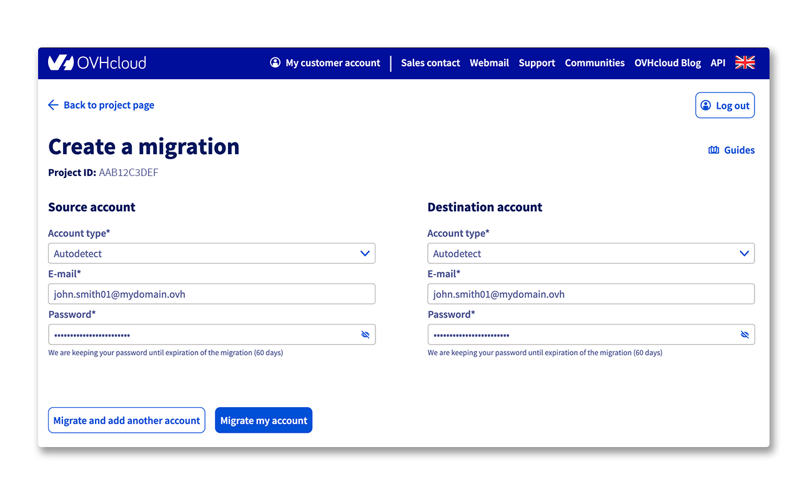
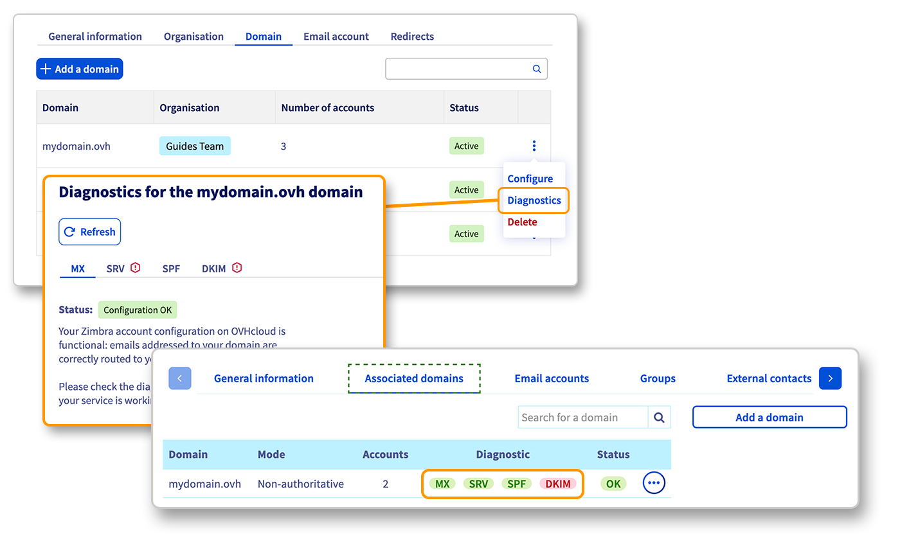

## Obiettivo

Per migrare i tuoi indirizzi email presenti su una piattaforma Exchange o Email Pro su un'altra piattaforma Exchange, Email Pro, MX Plan o Zimbra. In questa guida trovi il processo di migrazione in due fasi:

1. **Configura la piattaforma di destinazione**
2. **Migrare gli account email** dalla piattaforma attuale verso la nuova.

{.thumbnail}

> [!primary]
>
> Per migrare una soluzione MX Plan verso una piattaforma Exchange o Email Pro, consulta la guida [Migrare un indirizzo email MX Plan verso un account Email Pro o Exchange](/pages/web_cloud/email_and_collaborative_solutions/migrating/migration_control_panel).
>

**Questa guida ti mostra come migrare gli indirizzi email da una piattaforma Exchange o Email Pro verso un'altra piattaforma Exchange o Email Pro.**

## Prerequisiti

- Disporre di una piattaforma **"sorgente"** con conti [Exchange](/links/web/emails-hosted-exchange) o [Email Pro](/links/web/email-pro) configurati o [Zimbra](/links/web/zimbra).
- Disporre di una piattaforma di **"destinazione"** con account [Exchange](/links/web/emails-hosted-exchange), [Email Pro](/links/web/email-pro) o MX Plan (inclusa nella soluzione MX Plan o in una soluzione di [hosting Web OVHcloud](/links/web/hosting)) Questa piattaforma deve disporre di account non configurati o disponibili per accogliere gli indirizzi email che devono essere migrati.
- Avere accesso allo [Spazio Cliente OVHcloud](/links/manager).

## Procedura

### Configura la piattaforma di destinazione

> [!warning]
>
> Prima di iniziare la tua migrazione, se hai appena ordinato la tua nuova offerta email, aggiungi prima il nome del dominio alla tua piattaforma email. Se stai migrando verso una piattaforma MX Plan, il nome del dominio associato essendo "fisso", puoi passare direttamente alla [prossima fase](#accountsmigration).
>
> Seleziona l'opzione `Domini associati`{.action} o `Dominio`{.action} sulla tua piattaforma, quindi clicca su `Aggiungi un dominio`{.action}. Una volta aggiunto il nome del dominio, assicurati che l'indicazione `OK` o `Attivo`{.action} sia presente nella colonna `Stato`.
>
> {.thumbnail}
>
> Per ulteriori dettagli sull'aggiunta di un nome di dominio, segui la [guida Email Pro](/pages/web_cloud/email_and_collaborative_solutions/email_pro/first_config#etape-2-ajouter-votre-nom-de-domaine), la [guida Exchange](/pages/web_cloud/email_and_collaborative_solutions/microsoft_exchange/exchange_adding_domain) o la [guida Zimbra](/pages/web_cloud/email_and_collaborative_solutions/zimbra/getting_started_zimbra).

### Migra gli account email 

La migrazione dei tuoi account email avverrà in 3 step principali: **Rinomina** l'account email originale, **crea** il nuovo account email e **migra** dalla piattaforma di origine alla nuova.

{.thumbnail}

> [!warning]
>
> Caso specifico:
>
> - Se devi migrare **un conto Exchange o Zimbra PRO** verso un conto **Email Pro** o **Zimbra STARTER**, devi assicurarti che i tuoi conti email non superino i 10 Go (Email Pro) o 15 Go (Zimbra STARTER). Le funzioni collaborative, la sincronizzazione dei calendari e contatti non sono presenti su Email Pro o Zimbra STARTER e non possono essere migrate.
> - Se devi migrare **un conto Exchange, Email Pro o Zimbra** verso un conto **MX Plan**, devi assicurarti che il tuo conto email non superi i 5 Go. Le funzioni collaborative, la sincronizzazione dei calendari e contatti non sono presenti su MX Plan e non possono essere migrate.

#### Rinomina

Rinomina l'account email da migrare con un nome provvisorio (ad esempio: per migrare l'account email *john.smith@mydomain.ovh*, rinominalo in *john.smith01@mydomain.ovh*).

Nella scheda `Account email`{.action} della tua piattaforma email, clicca sui tre puntini `...`{.action} e poi su `Modifica`{.action}.

{.thumbnail}

#### Crea

Crea il tuo indirizzo email sul nuovo account della tua piattaforma Email Pro, Exchange o MX Plan (prendendo l'esempio precedente, crei *john.smith@mydomain.ovh* sulla tua nuova piattaforma)

Nella scheda `Account email`{.action} della tua piattaforma, clicca sui tre puntini in corrispondenza dell'account `...`{.action}. e seleziona `Modifica`{.action}.

{.thumbnail}

#### Migrare

> [!warning]
>
> Verranno migrati solo i dati dei tuoi account email (email, contatti, calendari, regole della posta in arrivo, ecc...). Le funzionalità legate alla tua piattaforma dovranno essere ripristinate sulla nuova piattaforma:
>
> - [Alias](/pages/web_cloud/email_and_collaborative_solutions/common_email_features/feature_redirections)
> - [Delega dei diritti](/pages/web_cloud/email_and_collaborative_solutions/microsoft_exchange/feature_delegation)
> - [Gruppi](/pages/web_cloud/email_and_collaborative_solutions/microsoft_exchange/feature_groups)
> - Contatti esterni
> - [Firma](/pages/web_cloud/email_and_collaborative_solutions/microsoft_exchange/feature_footers)

Migra l'account email "sorgente" verso l'account della tua nuova piattaforma con l'aiuto del nostro tool [OMM](/links/web/omm) (OVHcloud Mail Migrator).

Per maggiori informazioni su OMM, consulta la guida [Migrare account email via OVHcloud Mail Migrator](/pages/web_cloud/email_and_collaborative_solutions/migrating/migration_omm).

{.thumbnail}

Il tempo di migrazione dipende dalla quantità di dati da migrare verso il nuovo account. che può variare da pochi minuti a diverse ore.

Una volta completata la migrazione, verifica di trovare tutti i tuoi elementi accedendo alla Webmail all'indirizzo Web [Webmail](/links/web/email).

Una volta completata la migrazione, puoi conservare o eliminare l'account di origine con il nome provvisorio.

Per eliminarlo, seleziona la scheda `Account email`{.action} della tua piattaforma email originale, clicca sul pulsante`...`{.action} e poi su `Reimposta questo account `{.action}.

### Verifica o modifica la configurazione del tuo dominio

In questa fase, gli account email devono essere già migrati e funzionali. Per motivi di sicurezza, ti consigliamo di assicurarti che la configurazione del tuo dominio sia corretta consultando il tuo Spazio Cliente OVHcloud.

Per farlo, seleziona il servizio Email Pro, Exchange o Zimbra interessato, quindi vai nell'opzione `Domini associati`{.action} o `Dominio`{.action} sulla tua piattaforma. Verifica la sezione o la colonna `Diagnostico`{.action}.

{.thumbnail}

> [!primary]
>
> Se hai appena effettuato la migrazione o modificato un record DNS del tuo dominio, è possibile che l'aggiornamento della pagina nello [Spazio Cliente OVHcloud](/links/manager) richieda qualche ora.
>

Per modificare la configurazione, clicca sulla pastiglia rossa e effettua la manipolazione richiesta. Questa richiede un tempo di propagazione di 4 a 24 ore massimo prima di essere pienamente attiva.

### Utilizza i tuoi account email migrati

A questo punto non ti resta che utilizzare i tuoi account email migrati. OVHcloud mette a disposizione un'applicazione online (_Web app_) accessibile all'indirizzo [Webmail](/links/web/email). inserendo le credenziali associate al tuo indirizzo email.

Se hai configurato uno degli account migrati su un client di posta (ad esempio: Outlook, Thunderbird), è necessario impostarlo di nuovo. Le informazioni di connessione al server OVHcloud sono cambiate in seguito alla migrazione.

> [!primary]
>
> Inoltre, è possibile migrare manualmente indirizzi email verso OVHcloud utilizzando il nostro tool [OVHcloud Mail Migrator (OMM)](/links/web/omm). Per farlo, è necessario disporre delle informazioni (utente, password, server) dell'email sorgente e dell'email di destinazione.
>

## Per saperne di più

[Gestire i contatti dei servizi](/pages/account_and_service_management/account_information/managing_contacts)

[Primi passi con l'offerta Email Pro](/pages/web_cloud/email_and_collaborative_solutions/email_pro/first_config)

[Primi passi con l'offerta Exchange](/pages/web_cloud/email_and_collaborative_solutions/microsoft_exchange/exchange_starting_hosted)

[Primi passi con l'offerta Zimbra](/pages/web_cloud/email_and_collaborative_solutions/zimbra/getting_started_zimbra)

Contatta la nostra [Community di utenti](/links/community).