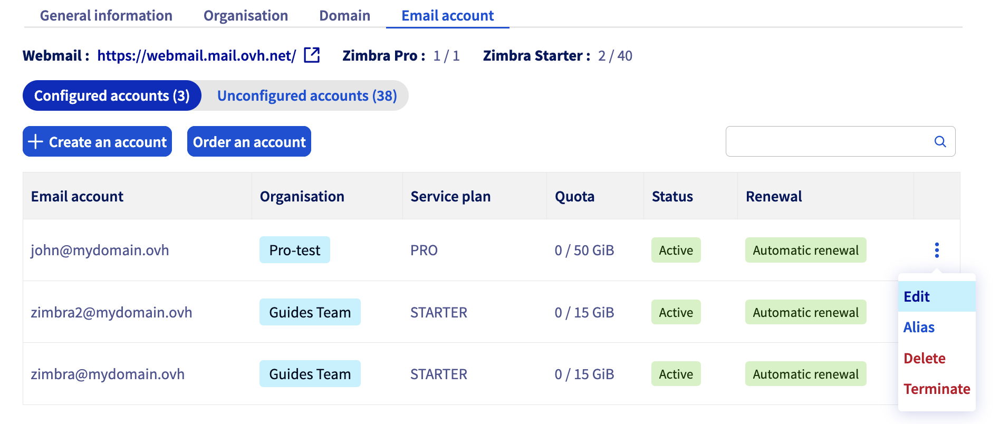
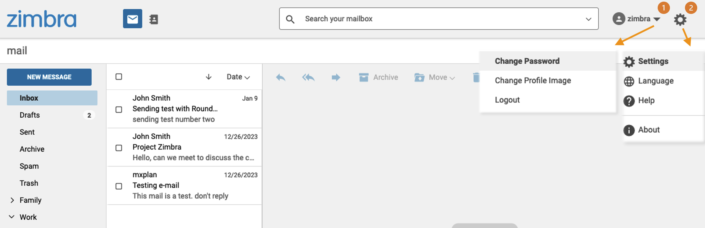

## Objectif

Les comptes e-mail de votre offre OVHcloud sont accessibles grâce au mot de passe qui leur est associé. La modification de celui-ci peut se faire de 2 manières selon votre offre e-mail:

- Depuis le Webmail
- Via l'espace client OVHcloud

**Découvrez comment modifier le mot de passe d'une adresse e-mail OVHcloud.**

## Prérequis

- Être connecté à votre [espace client OVHcloud](/links/manager).
- Disposer d'une solution e-mail OVHcloud préalablement configurée, parmi les suivantes :
    - **MX Plan** proposée avec nos [offres d’hébergement web](/links/web/hosting) ou incluse dans un [hébergement gratuit 100M](/links/web/domains-free-hosting).
    - [Exchange](/links/web/emails).
    - [Email Pro](/links/web/email-pro).
    - [Zimbra](/links/web/emails-zimbra).

## En pratique

> [!primary]
>
> Lorsque vous modifiez le mot de passe de votre adresse e-mail, vous devrez également répercuter ce changement sur tous les appareils où l’adresse e-mail a été configurée. N'hésitez pas à consulter le guide de configuration correspondant à votre logiciel de messagerie.

### Modifier le mot de passe depuis l'espace client 

> [!warning]
>
> Pour des raisons de sécurité, nous vous recommandons de ne pas utiliser deux fois le même mot de passe, d'en choisir un qui n'a aucun rapport avec vos informations personnelles (évitez les mentions de votre nom, prénom et date de naissance, par exemple) et de le renouveler régulièrement.

> [!primary]
>
> **Identifier la technologie e-mail de votre offre MX Plan.**
>
> En fonction de la date d’activation de votre offre MX Plan ou d’une migration récente, la technologie e-mail associée peut différer. Celle-ci est caractérisée par l'interface de son webmail. Pour l'identifier :
>
> - Depuis l'onglet `Informations Générales`{.action}, relevez la technologie utilisée sous la mention **Webmail** présente dans l'encadré `Abonnement`{.action} sous `Webmail`{.action}.
>
> {.thumbnail .w-500}

Depuis votre [espace client OVHcloud](/links/manager), dirigez-vous dans la partie `Web Cloud`{.action} puis suivez les instructions selon votre offre :

> [!tabs]
> **MX Plan - Roundcube**
>>
>> Si vous ne connaissez pas le type d'offre MX Plan que vous possédez, consultez notre paragraphe [Identifiez votre offre MX Plan](#whichmxplan).  
>> Cliquez sur `MX Plan`{.action} puis choisissez le nom du service MX Plan concerné. Positionnez-vous sur l'onglet `Emails`{.action}. La fenêtre qui apparaît affiche les comptes e-mail existants.  
>> Cliquez sur le bouton `...`{.action} puis sur `Changer le mot de passe`{.action}.  
>>{.thumbnail} 
>>
> **MX Plan Zimbra et OWA**
>>
>> Si vous ne connaissez pas le type d'offre MX Plan que vous possédez, consultez notre paragraphe [Identifiez votre offre MX Plan](#whichmxplan).  
>> Cliquez sur `MX Plan`{.action} puis choisissez le nom du service MX Plan concerné. Positionnez-vous sur l'onglet `Emails`{.action}. La fenêtre qui apparaît affiche les comptes e-mail existants.  
>> Cliquez sur le bouton `...`{.action} puis sur `Modifier`{.action}.  
>>{.thumbnail} 
>>
> **Email Pro**
>>
>> Cliquez sur `E-mail Pro`{.action}, puis choisissez le nom de la plateforme concernée. Positionnez-vous sur l'onglet `Comptes e-mail`{.action}. La fenêtre qui apparaît affiche les comptes e-mail existants. 
>> Cliquez sur le bouton `...`{.action} puis sur `Modifier`{.action}.  
>>{.thumbnail} 
>>
> **Exchange**
>>
>> Cliquez sur `Microsoft`{.action} / `Exchange`{.action}, puis choisissez le nom de la plateforme concernée. Positionnez-vous sur l'onglet `Comptes e-mail`{.action}. La fenêtre qui apparaît affiche les comptes e-mail existants. 
>> Cliquez sur le bouton `...`{.action} puis sur `Modifier`{.action}.  
>>{.thumbnail} 
>>
> **Zimbra**
>>
>> Cliquez sur `Zimbra Mail`{.action} puis dirigez-vous vers l'onglet `Compte email`{.action}. La fenêtre qui apparaît affiche les comptes e-mail existants.  
>> Cliquez sur le bouton `...`{.action} puis sur `Modifier`{.action}.  
>>{.thumbnail} 
>>

### Modifier le mot de passe depuis le webmail

La modification de votre mot de passe via le webmail est disponible pour les offres email OVHcloud utilisant **OWA** (**O**utlook **W**eb **A**pp) et Zimbra :

- MX Plan OWA
- Email Pro
- Exchange
- MX Plan Zimbra
- Zimbra Starter et Pro

> [!warning]
>
> Pour l'offre **MX Plan Roundcube** le changement de mot de passe se fait uniquement [via l'espace client](#controlpanel).
>

#### OWA

<iframe class="video" width="560" height="315" src="https://www.youtube-nocookie.com/embed/z1D2wc7XWX4" title="YouTube video player" frameborder="0" allow="accelerometer; autoplay; clipboard-write; encrypted-media; gyroscope; picture-in-picture" allowfullscreen></iframe>

Accédez à la page « [Webmail](/links/web/email) ». Sur celle-ci, renseignez votre adresse e-mail complète, ainsi que son mot de passe actuel. Cliquez ensuite sur le bouton `Connexion`{.action}. 

{.thumbnail}

Cliquez sur le bouton <i class="icons-gear-concept icons-masterbrand-blue"></i> dans la partie supérieure, puis sur `Options`{.action}.

{.thumbnail}

Sur la nouvelle page qui s'affiche, dans la partie latérale de gauche, dépliez l'onglet « Général » dans l'arborescence, puis cliquez sur `Mon compte`{.action}. Cliquez enfin sur `Modifier votre mot de passe`{.action}.

{.thumbnail}

Sur la nouvelle fenêtre qui apparaît, commencez par renseigner votre mot de passe actuel. Écrivez alors votre nouveau mot de passe, puis confirmez-le. Cliquez sur le bouton `Enregistrer`{.action} pour sauvegarder la modification.

> [!primary]
>
> Vous devrez renseigner le nouveau mot de passe sur tous les appareils où l’adresse e-mail a été configurée.
>

{.thumbnail}

#### Zimbra

Rendez-vous sur la page [Webmail](/links/web/email). Saisissez votre adresse e-mail et le mot de passe puis cliquez sur `Connexion`{.action}.

Cliquez sur le nom de votre compte e-mail dans la partie supérieure droite de votre interface. Depuis ce menu, vous pourrez `Changer le mot de passe`{.action}.

{.thumbnail}

### Récupérer un mot de passe

Pour des raisons de sécurité et de confidentialité, il n'est pas possible de **récupérer** un mot de passe. Comme cela est décrit dans les étapes précédentes, il est nécessaire de réinitialiser votre mot de passe si vous ne le connaissez plus.

> [!primary]
>
> Si vous souhaitez stocker un mot de passe, il est conseillé d'utiliser un gestionnaire de mot de passe, comme **Keepass** par exemple.

## Aller plus loin

[Premiers pas avec la solution MX Plan](/pages/web_cloud/email_and_collaborative_solutions/mx_plan/email_generalities)

[Premiers pas avec la solution E-mail Pro](/pages/web_cloud/email_and_collaborative_solutions/email_pro/first_config)

[Premiers pas avec la solution Hosted Exchange](/pages/web_cloud/email_and_collaborative_solutions/microsoft_exchange/exchange_starting_hosted)

[Premiers pas avec la solution Zimbra](/pages/web_cloud/email_and_collaborative_solutions/mx_plan/email_zimbra)

Si vous souhaitez bénéficier d'une assistance à l'usage et à la configuration de vos solutions OVHcloud, nous vous proposons de consulter nos différentes [offres de support](/links/support).

Échangez avec notre [communauté d'utilisateurs](/links/community).
