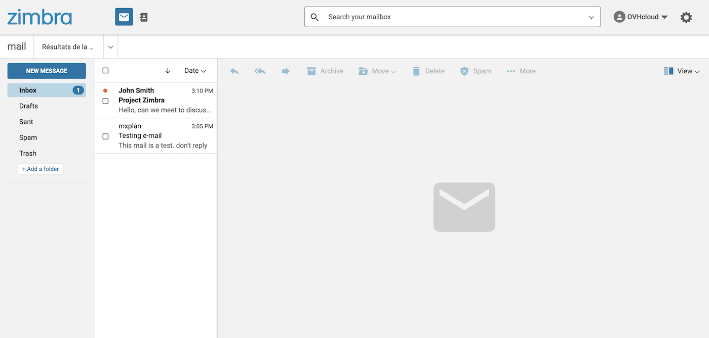

## Ziel

Sie haben gerade eine MX Plan E-Mail-Lösung erworben. Diese bietet Ihnen E-Mail-Accounts die mit Domainnamen verknüpft sind.

**Diese Anleitung erklärt, wie Sie einen E-Mail-Account mit Ihrem MX Plan erstellen.**

## Voraussetzungen

- Sie verfügen über ein MX Plan Angebot. Dieses ist verfügbar über:
    - Ein [Webhosting](/links/web/hosting).
    - Ein aktiviertes [Kostenloses Hosting 100M](/links/web/domains-free-hosting), inklusive mit einem Domainnamen.
    - Ein separat bestelltes MX Plan Angebot.
- Sie haben Zugriff auf Ihr [OVHcloud Kundencenter](/links/manager), Bereich `Web Cloud`{.action}.

> [!primary]
>
> **Sonderfälle**
>
> - Hinweis zu Kostenloses Hosting 100M: Es muss zuerst [aktiviert werden](/pages/web_cloud/web_hosting/activate_start10m), um einen E-Mail-Account zu erstellen. Sie können diese Operation über Ihr [OVHcloud Kundencenter](/links/manager) durchführen, indem Sie die betreffende Domain auswählen.
> - Bei einem Webhosting muss der [inkludierte MX Plan aktiviert werden](/links/web/hosting), bevor Sie die übrigen Schritte dieser Anleitung durchführen. Lesen Sie hierzu unsere Anleitung zur [Aktivierung der im Webhosting enthaltenen E-Mail-Accounts](/pages/web_cloud/web_hosting/activate-email-hosting).

## ## In der praktischen Anwendung 

1. Loggen Sie sich in Ihr [OVHcloud Kundencenter](/links/manager) ein.
1. Öffnen Sie den Bereich `Web Cloud`{.action}.
1. Klicken Sie auf `MX Plan`{.action}.
1. Wählen Sie die betreffende Domain aus.
1. **Fahren Sie mit der von Ihrem MX Plan Dienst verwendeten E-Mail Technologie fort**.

> [!primary]
>
> **E-Mail-Technologie Ihres MX Plan Angebots identifizieren.**
>
> Abhängig vom Aktivierungsdatum Ihres MX Plan Angebots oder einer kürzlich durchgeführten Migration kann die zugehörige E-Mail-Technologie variieren. Diese Version ist durch das Webmail-Interface gekennzeichnet. Um es zu identifizieren:
>
> - Gehen Sie in den Tab `Allgemeine Informationen`{.action} und beachten Sie die Technologie unter **Webmail** in der Randleiste `Abonnement`{.action} unter `Webmail`{.action}.
>
> {.thumbnail .w-400}

### OWA und Zimbra

In diesem Abschnitt werden MX Plan Angebote dokumentiert, die die Webmail-Technologie **OWA** und **Zimbra** verwenden.

#### Einen E-Mail-Account erstellen

Um einen neuen E-Mail-Account zu erstellen, gehen Sie in den Tab `E-Mail-Accounts`{.action}. Das angezeigte Fenster enthält bereits vorhandene E-Mail-Accounts sowie die Anzahl der Accounts, die Sie noch anlegen können. Klicken Sie auf den Button `Account hinzufügen`{.action}.

{.thumbnail .w-400}

Geben Sie im neu angezeigten Fenster die angeforderten Informationen ein.

- **E-Mail Account**: Im Textfeld ist bereits ein vorläufiger Name angegeben. Fügen Sie hier Ihre gewünschte E-Mail-Adresse ein (zum Beispiel vorname.name). Der Domainname der E-Mail-Adresse ist bereits in der Liste vorausgewählt.

> [!warning]
>
> Die Wahl des Namens Ihrer E-Mail-Adresse muss folgende Bedingungen erfüllen:
>
> - Mindestens 2 Zeichen
> - Maximal 32 Zeichen
> - Keine Zeichen mit Akzent
> - Keine Sonderzeichen außer `.`, `,`, `-` und `_`

- **Vorname**: Geben Sie einen Vornamen an.
- **Name**: Geben Sie einen Nachnamen an.
- **Anzeigename**: Geben Sie den Namen an, der als Absender angezeigt werden soll, wenn E-Mails mit dieser Adresse verschickt werden.
- **Passwort**: Wählen Sie ein Passwort und bestätigen Sie es. Aus Sicherheitsgründen empfehlen wir Ihnen, Passwörter nicht mehrfach zu verwenden, sondern ein neues auszuwählen, das keinerlei Zusammenhang mit Ihren persönlichen Angaben hat (beispielsweise Namen, Vornamen oder Ihr Geburtsdatum). Es wird empfohlen, das Passwort regelmäßig zu ändern.

> [!warning]
>
> Die Wahl des Passworts muss folgende Bedingungen erfüllen:
>
> - Mindestens 9 Zeichen
> - Maximal 30 Zeichen
> - Keine Zeichen mit Akzent

Wenn Sie die Felder ausgefüllt haben, klicken Sie auf den Button `Weiter`{.action}.

{.thumbnail .w-400}

Überprüfen Sie die in der Übersicht angezeigten Informationen. Sind alle Angaben korrekt, klicken Sie auf `Bestätigen`{.action}. Der neu hinzugefügte Account erscheint nun in der Tabelle. Warten Sie kurz ab, bis der Account verfügbar ist.

Führen Sie diesen Schritt so oft wie nötig durch (je nach Anzahl Ihrer Accounts).

#### E-Mails einsehen

Gehen Sie auf die [Webmail Loginseite](/links/web/email) und geben Sie die betreffende E-Mail-Adresse sowie das zugehörige Passwort ein. Klicken Sie anschließend auf den Button `Login`{.action}.

Wählen Sie den Tab für die E-Mail-Technologie Ihres MX Plan Angebots aus:

> [!tabs]
> **Zimbra**
>>
>> Wenn Sie im Zimbra Webmail eingeloggt sind, erhalten Sie das unten stehende Interface. Weitere Informationen zur Verwendung von Zimbra Webmail finden Sie in unserer Anleitung „[Zimbra Webmail verwenden](/pages/web_cloud/email_and_collaborative_solutions/mx_plan/email_zimbra)“.
>>
>> {.thumbnail .w-400}
>>
> **OWA**
>>
>> Beim ersten Login werden Sie aufgefordert, die Sprache sowie Ihre Zeitzone festzulegen. Daraufhin wird Ihr Postfach angezeigt. Um herauszufinden, wie Sie Ihre E-Mail-Adresse mit Outlook Web App (OWA) nutzen, lesen Sie unsere Anleitung zur [Verwendung von E-Mail-Accounts über Outlook Web App (OWA)](/pages/web_cloud/email_and_collaborative_solutions/using_the_outlook_web_app_webmail/email_owa).
>>
>> {.thumbnail .w-400}

Um Ihre E-Mails über ein E-Mail-Programm einzusehen, finden Sie die entsprechenden Informationen im Bereich "[E-Mail-Account von einem Client aus anzeigen](#configdevices)".

#### Einen E-Mail Account löschen

In der neuen MX Plan Version wird das Löschen eines Accounts als *Zurücksetzen des Accounts* bezeichnet.

> [!warning]
>
> Bevor Sie E-Mail-Accounts löschen, überprüfen Sie, dass diese nicht verwendet werden. Eine Sicherung dieser Accounts kann notwendig sein. Wenn nötig lesen Sie die Anleitung ["Ihre E-Mail-Adresse manuell migrieren"](/pages/web_cloud/email_and_collaborative_solutions/migrating/manual_email_migration), in der beschrieben wird, wie Sie Daten eines Accounts über Ihr Kundencenter oder ein E-Mail-Programm exportieren.

Klicken Sie im Tab `E-Mail-Accounts`{.action} auf den Button `...`{.action} rechts vom zu löschenden Account und danach auf `Diesen Account zurücksetzen`{.action}.

{.thumbnail .w-400}

### MX Plan Roundcube

Dieser Bereich ist MX Plan Angeboten gewidmet, die die Webmail-Technologie **Roundcube** verwenden.

#### Einen E-Mail Account erstellen

Um eine neue E-Mail-Adresse zu erstellen, gehen Sie in den Tab `E-Mails`{.action}. Die angezeigte Tabelle enthält alle E-Mail-Accounts, die im Rahmen Ihres MX Plan Angebots erstellt wurden. Klicken Sie nun auf den Button `Eine E-Mail-Adresse erstellen`{.action}.

{.thumbnail .w-400}

Geben Sie im angezeigten Fenster die angeforderten Informationen ein.

- **Name des Accounts**: Fügen Sie hier Ihre gewünschte E-Mail-Adresse ein (zum Beispiel vorname.name). Die betreffende Domain ist bereits standardmäßig angegeben.
- **Kontobeschreibung**: Geben Sie eine kurze Beschreibung ein, damit Sie diesen Account später von anderen Accounts in Ihrem OVHcloud Kundencenter unterscheiden können.
- **Account-Größe**: Wählen Sie die gewünschte Account-Größe aus. Hierbei handelt es sich um den Speicherplatz, den Ihr Account zum Speichern von Nachrichten nutzen kann. 
- **Passwort**: Wählen Sie ein Passwort und bestätigen Sie es. Aus Sicherheitsgründen empfehlen wir Ihnen, Passwörter nicht mehrfach zu verwenden, sondern ein neues auszuwählen, das keinerlei Zusammenhang mit Ihren persönlichen Angaben hat (beispielsweise Namen, Vornamen oder Ihr Geburtsdatum). Es wird empfohlen, das Passwort regelmäßig zu ändern.

Wenn Sie die Felder ausgefüllt haben, klicken Sie auf den Button `Weiter`{.action}. 

{.thumbnail .w-400}

Überprüfen Sie die in der Übersicht angezeigten Informationen. Sind alle Angaben korrekt, klicken Sie erneut auf `Weiter`{.action}. Klicken Sie zum Abschluss auf `Bestätigen`{.action}, um den E-Mail-Account zu erstellen. Warten Sie kurz ab, bis der Account verfügbar ist.

Führen Sie diesen Schritt so oft wie nötig durch (je nach Anzahl Ihrer Accounts).

#### E-Mails einsehen 

Gehen Sie auf die [Webmail Loginseite](/links/web/email) und geben Sie die betreffende E-Mail-Adresse sowie das zugehörige Passwort ein. Klicken Sie anschließend auf den Button `Login`{.action}.

Daraufhin wird Ihr Postfach angezeigt. Weitere Informationen finden Sie in unserer Anleitung zur [Verwendung Ihres E-Mail-Accounts mit RoundCube Webmail](/pages/web_cloud/email_and_collaborative_solutions/mx_plan/email_roundcube).

{.thumbnail .w-400}

Um Ihre E-Mails über ein E-Mail-Programm einzusehen, finden Sie die entsprechenden Informationen im Bereich "[E-Mail-Account von einem Client aus anzeigen](#configdevices)".

#### Einen E-Mail Account löschen

> [!warning]
>
> Bevor Sie E-Mail-Accounts löschen, überprüfen Sie, dass diese nicht verwendet werden. Eine Sicherung dieser Accounts kann notwendig sein. Wenn nötig lesen Sie die Anleitung [Ihre E-Mail-Adresse manuell migrieren](/pages/web_cloud/email_and_collaborative_solutions/migrating/manual_email_migration), in der beschrieben wird, wie Sie Daten eines Accounts über Ihr Kundencenter oder ein E-Mail-Programm exportieren.

Klicken Sie im Tab `E-Mail-Accounts`{.action} rechts neben dem zu löschenden Account auf `...`{.action} und dann auf `Account löschen`{.action}.

{.thumbnail .w-400}

### E-Mail-Account von einem Client aus anzeigen 

Sie können Ihre E-Mail-Accounts auf Ihrem gewünschten Gerät konfigurieren (z. B. einem Smartphone oder Tablet). Folgen Sie hierzu unseren Konfigurationsanleitungen:

> [!tabs]
> **Windows**
>>
>> - [Mail auf Windows 10](/pages/web_cloud/email_and_collaborative_solutions/mx_plan/how_to_configure_windows_10)
>> - [Outlook](/pages/web_cloud/email_and_collaborative_solutions/mx_plan/how_to_configure_outlook_2016)
>> - [Thunderbird](/pages/web_cloud/email_and_collaborative_solutions/mx_plan/how_to_configure_thunderbird_windows)
>>
> **Apple**
>>
>> - [macOS Mail](/pages/web_cloud/email_and_collaborative_solutions/mx_plan/how_to_configure_mail_macos)
>> - [Mail für iPhone oder iPad](/pages/web_cloud/email_and_collaborative_solutions/mx_plan/how_to_configure_ios)
>> - [Outlook Mac OS](/pages/web_cloud/email_and_collaborative_solutions/mx_plan/how_to_configure_outlook_2016_mac)
>> - [Thunderbird](/pages/web_cloud/email_and_collaborative_solutions/mx_plan/how_to_configure_thunderbird_mac)
>>
> **Android**
>>
>> - [Android](/pages/web_cloud/email_and_collaborative_solutions/mx_plan/how_to_configure_android)
>>
> **Andere**
>>
>> - [Interface Gmail](/pages/web_cloud/email_and_collaborative_solutions/mx_plan/how_to_configure_gmail)
>>

Wenn Sie nur die Informationen zur Konfiguration Ihres E-Mail-Accounts benötigen, verwenden Sie die folgenden Einstellungen:

#### Einstellungen für den IMAP- und POP-Empfang 

Für den Empfang von E-Mails empfehlen wir Ihnen bei der Auswahl des Kontotyps die Verwendung von **IMAP**. Sie können jedoch **POP** auswählen.

> [!warning]
>
> Geben Sie nur die passenden Werte für Ihren Standort ein (**EUROPA** oder **AMERIKA/ASIEN-PAZIFIK**).

Wählen Sie den Tab für Ihren Konfigurationstyp aus:

> [!tabs]
> **IMAP-Konfiguration**
>>
>> - **Benutzername**: Geben Sie die **vollständige** E-Mail-Adresse ein.
>> - **Passwort**: Geben Sie das Passwort des E-Mail-Accounts ein.
>> - **Server eingehend EUROPA**: imap.mail.ovh.net **oder** ssl0.ovh.net.
>> - **Server eingehend AMERIKA/ASIEN-PAZIFIK**: imap.mail.ovh.ca.
>> - **Port**: 993.
>> - **Sicherheitstyp**: SSL/TLS.
>>
> **POP-Konfiguration**
>>
>> - **Benutzername**: Geben Sie die **vollständige** E-Mail-Adresse ein.
>> - **Passwort**: Geben Sie das Passwort des E-Mail-Accounts ein.
>> - **Server eingehend EUROPA**: pop.mail.ovh.net **oder** ssl0.ovh.net.
>> - **Server eingehend AMERIKA/ASIEN-PAZIFIK**: pop.mail.ovh.ca.
>> - **Port**: 995.
>> - **Sicherheitstyp**: SSL/TLS.

#### Parameter für den SMTP-Versand 

Für den Versand von E-Mails verwenden Sie die folgenden **SMTP** Einstellungen:

**SMTP-Konfiguration**

- **Benutzername**: Geben Sie die **vollständige** E-Mail-Adresse ein.
- **Passwort**: Geben Sie das Passwort des E-Mail-Accounts ein.
- **Server ausgehend EUROPA**: smtp.mail.ovh.net **oder** ssl0.ovh.net.
- **Server ausgehend AMERIKA/ASIEN-PAZIFIK**: smtp.mail.ovh.ca.
- **Port**: 465.
- **Sicherheitstyp**: SSL/TLS.

### Anwendungsbeispiele

**Sie benötigen mehr E-Mail-Adressen?**

- Fragen in [unseren E-Mail FAQ](/pages/web_cloud/email_and_collaborative_solutions/mx_plan/faq-emails).
- Sehen Sie sich alle unsere E-Mail-Angebote [Zimbra](/links/web/emails-zimbra) oder [Exchange](/links/web/emails) an, um Ihr MX Plan Angebot für dieselbe Domain zu vervollständigen.

## Weiterführende Informationen 

[Roundcube Webmail verwenden](/pages/web_cloud/email_and_collaborative_solutions/mx_plan/email_roundcube)

[Zimbra Webmail verwenden](/pages/web_cloud/email_and_collaborative_solutions/mx_plan/email_zimbra)

[Outlook Web App (OWA) Webmail verwenden](/pages/web_cloud/email_and_collaborative_solutions/using_the_outlook_web_app_webmail/email_owa)

Kontaktieren Sie für spezialisierte Dienstleistungen (SEO, Web-Entwicklung etc.) die [OVHcloud Partner](/links/partner).

Wenn Sie Hilfe bei der Nutzung und Konfiguration Ihrer OVHcloud Lösungen benötigen, beachten Sie unsere [Support-Angebote](/links/support).

Treten Sie unserer [User Community](/links/community) bei.
