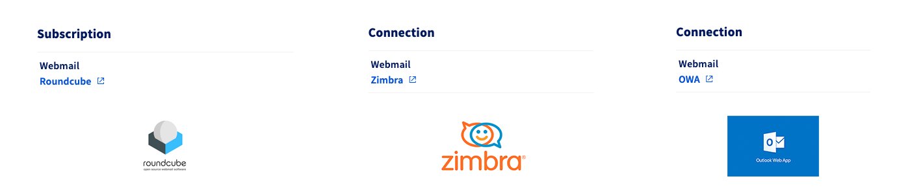
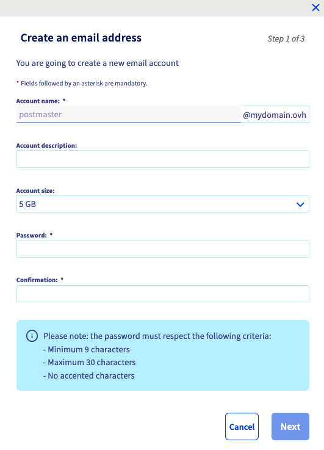
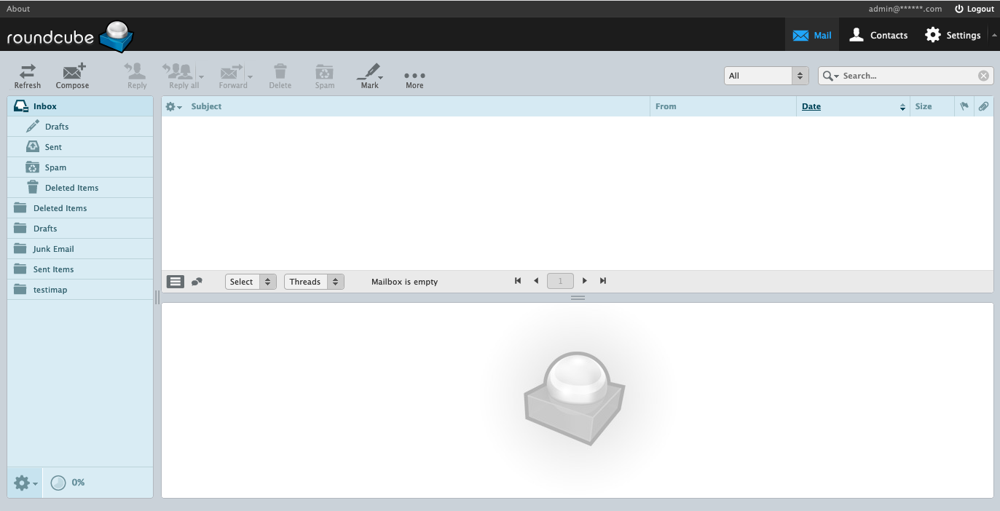
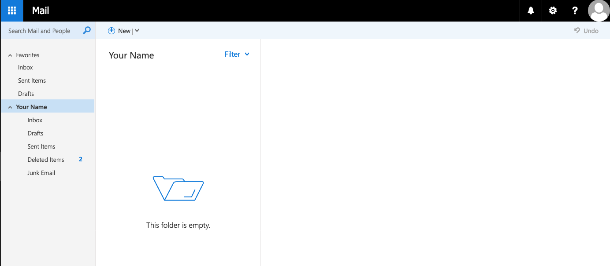

## Ziel

Mit der MX Plan Lösung verfügen Sie über E-Mail-Adressen, mit denen Sie Nachrichten von einem Gerät Ihrer Wahl aus versenden und empfangen können.

**Diese Anleitung erklärt, wie Sie Ihr MX Plan Angebot verwenden.**

## Voraussetzungen

- Sie verfügen über ein MX Plan Angebot, entweder in einem [OVHcloud Webhosting](/links/web/hosting) enthalten, separat bestellt, oder enthalten in [Kostenloses Hosting 100M](/links/web/domains-free-hosting).
- Sie haben Zugriff auf Ihr [OVHcloud Kundencenter](/links/manager).

## In der praktischen Anwendung 

1. Verbinden Sie sich mit Ihrem [OVHcloud Kundencenter](/links/manager).
1. Gehen Sie in den Bereich `Web Cloud`{.action}.
1. Klicken Sie auf `MX Plan`{.action}.
1. Wählen Sie die betreffende Domain aus.
1. **Fahren Sie mit der von Ihrem MX Plan Dienst verwendeten E-Mail Technologie fort.**

> [!primary]
>
> **E-Mail-Technologie Ihres MX Plan Angebots identifizieren.**
>
> Abhängig vom Aktivierungsdatum Ihres MX Plan Angebots oder einer kürzlich durchgeführten Migration kann die zugehörige E-Mail-Technologie variieren. Diese Version ist durch das Webmail-Interface gekennzeichnet.
>
> - Gehen Sie in den Tab `Allgemeine Informationen`{.action} und wählen Sie die Technologie aus, die unter **Webmail** in der Randleiste `Abonnement`{.action} oder `Webmail`{.action} verwendet wird.
>
>{.thumbnail .w-500}

**Inhalt**

- [E-Mail-Adresse erstellen](#create-email)
- [E-Mail-Adressen verwenden](#consult-emails)
    - [Webmail verwenden](#consult-emails-webmail)
    - [E-Mail-Client verwenden](#consult-emails-client)
       - [IMAP- und POP-Empfangseinstellungen](#imap-pop)
      - [SMTP-Sendeeinstellungen](#smtp)
- [Weiterleitungen und Alias](#redirection-alias)
- [automatische Antwort](#autoreply)

### Eine E-Mail-Adresse erstellen 

Um zu erfahren, wie Sie eine E-Mail-Adresse erstellen, klicken Sie auf den Tab für die von Ihrem MX Plan Dienst verwendete E-Mail-Technologie:

> [!tabs]
> **Roundcube**
>>
>> Gehen Sie zum Erstellen einer E-Mail-Adresse auf den Tab `E-Mails`{.action}. Das angezeigte Fenster listet die bereits erstellten Konten auf. Um einen neuen E-Mail-Account hinzuzufügen, klicken Sie auf `Einen Account hinzufügen`{.action}.
>>
>> {.thumbnail .w-500}
>>
>> Geben Sie im angezeigten Fenster die angeforderten Informationen ein:
>>
>> - **Kontoname**: Geben Sie Ihre neue E-Mail-Adresse ein (z.B. Vorname.Name). Der Domainname der E-Mail-Adresse ist bereits in der Liste vorausgewählt.
>> - **Account-Beschreibung**: Informationen zur E-Mail-Adresse, die nur in der Tabelle im Tab `E-Mails`{.action} Ihres E-Mail-Dienstes angezeigt werden.
>> - **Account-Größe**: Legen Sie die Größe fest, die Sie dem E-Mail-Account zuweisen möchten.
>> - **Passwort**: [Passwort festlegen](/pages/account_and_service_management/account_information/manage-ovh-password) und bestätigen Sie dieses. Aus Sicherheitsgründen empfehlen wir Ihnen, nicht zweimal das gleiche Passwort zu verwenden, sondern ein Passwort auszuwählen, das keinen Bezug zu Ihren persönlichen Daten hat (vermeiden Sie zum Beispiel Ihren Namen, Vornamen und Ihr Geburtsdatum) und dieses regelmäßig zu erneuern.
>>
>> Nachdem Sie die Felder ausgefüllt haben, klicken Sie auf `Weiter`{.action} und überprüfen Sie die Informationen in der Übersicht. Sind diese korrekt, klicken Sie auf `Bestätigen`{.action}. Führen Sie diesen Schritt so oft wie nötig aus, abhängig von der Anzahl der verfügbaren Accounts.
>>
>> {.thumbnail .w-500}
>>
> **Zimbra und OWA**
>>
>> Gehen Sie zum Erstellen einer E-Mail-Adresse auf den Tab `E-Mail-Accounts`{.action}. Das angezeigte Fenster listet die bereits verfügbaren Accounts sowie die Accounts auf, die Sie noch erstellen können. Um einen neuen E-Mail-Account hinzuzufügen, klicken Sie auf `Einen Account hinzufügen`{.action}.
>>
>> {.thumbnail .w-500}
>>
>> Geben Sie im angezeigten Fenster die angeforderten Informationen ein:
>>
>> - **E-Mail-Account**: Ein temporärer Name ist bereits im Textfeld eingegeben: Löschen Sie ihn und geben Sie Ihre neue E-Mail-Adresse an (z.B. Vorname.Name). Der Domainname der E-Mail-Adresse ist bereits in der Liste vorausgewählt.
>> - **Vorname**: Geben Sie einen Vornamen ein.
>> - **Name**: Geben Sie einen Namen ein.
>> - **Anzeigename**: Geben Sie den Namen an, der als Absender angezeigt werden soll, wenn E-Mails mit dieser Adresse gesendet werden.
>> - **Passwort**: [Passwort festlegen](/pages/account_and_service_management/account_information/manage-ovh-password) und bestätigen Sie dieses. Aus Sicherheitsgründen empfehlen wir Ihnen, nicht zweimal das gleiche Passwort zu verwenden, sondern ein Passwort auszuwählen, das keinen Bezug zu Ihren persönlichen Daten hat (vermeiden Sie zum Beispiel Ihren Namen, Vornamen und Ihr Geburtsdatum) und dieses regelmäßig zu erneuern.
>> - **Quota**: Legen Sie die Größe fest, die Sie dem E-Mail-Account zuweisen möchten.
>>
>> Nachdem Sie die Felder ausgefüllt haben, klicken Sie auf `Weiter`{.action} und überprüfen Sie die Informationen in der Übersicht. Sind diese korrekt, klicken Sie auf `Bestätigen`{.action}. Führen Sie diesen Schritt so oft wie nötig aus, abhängig von der Anzahl der verfügbaren Accounts.
>>
>> {.thumbnail .w-500}
>>

### E-Mail-Adressen verwenden 

Sobald Ihre E-Mail-Adressen angelegt sind, können Sie mit deren Verwendung beginnen. Hierzu haben Sie zwei Möglichkeiten: Webmail über einen Webbrowser oder einen E-Mail-Client verwenden.

### Webmail verwenden 

Gehen Sie auf die Seite „[Webmail Login](/links/web/email)“ und geben Sie die betreffende E-Mail-Adresse sowie das zugehörige Passwort ein. Klicken Sie dann auf den Button `Verbinden`{.action}.

Wählen Sie den Tab für die E-Mail-Technologie Ihres MX Plan Angebots aus:

> [!tabs]
> **Roundcube**
>>
>> Sie sollten ein Interface erhalten, das dem folgenden Bild ähnelt, mit dem Vermerk "Roundcube" oben links.  
>> Weitere Informationen zum Roundcube Interface und dessen Verwendung finden Sie in unserer Anleitung „[Roundcube Webmail-Adresse verwenden](/pages/web_cloud/email_and_collaborative_solutions/mx_plan/email_roundcube)“.
>>
>> {.thumbnail .w-500}
>>
> **Zimbra**
>>
>> Wie in der Abbildung unten wird ein Fenster mit dem Zusatz „Zimbra“ oben links angezeigt.  
>> Weitere Informationen zur Verwendung Ihrer E-Mail-Adresse mit Zimbra finden Sie in unserer Anleitung „[Zimbra Webmail verwenden](/pages/web_cloud/email_and_collaborative_solutions/mx_plan/email_zimbra)“.
>>
>> {.thumbnail .w-500}
>>
> **OWA**
>>
>> Bei der ersten Verbindung mit dem Webmail werden Sie aufgefordert, die Sprache des Interface sowie die Zeitzone festzulegen, in der Sie sich befinden. Daraufhin wird Ihr Posteingang angezeigt.
>>
>> Weitere Informationen zur Verwendung Ihrer E-Mail-Adresse mit OWA finden Sie in unserer Anleitung „[E-Mail-Adresse über Outlook Web App (OWA) verwenden](/pages/web_cloud/email_and_collaborative_solutions/using_the_outlook_web_app_webmail/email_owa)“.
>>
>> {.thumbnail .w-500}
>>

### Einen E-Mail-Client verwenden 

Sie können Ihren E-Mail-Account auf einem E-Mail-Client wie Outlook, Thunderbird, Mac Mail, etc. einrichten.

Je nach Gerätetyp finden Sie hier die Links zu den Konfigurationsanleitungen:

> [!tabs]
> **Windows-Computer**
>>
>> - [Outlook für Windows](/pages/web_cloud/email_and_collaborative_solutions/mx_plan/how_to_configure_outlook_2016)
>> - [Thunderbird für Windows](/pages/web_cloud/email_and_collaborative_solutions/mx_plan/how_to_configure_thunderbird_windows)
>> - [Mail for Windows](/pages/web_cloud/email_and_collaborative_solutions/mx_plan/how_to_configure_windows_10)
>>
> **Apple Mac Computer**
>>
>> - [Outlook für macOS](/pages/web_cloud/email_and_collaborative_solutions/mx_plan/how_to_configure_outlook_2016_mac)
>> - [Mail für macOS](/pages/web_cloud/email_and_collaborative_solutions/mx_plan/how_to_configure_mail_macos)
>> - [Thunderbird für macOS](/pages/web_cloud/email_and_collaborative_solutions/mx_plan/how_to_configure_thunderbird_mac)
>>
> **iPhone oder iPad**
>>
>> - [Mail für iPhone und iPad](/pages/web_cloud/email_and_collaborative_solutions/mx_plan/how_to_configure_ios)
>>
> **Android Smartphone oder Tablet**
>>
>> - [Google Mail für Android](/pages/web_cloud/email_and_collaborative_solutions/mx_plan/how_to_configure_android)
>>

Wenn Sie nur die notwendigen Informationen zur Konfiguration Ihrer E-Mail-Adresse benötigen, verwenden Sie die folgenden Einstellungen.

#### Einstellungen für den IMAP- und POP-Empfang 

Für den Empfang von E-Mails empfehlen wir Ihnen bei der Auswahl des Kontotyps die Verwendung von **IMAP**. Sie können jedoch **POP** auswählen.

> [!warning]
>
> Geben Sie nur die passenden Werte für Ihren Standort ein (**EUROPA** oder **AMERIKA/ASIEN-PAZIFIK**).

Wählen Sie den Tab für Ihren Konfigurationstyp aus:

> [!tabs]
> **IMAP-Konfiguration**
>>
>> - **Benutzername**: Geben Sie die **vollständige** E-Mail-Adresse ein.
>> - **Passwort**: Geben Sie das Passwort des E-Mail-Accounts ein.
>> - **Server eingehend EUROPA**: imap.mail.ovh.net **oder** ssl0.ovh.net.
>> - **Server eingehend AMERIKA/ASIEN-PAZIFIK**: imap.mail.ovh.ca.
>> - **Port**: 993.
>> - **Sicherheitstyp**: SSL/TLS.
>>
> **POP-Konfiguration**
>>
>> - **Benutzername**: Geben Sie die **vollständige** E-Mail-Adresse ein.
>> - **Passwort**: Geben Sie das Passwort des E-Mail-Accounts ein.
>> - **Server eingehend EUROPA**: pop.mail.ovh.net **oder** ssl0.ovh.net.
>> - **Server eingehend AMERIKA/ASIEN-PAZIFIK**: pop.mail.ovh.ca.
>> - **Port**: 995.
>> - **Sicherheitstyp**: SSL/TLS.

#### Parameter für den SMTP-Versand 

Für den Versand von E-Mails verwenden Sie die folgenden **SMTP** Einstellungen:

**SMTP-Konfiguration**

- **Benutzername**: Geben Sie die **vollständige** E-Mail-Adresse ein.
- **Passwort**: Geben Sie das Passwort des E-Mail-Accounts ein.
- **Server ausgehend EUROPA**: pop.mail.ovh.net **oder** ssl0.ovh.net.
- **Server ausgehend AMERIKA/ASIEN-PAZIFIK**: pop.mail.ovh.ca.
- **Port**: 465.
- **Sicherheitstyp**: SSL/TLS.

### Weiterleitungen und Alias 

Sie möchten Ihre E-Mails an einen anderen Empfänger weiterleiten, einen Alias erstellen oder systematisch eine andere E-Mail-Adresse kopieren?

Klicken Sie hierzu auf den Tab für Ihre E-Mail-Technologie:

> [!tabs]
> **RoundCube**
>>
>> Um eine Weiterleitung oder einen Alias hinzuzufügen, klicken Sie auf den Tab `E-Mails`{.action} Ihres MX Plan Dienstes und dann rechts auf `Weiterleitungsverwaltung`{.action}.  
>> Die Tabelle der bereits aktiven Weiterleitungen wird angezeigt. Rechts klicken Sie auf den Button `Weiterleitung hinzufügen`{.action}, um mit der Erstellung Ihrer Weiterleitung oder Ihres Alias zu beginnen.
>>
>> - `Von Adresse`: Geben Sie hier die E-Mail-Adresse ein, die Sie weiterleiten möchten. 
>> - `Zur Adresse`: Geben Sie hier die Zieladresse Ihrer Weiterleitung ein. Dies kann eine Ihrer OVHcloud E-Mail-Adressen oder eine externe E-Mail-Adresse sein. 
>> - `Wählen Sie einen Kopiermodus`: Legen Sie fest, ob Sie eine Kopie der empfangenen E-Mail an der Ziel-E-Mail-Adresse (`Von Adresse`) aufbewahren oder direkt an die Weiterleitungsadresse (`An Adresse`) ohne Kopie weiterleiten möchten.
>>
>> Die Verwendung der Weiterleitungen und Alias für Ihren MX Plan Dienst können Sie unserer vollständigen Anleitung entnehmen: „[E-Mail-Weiterleitungen verwenden](/pages/web_cloud/email_and_collaborative_solutions/common_email_features/feature_redirections)“.
>>
> **OWA und Zimbra**
>>
>> Wenn Sie sich auf einer **OWA** oder **Zimbra** Technologie befinden, gibt es zwei Möglichkeiten:
>>
>> 1. **Weiterleitung über Webmail erstellen**: Über Posteingangsregeln oder Filter. Diese Regeln, die beim Empfang einer E-Mail angewendet werden, erlauben es, eine E-Mail weiterzuleiten oder weiterzuleiten. Folgen Sie hierzu unserer Anleitung „[Posteingangsregeln über das OWA-Interface](/pages/web_cloud/email_and_collaborative_solutions/using_the_outlook_web_app_webmail/creating-inbox-rules-in-owa-mx-plan)“ oder unter „Filter“ unserer Anleitung „[Zimbra Webmail verwenden](/pages/web_cloud/email_and_collaborative_solutions/mx_plan/email_zimbra)“.
>>
>> 2. **Weiterleitung und Alias über Ihr OVHcloud Kundencenter erstellen**: Um eine Weiterleitung oder einen Alias hinzuzufügen, klicken Sie auf den Tab `Weiterleitungen`{.action}. Die Tabelle der bereits aktiven Weiterleitungen wird angezeigt. Rechts klicken Sie auf den Button `Weiterleitung hinzufügen`{.action}.
>>
>> - `Von Adresse`: Geben Sie hier die E-Mail-Adresse ein, die Sie weiterleiten möchten. 
>> - `Zur Adresse`: Geben Sie hier die Zieladresse Ihrer Weiterleitung ein. Dies kann eine Ihrer OVHcloud E-Mail-Adressen oder eine externe E-Mail-Adresse sein. 
>> - `Wählen Sie einen Kopiermodus`: Legen Sie fest, ob Sie eine Kopie der empfangenen E-Mail an der Ziel-E-Mail-Adresse (`Von Adresse`) aufbewahren oder direkt an die Weiterleitungsadresse (`An Adresse`) ohne Kopie weiterleiten möchten.
>>
>> Weitere Informationen zur Verwendung von Weiterleitungen und Alias für Ihren MX Plan Dienst finden Sie in unserer Anleitung: „[E-Mail-Weiterleitungen verwenden](/pages/web_cloud/email_and_collaborative_solutions/common_email_features/feature_redirections)“.

### Automatische Antwort 

Sie können für Abwesenheiten eine automatische Antwort einrichten, um anzuzeigen, dass Sie Ihre E-Mails nicht einsehen oder verarbeiten können.

Wählen Sie den Tab für die E-Mail-Technologie Ihres MX Plan Angebots aus:

> [!tabs]
> **RoundCube**
>>
>> Um eine automatische Antwort auf eine Ihrer E-Mail-Adressen hinzuzufügen, klicken Sie in Ihrem MX Plan Dienst auf `E-Mails`{.action} und dann rechts auf `Verwaltung der automatischen Antworten`{.action}.  
>> Die Tabelle der bereits aktiven Auto-Antworten wird angezeigt. Rechts klicken Sie auf den Button `Eine Auto-Antwort hinzufügen`{.action}, um Ihre Weiterleitung oder Ihren Alias zu erstellen.
>>
>> Weitere Informationen zur Einrichtung einer automatischen Antwort von Ihrem MX Plan Dienst aus in Ihrem OVHcloud Kundencenter finden Sie in unserer Anleitung „[MX Plan - Eine automatische Antwort auf eine E-Mail-Adresse erstellen](/pages/web_cloud/email_and_collaborative_solutions/mx_plan/feature_auto_responses)“.
>>
> **Zimbra**
>>
>> Die Einrichtung einer automatischen Antwort erfolgt direkt über die Verbindung mit der E-Mail-Adresse über das Webmail. Weitere Informationen finden Sie in unserer Anleitung „[Zimbra Webmail verwenden](/pages/web_cloud/email_and_collaborative_solutions/mx_plan/email_zimbra)“ unter „Automatische Antworten“.
>>
> **OWA**
>>
>> Die Einrichtung einer automatischen Antwort erfolgt direkt über die Verbindung mit der E-Mail-Adresse über das Webmail. Weitere Informationen finden Sie in unserer Anleitung „[E-Mail-Adresse über Outlook Web App (OWA) verwenden](/pages/web_cloud/email_and_collaborative_solutions/using_the_outlook_web_app_webmail/email_owa)“ unter „Automatische Antwort hinzufügen“.
>>

## Weiterführende Informationen 

[Roundcube Webmail verwenden](/pages/web_cloud/email_and_collaborative_solutions/mx_plan/email_roundcube)

[Zimbra Webmail verwenden](/pages/web_cloud/email_and_collaborative_solutions/mx_plan/email_zimbra)

[Outlook Web App (OWA) Webmail verwenden](/pages/web_cloud/email_and_collaborative_solutions/using_the_outlook_web_app_webmail/email_owa)

[E-Mail-Weiterleitungen verwenden](/pages/web_cloud/email_and_collaborative_solutions/common_email_features/feature_redirections)

[MX Plan - Automatische Antwort an einer E-Mail-Adresse erstellen](/pages/web_cloud/email_and_collaborative_solutions/mx_plan/feature_auto_responses)

[E-Mail-Weiterleitungen verwenden](/pages/web_cloud/email_and_collaborative_solutions/common_email_features/feature_redirections)

Kontaktieren Sie für spezialisierte Dienstleistungen (SEO, Web-Entwicklung etc.) die [OVHcloud Partner](/links/partner).

Wenn Sie Hilfe bei der Nutzung und Konfiguration Ihrer OVHcloud Lösungen benötigen, beachten Sie unsere [Support-Angebote](/links/support).

Treten Sie unserer [User Community](/links/community) bei.
