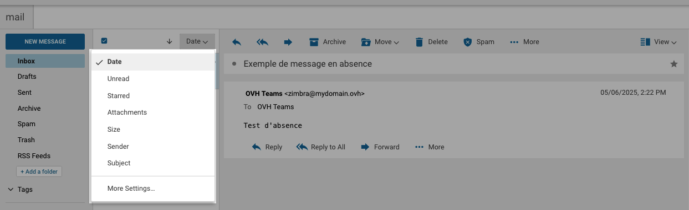
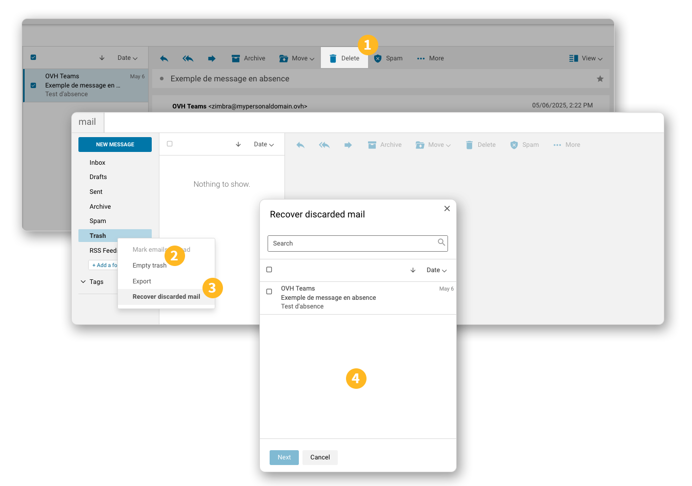
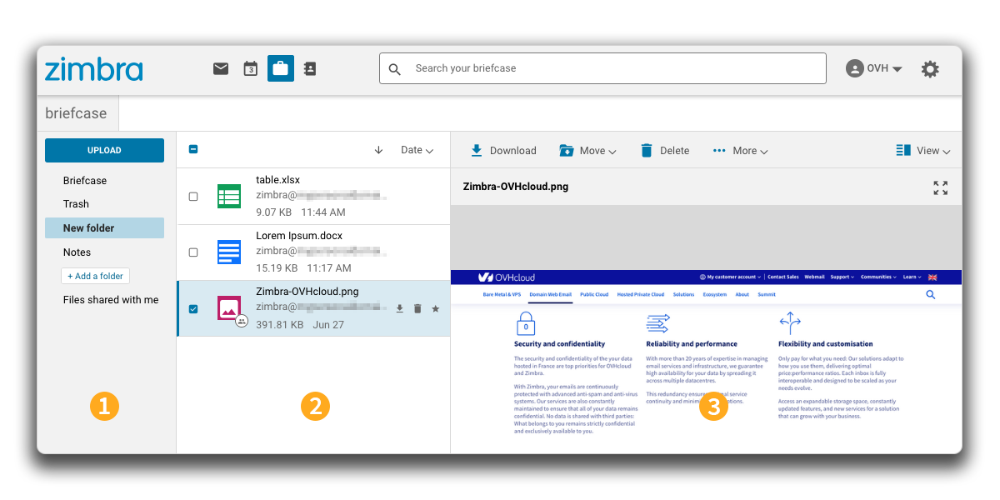
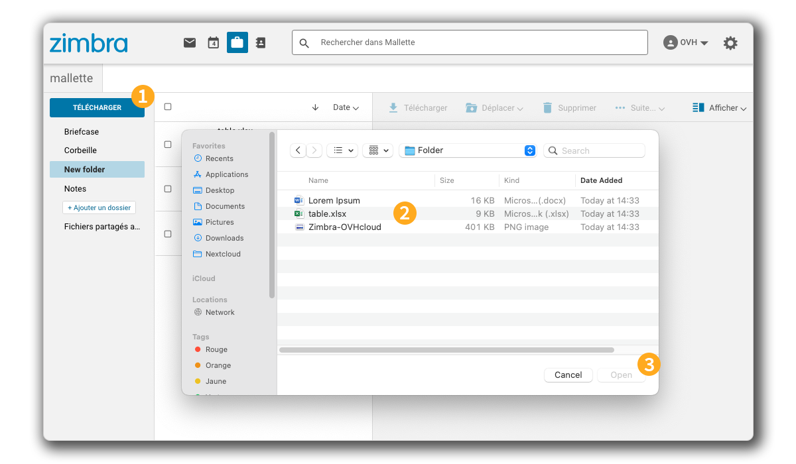
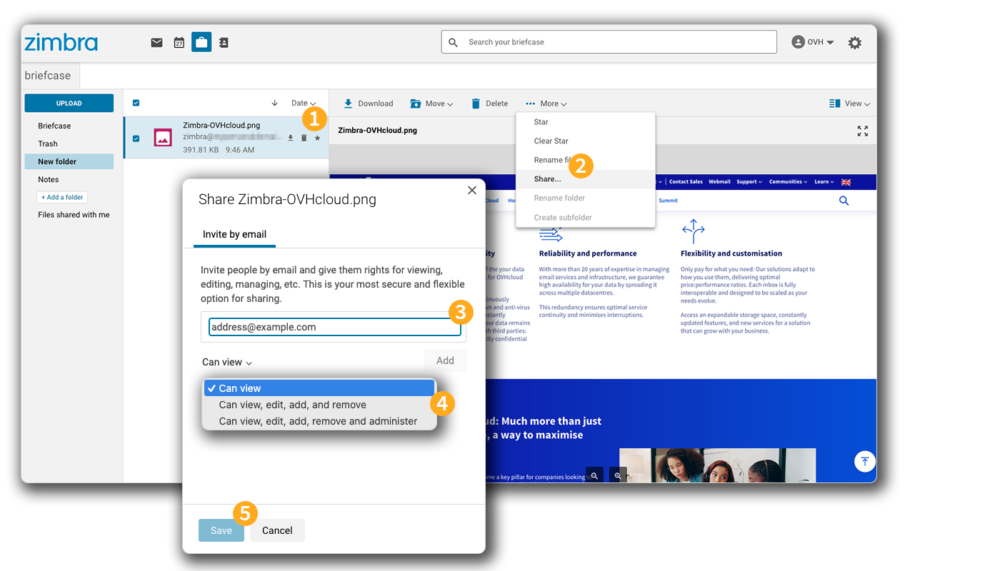
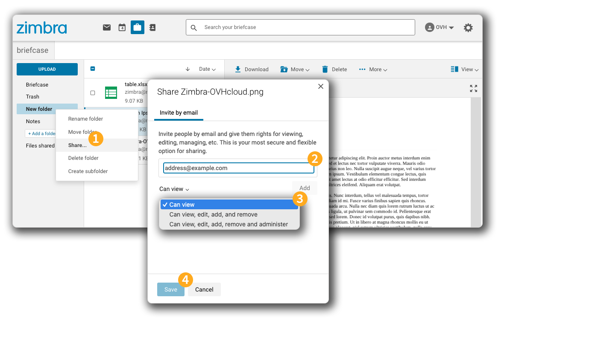
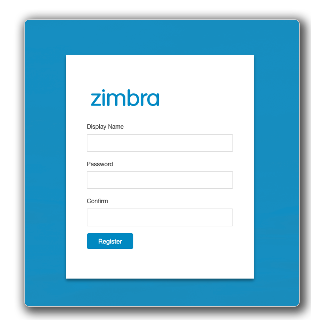
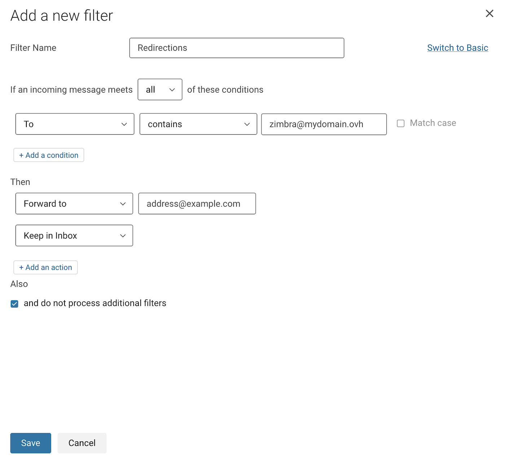

## Ziel

Mit dem MX Plan Angebot von OVHcloud können Sie E-Mails über einen E-Mail-Client (Thunderbird, Outlook, Mac Mail) oder per Webmail im Webbrowser Ihres Geräts versenden und empfangen. 
OVHcloud bietet den Webmail-Dienst Zimbra an, um auf MX Plan E-Mail-Accounts zuzugreifen. Auf dieser Seite werden die für die Verwendung dieses Webmailers erforderlichen Funktionen erläutert.

**Diese Anleitung erklärt, wie Sie Zimbra Webmail für Ihre OVHcloud MX Plan E-Mail-Accounts verwenden.**

## Voraussetzungen

- Sie verfügen über ein **MX Plan** Angebot, entweder in einem [OVHcloud Webhosting](/links/web/hosting) enthalten, separat bestellt, oder enthalten in [Kostenloses Hosting 100M](/links/web/domains-free-hosting).
- Sie verfügen über die Logindaten des MX Plan E-Mail-Accounts, den Sie verwenden möchten. Weitere Informationen finden Sie in unserer Anleitung "[Erste Schritte mit MX Plan](/pages/web_cloud/email_and_collaborative_solutions/mx_plan/email_generalities)".

## In der praktischen Anwendung

**Inhaltsübersicht**

- [In Zimbra Webmail einloggen](#login)
- [Allgemeines zum Webmail-Interface von Zimbra](#general-interface)
- [Verwaltung der Ordner Ihres E-Mail-Accounts](#folders-management)
    - [Spezialordner](#folders-specials)
    - [Ordner erstellen](#folders-creation)
 - [E-Mail-Verarbeitung](#email-management)
    - [Aktion für eine ausgewählte E-Mail](#email-action)
    - [E-Mail suchen](#email-search)
    - [Gelöschte E-Mails wiederherstellen](#restore)
- [E-Mail schreiben](#email-writing)
- [Einstellungen für das Zimbra-Interface konfigurieren](#settings)
- [Kontakte](#contacts)
    - [Ordnerverwaltung](#contacts-folders)
    - [Verwaltung von Listen](#contacts-lists)
    - [Kontakte importieren und exportieren](#import-export)
- [Kalender](#calendar)
    - [Kalenderverwaltung](#calendar-management)
    - [Aufgaben](#tasks)
- [Speicherplatz](#storage)
- [Filter](#filters)
    - [Grundlegendes zum Einrichten von Filtern](#filters-howto)
    - [Filter erstellen](#filters-creation)
    - [Eine Umleitung erstellen](#filters-redirection)
- [Delegationen](#delegations)
- [Signaturen](#signatures)
- [Automatische Antworten](#auto-reply)

### In Zimbra Webmail einloggen 

Gehen Sie auf die Seite [Webmail](/links/web/email). Geben Sie Ihre E-Mail-Adresse und das Passwort ein und klicken Sie dann auf `Anmelden`{.action}.

{.thumbnail .w-600}

Sie werden nun zum Zimbra-Interface weitergeleitet.

{.thumbnail .w-600}

### Allgemeines zum Webmail-Interface von Zimbra 

Wenn Sie in Ihrem E-Mail-Account eingeloggt sind, erscheint das Hauptfenster von Zimbra, das aus 3 Zonen besteht:

> [!tabs]
> **Menü oben**
>>
>> - **(1)** In diesem Bereich können Sie zwischen den beiden Funktionen `mail` und `kontakte` wechseln, die Standardansicht ist `mail`.
>> - **(2)** In der Suchleiste können Sie nach Nachrichten oder Kontakten suchen.
>> - **(3)** Das Menü zur Verwaltung des Profils Ihres E-Mail-Accounts und die Schaltfläche für den Zugriff auf die Einstellungen **(4)**.
>>
>> {.thumbnail .w-600}
>>
> **Linke Spalte**
>>
>> Die Struktur von E-Mail-Accounts oder Kontakten, bestehend aus Ordnern und Unterordnern. Der E-Mail-Hauptordner ist `Posteingang`.
>>
>> {.thumbnail .w-600}
>>
> **Mittleres Fenster**
>>
>> Ihre E-Mails oder Kontakte werden in diesem zweiteiligen Bereich angezeigt:
>>
>> - **(1)** Die Liste der Elemente
>> - **(2)** Der Inhalt des ausgewählten Elements
>>
>> {.thumbnail .w-600}
>>

### Verwaltung der Ordner Ihres E-Mail-Accounts (linke Spalte) 

In diesem Bereich werden die Ordner Ihres E-Mail-Account angezeigt. Sie finden die immer vorhandenen **Spezialordner** (orange) und die Ordner, die Sie selbst **erstellt** haben (grün).

{.thumbnail .w-600}

#### Spezialordner 

Spezialordner werden automatisch vom E-Mail-Server erstellt und bilden den Kern eines E-Mail-Accounts.

- **Empfang**: E-Mails werden standardmäßig in diesem Ordner abgelegt (mit Ausnahme der angewendeten Filter).
- **Entwürfe**: Verfasste, aber nicht gesendete E-Mails werden in diesem Ordner gespeichert.
- **Gesendet**: Gesendete E-Mails werden automatisch in diesem Ordner gespeichert.
- **Archive**: Standardordner zum Sortieren von verarbeiteten E-Mails.
- **Spam**: Ordner, in dem als Unerwünscht eingestufte E-Mails gespeichert werden.
- **Papierkorb**: Gelöschte E-Mails werden in diesem Ordner gespeichert, bevor sie endgültig gelöscht werden.

> [!primary]
>
> Ordner mit Sonderfunktion können nicht gelöscht werden.

#### Ordner erstellen 

Um Ihre E-Mails nach Ihren Bedürfnissen zu sortieren, können Sie Ihre eigenen Ordner erstellen.

Um einen neuen Ordner zu erstellen, klicken Sie unten in der Spalte auf die Schaltfläche `+ Einen Ordner hinzufügen`{.action}.

Sie können auch einen Unterordner erstellen, indem Sie mit der rechten Maustaste auf den gewünschten Ordner klicken und dann auf `Unterordner erstellen`{.action} klicken.

> [!primary]
>
> Die Ordner "Entwürfe", "Spam" und "Papierkorb" dürfen keine Unterordner enthalten.

### E-Mail-Verarbeitung 

Wenn Sie einen Ordner oder Unterordner in der linken Spalte auswählen, wird die Liste der darin enthaltenen E-Mails in der mittleren Spalte angezeigt. Klicken Sie dann auf die E-Mail Ihrer Wahl, um deren Inhalt im rechten Fenster anzuzeigen.

{.thumbnail .w-600}

> [!primary]
>
> **Darstellungstyp**
>
> Die Darstellung von E-Mails kann geändert werden. Klicken Sie hierzu rechts oben auf den Button `Anzeigen`{.action}.

Es ist möglich, E-Mails basierend auf bestimmten Kriterien zu sortieren und anzuzeigen, indem Sie auf den vorhandenen Filter (standardmäßig `Datum`{.action}) oben in der E-Mail-Liste klicken.

{.thumbnail .w-600}

#### Aktion für eine ausgewählte E-Mail 

Wenn Sie eine E-Mail auswählen, stehen Ihnen zahlreiche Aktionen zur Verfügung:

- 1.**Antworten**: Antwort an den Absender verfassen.
- 2.**Allen antworten**: Antwort an alle Empfänger in den Feldern "An" und "CC" verfassen.
- 3.**Weiterleiten**: Die ausgewählte E-Mail an einen oder mehrere Empfänger weiterleiten.
- 4.**Archivieren**: Die E-Mail in den Ordner "Archiv" Ihres E-Mail-Accounts verschieben.
- 5.**Verschieben**: Verschieben Sie die E-Mail in einen der Ordner des E-Mail-Accounts.
- 6.**Löschen**: Die ausgewählte E-Mail in den "Papierkorb" verschieben.
- 7.**SPAM**: Die ausgewählte E-Mail in den "Spam" verschieben.
- 8.**Mehr**
    - **Als gelesen markieren**
    - **Als ungelesen markieren**
    - **Markierung**: Weisen Sie Ihrer E-Mail einen "Stern" zu, um sie zu markieren und leichter zu identifizieren.
    - **Markierung löschen**: Entfernt den dieser E-Mail zugewiesenen "Stern".
    - **Original anzeigen**: Zeigt die E-Mail im Rohformat inklusive Header an.
    - **Neuer Filter**: Erstellt einen Filter basierend auf Absender und Betreff der ausgewählten Nachricht.
    - **Drucken**: Auswahl ausdrucken.
- 9.**Anzeigen**: Wählen Sie eines der 3 Layouts aus, um Ihre Ordner und E-Mails anzuzeigen.

{.thumbnail .w-600}

Sie können auf diese Optionen zugreifen, indem Sie auf eine E-Mail in der mittleren Spalte rechtsklicken.

> [!primary]
>
> Wenn eine E-Mail mit Lesebestätigung empfangen wurde, erhalten Sie die folgende Standardnachricht: `John hat eine Lesebestätigung für diese E-Mail angefordert. Lesebestätigung senden`.
>

#### E-Mail suchen 

Wenn Sie eine E-Mail suchen möchten, verwenden Sie die Suchleiste oben in Ihrem Interface. Sie können dann eine **einfache Suche** oder eine **erweiterte Suche** durchführen, wie in den folgenden Tabs beschrieben:

> [!tabs]
> **Einfache Suche**
>>
>> Geben Sie die Suchbegriffe in die Leiste ein, die Sie finden möchten, und drücken Sie `Enter`, um die Suche zu bestätigen. Die Wörter werden in den Suchergebnissen hervorgehoben.
>>
>> > Wenn Sie wissen, wo das gesuchte Element enthalten ist, können Sie Schlüsselwörter ( **from**, **to**, **cc**, **subject**, etc.) gefolgt von einem Doppelpunkt (`:`) eingeben. Wenn Sie beispielsweise schnell nach einem Absender suchen möchten, können Sie "from" gefolgt von der gesuchten E-Mail-Adresse eingeben. Beispiel: "from:address@example.com.
>>
>> {.thumbnail .w-600}
>>
> **Expertensuche**
>>
>> Für eine genauere Suche klicken Sie auf das Pfeilsymbol rechts in der Suchleiste. So können Sie Ihre Suche auf einen Ordner, eine Zeitspanne, den Betreff, den Nachrichtentext, etc. beschränken.
>>
>> {.thumbnail .w-600}
>>

#### Gelöschte E-Mails wiederherstellen 

Wenn Sie E-Mails löschen, werden diese standardmäßig in den Papierkorb verschoben. 
Wenn Sie E-Mails aus Ihrem Papierkorb löschen oder diesen leeren, werden sie in die Retention gelegt. Sie können sie innerhalb von 30 Tagen noch wiederherstellen.

Wir zeigen Ihnen, wie Sie eine E-Mail aus der Retention wiederherstellen, indem wir die Schritte ihrer Löschung und Wiederherstellung durchgehen:

1. **Löschen einer E-Mail**: Wenn Sie eine E-Mail in der Posteingang oder einem der Ordner öffnen und auf `löschen`{.action} klicken, wird diese standardmäßig in den Papierkorb verschoben.
2. **Papierkorb leeren**: Wenn Sie `Papierkorb leeren`{.action} klicken oder eine E-Mail aus dem Papierkorb löschen, wird die E-Mail nicht mehr im Papierkorb angezeigt und tritt in die 30-tägige Retention-Phase ein.
3. **Zugriff auf die Wiederherstellung**: Um eine E-Mail zu wiederherzustellen, die innerhalb von 30 Tagen aus dem Papierkorb gelöscht wurde, klicken Sie mit der rechten Maustaste auf `Papierkorb`{.action}, dann auf `Gelöschte E-Mails wiederherstellen`{.action}.
4. **E-Mails zur Wiederherstellung auswählen**: In diesem Fenster können Sie die E-Mails ansehen, die aus dem Papierkorb gelöscht wurden. Wählen Sie die E-Mail(s), die Sie wiederherstellen möchten. Klicken Sie auf `Weiter`{.action}, wählen Sie den Ordner aus, in den Sie die E-Mails wiederherstellen möchten, und klicken Sie dann auf `Speichern`{.action}.

{.thumbnail .w-600} 

### Eine E-Mail schreiben 

Um eine neue E-Mail zu verfassen, klicken Sie oben links im Zimbra-Fenster auf die Schaltfläche `Neue Mail`{.action} (1).

{.thumbnail .w-600}

> [!tabs]
> **Header**
>>
>> In der Kopfzeile können Sie folgende Felder ausfüllen:
>>
>>- **Von**: Adresse, von der aus Sie Ihre E-Mail senden. Standardmäßig ist dies Ihre primäre Account-Adresse. Sie können Ihre Absenderadresse ändern, indem Sie auf das Pfeilsymbol rechts neben Ihrer E-Mail-Adresse klicken. Dies ist jedoch nur möglich, wenn eine [Delegation](#delegations) eingerichtet wurde. 
>> - **An**: Empfänger Ihrer E-Mail. Klicken Sie auf `An`{.action}, um auf Ihre [Kontakte](#contacts) zuzugreifen und Ihre Empfänger auszuwählen. 
>> - **CC**: Klicken Sie auf `CC/BCC`{.action} rechts neben dem Feld `An`{.action}, um dieses Feld anzuzeigen. Über das Feld **CC** können Sie eine E-Mail-Kopie an weitere Empfänger senden, ohne dass diese als direkte Empfänger der E-Mail betrachtet werden (im Gegensatz zu den Empfängern im Feld "**An**"). 
>> - **CC**: Klicken Sie auf `CC/BCC`{.action} rechts neben dem Feld `An`{.action}, um dieses Feld anzuzeigen. Über das Feld **BCC** können Sie eine E-Mail-Kopie an weitere Empfänger senden, ohne dass andere Empfänger die Adressen in **BCC** sehen. 
>> - **Betreff**: Der Titel der E-Mail, der beim Empfang angezeigt wird, bevor die E-Mail geöffnet wird. 
>> - `...`{.action}: Rechts neben dem Feld `Von`{.action} befinden sich 3 Optionen: 
>>    - Sie können Ihre E-Mail als prioritär einstufen, indem Sie `Hohe Priorität` auswählen. 
>>    - Klicken Sie auf `Lesebestätigung anfordern`, um eine Lesebestätigung vom Empfänger anzufordern. 
>>    - Mit der Funktion `Nur Text` werden die HTML-Layoutfunktionen Ihrer E-Mail deaktiviert. 
>>
>> {.thumbnail .w-600}
>>
> **E-Mail-Text**
>>
>> Um den Text Ihrer E-Mail zu schreiben, können Sie die HTML-Symbolleiste am unteren Rand verwenden. So können Sie Ihre E-Mails direkt im Browser mit einem Seitenlayout verfassen. Außerdem öffnet sich mit der Schaltfläche `< >`{.action} (ganz rechts in der Symbolleiste) ein Fenster, in das Sie eine vordefinierte E-Mail aus einem externen Tool einfügen können.
>>
>> {.thumbnail .w-600}
>>

Nachdem Sie Ihre E-Mail verfasst haben, können Sie, bevor Sie auf `Senden`{.action} klicken, eine Datei anhängen, indem Sie auf das Klammersymbol neben der Schaltfläche `Senden`{.action} klicken.

{.thumbnail .w-600}

> [!success]
> **Mail zurückrufen**
> 
> Wenn Sie die Option `Mail zurückrufen` in den Zimbra-Einstellungen im Bereich "**Mail schreiben**" aktiviert haben, können Sie auf `RÛCKGÄNGIG`{.action} klicken, um den Versand abzubrechen.
> Diese Funktion bleibt ungefähr 5 Sekunden lang verfügbar.
>
> {.thumbnail .w-600}

### Einstellungen für das Zimbra-Interface konfigurieren 

Ihr Zimbra Interface verfügt über 2 Konfigurationsmenüs:

{.thumbnail .w-600}

- **(1) Profil**: Klicken Sie oben rechts auf den Namen Ihres E-Mail-Accounts. In diesem Menü finden Sie die Optionen "**Passwort ändern**", "**Profilbild ändern**" und können sich ausloggen, indem Sie auf "**Abmelden**" klicken.

- **(2) Einstellungen**: Über das Zahnrad oben rechts können die **Sprache** der Webmail-Oberfläche ändern und mit Klick auf "**Hilfe**" auf die offizielle Zimbra-Dokumentation (extern) zugreifen. Unter "**Einstellungen**" finden Sie die folgenden Konfigurationselemente:

> [!tabs]
> **Allgemeines**
>>
>> In diesem Tab finden Sie:
>>
>> - eine Fortschrittsleiste, die den belegten Speicherplatz auf Ihrem E-Mail-Konto anzeigt.
>> - die Möglichkeit, das Anzeigeformat für Datum und Uhrzeit Ihrer E-Mails festzulegen.
>>
> **Mail anzeigen**
>>
>> Hier finden Sie Anzeigeoptionen für folgende Elemente in Ihrem E-Mail-Account.
>>
>> - **Beim Anzeigen von Maillisten**: Mit diesen Optionen können Sie die Liste Ihrer E-Mails nach Konversationsgruppen organisieren und weitere Details in der Vorschau anzeigen.
>> - **Vorschaufenster**: Wählen Sie zwischen drei Layouts zur Anzeige von Ordner und E-Mails. Diese Option übernimmt die Einstellungen, die Sie beim Anzeigen von E-Mails auf der Schaltfläche `Anzeigen`{.action} treffen.
>> - **Engere Abstände verwenden**
>> - **Als gelesen markieren**: Sie können die Statusänderung beim Öffnen einer E-Mail zu "Gelesen" verzögern, oder geöffnete E-Mails als "Ungelesen" belassen.
>> - **Auf neue E-Mails überprüfen**: Legen Sie fest, wie oft empfangene E-Mails im Zimbra-Interface synchronisiert werden sollen.
>> - **Lesebestätigungen**: Legen Sie das Verhalten von Zimbra beim Öffnen einer E-Mail mit Lesebestätigung fest.
>> - **Neue Mail-Benachrichtigungen**: Aktivieren Sie Benachrichtigungen, wenn eine Mail empfangen wird.
>> - **Bilder in Mails anzeigen**: Beim Öffnen einer E-Mail Bilder automatisch anzeigen oder nicht.
>> - **Mails als Nur-Text anzeigen**: Mit dieser Option wird die E-Mail im Nur-Text-Format ohne Seitenlayout angezeigt.
>> - **Bilder standardmäßig in Mails von diesen vertrauenswürdigen Adressen oder Domains anzeigen**: Legen Sie vertrauenswürdigen E-Mail-Adressen fest, für die Bilder beim Öffnen angezeigt werden.
>>
> **Mail schreiben**
>>
>> - **Mail zurückrufen**: Zeigt ca. 5 Sekunden lang ein Banner an, mit dem der Versand einer E-Mail abgebrochen werden kann.
>> - **Lesebestätigungen anfordern**: Diese Option sendet eine Lesebestätigungsanforderung an Ihre Empfänger, wenn Sie E-Mails senden.
>> - **Eine Kopie im Ordner "Gesendet" speichern**: Diese Option ist aktiviert, um gesendete E-Mails im Ordner "Gesendet" Ihres E-Mail-Accounts zu speichern.
>> - **Stellvertreter**: Erfahren Sie mehr zur Verwendung dieser Funktion im Abschnitt [Delegationen](#delegations) in dieser Anleitung.
>> - **Sendeeinstellungen übertragen**: Informationen zur Verwendung von Delegierung finden Sie unter [Delegationen](#delegations) in dieser Anleitung.
>> - **Verfasser**: Sie können Ihre Standardformatierung für neue Mails festlegen.
>>
> **Signaturen**
>>
>> In diesem Bereich können Sie Ihre Signaturen erstellen. 
>>
>> - **Standard-Signatur**: Geben Sie die Signatur ein, die beim Verfassen einer neuen E-Mail eingefügt wird.
>> - **Signatur beantworten oder weiterleiten**: Ermöglicht das Hinzufügen einer abweichenden Signatur, wenn Sie eine E-Mail beantworten oder weiterleiten.
>>
> **Außer Haus**
>>
>> Dieser Bereich verwaltet die Funktion "Auto-Antwort". Informationen zur Konfiguration Ihrer automatischen Antworten finden Sie im Abschnitt "[Automatische Antworten](#auto-reply)" in dieser Anleitung.
>>
> **Filter**
>>
>> Informationen zum Konfigurieren der Filter finden Sie im Abschnitt "[Filter](#filters)" in dieser Anleitung.
>>
> **Kalender und Erinnerungen**
>>
>> Hier finden Sie die Einstellungen für Ihre [Kalender](#calendar).
>>
>> **Allgemeine Kalendereinstellungen**
>>
>> - **Standardkalender**: Legen Sie den Standardkalender fest, der beim Erstellen eines neuen Ereignisses in Ihren Kalendern verwendet wird.
>> - **Wochenanfang**: Der Tag, der im Kalenderraster zuerst angezeigt wird.
>> - **Arbeitsbeginn**: Die Uhrzeit, die am oberen Rand der angezeigten Amplitude angezeigt wird.
>> - **Arbeitsende**: Die Stunde, die am unteren Rand der angezeigten Amplitude angezeigt wird.
>> - **Zeitzone Arbeitstag** die für Kalender verwendet wird.
>> - **Beim Erstellen oder Bearbeiten von Ereignissen**: Zeitzonen für Start- und Endzeit anzeigen.
>> - **Freigaben**: `Delegierung für CALDav Clients aktivieren`. Mit dieser Option können Sie Ihre Kalender mit Software verwalten, die das CALdav-Protokoll unterstützt.
>> - **Abgelehnte Ereignisse**: Ein Ereignis im Kalender anzeigen, auch wenn es abgelehnt wurde.
>>
>> **Ereigniserinnerungen**
>>
>> - **E-Mail-Erinnerungen senden an**: Erinnerungen an Ereignisse an eine E-Mail-Adresse senden.
>> - **Browser-Benachrichtigungen anzeigen**: Von Ihrem Webbrowser über Ihre Ereignisse benachrichtigt werden.
>> - **Standarderinnerung**: Die standardmäßige Erinnerungszeit, die bei Aktivierung für ein Ereignis verwendet wird.
>> - **Erinnerungen für überfällige Ereignisse anzeigen**: Senden von Erinnerungen nach Ereignissen fortsetzen.
>>
>> **Berechtigung für Frei-/Gebucht-Ansicht**
>>
>> - **Berechtigung für**: Diese Einstellung gilt nur für den Verfügbarkeitsstatus, der mit den Kalendern Ihrer E-Mail-Adresse verknüpft ist. Das bedeutet, dass Sie Ihren Status "Beschäftigt" oder "Verfügbar" mit anderen E-Mail-Adressen teilen können.

### Kontakte 

Klicken Sie in der oberen Leiste auf `Kontakte`, um das Kontaktverzeichnis aufzurufen. Die Anzeige ist in **drei Teile** unterteilt:

- **(1) Ordner** (links): Im Kontaktverzeichnis können Sie Ordner zum Sortieren und Gruppieren von Kontakten erstellen.
- **(2) Kontaktliste** (Mitte): Zeigen Sie die Kontakte im Kontaktverzeichnis oder im ausgewählten Ordner an.
- **(3) Kontakteigenschaften** oder **Neuer Kontakt** (rechts): Dieses Fenster wird angezeigt, wenn ein Kontakt ausgewählt oder erstellt wird. Hier können Sie die Informationen eines Kontakts einsehen oder bearbeiten.

{.thumbnail .w-600}

Um einen neuen Kontakt zu erstellen, klicken Sie oben in der linken Spalte auf die Schaltfläche `Neuer Kontakt`{.action}.

Tragen Sie die Kontakt-Daten in die Felder ein. Sie können ein Bild hinzufügen, indem Sie auf das Profilsymbol oben rechts im Formular klicken.

Klicken Sie dann auf `Speichern`{.action}.

{.thumbnail .w-600}

#### Verwaltung der Kontaktordner 

Wie bei E-Mails werden vom E-Mail-Server automatisch spezielle Kontaktordner angelegt.

- **Kontakte**: Die Kontakte werden standardmäßig in diesem Ordner gespeichert.
- **Papierkorb**: Gelöschte Kontakte werden in diesen Ordner verschoben, bevor sie endgültig gelöscht werden.
- **Mail-Kontakte**: Adressen, mit denen Sie Kontakt hatten, werden in diesem Ordner abgelegt.

Sie können Ordner und Unterordner erstellen und Kontakte damit unterteilen. So können Sie einen Kontakt leichter in einem selbst erstellten Ordner finden als im gesamten Kontaktverzeichnis.

Um einen neuen Ordner zu erstellen, klicken Sie unten in der linken Spalte auf die Schaltfläche `+ Einen Ordner hinzufûgen`{.action}.

Sie können auch einen Unterordner erstellen, indem Sie mit der rechten Maustaste auf den gewünschten Ordner klicken und dann `Unterordner erstellen`{.action} wählen. Die Ordner "Mail-Kontakte" und "Papierkorb" erlauben nicht die Erstellung von Unterordnern.

Um einen Kontakt in einen der Ordner zu verschieben, wählen Sie ihn in der mittleren Spalte aus und klicken dann im Kontaktfenster auf die Schaltfläche `Verschieben`{.action}. Wählen Sie nun den Ordner aus, den Sie dem Kontakt zuweisen möchten.

{.thumbnail .w-600}

> [!primary]
>
> Wenn Sie einen Kontakt aus einem ausgewählten Ordner erstellen, wird der Kontakt automatisch diesem Ordner hinzugefügt.

#### Verwaltung von Listen 

Sie können einen Kontakt einer oder mehreren Listen zuordnen. Mithilfe von Listen können Sie Kontakte gruppieren, um das Senden von E-Mails an alle diese Kontakte zugleich zu erleichtern. Wenn Sie beispielsweise eine E-Mail an eine große Anzahl regelmäßiger Empfänger senden möchten, müssen Sie nur den Namen Ihrer Liste als Empfänger hinzufügen, anstatt die Kontakte einzeln hinzuzufügen.

Um eine Liste zu erstellen, klicken Sie in das Feld `Neue Liste` unten in der linken Spalte und geben einen Namen für die Liste ein.

Um einen Kontakt einer Ihrer Listen zuzuweisen, wählen Sie ihn in der mittleren Spalte aus und klicken dann auf `Zu Listen zuweisen`{.action}. Markieren Sie die Listen, die Sie dem Kontakt zuweisen möchten. Sie können auch einen Namen für eine neue Liste eingeben und auf `Hinzufügen`{.action} klicken.

{.thumbnail .w-600}

#### Kontakte importieren und exportieren 

Wählen Sie unter den folgenden Tabs aus:

> [!tabs]
> **Kontakte importieren**
>>
>> Klicken Sie im Fenster `Kontakte` mit der rechten Maustaste auf den gewünschten Kontakteordner, mit Ausnahme der Ordner "E-Mail-Kontakte" und "Papierkorb", die das Importieren und Exportieren von Kontakten nicht zulassen. 
>>
>> Klicken Sie anschließend auf `Importieren`{.action}, um das Importfenster zu öffnen. Mit dem Button `Browse...` können Sie eine Datei mit Ihren Kontakten im Format *.csv* oder *.vcf* öffnen.   
>> {.thumbnail .w-600}
>>
> **Kontakte exportieren**
>>
>> Klicken Sie im Fenster `Kontakte` mit der rechten Maustaste auf den gewünschten Kontakteordner, mit Ausnahme der Ordner "E-Mail-Kontakte" und "Papierkorb", die das Importieren und Exportieren von Kontakten nicht zulassen.
>>
>> Klicken Sie dann auf `Exportieren`{.action}, um das Exportfenster zu öffnen. Wählen Sie den Dateityp aus, den Sie exportieren möchten, und klicken Sie dann auf `Exportieren`{.action}.  
>> {.thumbnail .w-600}
>>

### Kalender 

Klicken Sie auf das Symbol `Kalender`, in der oberen Leiste, um das Kontaktbuch aufzurufen. Es ist in **3 Teile** unterteilt:

- **(1) Kalenderliste** (links): Verwalten der verschiedenen Kalender und Unterkalender.
- **(2) Kalenderinhalt** (Mitte): Zeigt den Inhalt der ausgewählten Kalender und Unterkalender an.
- **(3) Aufgabenliste** (rechts): Verwalten der Aufgaben und Aufgabenlisten.

{.thumbnail .w-600}

#### Kalenderverwaltung 

In der Liste `Meine Kalender` wird standardmäßig ein `Kalender` erstellt. Dieser Standardkalender kann nicht gelöscht werden, aber Sie werden im nächsten Absatz erfahren wie Sie eigene Kalender erstellen können.

##### 1 - Kalender erstellen 

- **(1)**: Um einen Kalender zu erstellen, bewegen Sie Ihren Mauszeiger in der linken Spalte auf `Meine Kalender` und klicken Sie auf die Schaltfläche `+`. Wählen Sie einen Namen und eine Farbe aus und klicken Sie auf `Speichern`{.action}.

Sie können auch Unterkalender erstellen.

- **(2)**: Um einen Unterkalender zu erstellen, bewegen Sie den Mauszeiger über den Kalender, für den Sie einen Unterkalender erstellen möchten. Klicken Sie dann mit der rechten Maustaste, um das Dropdownmenü anzuzeigen. Klicken Sie auf `Unterkalender hinzufügen`. Wählen Sie einen Namen und eine Farbe aus und klicken Sie auf `Speichern`{.action}.

{.thumbnail .w-600}

#### 2 - Ereignis hinzufügen 

- **(1)**: Klicken Sie in der oberen linken Ecke auf `Neues Ereignis`{.action}.
- **(2)**: Klicken Sie auf den Zeitraum in Ihrem Kalender, in dem Sie ein Ereignis hinzufügen möchten. Um das Hinzufügen zu vereinfachen, geben Sie einfach einen Titel für die Veranstaltung und einen Ort an und klicken Sie dann auf `Speichern`{.action}. Um weitere Details zu Ihrem Event hinzuzufügen, klicken Sie auf `Weitere Details hinzufügen`{.action}.

{.thumbnail .w-600}

- **Beginn**: Datum und Uhrzeit des Starts Ihres Events. Wenn Sie `Ganztägig` ankreuzen, müssen Sie keine Start- und Endzeit eingeben, da der gesamte Tag berücksichtigt wird.
- **Ende**: Datum und Uhrzeit des Endes Ihres Events.
- **Wiederholung**: Wenn es sich um ein wiederkehrendes Ereignis handelt, legen Sie die Häufigkeit fest.
- **Veranstaltungsort**: Der Veranstaltungsort, z.B. der Name eines Konferenzraums.
- **Equipment**: Wenn Sie auf `Ausrüstung zeigen`{.action} klicken, wird diese Zeile angezeigt, um ein gemeinsam genutztes Equipment zu definieren, das Sie für Ihr Event verwenden werden.
- **Gäste**: Die E-Mail-Adressen der Veranstaltungsteilnehmer.
- **Anmerkungen**: Die Nachricht wird an die Teilnehmer der Veranstaltung weitergeleitet.
- **Erinnerung**: Vor Beginn des Events benachrichtigt werden.
- **Anzeigen als**: Legen Sie fest, ob das Ereignis seine Gäste während der Veranstaltung verfügbar oder nicht verfügbar macht.
- **Kalender**: Legen Sie fest, welchem Kalender das Ereignis zugeordnet ist.

Wenn Sie Ihr Event definiert haben, klicken Sie auf `Speichern`{.action}.

{.thumbnail .w-600}

##### 3 - Ereignis bearbeiten 

### Aufgaben 

Aufgaben sind Elemente, die nicht mit Kalendern verknüpft sind. Ziel ist es, Aufgaben aufzulisten, ohne ein Ausführungs- oder Zeitintervall für diese Aufgaben festzulegen. Diese Aufgaben ergänzen Kalender.

Die Aufgabenliste ist standardmäßig vorhanden und kann nicht gelöscht werden. Sie können jedoch eigene Aufgabenlisten erstellen.

- **(1)**: Um eine neue Aufgabe zu erstellen, klicken Sie auf den Button `...`{.action} und dann auf `Neue Aufgabe`{.action} oder einfach auf den Button `+`{.action} neben Ihrer Aufgabenliste.

- **(2)**: Um eine neue Aufgabenliste zu erstellen, klicken Sie auf den Button `...`{.action} und dann auf `Liste erstellen`{.action}.

{.thumbnail .w-600}

Wenn Sie eine Aufgabe erstellen, können Sie ein Fälligkeitsdatum und eine Priorität festlegen, um die Aufgaben nach Wichtigkeit zu ordnen, und im Dropdown-Menü die entsprechende Aufgabenliste auswählen.

Klicken Sie dann auf `Speichern`{.action}, um die Erstellung Ihrer Aufgabe abzuschließen.

{.thumbnail .w-600}

### Storage / Speicherplatz 

> [!success]
>
> Die Speicherplatzfunktion "Aktentasche" ist nur mit der Zimbra Pro Lösung verfügbar.

> [!warning]
>
> Die Zimbra Pro-Lösung ist derzeit in der Beta-Version verfügbar. Einige Funktionen werden noch verbessert.

Klicken Sie auf das `Aktentasche`{.action} Symbol in der oberen Leiste, um auf Ihren Speicherplatz zuzugreifen. Sie können Ihre Dateien hochladen und dort freigeben.

1. In der linken Spalte sehen Sie die Ordner für Ihren Speicherplatz.

    - Um einen neuen Ordner zu erstellen, klicken Sie auf `+ Einen Ordner hinzufügen`{.action} am Ende der Spalte. Geben Sie den gewünschten Namen ein und bestätigen Sie ihn mit der `Enter`{.action} Taste.
    - Um einen Unterordner zu erstellen, klicken Sie mit der rechten Maustaste auf einen der Ordner und danach auf `Unterordner erstellen`{.action}. Geben Sie den gewünschten Namen ein und bestätigen Sie ihn mit `Enter`{.action}.

2. In der mittleren Spalte wird eine Liste der Dateien im ausgewählten Ordner angezeigt.

3. Im rechten Fenster wird abhängig vom in der mittleren Spalte ausgewählten Dateityp eine Vorschau des Inhalts angezeigt. In der oberen Leiste der Vorschau werden die möglichen Aktionen für die ausgewählten Dateien angezeigt.

{.thumbnail .w-600}

#### Hinzufügen einer Datei

So fügen Sie eine Datei zu Ihrem Speicherplatz hinzu:

1. Klicken Sie in der linken Spalte auf `Hochladen`{.action}.
2. Wählen Sie im Fenster "Dateisuche" die Dateien, die in Ihren Speicherplatz hochgeladen werden sollen.
3. Klicken Sie auf `Öffnen`{.action}, um Dateien in Ihren Speicherplatz hochzuladen.

{.thumbnail .w-600}

#### Freigeben von Dateien und Ordnern

Die Freigabe ermöglicht es Ihnen, Dritten außerhalb Ihres Zimbra Accounts Zugriff auf einen Ordner oder eine Datei in Ihrem Speicher zu gewähren.

> [!warning]
>
> Freigabe für Ordner- und Dateiverwaltung ist nur mit einem Zimbra Pro Account möglich.

> [!tabs]
> **Datei freigeben**
>>
>> 1. Wählen Sie die freizugebende Datei aus und klicken Sie auf `...Mehr`{.action}.
>> 2. Klicken Sie auf `Freigeben`{.action}.
>> 3. Geben Sie die E-Mail-Adresse des Gastes ein und klicken Sie dann auf `Hinzufügen`{.action}. Sie können mehrere E-Mail-Adressen hinzufügen.
>> 4. Wählen Sie die Berechtigungen aus, die Sie dem Gast zuweisen möchten.
>> 5. Klicken Sie auf `Speichern`{.action}, um die Freigabe abzuschließen.
>>
>> {.thumbnail .w-600}
>>
> **Ordner freigeben**
>>
>> 1. Klicken Sie mit der rechten Maustaste auf den Ordner, den Sie freigeben möchten, und klicken Sie dann auf `Freigeben`{.action}.
>> 2. Geben Sie die E-Mail-Adresse des Gastes ein und klicken Sie dann auf `Hinzufügen`{.action}. Sie können mehrere E-Mail-Adressen hinzufügen.
>> 3. Wählen Sie die Berechtigungen aus, die Sie dem Gast zuweisen möchten.
>> 4. Klicken Sie auf `Speichern`{.action}, um die Freigabe abzuschließen.
>>
>> {.thumbnail .w-600}
>>

Der Gast erhält eine E-Mail, in der er aufgefordert wird, einen Zimbra Account mit Benutzername und Passwort zu erstellen. Dieses Konto ermöglicht den Zugriff auf eine Zimbra Oberfläche, die auf den gemeinsam genutzten Inhalt beschränkt ist.

{.thumbnail .w-600}

### Filter 

#### Grundlegendes zum Einrichten von Filtern 

Das Einrichten von Filtern in Ihrem E-Mail-Account ist eine wichtige Einstellung, die es Ihnen erlaubt, eine automatische Sortierung beim Empfang Ihrer E-Mails einzurichten.

Eine Filterregel in Zimbra besteht aus 4 Elementen:

1 – [Vergleichsfeld](#filters-comp-field): Auf welchen Teil der E-Mail der Filter angewendet wird. 
2 – [Vergleichsoperator](#filters-comp-operator): Mit welcher Präzision soll der Filter angewendet werden. 
3 – [Wert](#filters-value): Welche Wörter/Elemente in der E-Mail werden vom Filter angesprochen. 
4 – [Filteraktionen](#filters-action): Wie der Filter mit der E-Mail umgehen soll. 

{.thumbnail .w-600}

> Beispiel: Wenn das Feld **Betreff (1)** in der E-Mail das Wort `invoice` **(3)** **enthält (2)**, dann **weiterleiten an (4)** die Adresse `billing@example.com`.

In den folgenden Abschnitten finden Sie Details zu den Elementen einer Filterregel.

##### 1 - Vergleichsfeld 

Das Vergleichsfeld gibt den Abschnitt der E-Mail an, der auf den Vergleichsoperator überprüft werden soll. Die Vergleichsfelder können die folgenden Felder enthalten:

- **Von**: Einen Absender im Feld "Von" der E-Mail.
- **An**: Nach Empfängernamen im Feld "An" suchen.
- **CC**: Im Feld "CC" nach Empfängernamen suchen.
- **Betreff**: Elemente im Betreff der E-Mail.
- **Header-Name**: Wenn diese Option ausgewählt ist, wird vor dem Vergleichsoperator ein zusätzliches Eingabefeld angezeigt. In dieses Feld können Sie einen beliebigen Eintrag im E-Mail-Header eingeben. Sie können die Standardfelder "Von", "An", "Betreff" oder andere Felder angeben, die im E-Mail-Header vorhanden sein können. Beispielsweise können E-Mail-Server Felder in der Kopfzeile hinzufügen, die Sie mithilfe dieses Vergleichsfelds in Ihre Filterregel integrieren können.
- **Inhalt**: Bezeichnet Wörter, die im Textkörper der E-Mail enthalten oder nicht enthalten sind.

##### 2 - Vergleichsoperator 

Anhand des zuvor festgelegten Vergleichsfelds bestimmt der Vergleichsoperator die für den Wert anzuwendende Übereinstimmungsebene.

> [!primary]
>
> Welche Vergleichsoperatoren verfügbar sind, hängt vom ausgewählten Vergleichsfeld ab.

- **Entspricht genau / Entspricht nicht genau**: Was Sie eingeben, muss genau übereinstimmen. 
    *Wenn Sie beispielsweise angeben*, dass der Betreff der E-Mail "house" ist, wird nur "house" und nicht "houses" oder "a blue house" zugeordnet.

- **Enthält / Enthält nicht**: Was Sie eingeben, muss in den Feldern vorhanden sein. 
    *Wenn Sie beispielsweise angeben*, dass der Betreff der E-Mail "house" enthalten soll, wird die Übereinstimmung mit "house", "houses" und auch "a blue house" erfolgen.

- **Entspricht der Platzhalter-Bedingung / Entspricht nicht der Platzhalter-Bedingung**: Gibt an, dass das Thema mit der angegebenen Zeichenfolge übereinstimmen muss, die Platzhalterzeichen enthält.

- **Vorhanden / ist nicht vorhanden**: Gibt an, dass das angegebene Vergleichsfeld in der Nachricht vorhanden oder nicht vorhanden sein muss. Dieser Vergleichsoperator wird mit den Vergleichsfeldern "Header-Name" verwendet.

> **Platzhalter in Filtern verwenden**
>
> Platzhalterzeichen (*Wildcards*) können im Eingabefeld eingegebn werden, wobei der Vergleichsoperator "**Entspricht der Platzhalter-Bedingung / Entspricht nicht der Platzhalter-Bedingung**" verwendet wird. Die verfügbaren Wildcards sind `*` und `?`.
>
> - Ein `*` steht für eine beliebige Anzahl von Zeichen eines beliebigen Typs, einschließlich Leerzeichen.   Die Suchzeichenfolge "blue\*house" entspräche also unter anderem "blue house", "houses" oder "blue wooden house", aber nicht "lightning blue house".    Die Suchzeichenfolge "w\*house" ergäbe die Übereinstimmungen "white house", "watch TV in your house", etc., aber nicht "watch TV in your house with a friend".
>
> - Ein `?` steht für genau ein Zeichen.  Die Suchzeichenfolge "blue?house" ergäbe z.B. die Übereinstimmungen "blue house", "blue-house" und "blue_house".
>

##### 3 - Wert 

Nachdem Sie das Feld und den Vergleichsoperator ausgewählt haben, geben Sie den Wert zur Übereinstimmung in das Feld ein.

##### 4 - Filteraktionen 

Das Feld `Dann` legt fest, welche Aktion für die E-Mail ausgeführt werden soll, die die Filterbedingungen erfüllt. Filteraktionen können Löschen, Sortieren oder Markieren eingehender E-Mails sein.

- **Im Posteingang aufbewahren**: Speichert E-Mails in Ihrem Posteingang. Wenn keine der Filterregeln mit einer E-Mail-Nachricht übereinstimmt, wird diese Aktion standardmäßig ausgeführt.
- **In Ordner verschieben**: Verschiebt die E-Mail in den angegebenen Ordner.
- **Endgültig löschen**: Löscht die E-Mail, ohne sie in den Papierkorb zu verschieben.
- **Weiterleiten an**: Leitet die E-Mail an die angegebene Adresse weiter.
- **Als gelesen markieren**
- **Markierung**: Markiert die E-Mail mit einem Stern.

#### Filter erstellen 

Um auf die Erstellung von Filtern zuzugreifen, klicken Sie auf das Zahnrad oben rechts in Zimbra, dann auf `Einstellungen`{.action} und schließlich auf `Filter`{.action} in der linken Spalte.

{.thumbnail .w-600}

Wenn Filter vorhanden sind, entspricht deren Anwendungsreihenfolge der Listenanordnung:

- **(1)** Sie können eine Vorschau der einzelnen Filter anzeigen, indem Sie rechts neben dem Filter auf den Button `...`{.action} und dann auf `Details`{.action} klicken. Mit dem Button `Anwenden`{.action} wird der Filter aktiv.

- **(2)** Mit dieser Funktion kann ein Filter in der Liste verschoben werden, um seine Anwendungsreihenfolge zu ändern. Filter werden in der Reihenfolge angewendet, die anhand der Liste definiert ist.

Klicken Sie auf den Button `+ Filter hinzufügen`{.action}, um die Erstellung zu starten. Das Fenster für den einfachen Modus wird standardmäßig angezeigt. Sie können auf `Wechseln zu "Erweitert"`{.action} klicken, um alle Vergleichsoperatoren anzuzeigen. Weitere Informationen finden Sie im Abschnitt "[Grundlegendes zum Einrichten von Filtern](#filters-howto)".

> [!tabs]
> **Einfacher Modus**
>>
>> {.thumbnail .w-600}
>>
> **Fortgeschrittener Modus**
>>
>> {.thumbnail .w-600}
>>

#### Erstellen einer Weiterleitung 

Es ist möglich, einen Filter zu verwenden, um eingehende E-Mails an eine andere Adresse weiterzuleiten, über eine Weiterleitungsregel.

> [!primary]
>
> In unserem folgenden Beispiel haben wir entschieden, alle eingehenden E-Mails an eine andere E-Mail-Adresse weiterzuleiten. Um das Beispiel in den Screenshots zu verstehen, sind wir mit der Adresse **zimbra@mydomain.ovh** angemeldet und möchten die E-Mails dieses Kontos an die Adresse **address@example.com** weiterleiten.
>

Um auf die Filter zuzugreifen und Ihre Weiterleitung zu erstellen, folgen Sie den folgenden Anweisungen:

- Klicken Sie auf die Schaltfläche `⚙`{.action} in der oberen rechten Ecke Ihres Webmail-Fensters.
- Klicken Sie auf `Einstellungen`{.action}.
- Klicken Sie im Einstellungsfenster auf den Abschnitt `Filter`{.action}.
- Klicken Sie auf die Schaltfläche `Filter hinzufügen`{.action}.
    - Klicken Sie zunächst auf <u>Erweiterten Modus</u> in der oberen rechten Ecke, um diese Regel einzurichten.
    - Geben Sie Ihrem Filter einen Namen im Feld `Filtername`.
    - Lassen Sie das Dropdown-Menü auf `alle` in der Phrase „Wenn eine eingehende Nachricht ... dieser Bedingungen erfüllt“ stehen.
    - In der nächsten Zeile wählen Sie `An`{.action} (To), lassen Sie `enthält`{.action} (contains), und geben Sie die E-Mail-Adresse ein, mit der Sie angemeldet sind, in das Feld rechts daneben.
    - Unter der Bezeichnung „Dann“ (Then) wählen Sie `An weiterleiten` (Forward to) im Dropdown-Menü und geben Sie die Ziel-E-Mail-Adresse ein.
    - Klicken Sie auf `+ Aktion hinzufügen`{.action} (Add an action) weiter unten, dann wählen Sie `Im Posteingang behalten` (Keep in Inbox).
    - Klicken Sie auf `Speichern`{.action} im Filterfenster und auch im Einstellungsfenster.

{.thumbnail .w-600}

### Delegationen 

Um auf die Delegationseinstellungen zuzugreifen, klicken Sie auf das Zahnrad oben rechts in Zimbra, dann auf `Einstellungen`{.action} und schließlich auf `Mail schreiben`{.action} in der linken Spalte.

Sie können den Zugang zu Ihrem E-Mail-Accounts einem anderen E-Mail-Account übertragen, aber nur wenn dieser zum selben E-Mail-Dienst gehört.

> [!primary]
>
> Ein E-Mail-Account eines anderen E-Mail-Diensts, der den selben Domainnamen verwendet, kann nicht delegiert werden.

{.thumbnail .w-600}

**(1) Delegation**. Um Ihren E-Mail-Account an einen anderen Account zu delegieren, klicken Sie auf `Stellvertreter hinzufügen`{.action}.

- **Senden als**: Der delegierte Account kann eine E-Mail mit Ihrer E-Mail-Adresse verschicken, als hätten Sie selbst gesendet. Der Empfänger kann die E-Mail-Adresse des Delegationsaccounts nicht sehen.
- **Senden im Auftrag von**: Der delegierte Account kann eine E-Mail mit ihrer E-Mail-Adresse und dem Vermerk "im Auftrag von" senden. Der Empfänger sieht beide am Mailverkehr beteiligten E-Mail-Adressen.

**(2) Sendeeinstellungen übertragen**: Sie haben die folgenden Optionen zur Delegation Ihres E-Mail-Accounts.

- **Gesendete Mails im meinem Ordner "Gesendet" speichern**: Wenn der delegierte Account eine E-Mail von Ihrer E-Mail-Adresse aus versendet, wird diese E-Mail in Ihrem "Gesendet"-Ordner abgelegt.
- **Gesendete Mails im Ordner "Gesendet" des Stellvetreters speichern**: Wenn der delegierte Account eine E-Mail von Ihrer E-Mail-Adresse aus versendet, wird diese E-Mail im Ordner "Gesendet" des Delegationsaccounts abgelegt.
- **Gesendete Mails in meinem Ordner "Gesendet" und im Ordner "Gesendet" des Stellvertreters speichern**: Wenn der delegierte Account eine E-Mail über Ihre E-Mail-Adresse sendet, wird diese E-Mail in Ihrem "Gesendet"-Ordner sowie im Ordner "Gesendet" des Delegationsaccounts abgelegt.
- **Gesendete Nachrichten nicht speichern**: Wenn der delegierte Account eine E-Mail von Ihrer E-Mail-Adresse aus versendet, wird keine Kopie erstellt.

### Signatur 

Klicken Sie auf das Zahnrad oben rechts in Ihrem Zimbra-Interface, dann auf `Einstellungen`{.action} und schließlich auf `Signaturen`{.action} in der linken Spalte.

Die Konfigurationsdetails finden Sie im Abschnitt "[Einstellungen für das Zimbra-Interface konfigurieren](#settings)" in dieser Anleitung (klicken Sie auf den Eintrag **Signaturen**).

### Automatische Antworten 

Wenn Sie abwesend ohne Zugriff auf Ihren E-Mail-Account sind, können Sie eine Abwesenheitsnachricht einrichten, die automatisch beim Eingang von Mails versendet wird. Im Zimbra Webmail heißt diese Funktion "Außer Haus".

Um auf die Konfiguration des Auto-Responders zuzugreifen, klicken Sie auf das Zahnrad oben rechts in Ihrem Interface, dann auf `Einstellungen`{.action} und schließlich auf `Außer Haus`{.action}.

`Automatische Antworten aktivieren während dieser Zeiten (bis einschließlich)`. Wenn diese Option angehakt ist, sind die automatischen Antworten aktiviert. Geben Sie den Inhalt Ihrer Abwesenheitsnotiz in das Feld ein.

- Wenn Sie nicht sicher sind, wann Sie die automatischen Antworten aufheben möchten, aktivieren Sie die Option `Kein Enddatum`.
- Der Button `Beispieltext an mich senden`{.action} sendet eine Vorschau dieser automatischen Antwort an Ihren Posteingang.
- `Externe Absender`: Sie können eine alternative Nachricht für Senderadressen außerhalb Ihres Domainnamens und/oder Kontaktverzeichnisses festlegen. Standardmäßig wird auf alle Mails mit derselben Nachricht geantwortet.

## Weiterführende Informationen 

[Erste Schritte mit MX Plan](/pages/web_cloud/email_and_collaborative_solutions/mx_plan/email_generalities)

[Passwort einer MX Plan E-Mail-Adresse ändern](/pages/web_cloud/email_and_collaborative_solutions/mx_plan/email_change_password)

[Filter für Ihre E-Mail-Adressen erstellen](/pages/web_cloud/email_and_collaborative_solutions/mx_plan/feature_filters)

[E-Mail-Weiterleitungen verwenden](/pages/web_cloud/email_and_collaborative_solutions/common_email_features/feature_redirections)

Treten Sie unserer [User Community](/links/community) bei.