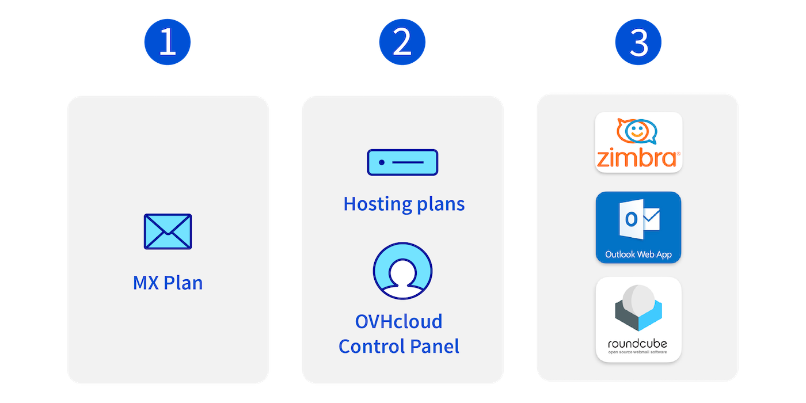
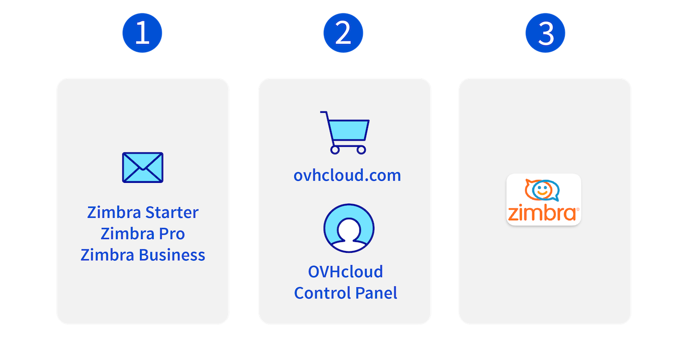
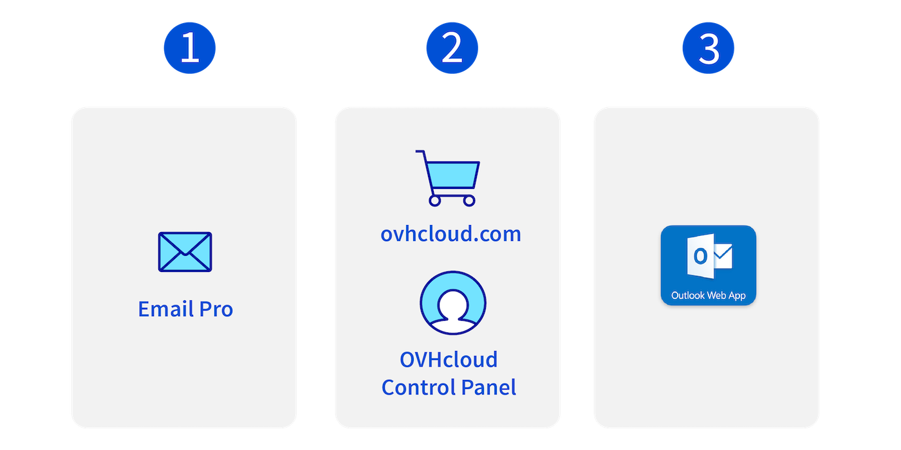
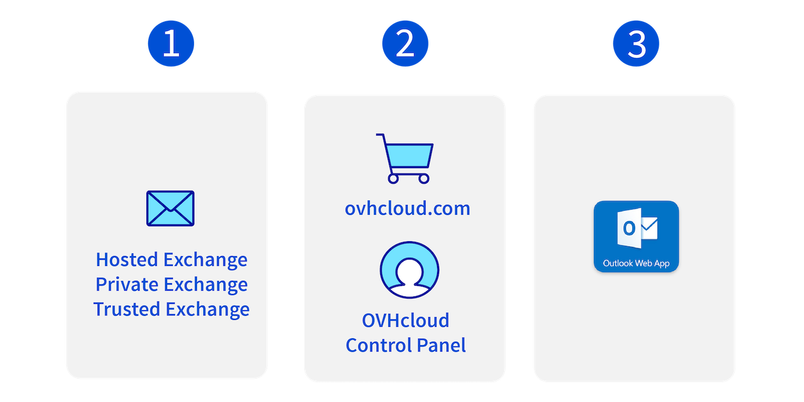
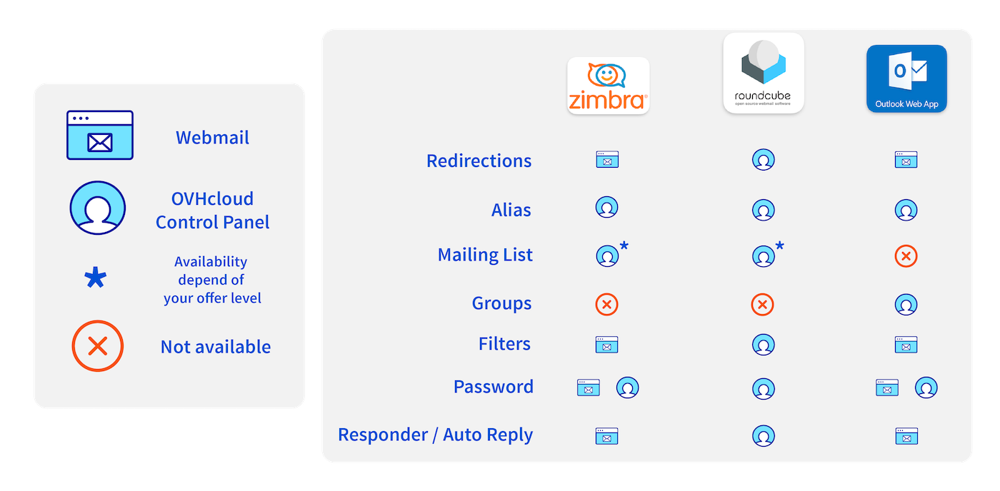

## FAQ e-mail

Na tej stronie znajdziesz najczęściej zadawane pytania dotyczące używania e-maili w zależności od ofert e-mail OVHcloud.

## Oferty e-mail w OVHcloud

OVHcloud oferuje aktualnie 4 oferty e-mail. Poznaj ich funkcje, przechodząc przez poniższe zakładki:

> [!tabs]
> **E-maile / MX Plan**
>>
>> {.thumbnail .w-500}
>>
>> 1. Najstarsza oferta e-mail od OVHcloud, zawierająca kluczowe funkcje usługi e-mail z przestrzenią dyskową 5 GB na konto e-mail.
>> 2. Zawarty w ofercie hostingu www i może być zamówiony za pośrednictwem [Panelu klienta OVHcloud](/links/manager).
>> 3. Ta oferta jest dostępna dla 3 różnych technologii poczty elektronicznej. **Roundcube**, **OWA** (Outlook Web Access) i **Zimbra**.
>>
> **Zimbra Mail**
>>
>> {.thumbnail .w-500}
>>
>> 1. Najnowsza oferta e-mail od OVHcloud, elastyczna i skalowalna usługa e-mail, dostępna na trzech poziomach ofert i funkcji.
>> 2. Możesz zamówić konto Zimbra w panelu klienta [OVHcloud](/links/manager) lub bezpośrednio w [ovhcloud.com](/links/web/email).
>> 3. Interfejs **Zimbra** jest obsługiwany przez aplikację.
>>
> **E-maile Pro**
>>
>> {.thumbnail .w-500}
>>
>> 1. Oferta e-mail oparta na technologii Exchange, oferująca podstawowe funkcje z przestrzenią dyskową 10 GB.
>> 2. Możesz zamówić konto E-mail Pro w Panelu klienta [OVHcloud](/links/manager) lub bezpośrednio w [ovhcloud.com](/links/web/email).
>> 3. W tej ofercie zastosowano interfejs webmail **OWA** (Outlook Web Access).
>>
> **Exchange**
>>
>> {.thumbnail .w-500}
>>
>> 1. Kompletna oferta e-mail z funkcjami do pracy zespołowej 50 GB lub 300 GB przestrzeni dyskowej.
>> 2. Zawarty w ofercie hostingu www i może być zamówiony za pośrednictwem [Panelu klienta OVHcloud](/links/manager).
>> 3. W tej ofercie zastosowano interfejs webmail **OWA** (Outlook Web Access).
>>

> [!success]
>
> Jeśli nie określono inaczej, odpowiedzi na poniższe pytania dotyczą wszystkich ofert e-mail OVHcloud.

/// details | Czym różnią się technologie e-mail wykorzystywane w ofertach **MX Plan**?

Oferta MX Plan wyróżnia się rozwojem, który opiera się na trzech odrębnych technologiach poczty elektronicznej. Każdy z nich posiada własny interfejs webmail:

- **Roundcube**.
- **OWA** (Outlook Web Access).
- **Zimbra**.

Ta różnorodność technologii wymaga odmiennej ergonomii pracy dla każdego interfejsu. Niektóre funkcjonalności można skonfigurować w Panelu klienta, podczas gdy inne konfigurują się za pośrednictwem interfejsu webmail.

Poniżej znajduje się tabela podsumowująca najważniejsze funkcje poczty elektronicznej, posortowane według technologii i lokalizacji konfiguracji:

{.thumbnail .w-500}

///

/// details | Jak sprawdzić technologię używaną w ofercie **MX Plan**?

Technologia poczty elektronicznej używana w usłudze MX Plan jest scharakteryzowana przez interfejs jej interfejsu webmail. Aby ją zidentyfikować w Panelu klienta:

1. Zaloguj się do [Panelu klienta OVHcloud](/links/manager).
1. Przejdź do sekcji `Web Cloud`{.action}.
1. Kliknij opcję `MX Plan`{.action}.
1. Wybierz odpowiednią domenę.
1. Wybierz domyślnie w zakładce `Informacje ogólne`{.action}.
1. Sprawdź technologię używaną pod napisem **Webmail**.

{.thumbnail .w-500}

///

/// details | Co należy wiedzieć przed utworzeniem konta e-mail?

Utworzenie adresu e-mail nie jest skomplikowane, ale należy przestrzegać pewnych zasad definiowania **nazwy adresu e-mail** i **hasła**.

**Nazwa Twojego konta e-mail** musi spełniać następujące wymagania:

- Minimum 2 znaki.
- Maksymalnie 32 znaki.
- Brak znaków akcentowanych.
- Brak znaków specjalnych z wyjątkiem następujących znaków: `.`, `,`, `-` i `_`.

**hasło** musi spełniać następujące wymagania:

- Minimum 9 znaków.
- Maksymalnie 30 znaków.
- Brak znaków akcentowanych.

> [!warning]
>
> Ze względów bezpieczeństwa nie używaj dwa razy tego samego hasła. Wybierz takie, które nie ma żadnego związku z Twoimi danymi osobowymi (np. unikaj podawania imienia, nazwiska i daty urodzenia). Zmieniaj ustawienia regularnie.

///

/// details | Co zrobić, jeśli nie otrzymuję e-maili?

Poniżej znajdziesz główne przyczyny braku otrzymywania e-maili.

1. **Program pocztowy**: Problem z odbieraniem wiadomości e-mail jest często związany z konfiguracją konta e-mail w programie pocztowym (Outlook, Mail na macOS, Thunderbird, etc.). Aby to sprawdzić, zaloguj się do [webmail](/links/web/email). Jeśli zauważysz e-maile w skrzynce odbiorczej interfejsu webmail, które nie znajdują się w programie pocztowym, rzeczywiście jest to spowodowane konfiguracją oprogramowania. Więcej informacji na ten temat można znaleźć na naszej stronie „[Wysyłka lub odbiór emaili jest niemożliwy](/pages/web_cloud/email_and_collaborative_solutions/troubleshooting/diagnostic_advanced)“.
1. **Konfiguracja DNS**: Twoja usługa e-mail jest przypisana do nazwy domeny. Rekordy MX w strefie DNS odnoszą się do serwerów poczty elektronicznej. Jeśli ostatnio zmodyfikowałeś serwery DNS lub strefę DNS, te rekordy MX mogły zostać „odłączone“. Może to spowodować przerwę w otrzymywaniu e-maili.Więcej informacji na ten temat znajdziesz na naszej stronie „[Wysyłka lub odbieranie e-maili niemożliwe](/pages/web_cloud/email_and_collaborative_solutions/troubleshooting/diagnostic_advanced)“.
1. **Przekroczono maksymalny rozmiar konta e-mail**: Jeśli rozmiar konta e-mail zostanie osiągnięty, nie będzie można odbierać e-maili, a nadawca otrzyma komunikat błędu informujący, że Twoje konto e-mail jest pełne. Zarządzanie przestrzenią dyskową konta e-mail Więcej informacji na ten temat można znaleźć na naszej stronie „[Zarządzanie przestrzenią dyskową konta e-mail ](/pages/web_cloud/email_and_collaborative_solutions/troubleshooting/email_manage_quota)“.
1. **Reguły skrzynki odbiorczej**: Może istnieć sytuacja, w której reguła skrzynki odbiorczej uniemożliwia wysyłanie e-maili do Twojej skrzynki odbiorczej lub przekierowuje je do folderu SPAM. Sprawdź swoje reguły w programie pocztowym (Outlook, Mail na macOS, Thunderbird, etc.) lub w [webmail](/links/web/email).
1. **Problem lub konserwacja**: Sprawdź na naszej stronie „[Web Cloud status](https://web-cloud.status-ovhcloud.com/)“, czy nie trwają operacje dla Twojej usługi e-mail.

> [!primary]
>
> **Wskazówki i porady**: Jeśli nie możesz się zalogować do interfejsu Webmail, to znaczy, że hasło może być błędne. Sprawdź go i w razie potrzeby zmień w [Panelu klienta OVHcloud](/links/manager) i odnów połączenie.

///

/// details | Co zrobić, jeśli nie mogę wysłać e-maili?

1. **Program pocztowy**: Problem z wysyłką może być związany z konfiguracją konta e-mail w programie pocztowym (Outlook, Mail na macOS, Thunderbird, itp.). Aby to sprawdzić, zaloguj się do [webmail](/links/web/email). Jeśli wykryjesz, że możesz wysyłać e-maile z poziomu interfejsu webmail, jest to spowodowane Twoją konfiguracją oprogramowania. Więcej informacji na ten temat można znaleźć na naszej stronie „[Wysyłanie lub odbieranie e-maili niemożliwe](/pages/web_cloud/email_and_collaborative_solutions/troubleshooting/diagnostic_advanced)“.
1. **Kod błędu**: Gdy wysyłasz wiadomość, a serwer docelowy odrzuca ją, zazwyczaj jest wysyłany komunikat o błędzie zawierający kod błędu. Przeanalizuj komunikat o błędzie i podaj przyczynę problemu (osiągnięty maksymalny limit konta e-mail, nieistniejący adres e-mail odbiorcy, etc.). Więcej informacji na ten temat można znaleźć na naszej stronie „[Wysyłka lub odbiór emaili jest niemożliwy](/pages/web_cloud/email_and_collaborative_solutions/troubleshooting/diagnostic_advanced)“.
1. **Rozmiar e-maila**: Nie ma znaczenia, czy dostawca poczty e-mail jest Twoim serwerem docelowym, istnieje limit rozmiaru wiadomości. Zalecamy przesyłanie głównie obrazów lub plików pdf o niewielkim rozmiarze. W przypadku dużych plików lepiej jest używać narzędzi do transferu plików, takich jak [plik.ovh](https://plik.ovh/).

///

/// details | Dlaczego warto skonfigurować rekordy SPF i DKIM?

**SPF (Sender Policy Framework)**

Dzięki niej serwery otrzymujące e-maile mają pewność, że zostały wysłane z zaufanego serwera. Protokół ten stał się niezbędny do legitymizacji wymiany e-maili. Bez rekordu SPF w domenie Twojej usługi e-mail Twoje e-maile mogą zostać uznane przez odbiorców za spam.

Aby dowiedzieć się, jak skonfigurować rekord SPF w Twojej usłudze e-mail, zapoznaj się z naszym przewodnikiem „[Poprawa bezpieczeństwa e-maili poprzez rekord SPF](/pages/web_cloud/domains/dns_zone_spf)“.

**DKIM (DomainKeys Identified Mail)**

Podpisuje e-maile, aby zapobiec kradzieży tożsamości. Podpis ten działa na zasadzie skrótu w połączeniu z kryptografią asymetryczną. Protokół ten jest uzupełnieniem programu SPF. SPF ingeruje w legalność nazwy domeny, DKIM natomiast dba o to, aby każda wiadomość e-mail została podpisana przy wysyłaniu za pomocą odpowiedniego konta e-mail. Staje się on również referencją w zakresie bezpieczeństwa e-maili. Niektóre usługi e-mail mogą również uznawać wiadomość za spam, jeśli nie jest chroniona podpisem DKIM.

Aby dowiedzieć się, jak skonfigurować rekord DKIM w Twojej usłudze e-mail, zapoznaj się z naszym przewodnikiem „[Poprawa bezpieczeństwa e-maili poprzez rekord DKIM](/pages/web_cloud/domains/dns_zone_dkim)“.

///

/// details | Jak skonfigurować mój adres e-mail i używać go w interfejsie webmail?

Konto e-mail można skonfigurować w programie pocztowym takim jak Outlook, Thunderbird, Mail na komputery Mac itd.
W tym celu przygotowaliśmy przewodniki, z których dowiesz się, jak skonfigurować Twój adres. Znajdziesz je na [tej stronie](/products/web-cloud-email-collaborative-solutions-mx-plan).

> [!tabs]
> **E-maile i Zimbra Mail**
>>
>> **Komputer z systemem Windows**
>> - [Outlook dla Windows](/pages/web_cloud/email_and_collaborative_solutions/mxplan/how_to_configure_outlook_2016).
>> - [Thunderbird for Windows](/pages/web_cloud/email_and_collaborative_solutions/mxplan/how_to_configure_thunderbird_windows).
>> - [Poczta elektroniczna systemu Windows](/pages/web_cloud/email_and_collaborative_solutions/mxplan/how_to_configure_windows_10).
>>
>> **Komputer Apple Mac**
>> - [Outlook for macOS](/pages/web_cloud/email_and_collaborative_solutions/mxplan/how_to_configure_outlook_2016_mac).
>> - [Mail na macOS](/pages/web_cloud/email_and_collaborative_solutions/mxplan/how_to_configure_mail_macos).
>> - [Thunderbird dla macOS](/pages/web_cloud/email_and_collaborative_solutions/mxplan/how_to_configure_thunderbird_mac).
>>
>> **iPhone lub iPad**
>> - [Mail na iPhone'a i iPada](/pages/web_cloud/email_and_collaborative_solutions/mxplan/how_to_configure_ios).
>>
>> **Smartphone lub tablet z systemem Android**
>> - [Gmail na Androida](/pages/web_cloud/email_and_collaborative_solutions/mxplan/how_to_configure_android).
>>
> **E-maile Pro**
>>
>> **Komputer z systemem Windows**
>> - [Outlook dla Windows](/pages/web_cloud/email_and_collaborative_solutions/email_pro/how_to_configure_outlook_2016).
>> - [Thunderbird for Windows](/pages/web_cloud/email_and_collaborative_solutions/email_pro/how_to_configure_thunderbird).
>> - [Poczta elektroniczna systemu Windows](/pages/web_cloud/email_and_collaborative_solutions/email_pro/how_to_configure_windows_10).
>>
>> **Komputer Apple Mac**
>> - [Outlook for macOS](/pages/web_cloud/email_and_collaborative_solutions/email_pro/how_to_configure_outlook_2016_mac).
>> - [Mail na macOS](/pages/web_cloud/email_and_collaborative_solutions/email_pro/how_to_configure_mail_macos).
>> - [Thunderbird dla macOS](/pages/web_cloud/email_and_collaborative_solutions/email_pro/how_to_configure_thunderbird_mac).
>>
>> **iPhone lub iPad**
>> - [Mail na iPhone'a i iPada](/pages/web_cloud/email_and_collaborative_solutions/email_pro/how_to_configure_ios).
>>
>> **Smartphone lub tablet z systemem Android**
>> - [Gmail na Androida](/pages/web_cloud/email_and_collaborative_solutions/email_pro/how_to_configure_android).
>>
> **Microsoft Exchange**
>>
>> **Komputer z systemem Windows**
>> - [Outlook dla Windows](/pages/web_cloud/email_and_collaborative_solutions/microsoft_exchange/how_to_configure_outlook_2016).
>> - [Thunderbird for Windows](/pages/web_cloud/email_and_collaborative_solutions/microsoft_exchange/how_to_configure_thunderbird).
>> - [Poczta elektroniczna systemu Windows](/pages/web_cloud/email_and_collaborative_solutions/microsoft_exchange/how_to_configure_windows_10).
>>
>> **Komputer Apple Mac**
>> - [Outlook for macOS](/pages/web_cloud/email_and_collaborative_solutions/microsoft_exchange/how_to_configure_outlook_2016_mac).
>> - [Mail na macOS](/pages/web_cloud/email_and_collaborative_solutions/microsoft_exchange/how_to_configure_mail_macos).
>> - [Thunderbird for macOS](/pages/web_cloud/email_and_collaborative_solutions/microsoft_exchange/how_to_configure_thunderbird_mac).
>>
>> **iPhone lub iPad**
>> - [Mail na iPhone'a i iPada](/pages/web_cloud/email_and_collaborative_solutions/microsoft_exchange/how_to_configure_ios).
>>
>> **Smartphone lub tablet z systemem Android**
>> - [Gmail na Androida](/pages/web_cloud/email_and_collaborative_solutions/microsoft_exchange/how_to_configure_android).
>>

Dzięki usłudze [webmail](/links/web/email) możesz uzyskać dostęp do poczty elektronicznej w dowolnym momencie i z każdego urządzenia z dostępem do Internetu. Po utworzeniu konta e-mail zaloguj się tutaj, aby uzyskać dostęp do poczty.

**Wskazówki i porady**: Jeśli konfigurujesz konto e-mail w programie pocztowym, zalecamy użycie protokołu IMAP. Dzięki temu wiadomości e-mail będą przechowywane na serwerze i będzie można uzyskać do nich dostęp z dowolnego miejsca za pośrednictwem [webmail](/links/web/email). W tym celu skorzystaj z [naszej dokumentacji](/pages/web_cloud/email_and_collaborative_solutions/mxplan/email_generalities).

///

/// details | Jak zarządzać moimi usługami e-mail?

Wszystkimi Twoimi adresami e-mail możesz zarządzać z poziomu [Panelu klienta OVHcloud](/links/manager). W tym celu zaloguj się i przejdź do danego produktu. Możesz zmienić hasło do Twoich adresów e-mail, sprawdzić wskaźnik wypełnienia, utworzyć nowe adresy lub usunąć istniejące.

**Wskazówki i porady**: W ofertach e-mail MX Plan możesz powierzyć zarządzanie kontem e-mail innemu kontu OVHcloud, zachowując jednocześnie kontrolę nad kontem e-mail. W tym celu w [Panelu klienta OVHcloud](/links/manager) skonfiguruj nadanie uprawnień. Możesz skorzystać z [naszej dokumentacji](/pages/web_cloud/email_and_collaborative_solutions/mxplan/feature_delegation).

///

/// details | Co należy wiedzieć przed utworzeniem konta e-mail?

Utworzenie adresu e-mail nie jest skomplikowane, ale należy przestrzegać pewnych zasad definiowania **nazwy adresu e-mail** i **hasła**.

**Nazwa Twojego konta e-mail** musi spełniać następujące wymagania:

- Minimum 2 znaki.
- Maksymalnie 32 znaki.
- Brak znaków akcentowanych.
- Brak znaków specjalnych z wyjątkiem następujących znaków: `.`, `,`, `-` i `_`.

**hasło** musi spełniać następujące wymagania:

- Minimum 9 znaków.
- Maksymalnie 30 znaków.
- Brak znaków akcentowanych.

> [!warning]
>
> Ze względów bezpieczeństwa zalecamy nie używać dwa razy tego samego hasła. Najlepiej wybrać hasło nie mające żadnego związku z Twoimi danymi osobistymi (należy unikać używania imienia, nazwiska, daty urodzenia, etc.) i regularnie je zmieniać.

///

/// details | Jak odzyskać zapomniane hasło?

Ze względów bezpieczeństwa i prywatności nie jest możliwe **odzyskanie** hasła. Zgodnie z opisem w sekcji „[Zmiana hasła do konta e-mail](/pages/web_cloud/email_and_collaborative_solutions/mxplan/email_change_password)“ należy zresetować hasło, jeśli nie jest ono już znane.

> [!primary]
>
> Jeśli chcesz zachować hasło, zalecane jest użycie menedżera haseł, takiego jak **Keepass**.

///

/// details | Jak ograniczyć ilość otrzymywanego spamu?

Aby ograniczyć liczbę wiadomości-śmieci, możesz skonfigurować filtry dla poczty e-mail (w ofercie MX Plan — „Filtrowanie”). Ich celem jest usunięcie lub przeniesienie tego typu wiadomości do folderu „Spam” w momencie ich odebrania.
W tym celu zaloguj się do Twojego [Panelu klienta OVHcloud](/links/manager), przejdź do sekcji `Web Cloud`{.action} i kliknij na `MX Plan`{.action}. Wybierz odpowiednią domenę, następnie kliknij zakładkę `E-maile`{.action}, a następnie w kolumnie `Filtry` kliknij na ikonę „Zarządzanie filtrami konta“.

Jeśli w Panelu klienta nie widzisz kolumny `Filtry`, wówczas tworzenie filtrów odbywa się za pośrednictwem reguł zarządzania skrzynką odbiorczą w interfejsie [webmail](/links/web/email). Więcej szczegółów znajdziesz w przewodniku: „[Reguły skrzynki odbiorczej w interfejsie OWA](/pages/web_cloud/email_and_collaborative_solutions/using_the_outlook_web_app_webmail/creating-inbox-rules-in-owa-mx-plan)“.

**Wskazówki i porady**: Jeśli włączysz filtr antyspamowy, możliwe, że niektóre prawidłowe wiadomości zostaną uznane za spam. Jest to tzw. wynik „fałszywie pozytywny”. Jeśli tak się zdarzy, zachęcamy do otwarcia zgłoszenia w [Panelu klienta OVHcloud](/links/manager), aby poinformować nas o tym. Dzięki temu będziemy mogli podjąć odpowiednie kroki, aby takie wiadomości nie były w przyszłości uznawane za spam.

///

/// details | Mój adres e-mail jest zajęty. Nie mam już miejsca. Co mogę zrobić?

Jeśli zamówiłeś [jedną z naszych ofert e-mail OVHcloud](/links/web/emails) i jedno z Twoich kont e-mail jest zapełnione, zapoznaj się z naszym przewodnikiem „[Zarządzanie przestrzenią dyskową konta e-mail](/pages/web_cloud/email_and_collaborative_solutions/troubleshooting/email_manage_quota)“. Przewodnik ten pomoże Ci określić, czy możesz zoptymalizować istniejącą przestrzeń lub czy konieczna jest zmiana oferty e-mail w celu zwiększenia przestrzeni dyskowej.

///

/// details | Chcę zmienić ofertę e-mail na mój adres. Jak mogę to zrobić zachowując jej zawartość?

Chcesz zmienić [ofertę e-mail](/links/web/emails) na większą przestrzeń i więcej funkcji, ale chcesz zachować zawartość swojego istniejącego adresu. W tym celu skorzystaj z jednego z naszych przewodników:

- [Przeniesienie adresu e-mail MX Plan na konto E-mail Pro lub Exchange](/pages/web_cloud/email_and_collaborative_solutions/migrating/migration_control_panel).
- [Przenoszenie adresów e-mail z jednej platformy e-mail OVHcloud na inną](/pages/web_cloud/email_and_collaborative_solutions/migrating/migration_control_panel).
- [Ręczna migracja Twojego konta e-mail](/pages/web_cloud/email_and_collaborative_solutions/migrating/manual_email_migration).
- [Przeniesienie kont e-mail za pomocą OVH Mail Migrator](/pages/web_cloud/email_and_collaborative_solutions/migrating/migration_omm).
- [Przeniesienie konta Gmail do konta e-mail OVHcloud za pośrednictwem OVH Mail Migrator](/pages/web_cloud/email_and_collaborative_solutions/migrating/security_gmail).

///

/// details | Czy oferta Office 365 Pro Plus zawiera licencję Skype?

Oferta Office 365 Pro Plus nie zawiera licencji Skype. W ofercie zawarty jest jedynie program Skype for Business.

///

/// details | Jak przenieść bez przerwy w działaniu usługi na serwery OVHcloud: moje e-maile, strona www, baza danych i nazwa domeny?

Wszystkie kolejne etapy znajdują się w przewodniku „[Przeniesienie strony WWW i powiązanych z nią usług do OVHcloud](/pages/web_cloud/web_hosting/hosting_migrating_to_ovh)“.

///

## Sprawdź również 

W przypadku wyspecjalizowanych usług (pozycjonowanie, rozwój, etc.) skontaktuj się z [partnerami OVHcloud](/links/partner).

Jeśli chcesz otrzymywać wsparcie w zakresie konfiguracji i użytkowania Twoich rozwiązań OVHcloud, zapoznaj się z naszymi [ofertami pomocy](/links/support).

Dołącz do [grona naszych użytkowników](/links/community).
