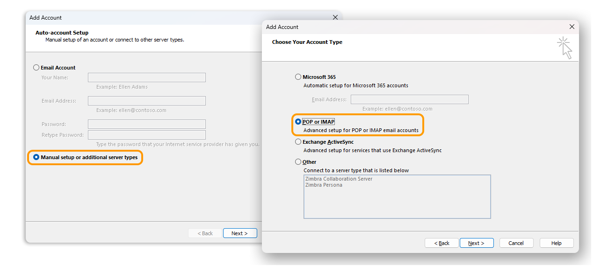
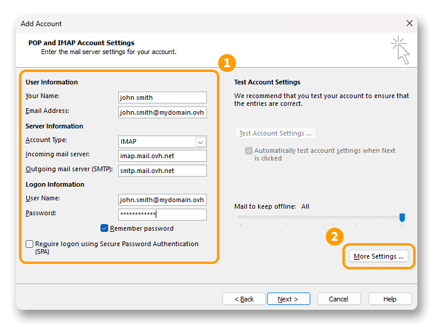
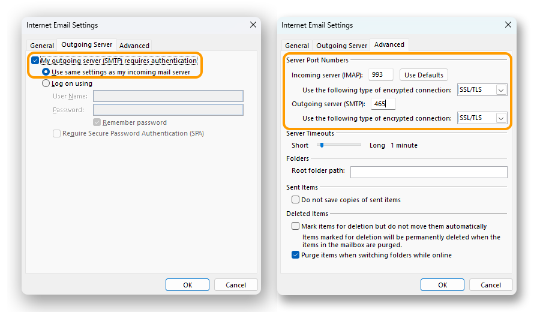
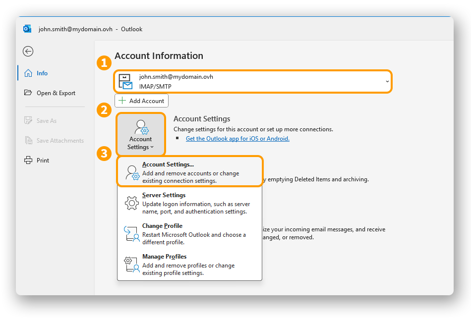
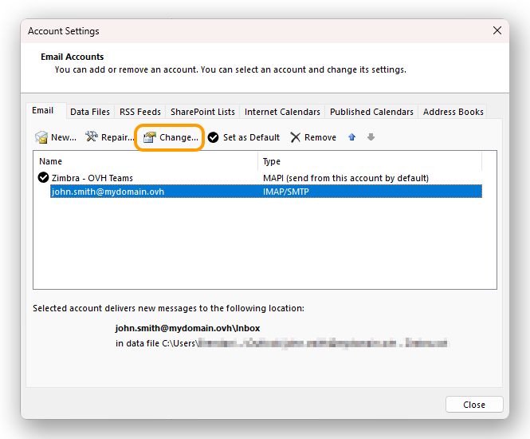

> [!success]
>
> Participez à notre enquête et aidez-nous à améliorer ce guide ! 
> N'hésitez pas à partager votre avis et vos idées avec nous. 
> [Accédez à l'enquête.](https://s.elq.fr/ovhext/FtjUebZ)

## Objectif

Les comptes MX Plan peuvent être configurés sur différents logiciels de messagerie compatibles. Cela vous permet d’utiliser votre adresse e-mail depuis l’appareil de votre choix.

**Découvrez comment configurer votre adresse e-mail MX Plan sur Outlook pour Windows.**

## Prérequis

- Disposer d’une adresse e-mail MX Plan (comprise dans l’offre MX Plan ou dans une offre d’[hébergement web OVHcloud](/links/web/hosting)).
- Disposer de l'application [Outlook classique](https://support.microsoft.com/fr-fr/office/installer-ou-r%C3%A9installer-outlook-classique-sur-un-pc-windows-5c94902b-31a5-4274-abb0-b07f4661edf5) sur Windows.
- Posséder les identifiants relatifs à l'adresse e-mail que vous souhaitez paramétrer.

/// details | Informations relatives à la gestion et la configuration des services OVHcloud

OVHcloud met à votre disposition des services dont la configuration, la gestion et la responsabilité vous incombent. Il vous revient de ce fait d'en assurer le bon fonctionnement.

Nous mettons à votre disposition ce guide afin de vous accompagner au mieux sur des tâches courantes. Néanmoins, nous vous recommandons de faire appel à un [partenaire spécialisé](/links/transversal/marketplace-support-collaboration) et/ou de contacter l'éditeur du service si vous éprouvez des difficultés. En effet, nous ne serons pas en mesure de vous fournir une assistance. Plus d'informations dans la section « [Aller plus loin](go-further) » de ce guide.

///

>
> Vous utilisez Outlook pour Mac ? Consultez notre documentation : [Configurer son adresse e-mail sur Outlook pour Mac](/pages/web_cloud/email_and_collaborative_solutions/mx_plan/how_to_configure_outlook_2016_mac).
>

## En pratique

> [!warning]
>
> Cette documentation s’applique uniquement à **Outlook classique** disponible dans la suite Microsoft 365. Si vous utilisez le nouvel Outlook, consultez notre guide [MX Plan / Zimbra Starter - Ajouter un compte e-mail sur le nouvel Outlook pour Windows](/pages/web_cloud/email_and_collaborative_solutions/mx_plan/how_to_configure_windows_10)
>
> Pour installer Outlook classique sur votre ordinateur Windows, téléchargez-le depuis la page Microsoft « [Installer ou réinstaller Outlook classique sur un PC Windows](https://support.microsoft.com/fr-fr/office/installer-ou-r%C3%A9installer-outlook-classique-sur-un-pc-windows-5c94902b-31a5-4274-abb0-b07f4661edf5) » et installez-le.
>
> Une fois l'installation terminée, afin de distinguer les deux versions lorsqu'elles sont installées, tapez « Outlook » dans la barre de recherche Windows. Vous pourrez alors constater la différence comme ci-dessous.
>
> {.thumbnail .h-500}

### Ajouter le compte 

> [!primary]
>
> Vous ne savez pas si vous devez configurer votre compte e-mail en **POP** ou en **IMAP**?
>
> Avant de poursuivre, consultez la section « [POP ou IMAP, quelle est la différence ?](#popimap) » de ce guide.
>
> Dans les paramètres suivants, vous constaterez la possibilité de renseigner 2 noms d'hôtes différents pour le même serveur (entrant ou sortant). Ces valeurs renvoient exactement au même serveur, elles ont été mises en place pour faciliter la saisie et éviter la confusion entre les protocoles POP, IMAP et SMTP qui utilisent des ports différents.

- **Lors du premier démarrage de l'application** : un assistant de configuration s'affiche et vous invite à renseigner votre adresse e-mail. Passez directement à l'étape 1 plus bas sur cette page.

- **Si un compte a déjà été paramétré** : cliquez sur `Fichier`{.action} dans la barre de menu en haut de votre écran, puis sur `Ajouter un compte`{.action}.

{.thumbnail .h-500}

Pour configurer votre adresse e-mail, suivez les étapes en cliquant sur les onglets ci-dessous.

> [!warning]
>
> Il est nécessaire de bien renseigner la valeur correspondant à votre localisation (**EUROPE** ou **AMERIQUE / ASIE-PACIFIQUE**).

> **Étape 1**
>>
>> - Depuis la fenêtre **Ajouter un compte**, sélectionnez `Configuration manuelle ou types de serveurs supplémentaires`{.action}.
>> - Cliquez sur `Suivant`{.action} pour continuer.
>> - Sélectionnez `POP ou IMAP`{.action}.
>> - Cliquez sur `Suivant`{.action} pour continuer.
>>
>> {.thumbnail .h-500}
>>
> **Étape 2**
>>
>> Saisissez les informations de connexion à votre compte **(1)** :
>>
>> Informations sur l'utilisateur  
>> **Votre nom** : définissez un nom d'affichage. 
>> **Adresse de courrier** : daisissez votre adresse e-mail complète. 
>>
>> Informations sur le serveur  
>> - **Type de compte** : sélectionnez IMAP 
>> - **Serveur de courrier entrant** :  
>>      - **EUROPE** : imap.mail.ovh.net **ou** ssl0.ovh.net  
>>      - **AMERIQUE/ASIE-PACIFIQUE** : imap.mail.ovh.ca  
>> - **Serveur de courrier sortant (SMTP)** :  
>>      - **EUROPE** : smtp.mail.ovh.net **ou** ssl0.ovh.net  
>>      - **AMERIQUE/ASIE-PACIFIQUE** : smtp.mail.ovh.ca  
>>
>> Informations de connexion  
>> **Nom d'utilisateur** : saisissez votre adresse e-mail complète. 
>> **Mot de passe** : saisissez le mot de passe associé à votre adresse e-mail. 
>>
>> Cliquez sur `Paramètres supplémentaires...`{.action} **(2)** et passez à l'étape suivante
>>
>> {.thumbnail .h-500}
>>
> **Étape 3**
>>
>> Depuis l'onglet `Serveur sortant`, cochez `Mon serveur sortant (SMTP) requiert une authentification`{.action} et laissez `Utiliser les mêmes paramètres que mon serveur de courrier entrant`{.action} sélectionné.
>>
>> Depuis l'onglet `Options avancées` :
>>
>> - **Serveur entrant (IMAP)** : 993
>> - **Utiliser le type de connexion chiffrée suivant** : SSL/TLS
>> - **Serveur de courrier sortant (SMTP)** : 465
>> - **Utiliser le type de connexion chiffrée suivant** : SSL/TLS
>>
>> Cliquez sur `OK`{.action} pour valider les informations. Cliquez sur `Suivant`{.action} pour lancer la configuration du compte.
>>
>> {.thumbnail .h-500}
>>
> **Étape 4**
>>
>> Cliquez sur `Suivant`{.action} pour lancer la configuration du compte. Si les paramètres sont validés, vous obtiendrez la fenêtre ci-dessous.
>>
>> {.thumbnail .h-500}
>>

### Utiliser l'adresse e-mail

Une fois l'adresse e-mail configurée, il ne reste plus qu’à l'utiliser ! Vous pouvez dès à présent envoyer et recevoir des messages.

OVHcloud propose aussi une application web permettant d'accéder à votre adresse e-mail depuis un navigateur internet. Celle-ci est accessible à l’adresse [Webmail](/links/web/email). Vous pouvez vous y connecter grâce aux identifiants de votre adresse e-mail. Pour toute question relative à son utilisation, n'hésitez pas à consulter notre guide [Consulter son compte Exchange depuis l’interface OWA](/pages/web_cloud/email_and_collaborative_solutions/using_the_outlook_web_app_webmail/email_owa).

### Récupérer une sauvegarde de votre adresse e-mail

Si vous devez effectuer une manipulation qui risquerait d'entrainer la perte des données de votre compte e-mail, nous vous conseillons d'effectuer une sauvegarde préalable du compte e-mail concerné. Pour ce faire, consulter le paragraphe « **Exporter depuis Windows** » sur notre guide [Migrer manuellement votre adresse e-mail](/pages/web_cloud/email_and_collaborative_solutions/migrating/manual_email_migration#exporter-depuis-windows).

### Modifier les paramètres existants

Si votre compte e-mail est déjà paramétré et que vous devez accéder aux paramètres du compte pour les modifier :

- Allez dans `Fichier`{.action} depuis la barre de menu en haut de votre écran.
- Sélectionnez le compte à modifier dans le menu déroulant **(1)**.
- Cliquez sur `Paramètres du compte`{.action} **(2)** en dessous.
- Cliquez sur `Paramètres du compte...`{.action} **(3)** pour accéder à la fenêtre de paramètres.

{.thumbnail}

- La fenêtre de paramètres des comptes s'affiche, sélectionnez le compte e-mail concerné et cliquez sur `Modifier...`{.action}.

{.thumbnail}

### Paramètre généraux d'envoi et de réception 

#### Paramètres de réception IMAP et POP 

Pour la réception des e-mails, lors du choix du type de compte, nous vous conseillons une utilisation en **IMAP**. Vous pouvez cependant sélectionner **POP**.

> [!warning]
>
> Il est nécessaire de bien relever la valeur correspondant à votre localisation (**EUROPE** ou **AMERIQUE / ASIE-PACIFIQUE**).

Sélectionnez l'onglet correspondant à votre type de configuration :

> [!tabs]
> **Configuration IMAP**
>>
>> - **Nom d'utilisateur** : renseignez l'adresse e-mail **complète**.
>> - **Mot de passe** : renseignez le mot de passe de l'adresse e-mail.
>> - **Serveur EUROPE (entrant)** : imap.mail.ovh.net **ou** ssl0.ovh.net.
>> - **Serveur AMERIQUE/ASIE-PACIFIQUE (entrant)** : imap.mail.ovh.ca.
>> - **Port** : 993.
>> - **Type de sécurité** : SSL/TLS.
>>
> **Configuration POP**
>>
>> - **Nom d'utilisateur** : renseignez l'adresse e-mail **complète**.
>> - **Mot de passe** : renseignez le mot de passe de l'adresse e-mail.
>> - **Serveur EUROPE (entrant)** : pop.mail.ovh.net **ou** ssl0.ovh.net.
>> - **Serveur AMERIQUE/ASIE-PACIFIQUE (entrant)** : pop.mail.ovh.ca.
>> - **Port** : 995.
>> - **Type de sécurité** : SSL/TLS.

#### Paramètres d'envoi SMTP 

Pour l'envoi des e-mails, retrouvez ci-dessous les paramètres **SMTP** à utiliser :

**Configuration SMTP**

- **Nom d'utilisateur** : renseignez l'adresse e-mail **complète**.
- **Mot de passe** : renseignez le mot de passe de l'adresse e-mail.
- **Serveur EUROPE (sortant)** : smtp.mail.ovh.net **ou** ssl0.ovh.net.
- **Serveur AMERIQUE/ASIE-PACIFIQUE (sortant)** : smtp.mail.ovh.ca.
- **Port** : 465.
- **Type de sécurité** : SSL/TLS.

### POP ou IMAP, quelle est la différence ? 

Lorsque vous configurez votre adresse e-mail manuellement, votre client de messagerie vous demande si vous souhaitez utiliser le protocole **POP** (**P**ost **O**ffice **P**rotocol) ou **IMAP**(**I**nternet **M**essage **A**ccess **P**rotocol). Pour bien comprendre, il faut situer le rôle des protocoles POP et IMAP dans la configuration de votre adresse e-mail.

Lors de la configuration de votre client de messagerie, vous devez lui renseigner les informations du **serveur entrant** pour recevoir les e-mails et le **serveur sortant** pour envoyer les e-mails. Pour envoyer les e-mails, il n'y a pas de choix, c'est le protocole **SMTP** (**S**imple **M**ail **T**ransfer **P**rotocol) qui est utilisé. Pour la réception, vous aurez donc le choix entre **POP** ou **IMAP**.

{.thumbnail .w-400}

Pour comprendre la différence entre l'utilisation du protocole POP et IMAP, nous allons détailler les éléments qui composent le traitement de vos e-mails en réception :

1. **Votre appareil** : un ordinateur, un smartphone ou une tablette. C'est votre support de consultation.
2. **Votre client de messagerie** : application dédiée à la gestion de vos e-mails. Son choix déterminera le niveau d'ergonomie et de fonctionnalités dont vous aurez besoin pour consulter vos e-mails.
3. **Le protocole de réception** : choix déterminant la façon de relever les e-mails sur votre appareil. Son choix a une incidence sur les autres appareils qui consultent ce même compte e-mail.
    - **IMAP** : votre client de messagerie interroge le serveur e-mail et télécharge les e-mails sur votre appareil. Lorsque vous consultez un e-mail non lu, le serveur le marque comme « lu » par défaut. Les autres appareils configurés en IMAP pourront constater cet état et consulter cet e-mail tant qu'il n'aura pas été supprimé sur l'un des appareils.
    - **POP** : votre client de messagerie interroge le serveur e-mail et télécharge les e-mails sur votre appareil. Par défaut, une fois l'e-mail téléchargé sur votre appareil, le message est supprimé du serveur. Par conséquent, les autres appareils connectés à cette adresse e-mail ne pourront pas consulter cet e-mail.

{.thumbnail .w-400}

> [!primary]
>
> Ce desriptif est une synthèse, il représente le fonctionnement standard de ces deux protocoles. Il est possible de paramétrer le POP pour que les e-mails ne soit pas supprimés lorsque vous relevez vos e-mails. Notre objectif est de décrire le fonctionnement natif de ces deux protocoles.

## Aller plus loin

> [!primary]
>
> Pour plus d'informations sur la configuration d'une adresse e-mail depuis l'application Outlook sur macOS, consultez [le centre d'aide Microsoft](https://support.microsoft.com/fr-fr/office/ajouter-un-compte-de-courrier-dans-outlook-6e27792a-9267-4aa4-8bb6-c84ef146101b).

[Configurer son compte E-mail Pro sur Outlook pour Windows](/pages/web_cloud/email_and_collaborative_solutions/email_pro/how_to_configure_outlook_2016)

[Configurer son compte Exchange sur Outlook pour Windows](/pages/web_cloud/email_and_collaborative_solutions/microsoft_exchange/how_to_configure_outlook_2016)

Échangez avec notre [communauté d'utilisateurs](/links/community).