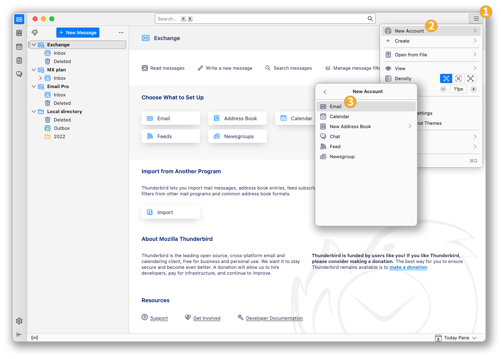
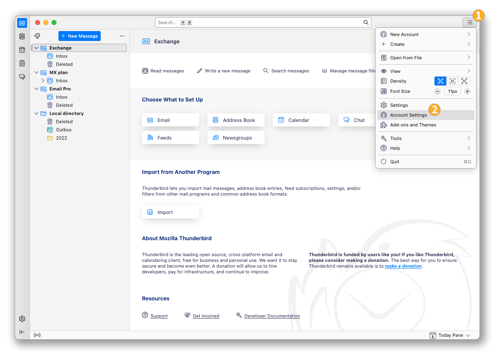
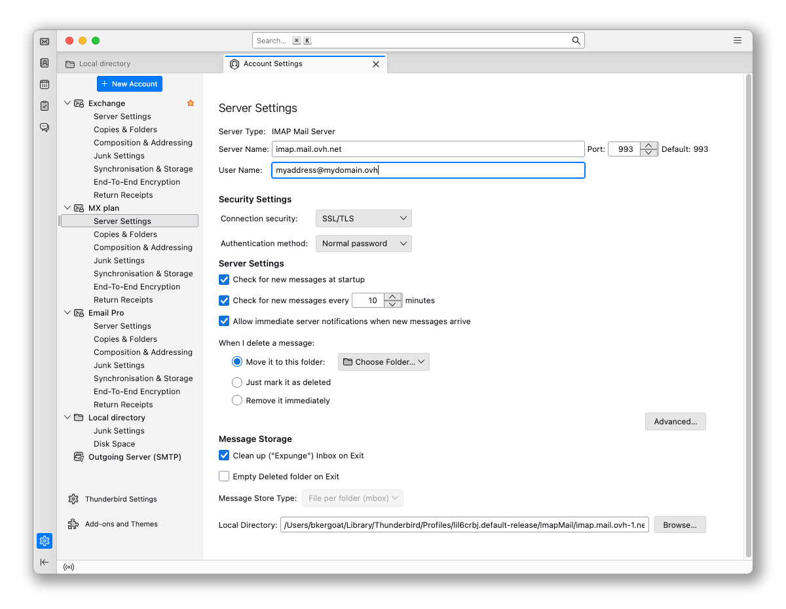
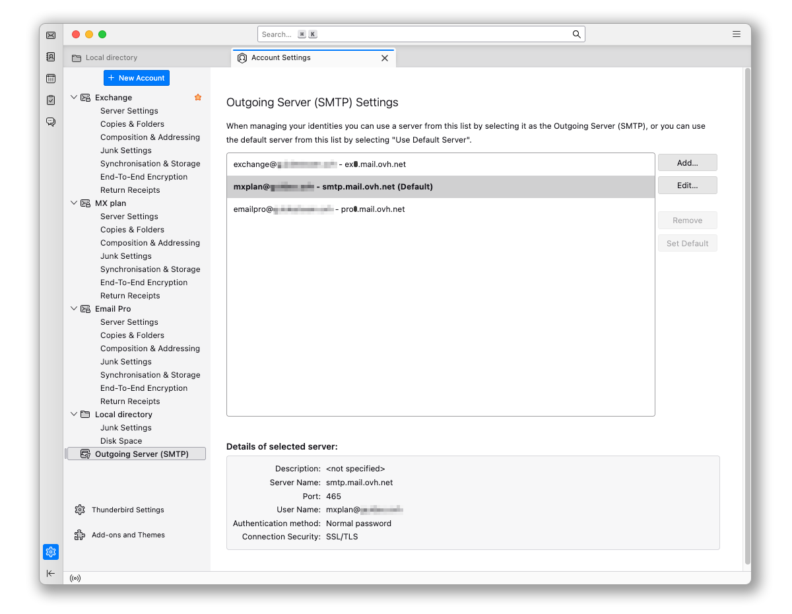

## Objective

MX Plan email accounts can be configured on different compatible email clients. This allows you to use your email address from the device of your choice. Thunderbird is a free and open-source email client.

**This guide explains how to configure your MX Plan email address on Thunderbird for macOS.**

## Requirements

- You are using an MX Plan email account. This applies to the [Web hosting](/links/web/hosting) plan (included in all offers).
- You have the Thunderbird software installed on your Mac device.
- You have the credentials for the email account you want to configure.

/// details | Information regarding the administration and configuration of OVHcloud services

This guide will show you how to use OVHcloud solutions with external tools, and the changes you need to make in specific contexts. You may need to adapt the instructions according to your situation.

If you experience any difficulties carrying out these operations, we recommend that you contact a specialist service provider or discuss the issue with our [community](/links/community). OVHcloud cannot provide you with technical support in this regard. You can find more information in the [Go further](#go-further) section of this guide.

///

## Instructions

### Add the account

- **On the first launch of the application**: a configuration wizard appears and prompts you to enter your email address.

- **If an account is already configured on the application**:

    1. Click on the `☰`{.action} menu in the top horizontal bar.
    2. Click on `New Account`{.action}.
    3. Click on `Email Address`{.action}.

{.thumbnail .w-600}

> [!warning]
>
> It is necessary to note the value corresponding to your location (**EUROPE** or **AMERICA / ASIA-PACIFIC**).

Follow the configuration steps by clicking successively on the **5** tabs below:

> [!tabs]
> **Step 1**
>>
>> In the window that appears, enter the following 2 pieces of information:
>>
>>  - Your full name (display name).
>>  - The email address to configure.
>>
>> Click on `Continue`{.action} to complete the settings.
>>
>> {.thumbnail .w-600}
>>
> **Step 2**
>>
>> When Thunderbird detects an OVHcloud domain name, an automatic configuration related to the MX Plan offer is proposed:
>>
>>  - If the information is correct, click on `Continue`{.action} and proceed to step 5.
>>  - Otherwise, click on `MODIFY THE CONFIGURATION`{.action} to perform a manual configuration.
>>
>> {.thumbnail .w-600}
>>
> **Step 3**
>>
>> Incoming server settings:
>>
>>  - **Protocol**: IMAP
>>  - **EUROPE (incoming) Hostname**: imap.mail.ovh.net **or** ssl0.ovh.net
>>  - **AMERICA/ASIA-PACIFIC (incoming) Hostname**: imap.mail.ovh.ca
>>  - **Port**: 993
>>  - **Connection security**: SSL/TLS
>>  - **Authentication method**: Normal password
>>  - **Username**: Your full email address
>>
>> {.thumbnail .w-600}
>>
> **Step 4**
>>
>> Outgoing server settings:
>>
>>  - **Protocol**: SMTP
>>  - **EUROPE (outgoing) Server**: smtp.mail.ovh.net **or** ssl0.ovh.net
>>  - **AMERICA/ASIA-PACIFIC (outgoing) Server**: smtp.mail.ovh.ca
>>  - **Port**: 587
>>  - **Connection security**: STARTTLS
>>  - **Authentication method**: Normal password
>>  - **Username**: Your full email address
>> 
>> 1\. Click on `Test`{.action} to verify the entered settings.
>> 2\. Click on `Continue`{.action} to validate these settings.
>>
>> {.thumbnail .w-600}
>>
> **Step 5**
>>
>> Enter the password associated with the email account, then click on `Continue`{.action} to finalize the configuration.
>>
>> {.thumbnail .w-600}
>>

> [!primary]
>
> **POP configuration**
>
> If you want a POP configuration for your email address, replace the settings in **Step 3** with the following:
>
> Incoming server settings:
>
> - **Protocol**: POP3
> - **EUROPE (incoming) Hostname**: pop.mail.ovh.net **or** ssl0.ovh.net
> - **AMERICA/ASIA-PACIFIC (incoming) Hostname**: pop.mail.ovh.ca
> - **Port**: 995
> - **Connection security**: SSL/TLS
> - **Authentication method**: Normal password
> - **Username**: Your full email address

### Use the email address

Once your email address is configured, you can start using it! You can now send and receive emails.

OVHcloud also offers a web application to access your email account from a browser. To access the OVHcloud Webmail, click on [this link](/links/web/email). You can log in using your email account credentials.

### Retrieve a backup of your email account

If you need to perform an operation that could result in the loss of your email account data, we recommend making a backup beforehand. To do this, refer to the "**Export**" section in the "**Thunderbird**" part of our guide "[Manually Migrate Your Email Address](/pages/web_cloud/email_and_collaborative_solutions/migrating/manual_email_migration)".

### Modify existing settings

If your email account is already configured and you need to access the account settings to modify them:

1. Click on the `☰`{.action} menu in the top horizontal bar.
2. Click on `Account Settings`{.action}.

{.thumbnail .w-600}

- To modify settings related to the **reception** of your emails, click on `Server Settings`{.action} in the left column under your email address.

{.thumbnail .w-600}

- To modify settings related to the **sending** of your emails, click on `Outgoing Server (SMTP)`{.action} at the bottom of the left column.
- Click on the relevant email address in the list, then click on `Edit`{.action}.

{.thumbnail .w-600}

## Go further 

> [!primary]
>
> For more information on configuring an email address from the Thunderbird email client, consult [Mozilla's help center](https://support.mozilla.org/products/thunderbird).

[Getting started with MX Plan](/pages/web_cloud/email_and_collaborative_solutions/mx_plan/email_generalities)

For specialised services (SEO, development, etc.), contact [OVHcloud partners](/links/partner).

If you would like assistance using and configuring your OVHcloud solutions, please refer to our [support offers](/links/support).

Join our [community of users](/links/community).
