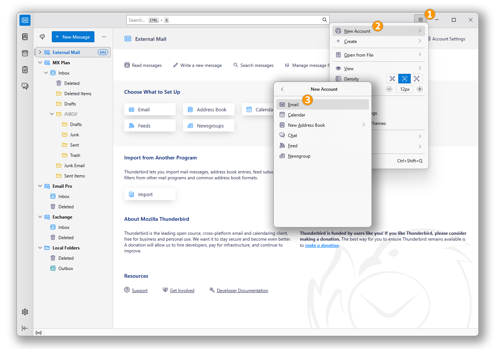
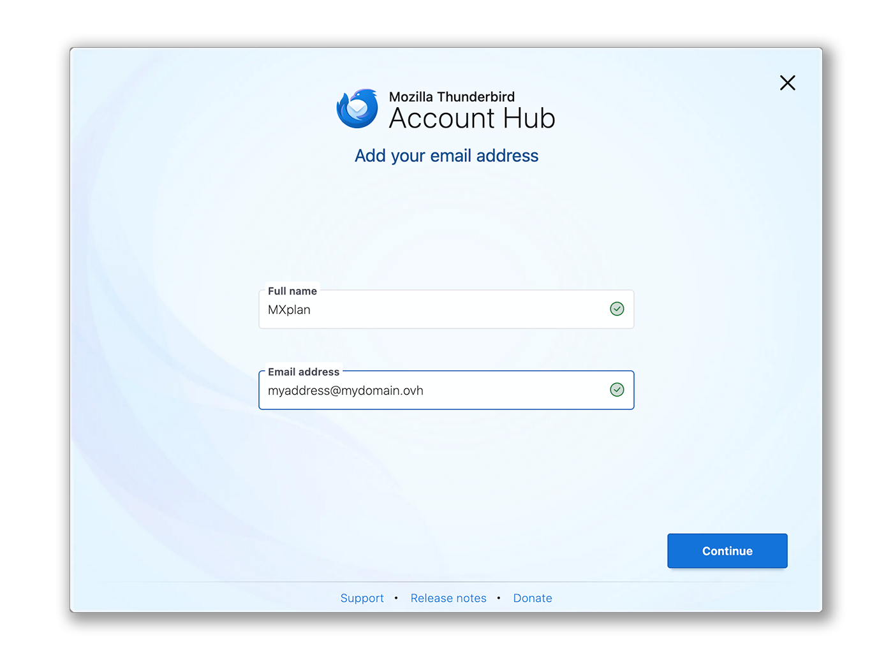
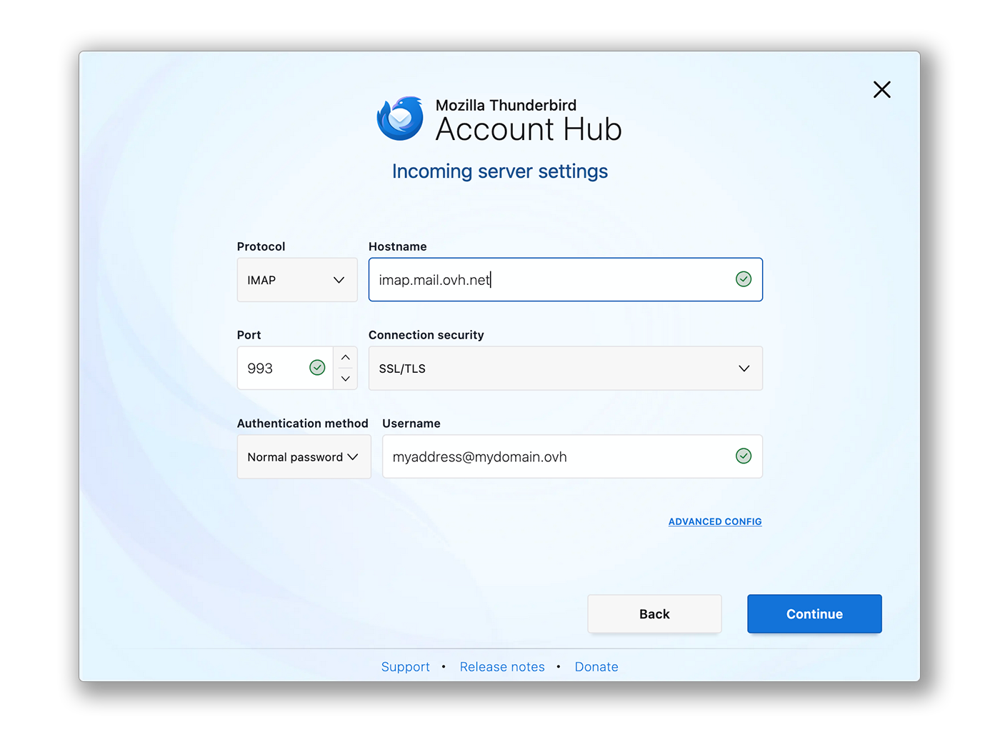
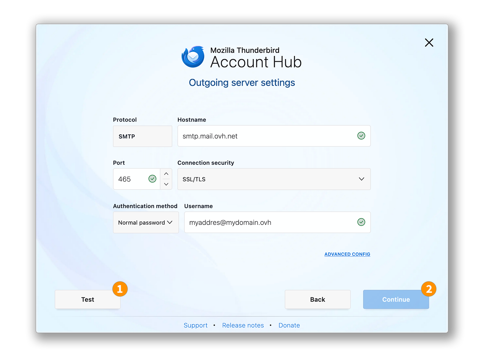
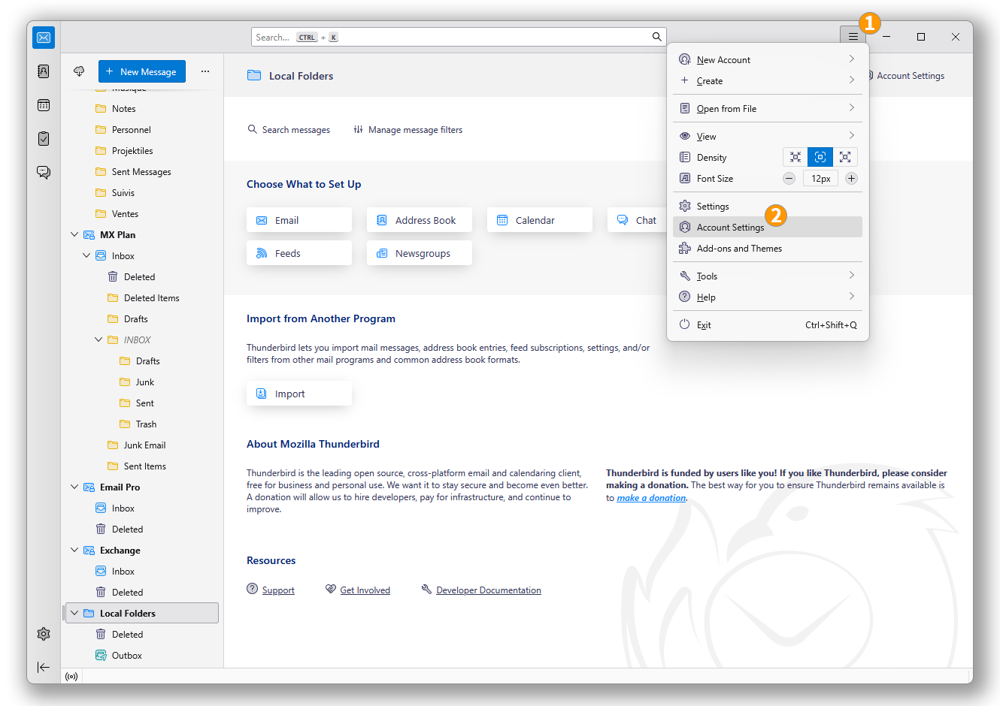
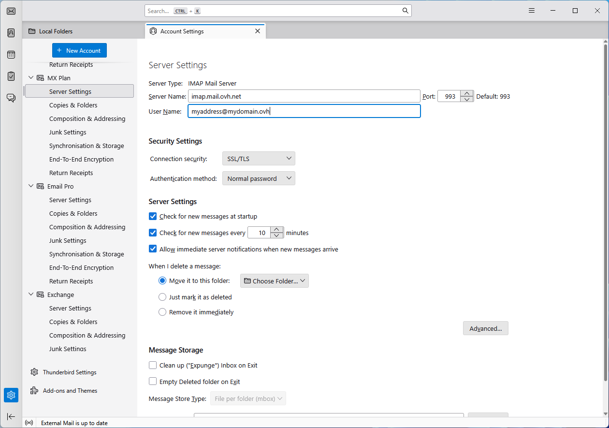
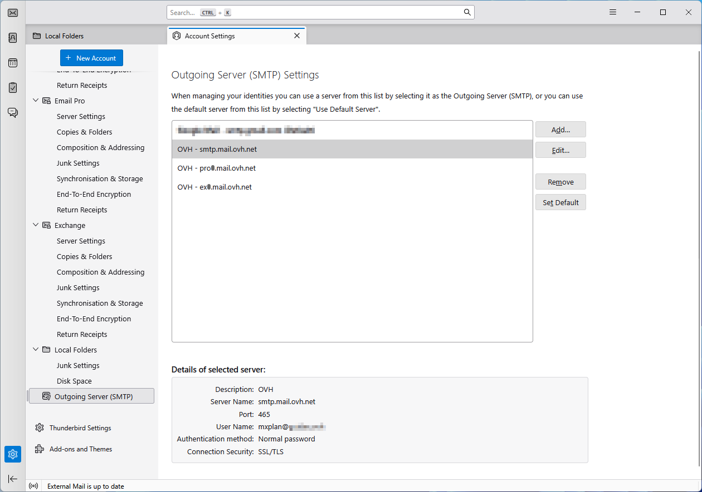

## Objetivo

As contas de e-mail MX Plan podem ser configuradas em diferentes clientes de e-mail compatíveis. Isso permite que você use seu endereço de e-mail a partir do dispositivo de sua escolha. O Thunderbird é um cliente de e-mail gratuito e de código aberto.

**Descubra como configurar seu endereço de e-mail MX Plan no Thunderbird para Windows.**

## Requisitos

- Ter uma oferta MX Plan. Esta está disponível por meio de:
    - Uma oferta de [alojamento web](/links/web/hosting).
    - Um [alojamento gratuito 100M](/links/web/domains-free-hosting) incluída com um nome de domínio (ativado previamente).
    - Uma oferta MX Plan encomendada separadamente.
    - Ter um endereço de e-mail [Zimbra Starter](/links/web/zimbra).
- Ter o software Thunderbird instalado no seu dispositivo sob Windows.
- Possuir as credenciais relacionadas ao endereço de e-mail que deseja configurar.

/// details | Informações relacionadas à gestão e configuração dos serviços OVHcloud

Este guia mostra como usar soluções OVHcloud com ferramentas externas e as modificações necessárias em contextos específicos. Pode ser necessário adaptar as instruções de acordo com sua situação.

Se você tiver dificuldades para realizar estas operações, recomendamos que entre em contato com um [provedor de serviços especializado](/links/partner) e/ou discuta com nossa comunidade. A OVHcloud não pode fornecer suporte técnico sobre o uso de ferramentas externas. Mais informações na seção [Quer saber mais?](#gofurther) deste guia.

///

## Instruções

### Adicionar a conta

- **Na primeira inicialização do aplicativo**: um assistente de configuração aparece e solicita que você insira seu endereço de e-mail.

- **Se uma conta já estiver configurada no aplicativo**:

    1. Clique no menu `☰`{.action} na barra horizontal superior.
    2. Clique em `Nova Conta`{.action}.
    3. Clique em `Endereço de E-mail`{.action}.

{.thumbnail .w-600}

> [!warning]
>
> É necessário anotar o valor correspondente à sua localização (**EUROPA** ou **AMÉRICA / ÁSIA-PACÍFICO**).

Siga as etapas de configuração clicando sucessivamente nos **5** abas abaixo:

> [!tabs]
> **Etapa 1**
>>
>> Na janela que aparece, insira as 2 seguintes informações:
>>
>>  - Seu nome completo (nome de exibição).
>>  - O endereço de e-mail a ser configurado.
>>
>> Clique em `Continuar`{.action} para completar as configurações.
>>
>> {.thumbnail .w-600}
>>
> **Etapa 2**
>>
>> Quando o Thunderbird detectar um nome de domínio OVHcloud, uma configuração automática relativa à oferta MX Plan é proposta:
>>
>>  - Se as informações estiverem corretas, clique em `Continuar`{.action} e passe para a etapa 5.
>>  - Caso contrário, clique em `MODIFICAR A CONFIGURAÇÃO`{.action} para realizar uma configuração manual.
>>
>> {.thumbnail .w-600}
>>
> **Etapa 3**
>>
>> Configurações do servidor de recepção:
>>
>>  - **Protocolo**: IMAP
>>  - **Nome do host EUROPA (entrante)**: imap.mail.ovh.net **ou** ssl0.ovh.net
>>  - **Nome do host AMÉRICA/ÁSIA-PACÍFICO (entrante)**: imap.mail.ovh.ca
>>  - **Porta**: 993
>>  - **Segurança da conexão**: SSL/TLS
>>  - **Método de autenticação**: Senha normal
>>  - **Nome de usuário**: Seu endereço de e-mail completo
>>
>> {.thumbnail .w-600}
>>
> **Etapa 4**
>>
>> Configurações do servidor de envio:
>>
>>  - **Protocolo**: SMTP
>>  - **Servidor EUROPA (saída)**: smtp.mail.ovh.net **ou** ssl0.ovh.net
>>  - **Servidor AMÉRICA/ÁSIA-PACÍFICO (saída)**: smtp.mail.ovh.ca
>>  - **Porta**: 587
>>  - **Segurança da conexão**: STARTTLS
>>  - **Método de autenticação**: Senha normal
>>  - **Nome de usuário**: Seu endereço de e-mail completo
>> 
>> 1. Clique em `Testar`{.action} para verificar os parâmetros inseridos.
>> 2. Clique em `Continuar`{.action} para validar esses parâmetros.
>>
>> {.thumbnail .w-600}
>>
> **Etapa 5**
>>
>> Insira a senha associada ao endereço de e-mail, depois clique em `Continuar`{.action} para finalizar a configuração.
>>
>> {.thumbnail .w-600}
>>

> [!primary]
>
> **Configuração POP**
>
> Se desejar uma configuração POP para seu endereço de e-mail, substitua os parâmetros da **etapa 3** pelos seguintes:
>
> Configurações do servidor de recepção:
>
> - **Protocolo**: POP3
> - **Nome do host EUROPA (entrante)**: pop.mail.ovh.net **ou** ssl0.ovh.net
> - **Nome do host AMÉRICA/ÁSIA-PACÍFICO (entrante)**: pop.mail.ovh.ca
> - **Porta**: 995
> - **Segurança da conexão**: SSL/TLS
> - **Método de autenticação**: Senha normal
> - **Nome de usuário**: Seu endereço de e-mail completo

### Usar o endereço de e-mail

Uma vez que seu endereço de e-mail esteja configurado, você pode começar a usá-lo! Agora você pode enviar e receber e-mails.

A OVHcloud também oferece uma aplicação web para acessar seu endereço de e-mail a partir de um navegador. Para acessar o Webmail da OVHcloud, clique [neste link](/links/web/email). Você pode se conectar usando as credenciais de seu endereço de e-mail.

### Recuperar um backup de seu endereço de e-mail

Se você precisar realizar uma operação que possa causar a perda de dados de sua conta de e-mail, recomendamos fazer um backup prévio da conta de e-mail afetada. Para isso, consulte o parágrafo "**Exportar**" na seção "**Thunderbird**" de nosso guia "[Migrar manualmente o seu endereço de e-mail](/pages/web_cloud/email_and_collaborative_solutions/migrating/manual_email_migration)".

### Modificar as configurações existentes

Se sua conta de e-mail já estiver configurada e você precisar acessar as configurações da conta para modificá-las:

1. Clique no menu `☰`{.action} na barra horizontal superior.
2. Clique em `Configurações da conta`{.action}.

{.thumbnail .w-600}

- Para modificar as configurações relacionadas à **recepção** de seus e-mails, clique em `Configurações do servidor`{.action} na coluna esquerda sob seu endereço de e-mail.

{.thumbnail .w-600}

- Para modificar as configurações relacionadas ao **envio** de seus e-mails, clique em `Servidor de saída (SMTP)`{.action} no final da coluna esquerda.
- Clique no endereço de e-mail afetado na lista, depois clique em `Modificar`{.action}.

{.thumbnail .w-600}

## Quer saber mais? 

> [!primary]
>
> Para mais informações sobre a configuração de um endereço de e-mail a partir do cliente de e-mail Thunderbird, consulte [o centro de ajuda da Mozilla](https://support.mozilla.org/products/thunderbird).

[Introdução à oferta MX Plan](/pages/web_cloud/email_and_collaborative_solutions/mx_plan/email_generalities)

Para serviços especializados (referenciamento, desenvolvimento, etc.), contacte os [parceiros OVHcloud](/links/partner).

Se pretender usufruir de uma assistência na utilização e na configuração das suas soluções OVHcloud, consulte as nossas diferentes [ofertas de suporte](/links/support).

Fale com a nossa [comunidade de utilizadores](/links/community).