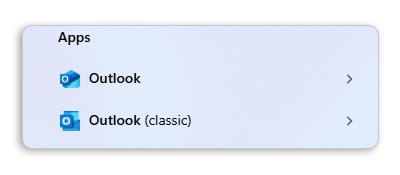
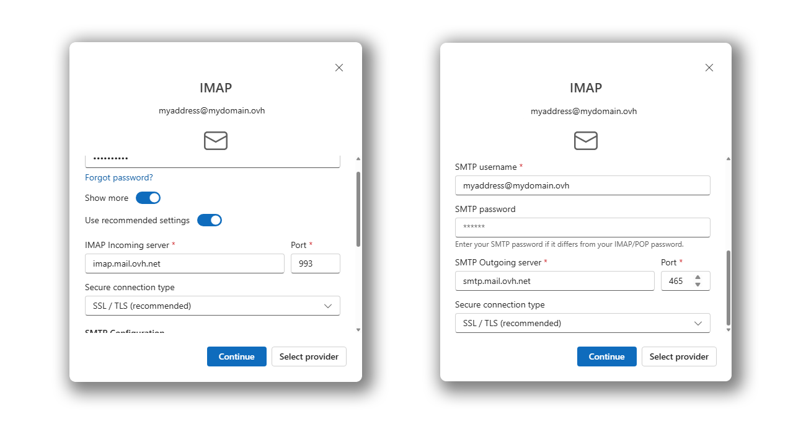
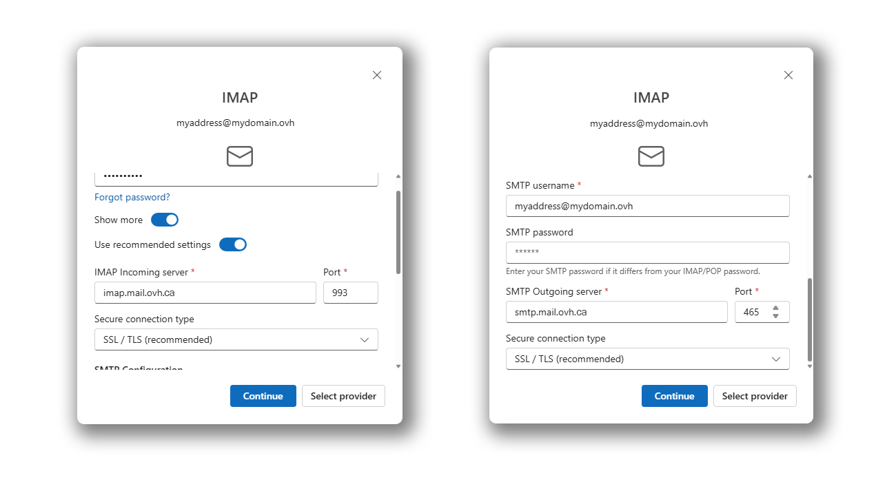
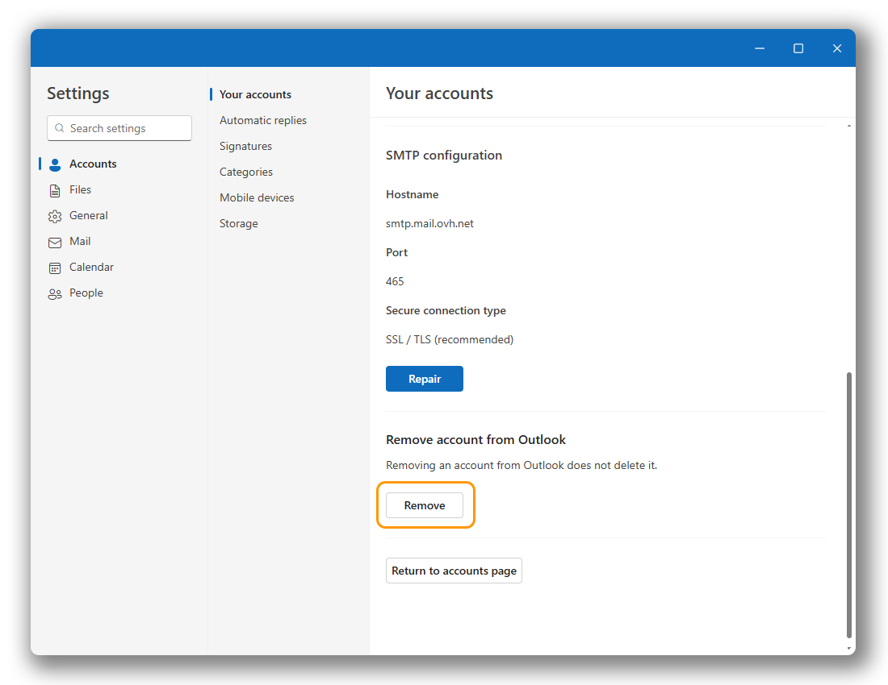

## Objectif

Les adresses e-mail de l'offre **MX Plan** peuvent être configurées sur un logiciel de messagerie compatible. Cela vous permet d'envoyer et de recevoir vos messages depuis l'application de votre choix.

Le **nouvel Outlook** remplace depuis le 1 janvier 2025 l'application **Courrier** sur Windows. Pour plus d'informations sur ce sujet, consultez la page officielle de Microsoft « [Outlook pour Windows : l’avenir du courrier, du calendrier et des Personnes sur Windows 11](https://support.microsoft.com/fr-fr/office/outlook-for-windows-the-future-of-mail-calendar-and-people-on-windows-11-715fc27c-e0f4-4652-9174-47faa751b199) ».

**Apprenez à configurer votre adresse e-mail MX Plan sur le nouvel Outlook pour Windows.**

## Prérequis

- Disposer d'une solution e-mail OVHcloud **MX Plan** proposée avec nos [offres d’hébergement web](/links/web/hosting).
- Disposer du [nouvel Outlook](https://support.microsoft.com/fr-fr/office/getting-started-with-the-new-outlook-for-windows-656bb8d9-5a60-49b2-a98b-ba7822bc7627) pour Windows.
- Posséder les identifiants relatifs à l'adresse e-mail que vous souhaitez paramétrer.

/// details | Informations relatives à la gestion et la configuration des services OVHcloud

OVHcloud met à votre disposition des services dont la configuration, la gestion et la responsabilité vous incombent. Il vous revient de ce fait d'en assurer le bon fonctionnement.

Nous mettons à votre disposition ce guide afin de vous accompagner au mieux sur des tâches courantes. Néanmoins, nous vous recommandons de faire appel à un [partenaire spécialisé](/links/partner) et/ou de contacter l'éditeur du service si vous éprouvez des difficultés. En effet, nous ne serons pas en mesure de vous fournir une assistance. Plus d'informations dans la section « Aller plus loin » de ce guide.

///

## En pratique

> [!warning]
>
> Cette documentation s’applique uniquement au **nouvel Outlook** et non à « [Outlook classique](https://support.microsoft.com/fr-fr/office/installer-ou-r%C3%A9installer-outlook-classique-sur-un-pc-windows-5c94902b-31a5-4274-abb0-b07f4661edf5) » disponible dans la suite Microsoft 365 ou précédemment installé sur votre ordinateur.
>
> Pour distinguer les deux versions d'Outlook lorsqu'elles sont installées, tapez « Outlook » dans la barre de recherche Windows. Vous pourrez alors constater la différence comme ci-dessous. Le nouvel Outlook n'a pas de mention spéciale.
>
> {.thumbnail .h-500}
>
> Pour configurer votre adresse e-mail MX plan sur Outlook classique, consultez notre guide « [MX Plan - Configurer son adresse e-mail sur Outlook classique pour Windows](/pages/web_cloud/email_and_collaborative_solutions/mx_plan/how_to_configure_outlook_2016) ».

### Ajouter le compte 

> [!warning]
>
> Il est nécessaire de choisir l'onglet de l'étape 3 correspondant à votre localisation (**EUROPE** ou **AMERIQUE / ASIE-PACIFIQUE**) pour obtenir les bonnes valeurs.

Pour configurer votre adresse e-mail, suivez les étapes en cliquant sur les onglets ci-dessous.

> [!tabs]
> **Etape 1**
>> - Ouvrez Outlook. Dans la colonne de gauche, cliquez sur `Ajouter un compte`{.action} pour démarrer la configuration.
>>
>> {.thumbnail .w-600}
>>
> **Etape 2**
>> - Saisissez votre adresse e-mail puis cliquez sur `Continuer`{.action}.
>> - Saisissez votre mot de passe et cliquez sur le bouton `Afficher plus`{.action}.
>>
>> {.thumbnail .w-600}
>>
> **Etape 3 EUROPE**
>> - Saisissez les paramêtres suivant:
>>    - **Serveur d'entrée IMAP**: imap.mail.ovh.net **ou** ssl0.ovh.net.
>>    - **Port**: 993.
>>    - **Type de connexion sécurisée**: SSL/TLS.
>>    - **Nom d'utilisateur SMTP**: Renseignez l'adresse e-mail **complète**.
>>    - **Serveur sortant SMTP**: smtp.mail.ovh.net **ou** ssl0.ovh.net.
>>    - **Port**: 465.
>>    - **Type de connexion sécurisée**: SSL/TLS.
>>    - **Mot de passe**: Ne rien saisir, le mot de passe saisi précédement sera utilisé.
>> - Cliquez sur `Continuer`{.action} pour finaliser la configuration.
>>
>> {.thumbnail .w-600}
>>
> **Etape 3 AMERIQUE / ASIE-PACIFIQUE**
>> - Saisissez les paramêtres suivant:
>>    - **Serveur d'entrée IMAP**: imap.mail.ovh.ca.
>>    - **Port**: 993.
>>    - **Type de connexion sécurisée**: SSL/TLS.
>>    - **Nom d'utilisateur SMTP**: Renseignez l'adresse e-mail **complète**.
>>    - **Serveur sortant SMTP**: smtp.mail.ovh.ca.
>>    - **Port**: 465.
>>    - **Type de connexion sécurisée**: SSL/TLS.
>>    - **Mot de passe**: Ne rien saisir, le mot de passe saisi précédement sera utilisé.
>> - Cliquez sur `Continuer`{.action} pour finaliser la configuration.
>>
>> {.thumbnail .w-600}

### Utiliser l'adresse e-mail 

Une fois votre adresse e-mail configurée, vous pouvez commencer à l'utiliser ! Vous pouvez dès à présent envoyer et recevoir des messages.

OVHcloud propose également une application web permettant d'accéder à votre adresse e-mail depuis votre navigateur internet accessible sur l’adresse [Webmail](/links/web/email). Vous pouvez vous y connecter grâce aux identifiants relatifs à votre adresse e-mail.

### Modifier les paramètres existants 

L'application Outlook ne permet pas de modifier les paramètres serveur de votre compte e-mail.

Si votre compte e-mail est déjà paramétré et que vous souhaitez le paramétrer à nouveau, vous devez alors le supprimer et le recréer :

- Cliquez sur l'icöne de réglage `⛭`{.action} dans le bas de la colonne de gauche.
- Dans la section « Vos comptes » cliquez sur `Gérer`{.action} à droite de l'adresse e-mail concernée.

{.thumbnail .w-600}

- Descendez dans le bas de la page.
- Cliquez sur `Supprimer`{.action} pour lancer la suppression.
- Déterminez si vous souhaitez supprimer seulement sur cet appareil ou sur les autres appareils utilisant Outlook.

{.thumbnail .w-600}

> [!success]
>
> Une fois votre compte e-mail supprimé, suivez les instructions de la partie « [Ajouter le compte](#add-account) » de cette documentation.

### Paramètre généraux d'envoi et de réception 

#### Paramètres de réception IMAP et POP 

Pour la réception des e-mails, lors du choix du type de compte, nous vous conseillons une utilisation en **IMAP**. Vous pouvez cependant sélectionner **POP**.

> [!warning]
>
> Il est nécessaire de bien relever la valeur correspondante à votre localisation (**EUROPE** ou **AMERIQUE / ASIE-PACIFIQUE**).

Sélectionnez l'onglet correspondant à votre type de configuration :

> [!tabs]
> **Configuration IMAP**
>>
>> - **Nom d'utilisateur** : Renseignez l'adresse e-mail **complète**.
>> - **Mot de passe** : Renseignez le mot de passe de l'adresse e-mail.
>> - **Serveur EUROPE (entrant)** : imap.mail.ovh.net **ou** ssl0.ovh.net.
>> - **Serveur AMERIQUE/ASIE-PACIFIQUE (entrant)** : imap.mail.ovh.ca.
>> - **Port** : 993.
>> - **Type de sécurité** : SSL/TLS.
>>
> **Configuration POP**
>>
>> - **Nom d'utilisateur** : Renseignez l'adresse e-mail **complète**.
>> - **Mot de passe** : Renseignez le mot de passe de l'adresse e-mail.
>> - **Serveur EUROPE (entrant)** : pop.mail.ovh.net **ou** ssl0.ovh.net.
>> - **Serveur AMERIQUE/ASIE-PACIFIQUE (entrant)** : pop.mail.ovh.ca.
>> - **Port** : 995.
>> - **Type de sécurité** : SSL/TLS.

#### Paramètres d'envoi SMTP 

Pour l'envoi des e-mails, retrouvez ci-dessous les paramètres **SMTP** à utiliser :

**Configuration SMTP**

- **Nom d'utilisateur** : Renseignez l'adresse e-mail **complète**.
- **Mot de passe** : Renseignez le mot de passe de l'adresse e-mail.
- **Serveur EUROPE (sortant)** : smtp.mail.ovh.net **ou** ssl0.ovh.net.
- **Serveur AMERIQUE/ASIE-PACIFIQUE (sortant)** : smtp.mail.ovh.ca.
- **Port** : 465.
- **Type de sécurité** : SSL/TLS.

## Aller plus loin

> [!primary]
>
> Pour plus d'informations sur la configuration d'une adresse e-mail depuis le client de messagerie nouvel Outlook sur Windows, consultez [le centre d'aide de Mircrosoft](https://support.microsoft.com/fr-fr/office/start-using-new-outlook-for-windows-4395454d-cb2f-4c16-bb24-fa4bb36650ae).

[Premiers pas avec l'offre MX Plan](/pages/web_cloud/email_and_collaborative_solutions/mx_plan/email_generalities)

Pour des prestations spécialisées (référencement, développement, etc.), contactez les [partenaires OVHcloud](/links/partner).

Si vous souhaitez bénéficier d'une assistance à l'usage et à la configuration de vos solutions OVHcloud, nous vous proposons de consulter nos différentes [offres de support](/links/support).

Échangez avec notre [communauté d'utilisateurs](/links/community).