

## Objective

With the Zimbra solution, OVHcloud offers an open-source collaborative messaging platform, with all the features you need for professional use. In this guide, you will find the information you need to get started configuring your Zimbra email accounts.

**Find out how to get started with the Zimbra email solution.**

<iframe class="video" width="560" height="315" src="https://www.youtube-nocookie.com/embed/q8QCtcXRbME?si=bAjQhzr-PQ--3Aj7" title="YouTube video player" frameborder="0" allow="accelerometer; autoplay; clipboard-write; encrypted-media; gyroscope; picture-in-picture; web-share" referrerpolicy="strict-origin-when-cross-origin" allowfullscreen></iframe>

## Requirements

- An email account on our Zimbra OVHcloud email solution
- An [OVHcloud domain name](/links/web/domains)
- Access to the [OVHcloud Control Panel](/links/manager)

## Instructions

**Summary**

- [Access your service management](#zimbra-access)
- [Configure your Zimbra service](#zimbra-conf)
- [Organizations](#organizations)
    - [Create an organization](#organizations-create)
    - [Filter by organization](#organizations-filters)
- [Domains](#domains)
    - [Add a domain name](#domains-add)
    - [Modify a domain name](#domains-modify)
- [Email accounts](#emails)
    - [Create an email account](#emails-create)
    - [Change plan](#emails-offer)
- [Check your email account](#emails-consult)
- [Redirections](#redirections)
- [Alias](#alias)
- [Automatic Replies](#autoreply)

### Access your service management 

1. Log in to your [OVHcloud Control Panel](/links/manager).
1. Open the `Web Cloud`{.action} section.
1. Click `Zimbra Mail`{.action}.

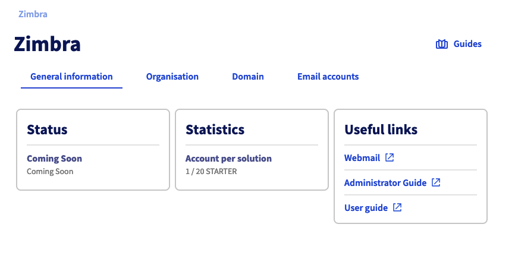{.thumbnail .w-500}

### Configure your Zimbra service 

Before you start configuring your Zimbra email accounts, take note of the three elements that structure your Zimbra service hierarchically:

- [**Organization**](#organizations): It enables domain names to be grouped together in order to associate them.
- [**Domain name**](#domains): It is essential to create an email account. You will need to manage at least one domain name via the OVHcloud Control Panel, and add it to your Zimbra service.
- [**Email accounts**](#emails): By using the domain names added to your Zimbra service, you can create an email address.

> [!primary]
>
> An *Organization* is used to represent an entity (company, association, personal project, etc.). It enables email accounts to be partitioned, specific security policies to be applied (upcoming feature) and rights to be delegated to an organization (upcoming feature). By using organizations, you can make it easier to browse and manage your Zimbra platform.

The diagram below summarizes the hierarchical link between the above-mentioned elements.

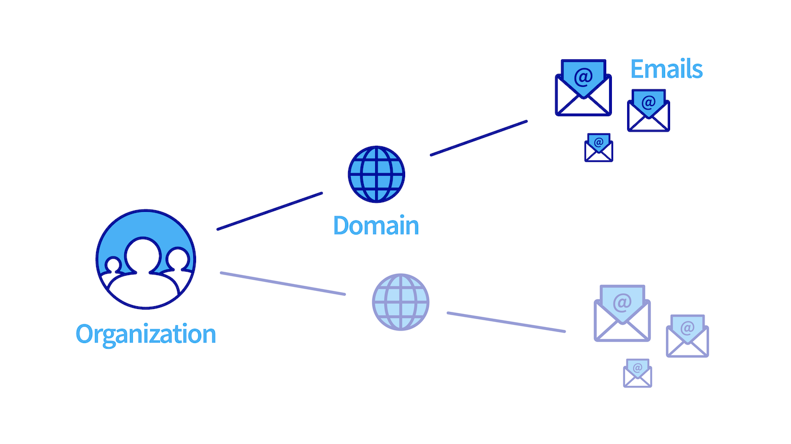{.thumbnail .w-500}

### Organizations 

If you are adding a large number of domain names to your Zimbra service, it may be useful to group them together by associating them with an "Organization". From your Zimbra service, click `Organization`{.action}.

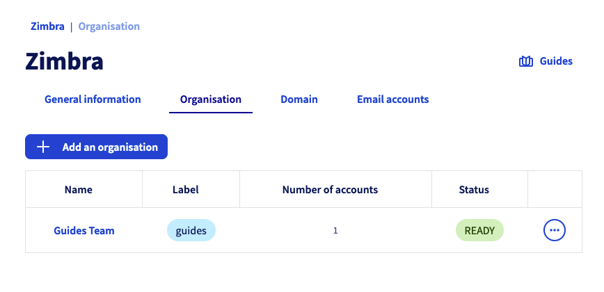{.thumbnail .w-500}

#### Create an organization 

To create an organization, click `Add Organization`{.action}. Define the `Name` of the organization and the `Label of the organization`, the latter being a short description of the organization allowing you to find your way when you filter the display of domain names and email accounts of your Zimbra service.

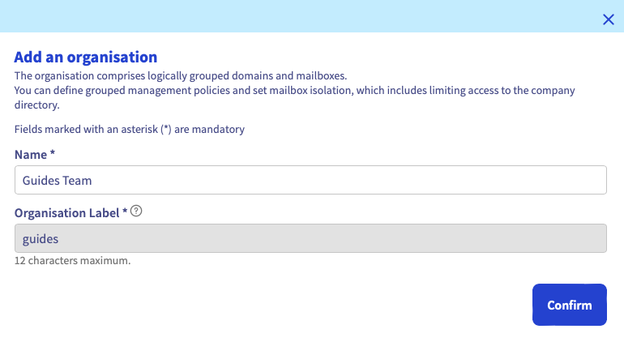{.thumbnail .w-500}

#### Filter by organization 

From the `Organization`{.action}, `Domain`{.action} and `Email accounts`{.action} tabs, by clicking on an organization’s label, you can create a filter that will only display items related to that organization.

You can see that the filter is applied when the label appears next to the name of your Zimbra service.

To remove the filter, simply click on the cross of the filter.

{.thumbnail .w-500}

### Domains 

> [!warning]
>
> For optimal operation when you use the same domain name between OVHcloud solutions [Exchange](/links/web/emails-hosted-exchange), [Email Pro](/links/web/email-pro) and Zimbra, it is necessary to configure the domain name in `non-authoritative`. To find out how to configure a non-authoritative domain name on an Exchange or Email Pro platform, please read our guide on [Adding a domain name on an email platform](/pages/web_cloud/email_and_collaborative_solutions/microsoft_exchange/exchange_adding_domain).

In this tab, you will find all of the domain names added to your Zimbra service. They must be managed via the OVHcloud Control Panel in order to be added.

The domain name table gives you two pieces of information:

- **Organization**: It is determined when you add your domain name. You will automatically find its label in this column.
- **Number of accounts**: Here, you can find all of the accounts created under the domain name concerned.

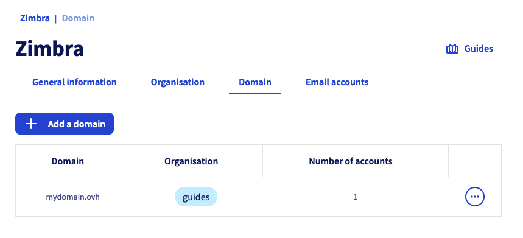{.thumbnail .w-500}

#### Add a domain name 

> [!warning]
>
> You need to [create an organization](#organisations) in order to add a domain name to your Zimbra service.

To add a domain name to your Zimbra service, click on the `Domain`{.action} tab, then click `Add a domain`{.action}.

Select an organization from the drop-down menu, and then select one of the following two options:

- **Select a domain from the list** (internal domain): In this list, you will find the domain names that you manage from the OVHcloud Control Panel.
- **Enter a domain name that is not managed by your OVHcloud account** (external domain): Enter a domain name that is not managed in your OVHcloud Control Panel, or that is registered with a different registrar and managed by you.

Select the tab that corresponds to your choice:

> [!tabs]
> **Internal domain**
>>
>> Select a managed domain name from the list in your OVHcloud Control Panel.
>>
>> 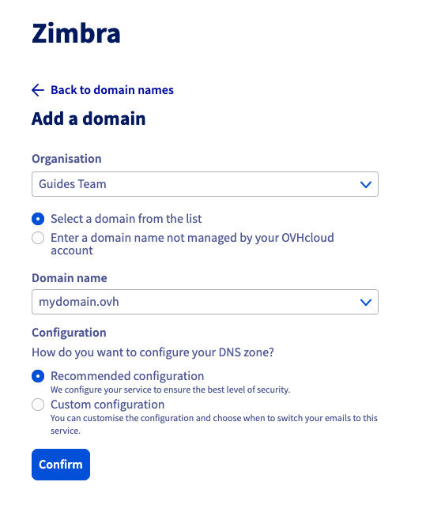{.thumbnail .w-500}
>>
>> To configure your DNS zone, select one of the following two options:
>>
>> - **Recommended configuration**: Your DNS zone will be configured automatically. This option is suitable if you have not configured an email solution on your domain name.
>> - **Custom configuration**: If you have already configured an email solution on your domain name, you can choose the elements that interest you.
>>    - *Configure the MX record automatically*: This allows you to enter the OVHcloud incoming servers automatically (applies to all OVHcloud email solutions).
>>    - *Configure the SPF record automatically*: This allows you to enter the record automatically, authorizing the OVHcloud sending email servers to send your emails. This registration is valid for all OVHcloud email solutions.
>>    - *Configure the DKIM record automatically*: it allows you to automatically enter the records required to authenticate your email sending
>>    - *Automatically configure the SRV record*: it allows the automatic configuration of the parameters of an email account when you add it to an email software (Outlook, Mail for Mac, Thunderbird, etc.).
>>
>> 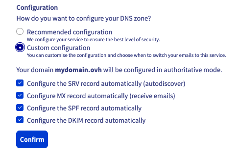{.thumbnail .w-500}
>>
>> Click `Confirm`{.action} to finish adding your domain and start the configuration process.
>>
> **External domain**
>>
>> Enter a domain name that is not managed in your Control Panel. Make sure that you have the permissions to modify the DNS zone for the domain name concerned.
>>
>> Then click `Confirm`{.action}
>>
>> {.thumbnail .w-500}
>>
>> The window below will open. You will need to enter this CNAME record in the domain name’s DNS zone, so that it can be validated on your Zimbra platform.
>>
>> {.thumbnail .w-500}
>>
>> > [!warning]
>> >
>> > If the CNAME record is not visible in the DNS zone after 48 hours, the operation is cancelled. You will then need to retry the operation.

#### Modify a domain name 

You can modify your domain name to change its organization or to check its associated DNS records.

In the `Domain`{.action} tab of your Zimbra service, click on the "&#8285;" icon to the right of the domain name concerned to display the options.

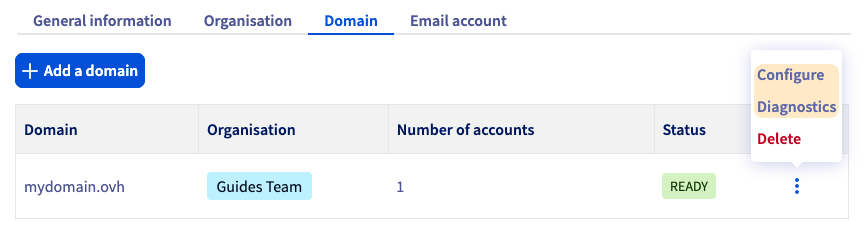{.thumbnail .w-500}

- Click `Configure`{.action} to modify the organization associated with your domain name.
- Click `Diagnostics`{.action} to display the diagnostic interface for the domain name DNS records. You will need to ensure that no alerts are displayed for each of the DNS records listed in the tabs. Follow the instructions detailed in each tab with an alert to configure the DNS records:
    - **MX**: Essential for receiving your emails.
    - **SPF**: Security record that is required by the majority of recipient email servers to legitimize OVHcloud email sending servers with your domain name.
    - **DKIM**: Provides a signature system for each email sent by your Zimbra service. The signature is verified by the recipient using the public key visible in your DNS zone.
    - **SRV**: Facilitates the configuration of your Zimbra account when you configure it on an email software (Outlook, Mail for Mac, Thunderbird, etc.).

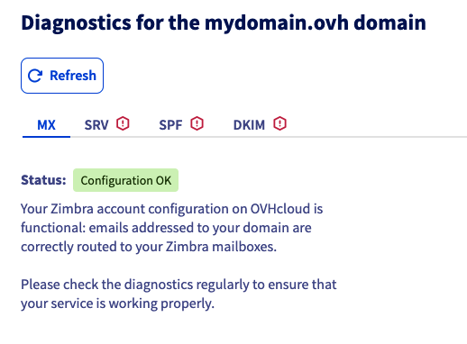{.thumbnail .w-500}

### Email accounts 

You can manage your Zimbra service email addresses from the `Email accounts`{.action} tab. The table displays the list of email accounts on your service, as well as 3 pieces of information for each:

- **Organization**: If your email account domain name is linked to an organization, you will automatically find its label in this column.
- **Offer**: Since your Zimbra service can host several Zimbra solutions, you will find the solution associated with your email account in this column.
- **Size**: This column shows the total capacity of your email account and the space it currently occupies.

At the top of this page, you will also find a link to [Webmail](/links/web/email), so that you can log in directly to the content of your email account via your web browser.

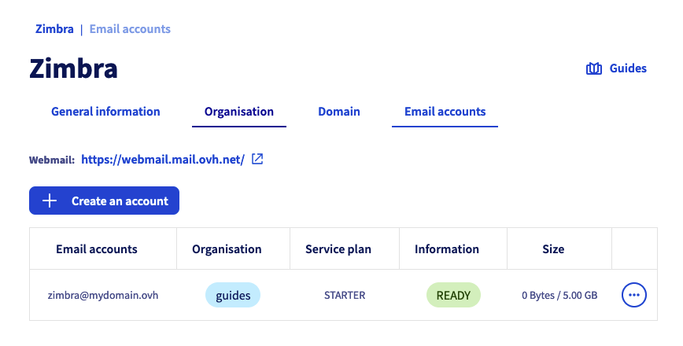{.thumbnail .w-500}

#### Create an email account 

To create an email account on your Zimbra service, click on the `Email accounts`{.action} tab, then `Create an account`{.action}.

Fill in the information displayed.

- **Email account**: Enter the *account name* that your email address will contain (your "first name.surname", for example), and *select a domain name* in the dropdown menu.

> [!warning]
>
> The name of your email address must meet the following conditions:
>
> - Minimum 2 characters.
> - Maximum 32 characters.
> - No accents.
> - No special characters, except for the following characters: `.`, `+`, `-` and `_`.

- **First name**: Enter a first name.
- **Name**: Enter a name.
- **Full name**: Enter the name that will appear as a sender when emails are sent from this address.
- **Password**: Set a strong password consisting of (at least) 9 characters, an upper-case letter, a lower-case letter and a number. For security reasons, do not use the same password twice. Choose one that has no relation to your personal information (for example, avoid your surname, first name and date of birth). Change it regularly.

> [!warning]
>
> The password must meet the following requirements:
>
> - Minimum 10 characters.
> - Maximum 64 characters.
> - Minimum 1 upper case.
> - Minimum 1 special character.
> - No accents.

Click `Confirm`{.action} to start creating the account.

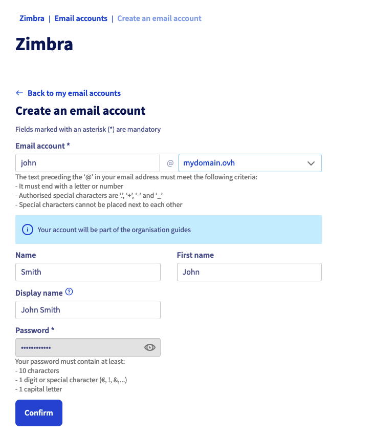{.thumbnail .w-500}

### Change plan 

It is possible to upgrade or downgrade any Zimbra account.

1. Log in to your [OVHcloud Control Panel](/links/manager).
1. Go to the `Web Cloud`{.action} section.
1. Click on `Zimbra Mail`{.action}.
1. Click on the `Email account`{.action} tab.
1. To the right of the email account for which you want to switch to a higher plan, click on `⁝`{.action}.
1. Click on `Change plan`{.action}.

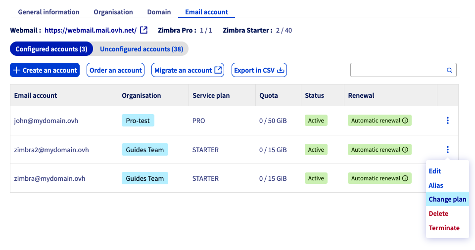{.thumbnail .w-500}

> [!warning]
>
> Before switching to a lower plan, make sure the following points:
>
> - No file is stored on your storage volume "Briefcase" if you are switching to the Starter plan.
> - The content of your email account must be less than 15 GB if you are switching to the Starter plan.

### View your email account 

To view your email account:

- Log in to [webmail](/links/web/email) from a web browser and enter your email address and password. For further details, please refer to our page “[Using Zimbra webmail](/pages/web_cloud/email_and_collaborative_solutions/mx_plan/email_zimbra)”.
- Configure an email software on your computer, smartphone or tablet. Visit our page “[Configuring your Zimbra email address in an email client](/pages/web_cloud/email_and_collaborative_solutions/zimbra/zimbra_mail_apps)”.

### Redirections 

To create a redirection for a Zimbra email address, log in to [webmail](/links/web/email).  
You can create a redirection using inbox rules, called filters in webmail. These rules, which are applied when an email is received, can be used to forward or redirect an email.

To redirect emails from your Zimbra account to another email address, we will apply a transfer rule. Follow the tabs below to set up your redirection.

> [!primary]
>
> In our example below, we have chosen to redirect all incoming emails to another email address. To understand the example in the screenshots, we are logged on to the account **zimbra@mydomain.ovh** and we would like to redirect emails from this address to  **address@example.com**.

> [!tabs]
> **Step 1**
>>
>> Click the &#9881; button in the top right-hand corner of your webmail window, then click `Settings`{.action}.
>>
>>{.thumbnail .w-500}
>>
> **Step 2**
>>
>> Click the `Filters`{.action} section in the settings window, then click the `Add a filter`{.action} button.
>>
>>{.thumbnail .w-500}
>>
> **Step 3**
>>
>> - First click <u>Advanced Mode</u> in the top right-hand corner to set up this rule.
>> - Enter a name for your filter in the `Filter name` box.
>> - Leave the dropdown menu on `all` in the sentence “If an incoming message meets ... of these conditions”.
>> - In the first dropdown menu of the rules, choose `To`, leave `contains`, then enter the source email address in the box to the right.
>> - Under “Then”, select `Forward to` from the drop-down menu and enter the destination email address.
>> - Click `+ Add an action`{.action} below, then select `Keep in Inbox`.
>> - Click `Save`{.action} from your filter window and also from the settings window.
>>
>>{.thumbnail .w-500}
>>

For more details on using Zimbra webmail, please read our guide on [Using Zimbra webmail](/pages/web_cloud/email_and_collaborative_solutions/mx_plan/email_zimbra).

### Alias 

Alias addresses for your email account allow you to keep your account's email address private. You can disclose alias addresses to your contacts and emails sent to these addresses will then be redirected to your email account.

You can create an alias in the [OVHcloud Control Panel](/links/manager). Click on the steps below:

> [!tabs]
> **Step 1**
>>
>> - Click on the `Email accounts`{.action} tab of your Zimbra service.
>> - Click the &#8942; button for the email account concerned.
>> - Click `Modify`{.action}.
>>
>>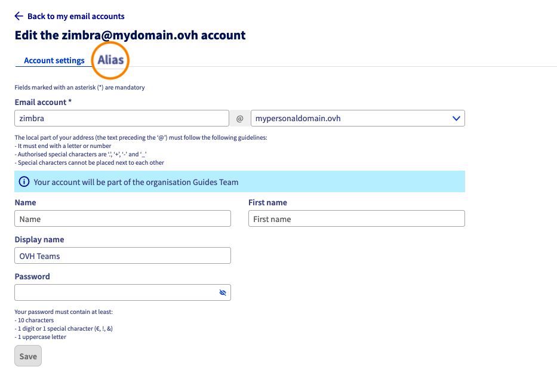{.thumbnail .w-500}
>>
> **Step 2**
>>
>> The window for configuring your email account will open. Click on the `Alias`{.action} tab above.
>>
>>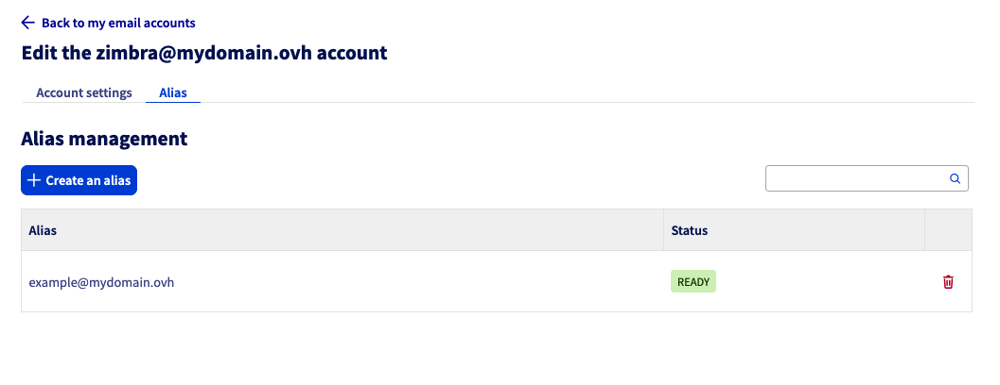{.thumbnail .w-500}
>>
> **Step 3**
>>
>> The following window will contain a list of aliases that you can associate with the account concerned. Click the `Create Alias`{.action} button.
>>
>>{.thumbnail .w-500}
>>
> **Step 4**
>>
>> Determine the address of your alias and select one of the domain names associated with your Zimbra service.
>>
>>{.thumbnail .w-500}
>>

### Automatic replies 

When you need to leave the office and cannot process your emails, you can set up an absence message. Follow the steps below:

- Click the &#9881; button in the top right-hand corner of your webmail window, then click `Settings`{.action}.

{.thumbnail .w-500}

- Click on the `Out of Office` section in the settings window.
- Tick the box "Enable automatic reply during these dates (included)".
- Enter the absence start date before the “From” comment.
- Untick the “No end date” box if you want to determine an absence end date and determine it.
- In the box, enter your absence message.
- Click `Save`{.action} to finish setting up your absence message.

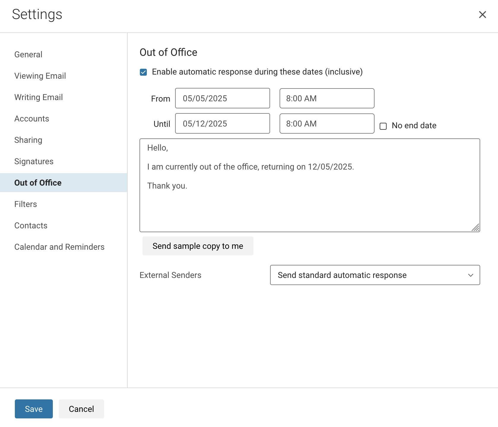{.thumbnail .w-500}

For more details, please read our guide on [Using Zimbra webmail](/pages/web_cloud/email_and_collaborative_solutions/mx_plan/email_zimbra).

## Go further 

[Configuring your Zimbra email address on an email client](/pages/web_cloud/email_and_collaborative_solutions/zimbra/zimbra_mail_apps)

[Use Zimbra webmail](/pages/web_cloud/email_and_collaborative_solutions/mx_plan/email_zimbra)

[OVHcloud Zimbra FAQ](/pages/web_cloud/email_and_collaborative_solutions/mx_plan/faq-zimbra)

For specialised services (SEO, development, etc.), contact [OVHcloud partners](/links/partner).

Join our [community of users](/links/community).
