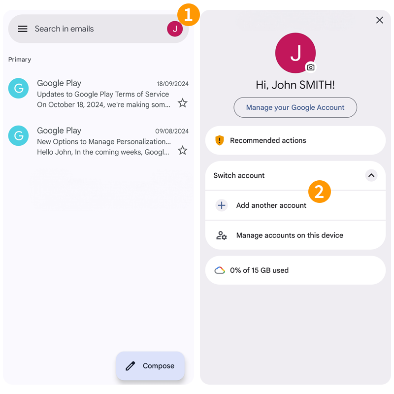
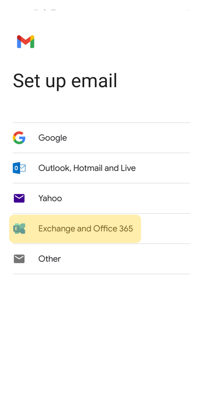
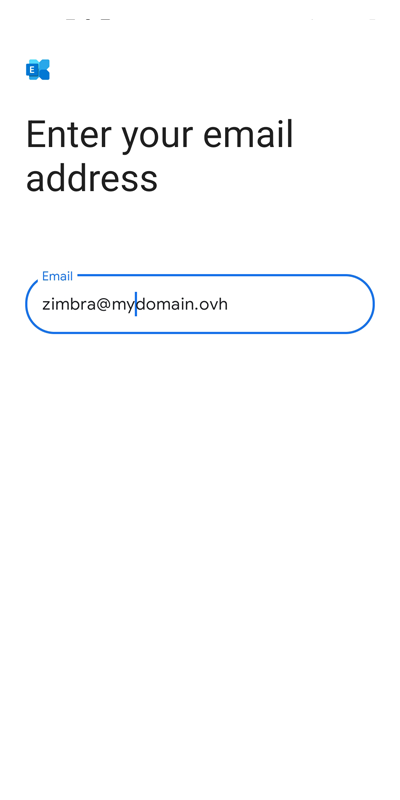
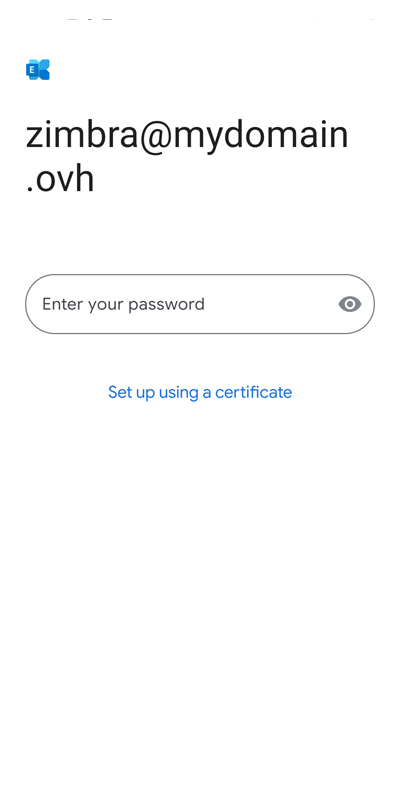
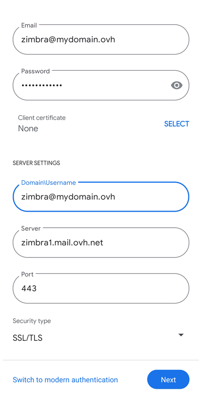
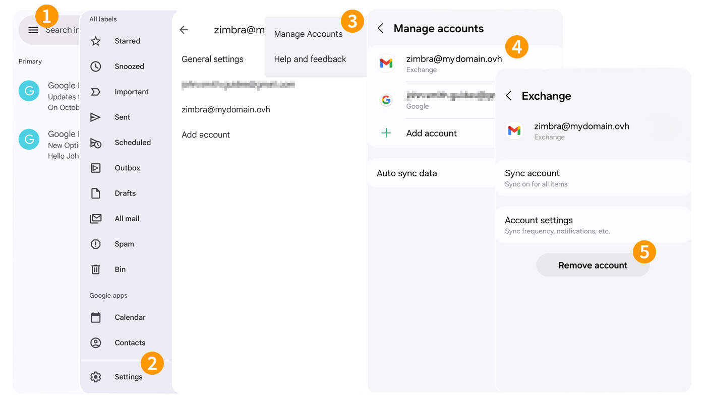

## Ziel

> [!primary]
> Diese Anleitung richtet sich an Kunden, die über das E-Mail-Angebot [Zimbra Pro](/links/web/emails-zimbra) verfügen. Diese Dienstleistung wird ab Juli 2025 als Beta verfügbar sein.

Zimbra Pro E-Mail-Accounts können auf einem Android-Mobiltelefon mithilfe des ActiveSync-Protokolls konfiguriert werden. So können Sie alle kollaborativen Funktionen Ihrer E-Mail-Adresse in einem Schritt konfigurieren. Die Google Gmail-App ist kostenlos im Google Play Store auf Android verfügbar.

**Diese Anleitung erklärt, wie Sie Ihre Zimbra Pro E-Mail-Adresse über das ActiveSync-Protokoll in der Gmail-App für Android konfigurieren.**

> [!warning]
> OVHcloud stellt Ihnen Dienstleistungen zur Verfügung, für deren Konfiguration und Verwaltung Sie die alleinige Verantwortung tragen. Es liegt somit bei Ihnen, sicherzustellen, dass diese ordnungsgemäß funktionieren.
> 
> Wir stellen Ihnen diese Anleitung zur Verfügung, um Ihnen bei der Bewältigung genereller Verwaltungsaufgaben zu helfen. Dennoch empfehlen wir Ihnen, einen [spezialisierten Partner](/links/partner) oder den Herausgeber des Dienstes zu kontaktieren, wenn Sie bei der Administration Ihrer Dienste Hilfe benötigen. Weitere Informationen finden Sie am [Ende dieser Anleitung](#go-further).
>

## Voraussetzungen

- Sie haben einen E-Mail-Account auf der OVHcloud [Zimbra Pro E-Mail-Lösung](/links/web/emails-zimbra) abonniert.
- Die Gmail-App ist auf Ihrem Android-Mobilgerät installiert.
- Sie haben die Login-Daten des E-Mail-Accounts, den Sie einrichten möchten.

> [!primary]
>
> Diese Anleitung wurde für ein Gerät mit Android Version 14 erstellt.

## In der praktischen Anwendung

### Konto hinzufügen

- **Beim ersten Start der Gmail-Anwendung** wird ein Konfigurationsassistent angezeigt:
    - Tippen Sie auf `Weitere E-Mail-Adresse hinzufügen`.
- **Wenn bereits ein Account in der Gmail-App eingerichtet ist**:
    - Tippen Sie auf das Profilbild oben rechts auf Ihrem Bildschirm.
    - Tippen Sie dann auf den Button `+ Weiteres Konto hinzufügen`{.action}.

{.thumbnail .h-500}

Folgen Sie den Installationsschritten, indem Sie auf die Tabs klicken:

> [!tabs]
> **Schritt 1**
>>
>> Wählen Sie `Exchange and Office 365`{.action} als Kontotyp aus.
>>
>> {.thumbnail .h-500}
>>
> **Schritt 2**
>>
>> Geben Sie Ihre E-Mail-Adresse ein und drücken Sie `Weiter`{.action}.
>>
>> {.thumbnail .h-500}
>>
> **Schritt 3**
>>
>> Geben Sie das Passwort Ihrer E-Mail-Adresse ein und drücken Sie `Weiter`{.action}.
>>
>> {.thumbnail .h-500}
>>
> **Schritt 4**
>>
>> Überprüfen und vervollständigen Sie die folgenden Informationen:
>>
>> - **E-Mail**: Dieses Feld ist mit der zuvor angegebenen E-Mail-Adresse vorausgefüllt. Überprüfen Sie, ob Ihre E-Mail-Adresse vollständig und korrekt ist.
>> - **Passwort**: Dieses Feld ist mit dem zuvor eingegebenen Passwort ausgefüllt.
>> - **Domain\Benutzername**: Geben Sie Ihre vollständige E-Mail-Adresse ein.
>> - **Server**: Geben Sie „zimbra1.mail.ovh.net“ ein.
>> - **Port**: Lassen Sie den Standardwert „443“.
>>
>> Zum Abschließen der Konfiguration drücken Sie `Weiter`{.action}.
>>
>> {.thumbnail .h-500}
>>

### E-Mail-Adresse verwenden

Sobald die E-Mail-Adresse eingerichtet ist, können Sie sie verwenden! Sie können ab sofort Nachrichten senden und empfangen sowie Ihre Kalender und Aufgaben verwalten.

OVHcloud bietet Ihnen außerdem eine Webanwendung, mit der Sie über einen Webbrowser auf Ihren E-Mail-Account zugreifen können. Diese ist über[Webmail](/links/web/email) verfügbar. Sie können sich mit den Login-Daten Ihres E-Mail-Accounts anmelden. Wenn Sie Fragen zur Verwendung haben, lesen Sie unsere Anleitung „[Zimbra Webmail verwenden](/pages/web_cloud/email_and_collaborative_solutions/mx_plan/email_zimbra)“.

### Wie kann ich vorhandene Einstellungen ändern?

Um die Einstellungen eines bereits konfigurierten E-Mail-Accounts zu ändern, befolgen Sie die folgenden Anweisungen:

1. Tippen Sie oben links auf das Menü `☰`.
1. Tippen Sie dann unten in der linken Spalte auf `Einstellungen`.
1. Wählen Sie das entsprechende Konto aus.
1. Tippen Sie unten auf der angezeigten Seite auf `Empfangseinstellungen`.
1. Überprüfen Sie die Einstellungen des betreffenden Kontos im Kapitel [Konto hinzufügen](#add-account) unter **Schritt 4**.

{.thumbnail .h-500}

### Wie lösche ich einen E-Mail-Account?

1. Tippen Sie oben links auf das Menü `☰`.
1. Tippen Sie dann unten in der linken Spalte auf `Einstellungen`.
1. Tippen Sie oben rechts auf das Menü `⋮`, und tippen Sie dann auf `Konten verwalten`.
1. Wählen Sie das entsprechende Konto aus.
1. Tippen Sie abschließend auf `Account löschen`.

{.thumbnail .h-500}

## Weitere Informationen 

> [!primary]
>
> Weitere Informationen zum Einrichten einer E-Mail-Adresse in der Gmail-App auf Android finden Sie im [Google Help Center](https://support.google.com/mail/answer/6078445?hl=de-CA&co=GENIE.Platform%3DAndroid#zippy=%2CaAdd-a-account).

Kontaktieren Sie für spezialisierte Dienstleistungen (SEO, Web-Entwicklung etc.) die [OVHcloud Partner](/links/partner).

Wenn Sie Hilfe bei der Nutzung und Konfiguration Ihrer OVHcloud Lösungen benötigen, beachten Sie unsere [Support-Angebote](/links/support).

Treten Sie unserer [User Community](/links/community) bei.
