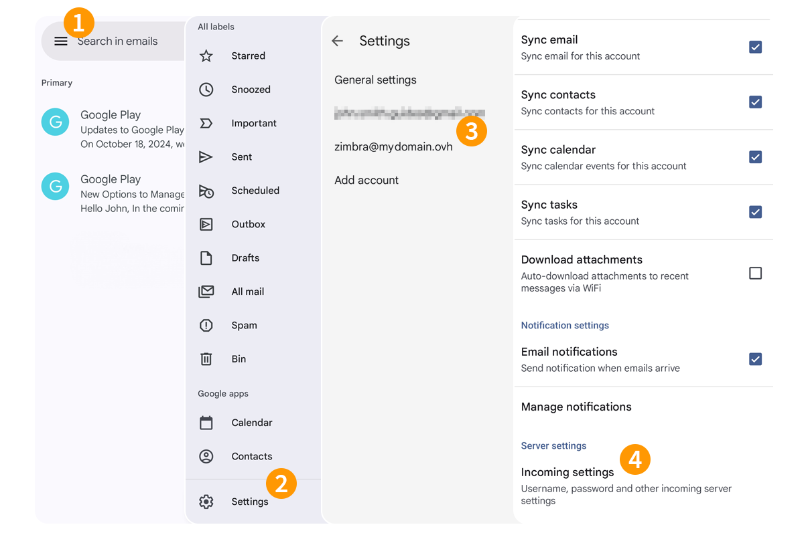

## Objectif

> [!primary]
> Ce guide nécessite le service [Zimbra Pro](https://www.ovhcloud.com/fr/emails/zimbra-emails/) qui sera disponible en bêta à partir de juillet 2025.

Les comptes Zimbra Pro peuvent être configurés en utilisant le protocole Active Sync sur un mobile Android, cela vous permet de configurer l'ensemble des fonctionnalités collaboratives de votre adresse e-mail en une seule fois. L'application Gmail de Google sur Android est disponible gratuitement depuis le Google Play Store.

**Découvrez comment configurer son adresse e-mail Zimbra Pro sur l'application mobile Gmail pour Android via le protocole Activesync**

> [!warning]
>
> OVHcloud met à votre disposition des services dont la configuration, la gestion et la responsabilité vous incombent. Il vous revient de ce fait d'en assurer le bon fonctionnement.
>
> Nous mettons à votre disposition ce guide afin de vous accompagner au mieux sur des tâches courantes. Néanmoins, nous vous recommandons de faire appel à un [partenaire spécialisé](https://marketplace.ovhcloud.com/c/support-collaboration) et/ou de contacter l'éditeur du service si vous éprouvez des difficultés. En effet, nous ne serons pas en mesure de vous fournir une assistance. Plus d'informations dans la section « Aller plus loin » de ce guide.

## Prérequis

- Disposer d’une adresse e-mail [Zimbra Pro](/links/web/zimbra).
- Disposer de l'application Gmail sur votre appareil mobile Android.
- Posséder les identifiants relatifs à l'adresse e-mail que vous souhaitez paramétrer.

> [!primary]
>
> Cette documentation a été réalisée depuis un appareil utilisant la version 14 d'Android.

## En pratique

### Ajouter le compte 

- **Lors du premier démarrage de l'application** : un assistant de configuration s'affiche, appuyez sur `Ajouter une autre adresse e-mail`.
- **Si un compte a déjà été paramétré** :
    - Appuyez sur la photo de profil dans la partie supérieure droite de votre écran.
    - Appuyez ensuite sur le bouton `+ Ajouter un autre compte`{.action}.

{.thumbnail .h-500}

Suivez les étapes d'installation en cliquant sur les onglets ci-dessous :

> [!tabs]
> **Etape 1**
>>
>> Sélectionnez `Exchange and Office 365`{.action} comme type de compte.
>>
>> {.thumbnail .h-500}
>>
> **Etape 2**
>>
>> Saisissez votre adresse e-mail et appuyez sur `Suivant`{.action}.
>>
>> {.thumbnail .h-500}
>>
> **Etape 3**
>>
>> Saisissez le mot de passe de votre adresse e-mail et appuyez sur `Suivant`{.action}.
>>
>> {.thumbnail .h-500}
>>
> **Etape 4**
>>
>> Complétez les informations suivantes :
>>
>> - **Adresse e-mail** : laissez votre adresse e-mail complète.
>> - **Mot de passe** : laissez le mot de passe de votre adresse e-mail.
>> - **Domaine/Nom d'utilisateur** : saisissez votre adresse e-mail complète.
>> - **Serveur** : saisissez « zimbra1.mail.ovh.net ».
>> - **Port** : laissez la valeur « 443 ».
>>
>> Pour finaliser la configuration, appuyez sur `Suivant`{.action}.
>>
>> {.thumbnail .h-500}
>>

### Utiliser l'adresse e-mail

Une fois l'adresse e-mail configurée, il ne reste plus qu’à l'utiliser ! Vous pouvez dès à présent envoyer et recevoir des messages, mais aussi gérer vos calendriers et tâches.

OVHcloud propose aussi une application web permettant d'accéder à votre adresse e-mail depuis un navigateur internet. Celle-ci est accessible via ce lien : [Webmail](/links/web/email). Vous pouvez vous y connecter grâce aux identifiants de votre adresse e-mail. Pour toute question relative à son utilisation, aidez-vous de notre guide [Utiliser le webmail Zimbra](/pages/web_cloud/email_and_collaborative_solutions/mx_plan/email_zimbra).

### Comment modifier les paramètres existants ?

Si votre compte e-mail est déjà paramétré et que vous souhaitez modifier les paramètres :

1. Appuyer sur le menu `☰` en haut à gauche.
1. Appuyez ensuite sur `Paramètres` dans le bas de la colonne de gauche.
1. Sélectionnez le compte concerné.
1. Dans le bas de la page qui s'affiche, appuyez sur `Paramètres de réception`.
1. Référez-vous à l'**Étape 4** du chapitre [Ajouter le compte](#add-account) pour vérifier les paramètres du compte concerné.

{.thumbnail .h-500}

### Comment supprimer un compte e-mail ?

1. Appuyer sur le menu `☰` en haut à gauche.
1. Appuyez ensuite sur `Paramètres` dans le bas de la colonne de gauche.
1. Appuyer sur le menu `⋮` en haut à droite, puis appuyez sur `Gérer les comptes`.
1. Sélectionnez le compte concerné.
1. Pour finir, appuyez sur `Supprimer le compte`.

{.thumbnail .h-500}

## Aller plus loin

> [!primary]
>
> Pour plus d'informations sur la configuration d'une adresse e-mail depuis l'application Gmail sur Android, consultez [le centre d'aide de Google](https://support.google.com/mail/answer/6078445?hl=fr-CA&co=GENIE.Platform%3DAndroid#zippy=%2Cajouter-un-compte).

Pour des prestations spécialisées (référencement, développement, etc), contactez les [partenaires OVHcloud](/links/partner).

Si vous souhaitez bénéficier d'une assistance à l'usage et à la configuration de vos solutions OVHcloud, nous vous proposons de consulter nos différentes [offres de support](/links/support).

Échangez avec notre [communauté d'utilisateurs](/links/community).