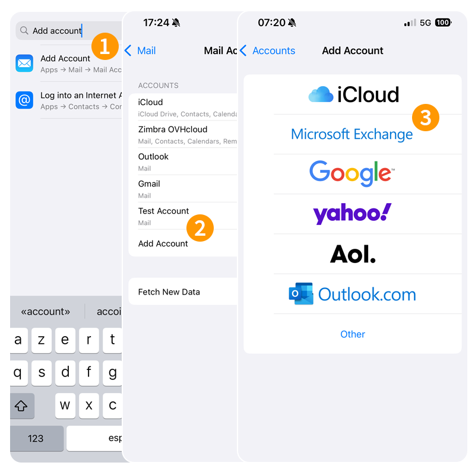
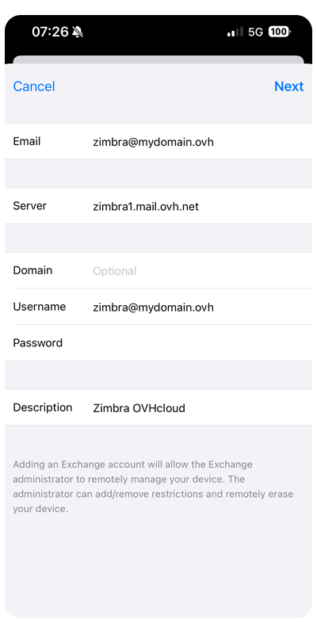

## Objective

> [!primary]
>
> This guide is aimed at customers with the email solution [Zimbra Pro](/links/web/emails-zimbra). This service will be available in beta version from July 2025.

Zimbra Pro accounts can be configured on iPhone or iPad using ActiveSync protocol. This allows you to configure all the collaborative features of your email address at once. The Mail application is available natively on iOS.

**Find out how to configure your Zimbra Pro email address on the Mail for iOS mobile app via the ActiveSync protocol.**

> [!warning]
>
> OVHcloud provides services for which you are responsible with regard to their configuration and management. It is therefore your responsibility to ensure that they function correctly.
> 
> This guide is designed to help you with common tasks. Nevertheless, we recommend contacting a [specialist provider](/links/partner) or the software publisher if you encounter any difficulties. OVHcloud cannot provide you with technical support in this regard. You can find more information in the [Go further](#go-further) section of this guide.
> 

## Requirements

- A [Zimbra Pro](/links/web/emails-zimbra) account
- The Mail app installed on your device
- The login details for the email account you would like to configure

## Instructions

### Add the  account

From your iPhone or iPad, go to the "Settings" section, then follow the installation steps by clicking on the **4** tabs below:

> [!tabs]
> **Step 1**
>>
>> 1. Enter “add an account” in the search bar.
>> 2. Tap `Add Account`{.action}.
>> 3. Select `Microsoft Exchange`{.action}.
>>
>> {.thumbnail .h-500}
>>
> **Step 2**
>>
>> 1. Enter your email address and a description, then press `Next`{.action}.
>> 2. In the window that pops up, choose `Configure manually`{.action}.
>>
>> {.thumbnail .h-500}
>>
> **Step 3**
>>
>> - **Email**: Enter your full email address.
>> - **Password**: Enter the password associated with your email address.
>> - **Description**: Enter a name that can be used to identify this account, along with other email accounts saved on email.
>>
>> {.thumbnail .h-500}
>>
> **Step 4**
>>
>> In the next window, tick `Advanced settings`{.action} and enter the following information:
>>
>> - **Email**: Enter your full email address.
>> - **Server**: Enter “zimbra1.mail.ovh.net”.
>> - **Domain**: Leave this field blank.
>> - **Username**: Enter your full email address.
>> - **Password**: Enter the password associated with the email address.
>> - **Description**: Enter a name that can be used to identify this account, along with other email accounts saved on email.
>>
>> To finalize the configuration, tap `Next`{.action} and select the features you want to use on your iPhone or iPad.
>>
>> {.thumbnail .h-500}
>>

> [!warning]
>
> If you encounter a sending or receiving error after following the configuration steps above, please refer to the “[Modify existing settings](#modify-settings)” section of this guide.

### Use the email address

Once you have configured your email address, you can start using it! You can now send and receive messages, and manage your calendars and tasks.

OVHcloud also offers a web application that allows you to access your email address from an internet browser. You can log in to the [OVHcloud webmail](/links/web/email) using your email credentials. If you have any questions on how to use it, please read our guide on [Using Zimbra webmail](/pages/web_cloud/email_and_collaborative_solutions/mx_plan/email_zimbra).

### How do I modify existing settings?

From your iPhone or iPad, go to the "Settings" section, then follow the instructions below:

1. Enter “mail accounts” in the search bar.
1. Select the email account concerned.
1. Press `Account Settings`{.action} at the bottom of the page.

{.thumbnail .h-500}

Find the settings in **Step 4** of the [Add account](#add-account) chapter.

### How do I delete an email account?

From your iPhone or iPad, go to the "Settings" section, then follow the instructions below:

1. From the search bar, enter “email accounts”.
1. Select the email account concerned.
1. Press `Delete Account`{.action}.

{.thumbnail .h-500}

## Go further 

> [!primary]
>
> For more information on configuring an email address from the Mail app on iOS, visit [Apple Help Center](https://support.apple.com/en-gb/102619).

For specialised services (SEO, development, etc.), contact [OVHcloud partners](/links/partner).

If you would like assistance using and configuring your OVHcloud solutions, please refer to our [support offers](/links/support).

Join our [community of users](/links/community).
