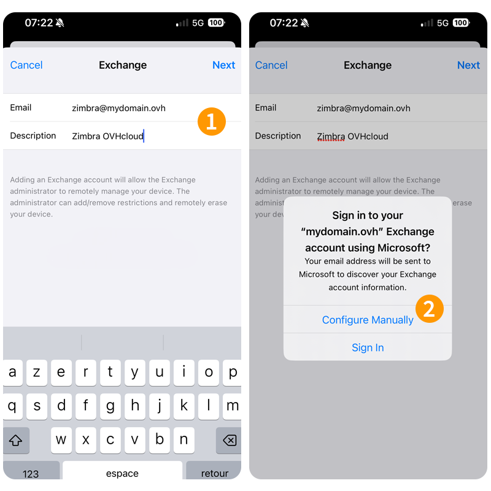
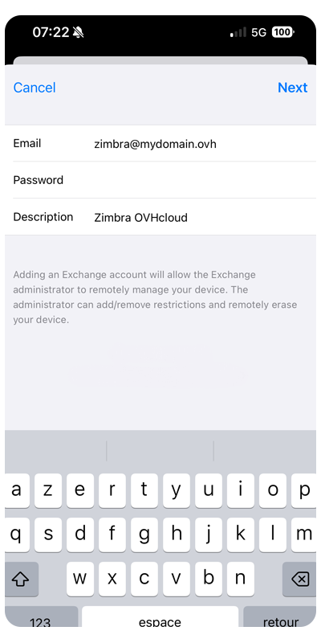
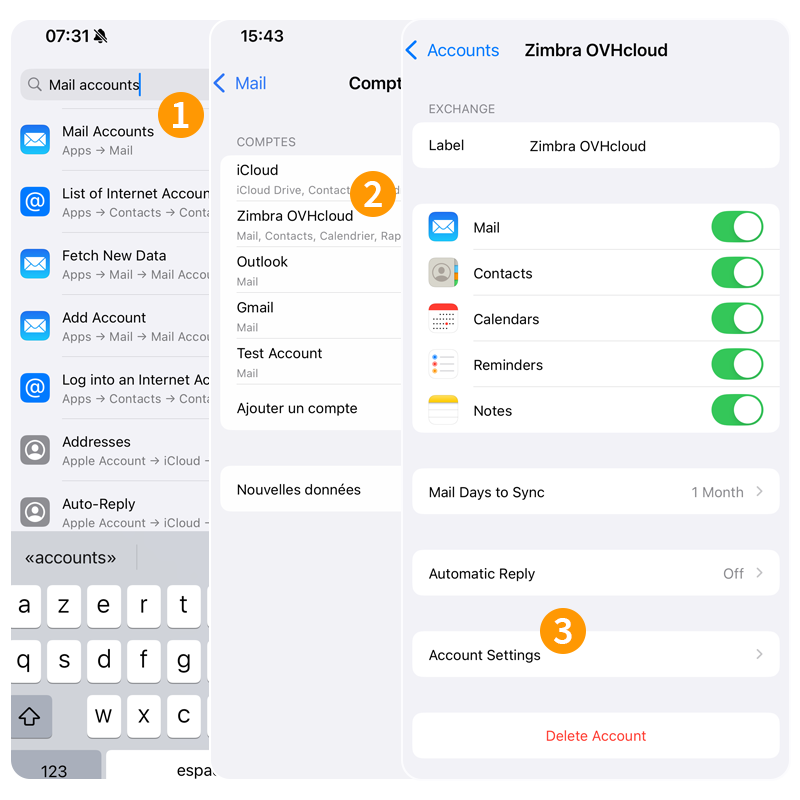
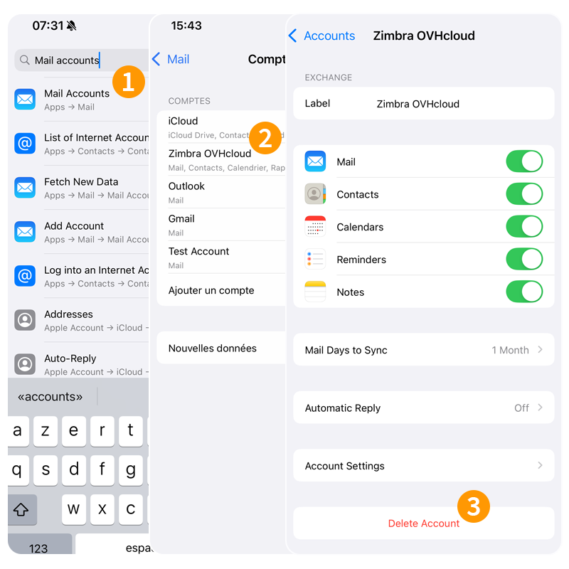

## Objetivo

> [!primary]
> Este guia destina-se aos clientes que possuem um serviço de e-mail [Zimbra Pro](/links/web/emails-zimbra). Este serviço estará disponível em beta a partir de julho de 2025.

As contas Zimbra Pro podem ser configuradas num iPhone ou num iPad utilizando o protocolo AtiveSync. Isto permite-lhe configurar o conjunto das funcionalidades colaborativas do seu endereço de e-mail de uma só vez. A aplicação Mail está disponível de forma nativa no iOS.

**Saiba como configurar o seu endereço de e-mail Zimbra Pro na aplicação móvel Mail para iOS através do protocolo AtiveSync.**

> [!warning]
>
> A OVHcloud oferece-lhe serviços cuja configuração, gestão e responsabilidade é da sua responsabilidade. É da sua responsabilidade assegurar o bom funcionamento destes serviços.
>
> Este manual foi concebido para o ajudar a realizar tarefas comuns. No entanto, se encontrar dificuldades, recomendamos que recorra a um [parceiro especializado](https://marketplace.ovhcloud.com/c/support-collaboration) e/ou que contacte o editor do serviço. Não poderemos proporcionar-lhe assistência técnica. Para mais informações, consulte "[Quer saber mais?](#go-further)" deste guia.

## Requisitos

- Ter um endereço de e-mail [Zimbra Pro](/links/web/emails-zimbra).
- Ter a aplicação Mail no seu iPhone ou iPad.
- Dispor das credenciais relativas ao endereço de e-mail que pretende configurar.

## Instruções

### Adicionar a conta 

A partir do seu iPhone ou do seu iPad, aceda aos `Definições` e siga as etapas de instalação ao clicar sucessivamente nos **4** separadores abaixo:

> [!tabs]
> **Etapa 1**
>>
>> 1. Introduza "adicionar uma conta" na barra de procura.
>> 2. Toque em `Adicionar uma conta`{.action}.
>> 3. Selecione `Microsoft Exchange`{.action}.
>>
>> {.thumbnail .h-500}
>>
> **Etapa 2**
>>
>> 1. Introduza o seu endereço de e-mail e uma descrição e prima `Seguinte`{.action}.
>> 2. Na janela que surgir, escolha `Configurar manualmente`{.action}.
>>
>> {.thumbnail .h-500}
>>
> **Etapa 3**
>>
>> - **Email**: Introduza o seu endereço de e-mail completo.
>> - **Palavra-passe**: Introduza a palavra-passe associada ao seu endereço de e-mail.
>> - **Description**: Insira um nome que permita identificar esta conta entre as outras contas de e-mail registadas.
>>
>> {.thumbnail .h-500}
>>
> **Etapa 4**
>>
>> Na seguinte janela, selecione `Configurações avançadas`{.action} e introduza as seguintes informações:
>>
>> - **Email**: Introduza o seu endereço de e-mail completo.
>> - **Servidor**: Introduza "zimbra1.mail.ovh.net".
>> - **Domínio**: Deixe este campo em branco.
>> - **Nome de utilizador**: Introduza o seu endereço de e-mail completo.
>> - **Palavra-passe**: Introduza a palavra-passe associada ao endereço de e-mail.
>> - **Description**: Insira um nome que permita identificar esta conta entre as outras contas de e-mail registadas.
>>
>> Para finalizar a configuração, toque em `Seguinte`{.action} e selecione as funcionalidades que pretende explorar no seu iPhone ou iPad.
>>
>> {.thumbnail .h-500}
>>

> [!warning]
>
> Se, depois de seguir os passos de configuração acima indicados, não enviar ou receber os dados corretos, consulte a secção "[Alterar definições existentes](#modify-settings)" deste manual.

### Utilizar o endereço de e-mail

Depois de configurar um endereço de e-mail, pode começar a utilizá-lo! Já pode enviar e receber mensagens e gerir os calendários e as tarefas.

A OVHcloud também disponibiliza uma aplicação web que pode usar para aceder ao seu e-mail diretamente a partir do browser. Pode ligar a [webmail OVHcloud](/links/web/email) com as credenciais do seu endereço de e-mail. Para qualquer questão relativa à sua utilização, consulte o guia "[Utilizar o webmail Zimbra](/pages/web_cloud/email_and_collaborative_solutions/mx_plan/email_zimbra)".

### Como alterar os parâmetros existentes? 

A partir do seu iPhone ou do seu iPad, aceda às "Definições" e siga as instruções abaixo:

1. Introduza "contas de e-mail" na barra de pesquisa.
1. Selecione a conta de e-mail correspondente.
1. Toque em `Definições da conta`{.action} na parte inferior da página.

{.thumbnail .h-500}

Consulte os parâmetros para **etapa 4** do capítulo "[Adicionar a conta](#add-account)".

### Como eliminar uma conta de e-mail? 

A partir do seu iPhone ou do seu iPad, aceda às `Definições` e siga as instruções abaixo:

1. Na barra de pesquisa, introduza "contas de e-mail".
1. Selecione a conta de e-mail correspondente.
1. Prima `Eliminar conta`{.action}.

{.thumbnail .h-500}

## Quer saber mais? 

> [!primary]
>
> Para obter mais informações sobre a configuração de um endereço de e-mail a partir da aplicação Mail para o iOS, visite [Centro de Ajuda da Apple](https://support.apple.com/pt-pt/102619).

Para serviços especializados (referenciamento, desenvolvimento, etc.), contacte os [parceiros OVHcloud](/links/partner).

Se pretender usufruir de uma assistência na utilização e na configuração das suas soluções OVHcloud, consulte as nossas diferentes [ofertas de suporte](/links/support).

Fale com a nossa [comunidade de utilizadores](/links/community).