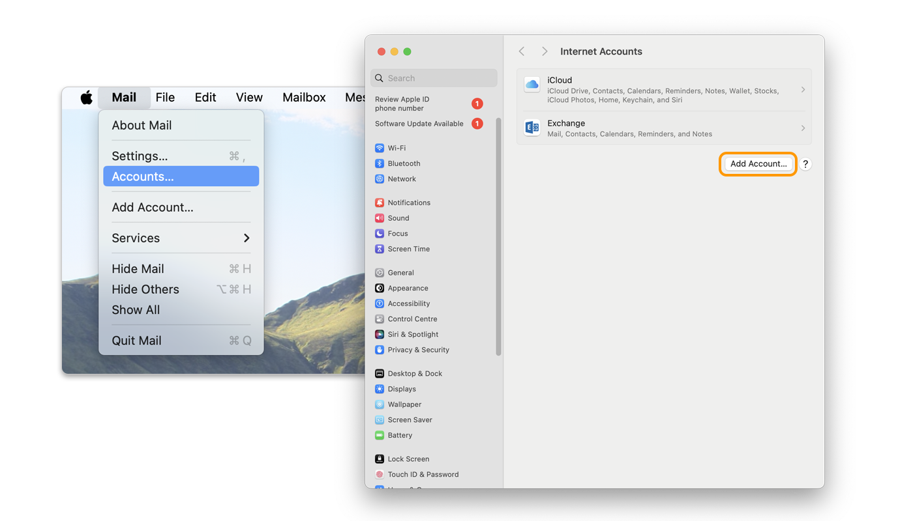
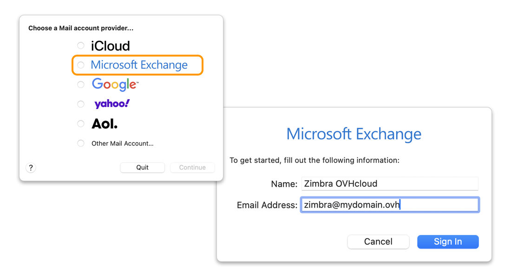
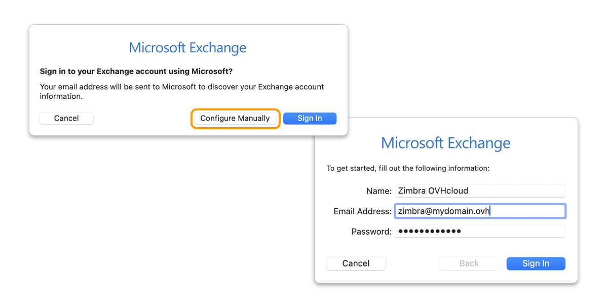
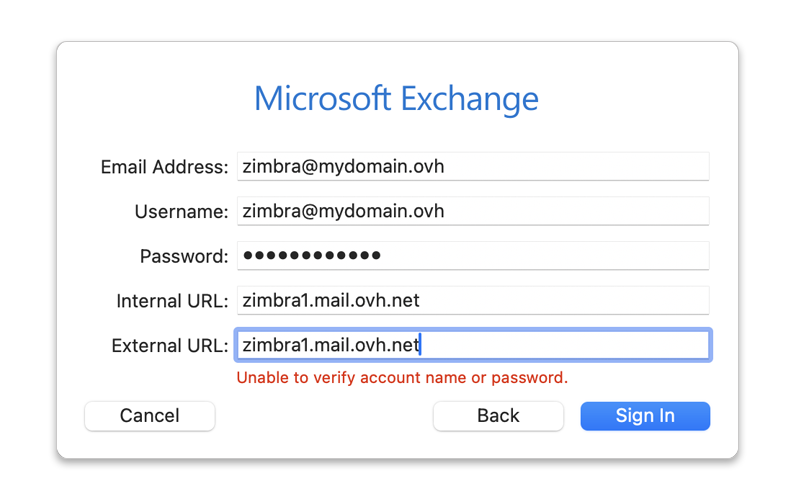
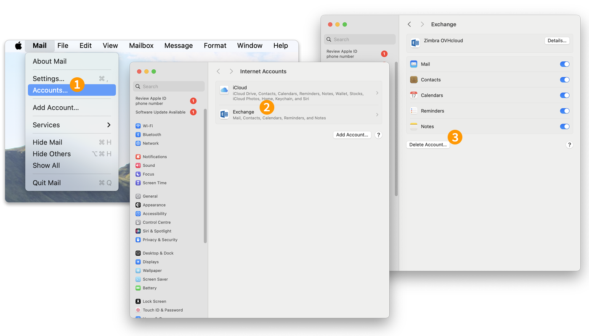

## Objectif

> [!primary]
> Ce guide s'adresse aux clients possédant une offre e-mail [Zimbra Pro](/links/web/emails-zimbra). Ce service sera disponible en bêta à partir de juillet 2025.

Les comptes Zimbra Pro peuvent être configurés sur un macOS en utilisant le protocole EWS (**E**xchange **W**eb **S**ervices). Cela vous permet de configurer l'ensemble des fonctionnalités collaboratives de votre adresse e-mail en une seule fois. L'application Mail est disponible nativement sur macOS.

**Découvrez comment configurer votre adresse e-mail Zimbra Pro sur l'application Mail sur Mac via le protocole EWS.**

> [!warning]
>
> OVHcloud met à votre disposition des services dont la configuration, la gestion et la responsabilité vous incombent. Il est de votre responsabilité d'assurer le bon fonctionnement de ces services.
>
> Ce guide est conçu pour vous aider à accomplir des tâches courantes. Néanmoins, nous vous recommandons de faire appel à un [partenaire spécialisé](https://marketplace.ovhcloud.com/c/support-collaboration) et/ou de contacter l'éditeur du service si vous éprouvez des difficultés. En effet, nous ne serons pas en mesure de vous fournir une assistance. Pour plus d'informations, consultez la section [Aller plus loin](#go-further) de ce guide.

## Prérequis

- Disposer d’une adresse e-mail [Zimbra Pro](/links/web/emails-zimbra).
- Disposer de l'application Mail sur votre Mac.
- Posséder les identifiants relatifs à l'adresse e-mail que vous souhaitez paramétrer.

## En pratique

### Ajouter le compte 

- **Lors du premier démarrage de l'application Mail**, un assistant de configuration s'affiche directement et vous invite à choisir votre type de compte.

- **Si un compte est déjà paramétré sur l'application Mail** : 
    - Cliquez sur `Mail`{.action} dans la barre de menu en haut de votre écran.
    - Cliquez sur `Comptes`{.action}.
    - Dans la fenêtre « Comptes Internet » qui s'affiche, cliquez sur `Ajouter un compte`{.action}

{.thumbnail .h-500}

Suivez les étapes d'installation en cliquant successivement sur les **3** onglets ci-dessous :

> [!tabs]
> **Étape 1**
>>
>> - Sélectionnez `Microsoft Exchange`{.action}.
>> - Définissez un **nom** et saisissez votre **adresse e-mail**.
>> - Cliquez ensuite sur `Se connecter`{.action}.
>>
>> {.thumbnail .h-500}
>>
> **Étape 2**
>>
>> - Choisissez `Configurer manuellement`{.action} depuis la fenêtre qui apparaît.
>> - Saisissez ensuite le **mot de passe** de votre adresse e-mail en complément des informations déjà saisies.
>>
>> {.thumbnail .h-500}
>>
> **Étape 3**
>>
>> Vérifiez et complétez les informations suivantes :
>>
>> - **Adresse e-mail** : Saisissez votre adresse e-mail complète.
>> - **Nom d'utilisateur** : Renseignez votre adresse e-mail complète.
>> - **Mot de passe** : Renseignez le mot de passe associé à votre adresse e-mail.
>> - **URL interne** : Saisissez « zimbra1.mail.ovh.net ».
>> - **URL externe** : Saisissez « zimbra1.mail.ovh.net ».
>>
>> Pour finaliser la configuration, appuyez sur `Se connecter`{.action} et sélectionnez les fonctionnalités que vous souhaitez explorer sur votre Mac.
>>
>> {.thumbnail .h-500}
>>
>> > [!warning]
>> >
>> > Il est normal de voir apparaître le message en rouge « **Impossible de vérifier le nom ou le mot de passe du compte** » lorsque la fenêtre apparaît pour la première fois. Néanmoins, si ce message persiste après validation, cela signifie que les informations saisies sont erronées.

> [!warning]
>
> Si vous rencontrez un défaut d'envoi ou de réception après avoir suivi les étapes de configuration ci-dessus, consultez la rubrique « [Modifier les paramètres existants](#modify-settings) » de ce guide.

### Utiliser l'adresse e-mail

Une fois l'adresse e-mail configurée, vous pouvez commencer à l'utiliser ! Vous pouvez dès à présent envoyer et recevoir des messages, mais aussi gérer vos calendriers et tâches.

OVHcloud propose également une application web permettant d'accéder à votre adresse e-mail depuis un navigateur Internet. Vous pouvez connecter au [webmail OVHcloud](/links/web/email) avec les identifiants de votre adresse e-mail. Pour toute question relative à son utilisation, consultez notre guide « [Utiliser le webmail Zimbra](/pages/web_cloud/email_and_collaborative_solutions/mx_plan/email_zimbra) ».

### Comment modifier les paramètres existants ?

L'application Mail sur Mac ne permet pas de modifier les paramètres serveur d'un compte e-mail Exchange.

Si votre compte e-mail est déjà configuré et que vous souhaitez en modifier les paramètres, vous devez alors le supprimer et le recréer.

Pour supprimer un compte e-mail Exchange, suivez les instructions ci-dessous :

1. Cliquez sur `Mail`{.action} dans la barre de menu en haut de votre écran.
1. Cliquez sur `Comptes`{.action} et sélectionnez le compte e-mail concerné.
1. Appuyez sur `Supprimer le compte`{.action}.

{.thumbnail .h-500}

> [!success]
>
> Une fois votre compte e-mail supprimé, suivez les étapes d'installation indiquées dans la rubrique « [Ajouter le compte](#add-account) » de ce guide.

## Aller plus loin 

> [!primary]
>
> Pour plus d'informations sur la configuration d'une adresse e-mail depuis l'application Mail sur macOS, consultez le [centre d'aide Apple](https://support.apple.com/fr-fr/102619).

Pour des prestations spécialisées (référencement, développement, etc.), contactez les [partenaires OVHcloud](/links/partner).

Si vous souhaitez bénéficier d'une assistance à l'usage et à la configuration de vos solutions OVHcloud, nous vous proposons de consulter nos différentes [offres de support](/links/support).

Échangez avec notre [communauté d'utilisateurs](/links/community).