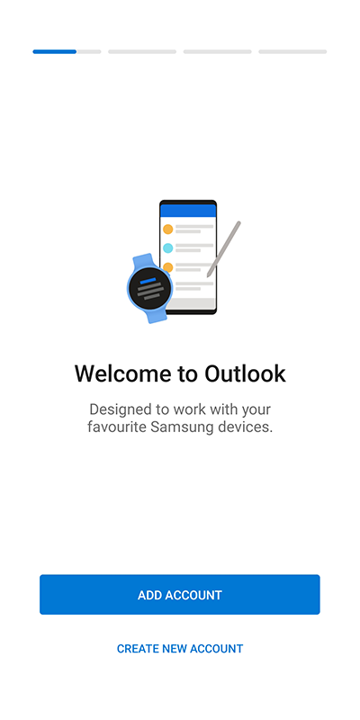
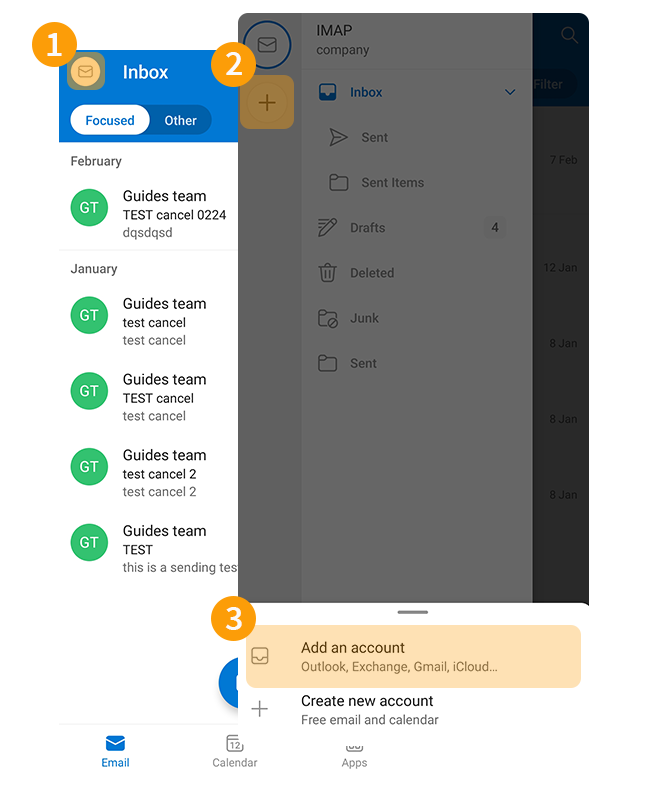
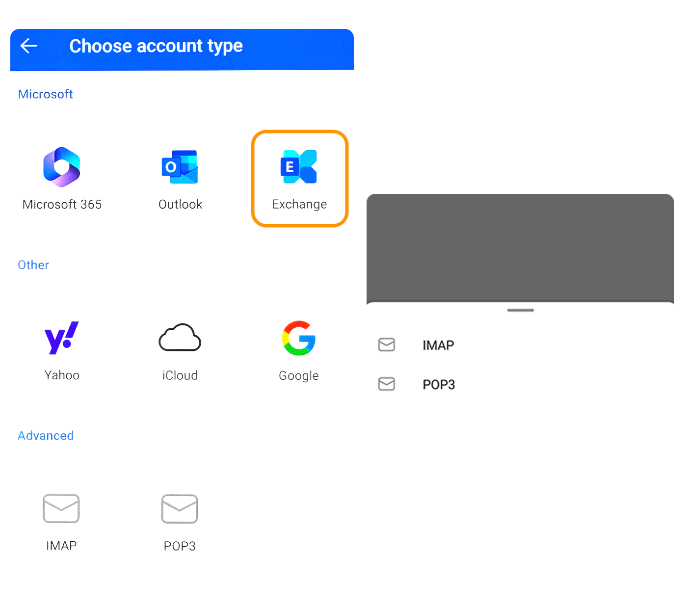
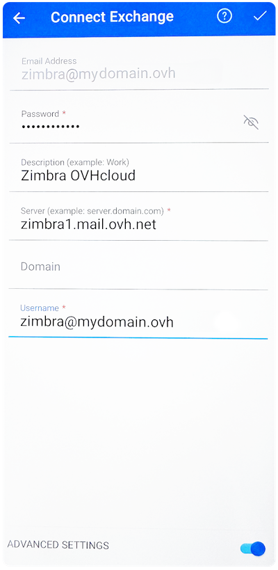
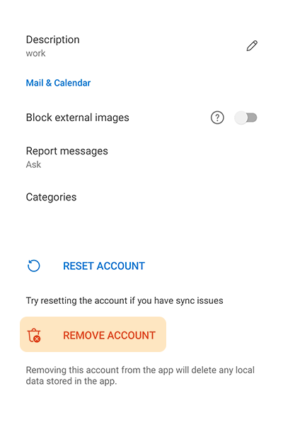

## Objetivo

> [!primary]
> Este guia destina-se aos clientes que possuem um serviço de e-mail [Zimbra Pro](/links/web/emails-zimbra). Este serviço estará disponível em beta a partir de julho de 2025.

As contas do Zimbra Pro podem ser configuradas em dispositivos móveis Android usando o protocolo AtiveSync. Isto permite-lhe configurar o conjunto das funcionalidades colaborativas do seu endereço de e-mail de uma só vez. A aplicação Outlook da Microsoft para Android está disponível gratuitamente a partir da Google Play Store.

**Saiba como configurar o seu endereço de e-mail Zimbra Pro na aplicação móvel Outlook para Android através do protocolo AtiveSync.**

> [!warning]
>
> A OVHcloud oferece-lhe serviços cuja configuração, gestão e responsabilidade é da sua responsabilidade. É da sua responsabilidade assegurar o bom funcionamento destes serviços.
>
> Este manual foi concebido para o ajudar a realizar tarefas comuns. No entanto, se encontrar dificuldades, recomendamos que recorra a um [parceiro especializado](https://marketplace.ovhcloud.com/c/support-collaboration) e/ou que contacte o editor do serviço. Não poderemos proporcionar-lhe assistência técnica. Para mais informações, consulte "[Quer saber mais?](#go-further)" deste guia.

## Requisitos

- Ter um endereço de e-mail [Zimbra Pro](/links/web/emails-zimbra).
- Ter a [aplicação Outlook](https://play.google.com/store/apps/details?id=com.microsoft.office.outlook&hl=pt) no seu dispositivo móvel Android.
- Dispor das credenciais relativas ao endereço de e-mail que pretende configurar.

> [!primary]
>
> Esta documentação foi feita a partir de um dispositivo que utiliza a versão 14 do Android.

## Instruções

### Adicionar a conta 

- **Ao iniciar pela primeira vez a aplicação Outlook**, é apresentado um assistente de configuração:
    - Prima `Adicionar uma conta`{.action}.

  {.thumbnail .h-500}

- **Se uma conta já estiver parametrizada na aplicação Outlook**:
    - Prima o envelope (`✉`{.action}) na parte superior esquerda do seu ecrã.
    - De seguida, prima o botão `+`{.action} na barra vertical à esquerda.
    - Prima `Adicionar uma conta`{.action}.

  {.thumbnail .h-500}

Siga as etapas de instalação clicando sucessivamente nos **3** separadores abaixo:

> [!tabs]
> **Etapa 1**
>>
>> Introduza o seu endereço de e-mail e prima `Continuar`{.action}.
>>
>> {.thumbnail .h-500}
>>
> **Etapa 2**
>>
>> {.thumbnail .h-500}
>>
>> - Selecione **Exchange** na lista de tipos de conta.
>> - **Ou**, se surgir uma janela a solicitar a seleção do protocolo **IMAP** ou **POP3**, prima a tecla num ou no outro. Na janela seguinte, prima o botão `?`{.action} no canto superior direito do ecrã e escolha `Mudar de fornecedor de conta`{.action}. Selecione a opção `Exchange`.
>>
>> {.thumbnail .h-500}
>>
> **Etapa 3**
>>
>> Na seguinte janela, selecione `Configurações avançadas`{.action} e introduza as seguintes informações:
>>
>> - **Endereço de correio eletrónico**: Introduza o endereço de correio eletrónico completo.
>> - **Description**: Insira um nome que permita identificar esta conta entre as outras contas de e-mail registadas no Outlook.
>> - **Servidor**: Introduza "zimbra1.mail.ovh.net".
>> - **Domínio**: Deixe este campo em branco.
>> - **Nome de utilizador**: Introduza o seu endereço de e-mail completo.
>>
>> Para finalizar a configuração, prima o botão "&#10003;".
>>
>> {.thumbnail .h-500}
>>

### Utilizar o endereço de e-mail

Depois de configurar um endereço de e-mail, pode começar a utilizá-lo! Já pode enviar e receber mensagens e gerir os calendários e as tarefas.

A OVHcloud também disponibiliza uma aplicação web que pode usar para aceder ao seu e-mail diretamente a partir do browser. Pode ligar a [webmail OVHcloud](/links/web/email) com as credenciais do seu endereço de e-mail. Para qualquer questão relativa à sua utilização, consulte o guia "[Utilizar o webmail Zimbra](/pages/web_cloud/email_and_colaborative_solutions/mx_plan/email_zimbra)".

### Como alterar os parâmetros existentes? 

A aplicação Outlook não permite alterar as definições do servidor da sua conta de e-mail.

Se a sua conta de e-mail já estiver configurada e pretender alterar as suas definições, deve eliminá-la e recriá-la:

1. Prima o envelope (`✉`{.action}) na parte superior esquerda do seu ecrã.
2. Toque no ícone de ajuste (`⛭`{.action}) na parte inferior da coluna da esquerda.
3. Na secção "Geral" pressione `Contas` para visualizar todos os endereços de e-mail configurados na aplicação.

  {.thumbnail .h-500}

4. Selecione a conta de e-mail correspondente.
5. Prima `Eliminar conta`{.action}.
6. Prima `Eliminar`{.action} quando a pergunta "Deseja eliminar a conta?" for apresentada.

  {.thumbnail .h-500}

> [!success]
>
> Após a eliminação da conta de correio eletrónico, siga os passos de instalação descritos no "[Adicionar a conta](#add-account)" deste manual.

## Quer saber mais? 

> [!primary]
>
> Para obter mais informações sobre a configuração de um endereço de e-mail a partir da aplicação Outlook no Android, visite [Centro de Ajuda da Microsoft](https://support.microsoft.com/pt-pt/office/configurar-o-e-mail-na-aplica%C3%A7%C3%A3o-outlook-para-android-886db551-8dfa-4fd5-b835-f8e532091872).

Para serviços especializados (referenciamento, desenvolvimento, etc.), contacte os [parceiros OVHcloud](/links/partner).

Se pretender usufruir de uma assistência na utilização e na configuração das suas soluções OVHcloud, consulte as nossas diferentes [ofertas de suporte](/links/support).

Fale com a nossa [comunidade de utilizadores](/links/community).