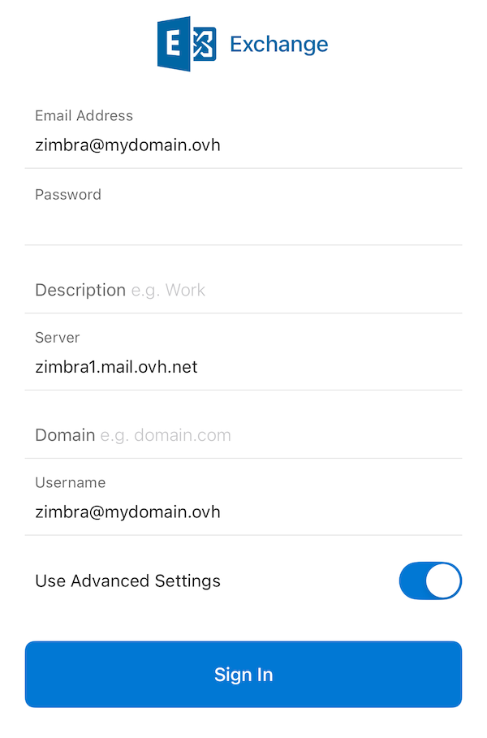
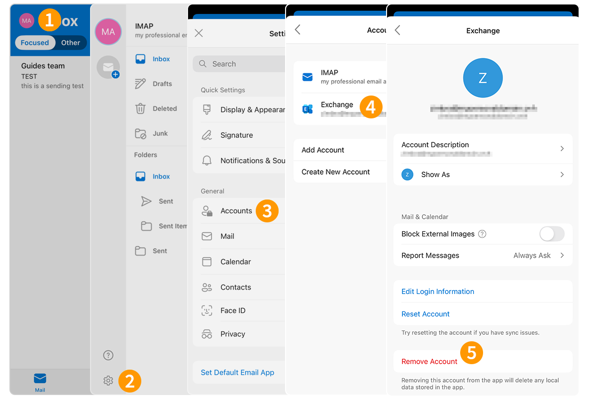

## Objectif

Les comptes Zimbra Pro peuvent être configurés en utilisant le protocole Active Sync sur un iPhone, cela vous permet de configurer l'ensemble des fonctionnalités collaboratives de votre adresse e-mail en une seule fois. L'application Outlook de Microsoft sur iOS est disponible gratuitement depuisdepuis l'App Store de Apple.

**Découvrez comment configurer votre adresse e-mail Zimbra Pro sur l'application mobile Outlook pour iOS via le protocole Active Sync**

> [!warning]
>
> OVHcloud met à votre disposition des services dont la configuration, la gestion et la responsabilité vous incombent. Il vous revient de ce fait d'en assurer le bon fonctionnement.
>
> Nous mettons à votre disposition ce guide afin de vous accompagner au mieux sur des tâches courantes. Néanmoins, nous vous recommandons de faire appel à un [partenaire spécialisé](https://marketplace.ovhcloud.com/c/support-collaboration) et/ou de contacter l'éditeur du service si vous éprouvez des difficultés. En effet, nous ne serons pas en mesure de vous fournir une assistance. Plus d'informations dans la section « Aller plus loin » de ce guide.

## Prérequis

- Disposer d’une adresse e-mail [Zimbra Pro](/links/web/zimbra).
- Disposer de l'application [Outlook pour iOS](https://apps.apple.com/app/microsoft-outlook/id951937596).
- Posséder les identifiants relatifs à l'adresse e-mail que vous souhaitez paramétrer.

## En pratique

### Ajouter le compte 

- **Lors du premier démarrage de l'application** : un assistant de configuration s'affiche, appuyez sur `Ajouter un compte`{.action}.

{.thumbnail .h-500}

- **Si un compte a déjà été paramétré** :
    1. Appuyez sur le cercle contenant les initiales du compte e-mail consulté ou l'icône de maison « &#8962; » dans la partie supérieure gauche de votre écran.
    2. Appuyez sur l'engrenage « &#9881; » dans la partie inférieure gauche de votre écran.
    3. Appuyez ensuite sur `Comptes`{.action} dans le menu **Réglages**.
    4. Appuyez sur `Ajouter un compte`{.action}.
    5. Appuyez sur `Compte de courrier`{.action}.

{.thumbnail .h-500}

Suivez les étapes d'installation en cliquant sur les onglets ci-dessous :

> [!tabs]
> **Etape 1**
>>
>> Saisissez votre adresse e-mail et appuyez sur `Ajouter un compte`{.action}.
>>
>> {.thumbnail .h-500}
>>
> **Etape 2**
>>
>> Vous avez deux possibilités:
>>
>> - Si vous avez la mention « **IMAP** » en haut de la page , passez à l'étape 3, appuyez sur le bouton `?` dans le coin supérieur droit de l'écran **(1)**, puis choisissez `Changer de fournisseur de compte`{.action} **(2)**. Sélectionnez alors `Exchange` **(3)** et passez à l'étape 3.
>>
>> {.thumbnail .h-500}
>>
>> - Si vous êtes directement sur le choix du type de comtpe, sélectionnez `Exchange` 
>>
> **Etape 3**
>>
>> Dans la fenêtre suivante, cochez `Paramètres avancés`{.action} et  complétez les informations suivantes :
>>
>> - **Adresse e-mail** : saisissez votre adresse e-mail complète.
>> - **Mot de pass** : saisissez le mot de passe assossié à l'adresse e-mail.
>> - **Description** : saisissez un nom permettant d'identifier ce compte parmis vos autres comptes e-mail enregistrés sur Outlook.
>> - **Serveur** : saisissez « zimbra1.mail.ovh.net ».
>> - **Domaine** : laissez vide.
>> - **Nom d'utilisateur** : votre adresse e-mail complète.
>>
>> Pour finaliser la configuration, appuyez sur `Connexion`{.action}.
>>
>> {.thumbnail .h-500}
>>

> [!warning]
>
> Si, après avoir suivi les étapes de configuration ci-dessus, vous rencontrez un défaut d'envoi ou de réception, consultez la rubrique « [Modifier les paramètres existants](#modify-settings) ».

### Utiliser l'adresse e-mail

Une fois l'adresse e-mail configurée, il ne reste plus qu’à l'utiliser ! Vous pouvez dès à présent envoyer et recevoir des messages, mais aussi gérer vos calendriers et tâches.

OVHcloud propose aussi une application web permettant d'accéder à votre adresse e-mail depuis un navigateur internet. Celle-ci est accessible via ce lien : [Webmail](/links/web/email). Vous pouvez vous y connecter grâce aux identifiants de votre adresse e-mail. Pour toute question relative à son utilisation, aidez-vous de notre guide [Utiliser le webmail Zimbra](/pages/web_cloud/email_and_collaborative_solutions/mx_plan/email_zimbra).

### Comment modifier les paramètres existants ? 

1. Appuyez sur le cercle contenant les initiales du compte e-mail consulté ou l'icône de maison « &#8962; » dans la partie supérieure gauche de votre écran.
1. Appuyez sur l'engrenage « &#9881; » dans la partie inférieure gauche de votre écran.
1. Appuyez ensuite sur `Comptes`{.action} dans le menu **Réglages**.
1. Sélectionnez le compte concerné.
1. Appuyez sur `Modifier les informations de connexion`{.action}.

{.thumbnail .h-500}

Retrouvez les paramètres à **l'étape 3** du chapitre [Ajouter le compte](#add-account).

### Comment supprimer un compte e-mail ?

1. Appuyez sur le cercle contenant les initiales du compte e-mail consulté ou l'icône de maison « &#8962; » dans la partie supérieure gauche de votre écran.
1. Appuyez sur l'engrenage «  &#9881; » dans la partie inférieure gauche de votre écran.
1. Appuyez ensuite sur `Comptes`{.action} dans le menu **Réglages**.
1. Sélectionnez le compte concerné.
1. Appuyez sur `Suppression du compte`{.action}.

{.thumbnail .h-500}

## Aller plus loin

> [!primary]
>
> Pour plus d'informations sur la configuration d'une adresse e-mail depuis l'application Outlook sur iOS, consultez [le centre d'aide Microsoft](https://support.microsoft.com/office/configurer-l-application-outlook-pour-ios-b2de2161-cc1d-49ef-9ef9-81acd1c8e234).

https://support.microsoft.com/office/configurer-l-application-outlook-pour-ios-b2de2161-cc1d-49ef-9ef9-81acd1c8e234

Pour des prestations spécialisées (référencement, développement, etc), contactez les [partenaires OVHcloud](/links/partner).

Si vous souhaitez bénéficier d'une assistance à l'usage et à la configuration de vos solutions OVHcloud, nous vous proposons de consulter nos différentes [offres de support](/links/support).

Échangez avec notre [communauté d'utilisateurs](/links/community).