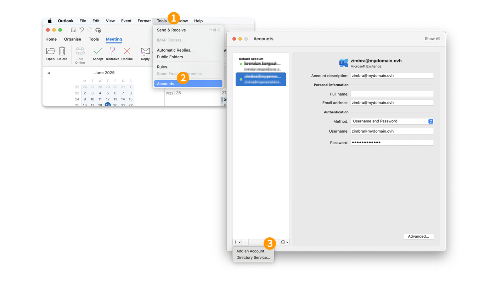
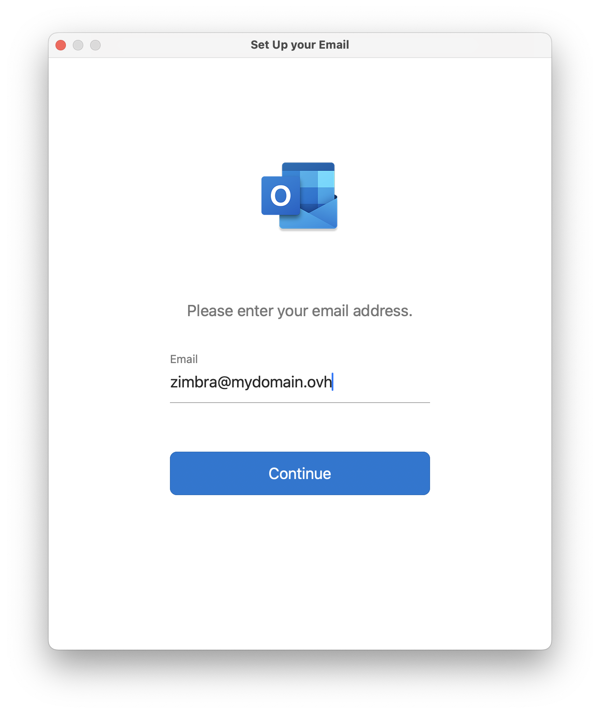
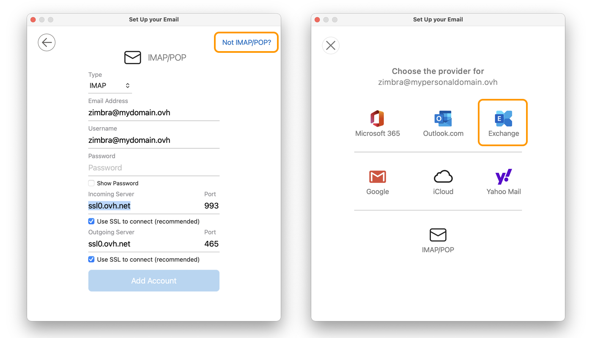
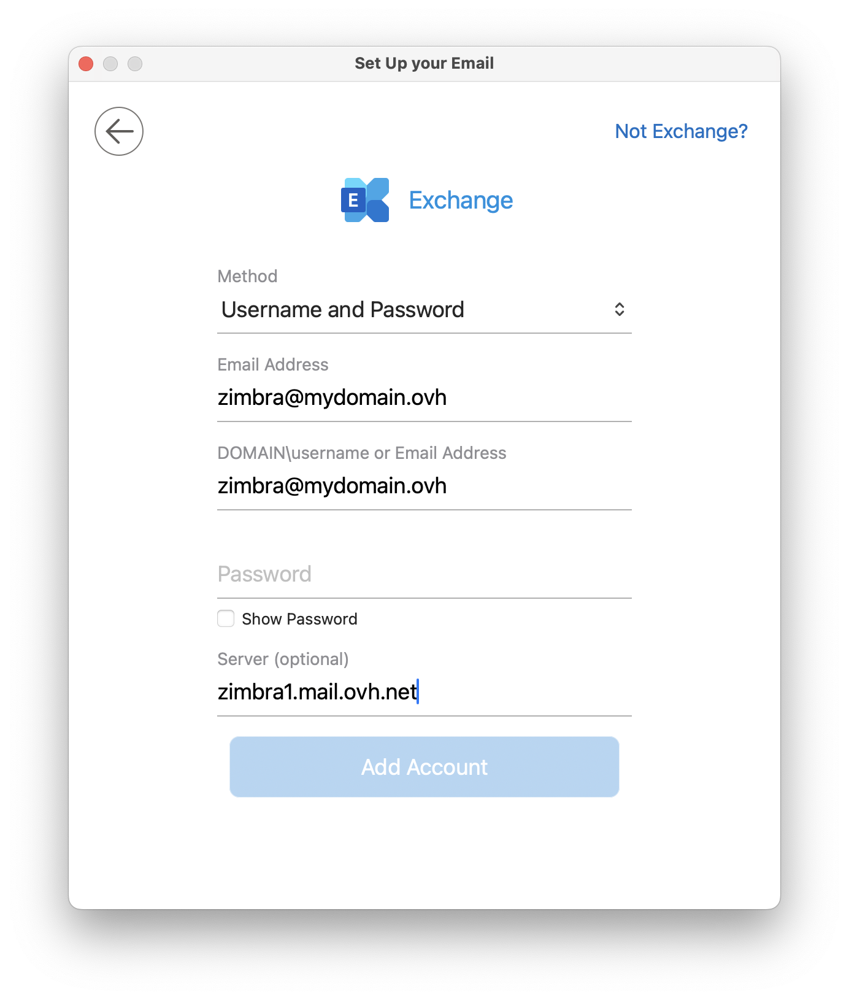
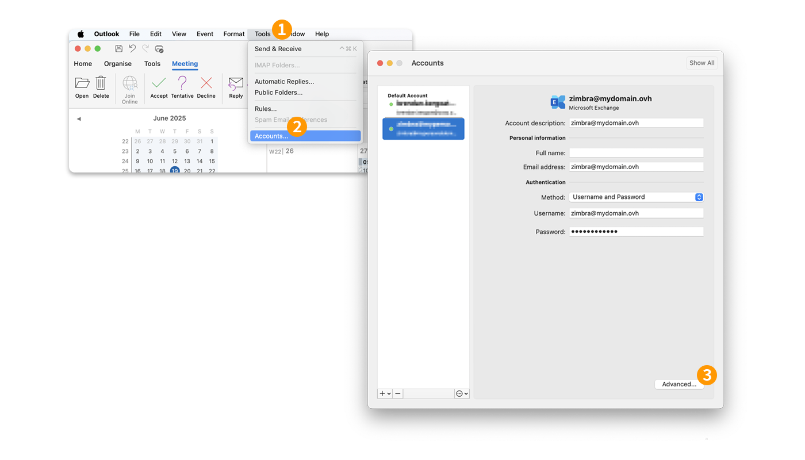
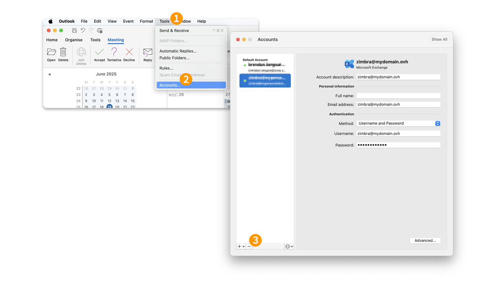

## Objective

> [!primary]
>
> This guide is aimed at customers with an email solution [Zimbra Pro](/links/web/emails-zimbra). This service will be available in beta version from July 2025.

Zimbra Pro accounts can be configured on a Mac using the EWS protocol (**E**xchange **W**eb **S**services). This allows you to configure all the collaborative features of your email address at once. The application [Outlook on macOS](https://apps.apple.com/en-gb/app/microsoft-outlook/id985367838?mt=12) is available on the Apple App Store.

**Find out how to configure your Zimbra Pro email address in Outlook for macOS via the EWS protocol.**

> [!warning]
>
> OVHcloud provides services that you are responsible for configuring, managing and managing. It is your responsibility to ensure that these services work properly.
>
> This guide is designed to help you accomplish common tasks. Nevertheless, we recommend contacting a [specialized partner](https://marketplace.ovhcloud.com/c/support-collaboration) and/or the service publisher if you experience any difficulties. We will not be able to assist you. For more information, see the [Go further](#go-further) section of this guide.

## Requirements

- an email address [Zimbra Pro](/links/web/emails-zimbra).
- You must have the application [Outlook on macOS](https://apps.apple.com/fr/app/microsoft-outlook/id985367838?mt=12).
- You must have the login details for the email address you would like to configure.

## Instructions

### Add the  account

- **When you start the Outlook application for the first time**: a configuration wizard will appear, prompting you to enter the first email address you would like to add.

- **If an account is already set up on the Outlook application**:
1. Click `Tools`{.action} in the menu bar at the top of your screen.
2. Click `Accounts`{.action}.
3. In the “Accounts” window that pops up, click on `+`{.action} in the bottom left-hand corner, then click on `New account`{.action}.

{.thumbnail .h-500}

Follow the installation steps by clicking on the **3** tabs below:

> [!tabs]
> **Step 1**
>>
>> Enter your email address under “Email address”, then click `Continue`{.action}.
>>
>> {.thumbnail .h-500}
>>
> **Step 2**
>>
>> Two scenarios are possible:
>>
>> - **If the “IMAP/POP” window appears** : click `This is not a POP/IMAP account`{.action}, then choose `Exchange`{.action} from the “Choose Provider” window.
>> - **If you go directly to “Choose the provider”**, choose `Exchange`{.action}.
>>
>> {.thumbnail .h-500}
>>
> **Step 3**
>>
>> Check and complete the following information:
>>
>> - **Method**: Choose `User name and password`.
>> - **Email address**: Enter your full email address.
>> - **DOMAIN\User name or email address**: Enter your full email address.
>> - **Password**: Enter the password associated with your email address.
>> - **Server** : Enter "zimbra1.mail.ovh.net".
>>
>> To finalize the configuration, tap `Add an account`{.action} and select the features you want to explore on your Mac.
>>
>> {.thumbnail .h-500}
>>

> [!warning]
>
> If you encounter a sending or receiving error after following the configuration steps above, please refer to the “[Modify existing settings](#modify-settings)” section of this guide.

### Use the email address

Once you have configured your email address, you can start using it! You can now send and receive messages, and manage your calendars and tasks.

OVHcloud also offers a web application that allows you to access your email address from an internet browser. You can log in to the [OVHcloud webmail](/links/web/email) using your email credentials. If you have any questions on how to use it, please read our guide on [Using Zimbra webmail](/pages/web_cloud/email_and_collaborative_solutions/mx_plan/email_zimbra) .

### How do I modify existing settings?

To modify the settings of an email account that has already been configured, follow the instructions below:

1. Click `Tools`{.action} in the menu bar at the top of your screen.
1. Click `Accounts`{.action}.
1. Select your account in the left column.
1. Click `Advanced...`{.action} in the bottom right.

{.thumbnail .h-500}

Find the settings in **Step 3** of the [Add account](#add-account) chapter.

### How do I delete an email account?

1. Click `Tools`{.action} in the menu bar at the top of your screen.
1. Click `Accounts`{.action}.
1. Select your account in the left column.
1. Click `-`{.action} in the bottom left-hand corner

{.thumbnail .h-500}

## Go further 

> [!primary]
>
> For more information on configuring an email address from the Mail app on macOS, see the [Apple Help Center](https://support.apple.com/en-gb/102619).

For specialised services (SEO, development, etc.), contact [OVHcloud partners](/links/partner).

If you would like assistance using and configuring your OVHcloud solutions, please refer to our [support offers](/links/support).

Join our [community of users](/links/community).