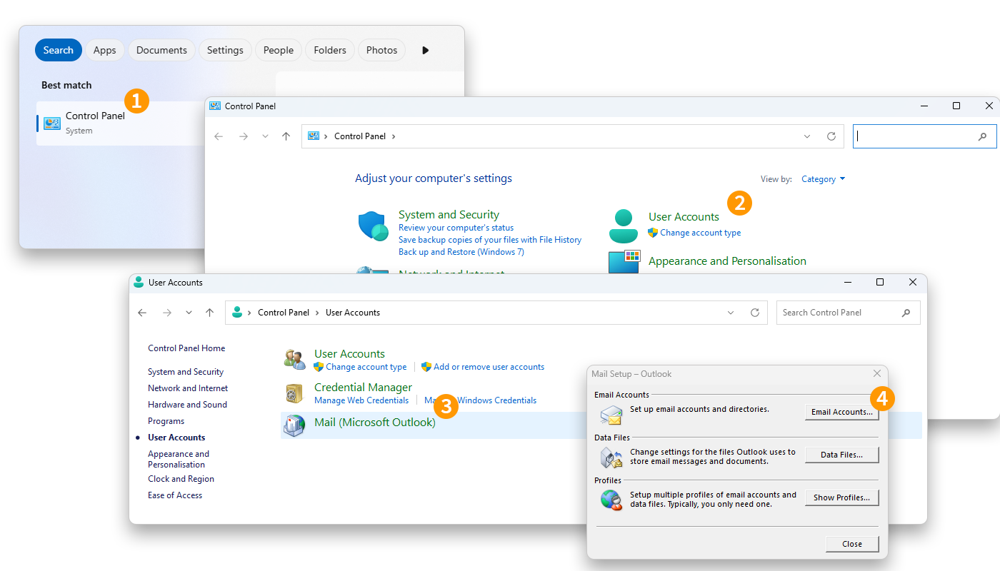
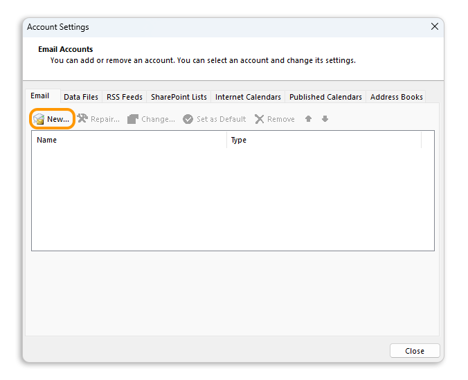
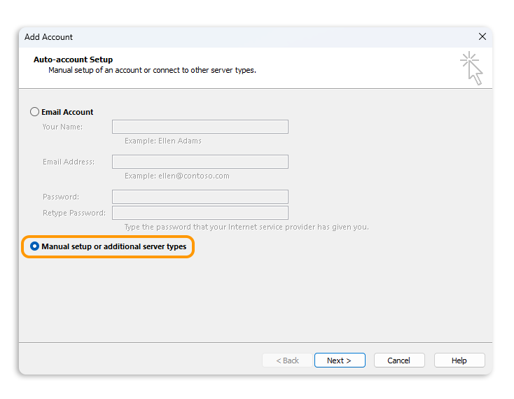
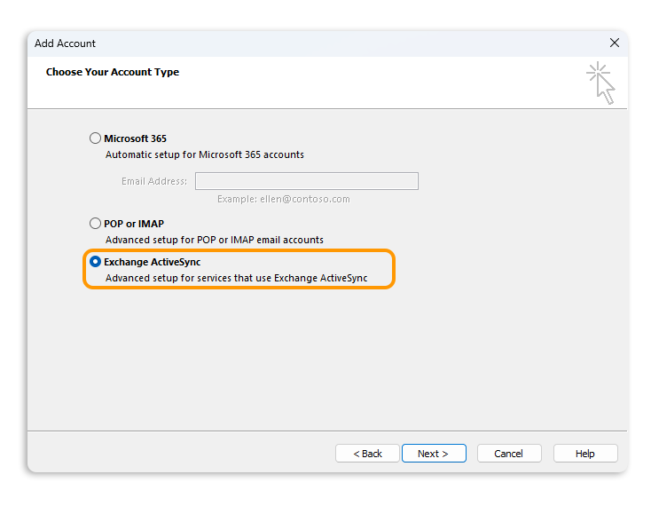
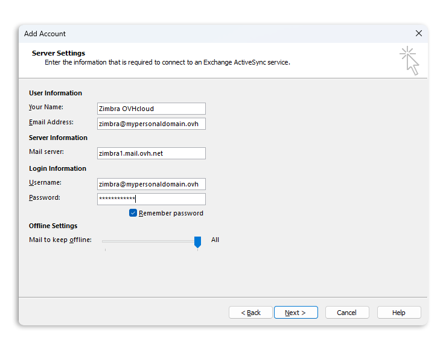
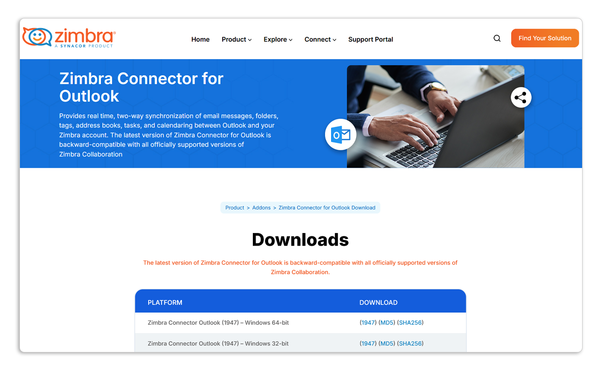
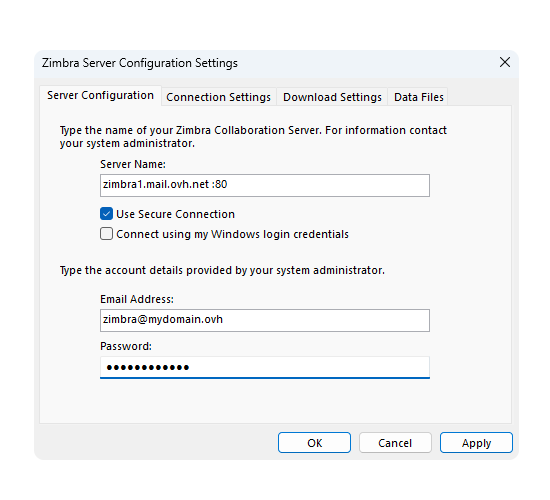
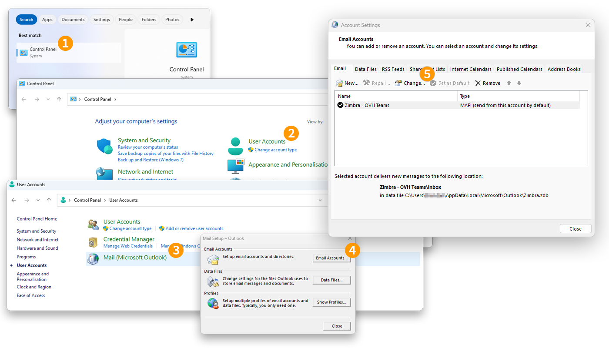
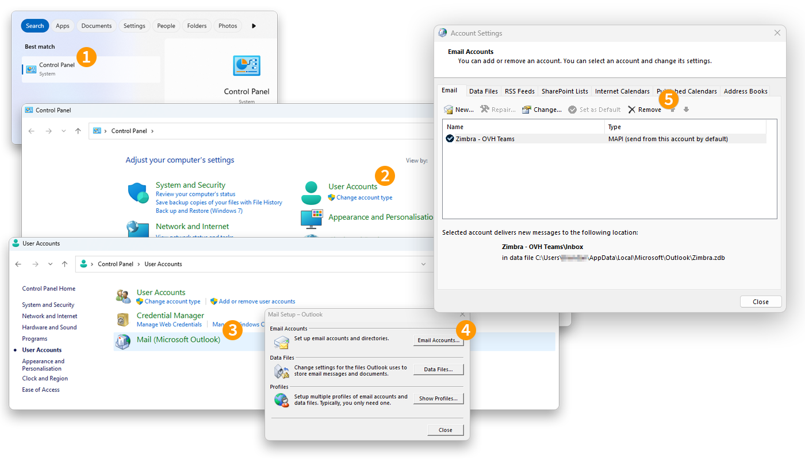

## Ziel

> [!primary]
> Diese Anleitung richtet sich an Kunden, die über das E-Mail-Angebot [Zimbra Pro](/links/web/emails-zimbra) verfügen. Diese Dienstleistung wird ab Juli 2025 als Beta verfügbar sein.

Zimbra Pro Accounts können unter Windows mithilfe des ActiveSync-Protokolls konfiguriert werden, was es Ihnen erlaubt, alle kollaborativen Funktionen Ihrer E-Mail-Adresse auf einmal zu konfigurieren. Die Outlook für Windows-App ermöglicht die Anzeige Ihres Zimbra Pro E-Mail-Kontos über das ActiveSync-Protokoll.

**Diese Anleitung erklärt, wie Sie Ihre Zimbra Pro E-Mail-Adresse auf Outlook für Windows über das ActiveSync-Protokoll konfigurieren.**

> [!warning]
> OVHcloud stellt Ihnen Dienstleistungen zur Verfügung, für deren Konfiguration und Verwaltung Sie die alleinige Verantwortung tragen. Es liegt somit bei Ihnen, sicherzustellen, dass diese ordnungsgemäß funktionieren.
> 
> Wir stellen Ihnen diese Anleitung zur Verfügung, um Ihnen bei der Bewältigung genereller Verwaltungsaufgaben zu helfen. Dennoch empfehlen wir Ihnen, einen [spezialisierten Partner](/links/partner) oder den Herausgeber des Dienstes zu kontaktieren, wenn Sie bei der Administration Ihrer Dienste Hilfe benötigen. Weitere Informationen finden Sie am „[Ende dieser Anleitung](#go-further)“.
>

## Voraussetzungen

- Sie haben einen E-Mail-Account auf der OVHcloud [Zimbra Pro E-Mail-Lösung](/links/web/emails-zimbra) abonniert.
Sie haben die Windows Anwendung [Outlook Classic](https://support.microsoft.com/de-de/office/installieren-oder-erneutes-installieren-des-klassischen-outlook-auf-einem-windows-pc-5c94902b-31a5-4274-abb0-b07f4661edf5).
- Sie haben die Login-Daten des E-Mail-Accounts, den Sie einrichten möchten.

## In der praktischen Anwendung

> [!warning]
>
> Bevor Sie mit der Konfiguration beginnen, ist es wichtig zu beachten, dass die kostenlos in Windows 11 enthaltene Outlook-Anwendung nicht mit dem ActiveSync-Protokoll kompatibel ist, das für die Konfiguration eines Zimbra Pro Accounts erforderlich ist. Sie müssen die Version **Outlook Classic** verwenden, um das ActiveSync-Protokoll zu unterstützen.
>
> Um Outlook Classic auf Ihrem Windows-Computer zu installieren, laden Sie es von der Microsoft-Seite „[Installieren oder Reinstallieren von Outlook Classic auf einem Windows-PC](https://support.microsoft.com/de-de/office/installieren-oder-erneutes-installieren-des-klassischen-outlook-auf-einem-windows-pc-5c94902b-31a5-4274-abb0-b07f4661edf5)“ herunter und installieren Sie es.
>
> Geben Sie nach Abschluss der Installation in der Windows-Suchleiste „Outlook“ ein, um die beiden Versionen bei der Installation voneinander zu unterscheiden. Sie können dann den Unterschied wie folgt sehen.
>
>{.thumbnail .h-500}

### Konto  hinzufügen

Um einen Zimbra Pro Account in Outlook Classic hinzuzufügen, folgen Sie den Installationsschritten, indem Sie auf die Tabs klicken:

> [!tabs]
> **Schritt 1**
>>
>> 1. Rufen Sie das Windows-Systemsteuerungssymbol ** auf.
>> 2. Klicken Sie auf `Benutzerkonten`{.action}.
>> 3. Klicken Sie auf `Mail`{.action}.
>> 4. Klicken Sie auf `E-Mail-Konten...`{.action}.
>>
>> {.thumbnail .h-500}
>>
> **Schritt 2**
>>
>> - Klicken Sie im Fenster **Kontoeinstellungen** im Tab `E-Mail` auf `Neu...`{.action}.
>>
>> {.thumbnail .h-500}
>>
> **Schritt 3**
>>
>> - Wählen Sie im Fenster **Account hinzufügen** `Manuelle Konfiguration oder zusätzliche Servertypen`{.action} aus.
>> - Klicken Sie auf `Weiter`{.action}, um fortzufahren.
>>
>> {.thumbnail .h-500}
>>
> **Schritt 4**
>>
>> - Wählen Sie `Exchange ActiveSync`{.action} aus.
>> - Klicken Sie auf `Weiter`{.action}, um fortzufahren.
>>
>> {.thumbnail .h-500}
>>
> **Schritt 5**
>>
>> Geben Sie die Anmeldeinformationen für Ihren Account ein:
>>
>> - **Ihr Name**: Definieren Sie einen Anzeigenamen.
>> - **E-Mail-Adresse**: Geben Sie Ihre vollständige E-Mail-Adresse ein.
>> - **Mailserver**: Geben Sie „zimbra1.mail.ovh.net“ ein.
>> - **Benutzername**: Geben Sie Ihre vollständige E-Mail-Adresse ein.
>> - **Passwort**: Geben Sie das Passwort Ihrer E-Mail-Adresse ein.
>>
>> Klicken Sie auf `Weiter`{.action}, um das Hinzufügen des Accounts abzuschließen.
>>
>> {.thumbnail .h-500}
>>
> **Schritt 6**
>>
>> Ihre E-Mail-Adresse ist jetzt für Outlook konfiguriert. Um die vollständige Synchronisierung der Funktionen Ihres Zimbra Pro Accounts zu nutzen, laden Sie [Zimbra Connector for Outlook](https://www.zimbra.com/product/addons/zimbra-connector-for-outlook-download/) herunter und installieren Sie es.
>>
>> {.thumbnail .h-500}
>>
> **Schritt 7**
>>
>> Nach der Installation von [Zimbra Connector for Outlook](https://www.zimbra.com/product/addons/zimbra-connector-for-outlook-download/) starten Sie Outlook Classic.
>> Beim ersten Mal wird das Konfigurationsfenster **Zimbra Server Configuration Settings** angezeigt. Geben Sie die folgenden Informationen ein:
>>
>> - **Servername**: Geben Sie „zimbra1.mail.ovh.net“ ein.
>> - **E-Mail-Adresse**: Geben Sie Ihre vollständige E-Mail-Adresse ein.
>> - **Passwort**: Geben Sie das Passwort Ihrer E-Mail-Adresse ein.
>>
>> Die anderen Einstellungen müssen nicht geändert werden. Klicken Sie auf `Anwenden`{.action}, um die Einstellungen zu überprüfen und sicherzustellen, dass sie konform sind. Klicken Sie anschließend auf `OK`{.action}, um auf Outlook zuzugreifen und Ihre E-Mail-Adresse zu verwenden.
>>
>> {.thumbnail .h-500}

> [!warning]
>
> Wenn Sie nach dem Befolgen der oben genannten Konfigurationsschritte einen Fehler beim Senden oder Empfangen feststellen, lesen Sie den Abschnitt „[Vorhandene Einstellungen ändern](#modify-settings)“ in dieser Anleitung.

### E-Mail-Adresse verwenden

Sobald die E-Mail-Adresse eingerichtet ist, können Sie sie verwenden! Sie können ab sofort Nachrichten senden und empfangen sowie Ihre Kalender und Aufgaben verwalten.

OVHcloud bietet Ihnen außerdem eine Webanwendung, mit der Sie über einen Webbrowser auf Ihren E-Mail-Account zugreifen können. Diese ist über [Webmail](/links/web/email) verfügbar. Sie können sich mit den Login-Daten Ihres E-Mail-Accounts anmelden. Wenn Sie Fragen zur Verwendung haben, lesen Sie unsere Anleitung „[Zimbra Webmail verwenden](/pages/web_cloud/email_and_collaborative_solutions/mx_plan/email_zimbra)“.

### Wie kann ich vorhandene Einstellungen ändern? 

Um die Einstellungen eines bereits konfigurierten E-Mail-Accounts zu ändern, befolgen Sie die folgenden Anweisungen:

1. Begeben Sie sich in die Windows-Systemsteuerung.
1. Klicken Sie auf `Benutzerkonten`{.action}.
1. Klicken Sie auf `Mail`{.action}.
1. Klicken Sie auf `E-Mail-Konten...`{.action}.
1. Wählen Sie den betreffenden E-Mail-Account aus der Liste aus und klicken Sie auf `Bearbeiten...`{.action}.

{.thumbnail .h-500}

Die Einstellungen finden Sie in **Schritt 7** des Kapitels „[Account hinzufügen](#add-account)“.

### Wie lösche ich einen E-Mail-Account? 

Um Ihren E-Mail-Account zu löschen befolgen Sie die folgenden Anweisungen:

1. Begeben Sie sich in die Windows-Systemsteuerung**.
1. Klicken Sie auf `Benutzerkonten`{.action}.
1. Klicken Sie auf `Mail`{.action}.
1. Klicken Sie auf `E-Mail-Konten...`{.action}.
1. Wählen Sie den betreffenden E-Mail-Account aus der Liste aus, und klicken Sie auf `Löschen`{.action}.

{.thumbnail .h-500}

> [!warning]
>
> Um Ihren E-Mail-Account löschen zu können, muss dieser nicht der Standard-E-Mail-Account sein.

## Weitere Informationen 

> [!primary]
>
> Weitere Informationen zum Konfigurieren einer E-Mail-Adresse in der Outlook-Anwendung auf Windows finden Sie im [Microsoft Help Center](https://support.microsoft.com/de-de/office/hinzuf%C3%BCgen-eines-e-mail-kontos-zu-outlook-f%C3%BCr-windows-6e27792a-9267-4aa4-8bb6-c84ef146101b?ocmsassetID=&CorrelationId=778d1d8d-9ac2-4449b-96292924_4b).

Kontaktieren Sie für spezialisierte Dienstleistungen (SEO, Web-Entwicklung etc.) die [OVHcloud Partner](/links/partner).

Wenn Sie Hilfe bei der Nutzung und Konfiguration Ihrer OVHcloud Lösungen benötigen, beachten Sie unsere [Support-Angebote](/links/support).

Treten Sie unserer [User Community](/links/community) bei.