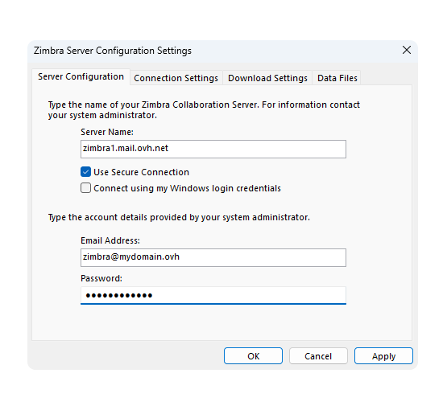

## Obiettivo

Gli account Zimbra Pro possono essere configurati su Windows utilizzando il protocollo ActiveSync, per consentirti di configurare tutte le funzionalità collaborative del tuo indirizzo email in una sola volta. L’applicazione Outlook per Windows consente di visualizzare l’account email Zimbra Pro tramite il protocollo ActiveSync.

**Questa guida ti mostra come configurare il tuo indirizzo e-mail Zimbra Pro su Outlook per Windows utilizzando il protocollo ActiveSync.**

## Prerequisiti

- Disporre di un indirizzo email [Zimbra Pro](/links/web/emails-zimbra).
- Aver installato [Outlook classico](https://support.microsoft.com/it-it/office/installare-o-reinstallare-la-versione-classica-di-outlook-in-un-pc-windows-5c94902b-31a5-4274-abb0-b07f4661edf5) su Windows.
- Disporre delle credenziali associate all’indirizzo email da configurare.

/// details | Informazioni relative alla gestione e alla configurazione dei servizi OVHcloud

OVHcloud mette a disposizione i servizi ma non si occupa della loro configurazione e gestione. Garantire il corretto funzionamento di questi servizi è responsabilità dell’utente.

Questa guida è progettata per aiutarvi a svolgere le attività più comuni. Tuttavia, in caso di difficoltà o dubbi, ti consigliamo di contattare un [partner specializzato](/links/partner) o il fornitore del servizio. Non saremo infatti in grado di fornirti assistenza. Per maggiori informazioni, consulta la sezione "[Per saperne di più](#go-further)" di questa guida.

///

## Procedura

> [!warning]
>
> Prima di iniziare la configurazione, è importante notare che l’applicazione Outlook inclusa gratuitamente con Windows 11 è incompatibile con il protocollo ActiveSync, necessario per la configurazione di un account Zimbra Pro. Per il supporto del protocollo ActiveSync è necessario utilizzare la versione **Outlook classica**.
>
> Per installare Outlook classico sul computer Windows, scaricarlo dalla pagina Microsoft "[Installa o reinstalla Outlook classico su un PC Windows](https://support.microsoft.com/it-it/office/installare-o-reinstallare-la-versione-classica-di-outlook-in-un-pc-windows-5c94902b-31a5-4274-abb0-b07f4661edf5)" e installarlo.
>
> Al termine dell'installazione, per distinguere le due versioni quando vengono installate, digitare Outlook nella barra di ricerca di Windows. La differenza è visibile come mostrato qui di seguito.
>
>{.thumbnail .h-500}

### Aggiungi l'account 

Per aggiungere un account Zimbra Pro su Outlook classico, segui i seguenti passaggi cliccando sulle **7** schede seguenti:

> [!tabs]
> **Step 1**
>>
>> 1. Accedi al **Pannello di controllo** di Windows.
>> 2. Clicca su `Account utente`{.action}.
>> 3. Clicca su `Posta`{.action}.
>> 4. Clicca su `Account di posta...`{.action}.
>>
>> {.thumbnail .h-500}
>>
> **Step 2**
>>
>> - Dalla finestra **Impostazioni account**, nella scheda `Messaggeria`, clicca su `Nuovo...`{.action}.
>>
>> {.thumbnail .h-500}
>>
> **Step 3**
>>
>> - Dalla finestra **Aggiungi account**, seleziona `Configurazione manuale o tipi di server aggiuntivi`{.action}.
>> - Clicca su `Avanti`{.action} per continuare.
>>
>> {.thumbnail .h-500}
>>
> **Step 4**
>>
>> - Seleziona `Exchange ActiveSync`{.action}.
>> - Clicca su `Avanti`{.action} per continuare.
>>
>> {.thumbnail .h-500}
>>
> **Step 5**
>>
>> Inserisci le informazioni di connessione al tuo account:
>>
>> - **Nome**: Definisci un nome visualizzato.
>> - **Indirizzo email**: Inserisci il tuo indirizzo email completo.
>> - **Server di posta**: Inserisci "zimbra1.mail.ovh.net".
>> - **Nome utente**: Inserisci il tuo indirizzo email completo .
>> - **Password**: Inserisci la password associata al tuo indirizzo email.
>>
>> Clicca su `Avanti`{.action} per completare l'aggiunta dell'account.
>>
>> {.thumbnail .h-500}
>>
> **Step 6**
>>
>> Il tuo indirizzo email è configurato per Outlook. Per usufruire di una completa sincronizzazione delle funzionalità del tuo account Zimbra Pro, **scarica e installa** il modulo "[Zimbra Connector for Outlook](https://www.zimbra.com/product/addons/zimbra-connector-for-outlook-download/)".
>>
>> {.thumbnail .h-500}
>>
> **Step 7**
>>
>> Una volta installato il modulo "[Zimbra Connector for Outlook](https://www.zimbra.com/product/addons/zimbra-connector-for-outlook-download/)", avvia Outlook classico.
>> La prima volta viene visualizzata la finestra di configurazione **Zimbra Server configuration Settings**. Inserisci le informazioni richieste:
>>
>> - **Nome del server**: Inserisci "zimbra1.mail.ovh.net".
>> - **Indirizzo email**: Inserisci il tuo indirizzo email completo.
>> - **Password**: Inserisci la password associata al tuo indirizzo email.
>>
>> Non è necessario modificare altre impostazioni. Clicca su `Applica`{.action} per confermare le impostazioni e assicurarti che siano conformi. Clicca su `OK`{.action} per accedere a Outlook e iniziare a utilizzare il tuo indirizzo email.
>>
>> {.thumbnail .h-500}

> [!warning]
>
> Se riscontri un problema di invio o di ricezione dopo aver seguito i passaggi di configurazione di cui sopra, consulta l'argomento "[Modifica le impostazioni esistenti](#modify-settings)" di questa guida.

### Utilizza l'indirizzo email

Una volta configurato l’indirizzo email, puoi iniziare a utilizzarlo! Da questo momento è possibile inviare e ricevere messaggi, ma anche gestire calendari e task.

OVHcloud propone anche un’applicazione Web che permette di accedere al tuo indirizzo email da un browser Internet. È possibile accedere alla [webmail OVHcloud](/links/web/email) con le credenziali del tuo indirizzo email. Per qualsiasi domanda relativa al suo utilizzo, consulta la nostra guida "[Utilizzare la webmail Zimbra](/pages/web_cloud/email_and_collaborative_solutions/mx_plan/email_zimbra)".

### Come modificare le impostazioni esistenti? 

Per modificare le impostazioni di un account email già configurato, segui le istruzioni seguenti:

1. Accedi al **Pannello di controllo** di Windows.
1. Clicca su `Account utente`{.action}.
1. Clicca su `Posta`{.action}.
1. Clicca su `Account di posta elettronica...`{.action}.
1. Seleziona l’account email nella lista e clicca su `Modifica...`{.action}.

{.thumbnail .h-500}

Le impostazioni sono disponibili al **step 7** del capitolo "[Aggiungi account](#add-account)".

### Come eliminare un account email? 

Per eliminare il tuo account email, segui le istruzioni qui sotto:

1. Accedi al **Pannello di controllo** di Windows.
1. Clicca su `Account utente`{.action}.
1. Clicca su `Posta`{.action}.
1. Clicca su `Account di posta elettronica...`{.action}.
1. Seleziona l’account email nella lista e clicca su `Elimina`{.action}.

{.thumbnail .h-500}

> [!warning]
>
> Per poter eliminare il tuo account email, è necessario che questo non sia quello predefinito.

## Per saperne di più 

> [!primary]
>
> Per ulteriori informazioni sulla configurazione di un indirizzo e-mail dall'applicazione Outlook in Windows, consultare [centro assistenza Microsoft](https://support.microsoft.com/it-it/office/aggiungere-un-account-di-posta-elettronica-a-outlook-per-windows-6e27792a-9267-4aa4-8bb6-c84ef146101b?ocmsassetID=&CorrelationId=778d1d8d-9ac2-4449b-96292924_4b).

Per prestazioni specializzate (referenziamento, sviluppo, ecc.), contatta i [partner OVHcloud](/links/partner).

Per usufruire di un supporto per l'utilizzo e la configurazione delle soluzioni OVHcloud, è possibile consultare le nostre soluzioni [offerte di supporto](/links/support).

Contatta la nostra [Community di utenti](/links/community).