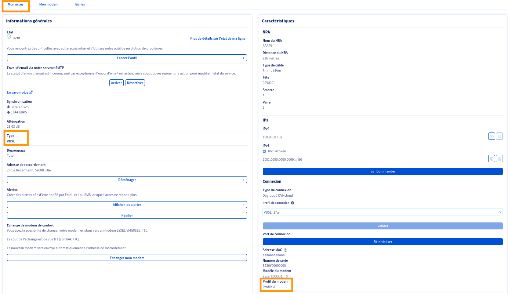

## Objectif

Si vous souhaitez utiliser votre équipement personnel pour gérer la connexion PPPoE sur votre offre xDSL/FTTH OVHcloud, vous devez récupérer les identifiants PPPoE associés à cet accès. 
Si vous ne les connaissez pas, vous pouvez les récupérer en suivant les étapes de notre guide « [Obtenir les identifiants PPPoE](/pages/web_cloud/internet/internet_access/obtenir_id_ppp) ».

**Découvrez comment configurer votre accès Internet OVHcloud sur votre propre routeur**.

## Prérequis

- Disposer d'un [accès Internet xDSL ou FTTH OVHcloud](/links/telecom/offre-internet) actif.
- Disposer d'un équipement (routeur, firewall) compatible PPPoE.
- Disposer des identifiants PPPoE de votre accès Internet OVHcloud.

## En pratique

Les identifiants PPPoE vous sont envoyés par e-mail (à l'adresse e-mail de contact de votre compte OVHcloud) lors de la livraison de votre accès. 
Ces identifiants vous permettent de configurer votre modem OVHcloud (dans le cas d’une configuration manuelle en local du modem fourni par OVHcloud) ou de votre équipement personnel pour l’usage de votre accès à Internet.

Si votre offre a été fournie avec un modem OVHcloud, les identifiants PPPoE vous sont envoyés par e-mail systématiquement après chaque réinitialisation du modem.

Le *login* reste identique après chaque réinitialisation. 
Pour des raisons de sécurité, le *mot de passe* est systématiquement modifié après chaque réinitialisation de votre routeur OVHcloud.

Si vous utilisez votre propre modem/routeur, vous pouvez utiliser les API OVHcloud afin de [générer l'envoi de nouveaux identifiants PPPoE par e-mail](/pages/web_cloud/internet/internet_access/obtenir_id_ppp).

> [!warning]
>
> Chaque routeur a une méthode de configuration différente.
> Ce guide liste les paramètres indispensables pour faire fonctionner votre connexion mais nous vous invitons à lire le manuel utilisateur de votre modem/routeur pour vérifier comment les appliquer.
>

### Connaître le profil de son modem

Le profil de votre accès est disponible sur l'espace client. Pour le retrouver, suivez ces étapes :

1. Connectez-vous à votre [espace client OVHcloud](/links/manager) et cliquez sur `Télécom`{.action}.
1. Cliquez sur `Offres Internet`{.action} puis sur le *Pack* contenant l'accès à Internet concerné.
1. Cliquez sur votre accès à Internet FTTH ou xDSL dans le cadre `Accès Internet` à droite.

{.thumbnail}

Par défaut, l'onglet affiché est `Mon accès`.

Le type de l'accès est disponible dans le cadre `Informations générales`.
Le profil du modem est disponible dans la section `Connexion` du cadre `Caractéristiques`.

{.thumbnail}

### Profil A

Ce profil s'applique aux typologies d'accès suivantes :

- Accès ADSL/VDSL (Cuivre) et FTTH (Fibre) Covage
- Accès ADSL/VDSL (Cuivre) et FTTH (Fibre) en collecte SFR
- Accès ADSL/VDSL (Cuivre) et FTTH (Fibre) en collecte AXIONE
- Accès ADSL (Cuivre) en collecte ORANGE
- Accès FTTO (Fibre) Bouygues

Les paramètres à configurer sont :

- **Mode de connexion** : PPPoE
- **Nom d'utilisateur PPPoE** : le login reçu par e-mail (exemple : `0320xxyyzz_1@ovh.kosc`)
- **Mot de passe PPPoE** : le mot de passe reçu par e-mail
- **MTU** : 1432 ou 1456 ou **1492** (recommandé)
- **VLAN** : aucun VLAN
- **IPv6** : IPv4/IPv6 DualStack, IPCPv6 activé
- **Pour l'ADSL** :
    - **Type** : ADSL over ATM
    - **VPI** : 8
    - **VCI** : 35
    - **Encapsulation** : LLC/SNAP-BRIDGING
    - **Service Category** : UBR without PCR
- **Pour le VDSL** :
    - **Type** : VDSL over PTM
- **Pour le FTTH et le FTTO** :
    - **Type** : Ethernet

### Profil B

> [!primary]
> La différence avec le « profil A » est l'activation du VLAN 835.
>

Ce profil s'applique aux typologies d'accès suivantes :

- Accès VDSL (Cuivre) et FTTH (Fibre) en collecte Orange

Les paramètres à configurer sont :

- **Mode de connexion** : PPPoE
- **Nom d'utilisateur PPPoE** : le login reçu par e-mail (exemple : `0320xxyyzz_1@adsl.ovh`)
- **Mot de passe PPPoE** : le mot de passe reçu par e-mail
- **MTU** : 1432 ou 1456 ou **1492** (recommandé)
- **VLAN** : 835 (802.1p : 0, 802.1q : 835)
- **IPv6** : IPv4/IPv6 DualStack, IPCPv6 activé
- **Pour le VDSL** :
    - **Type** : VDSL over PTM
- **Pour le FTTH** :
    - **Type** : Ethernet

### Profil C

> [!primary]
> La différence avec le « profil A » est l'activation du VLAN 4001.
>

Ce profil s'applique aux typologies d'accès suivantes :

- Accès FTTH (Fibre) Bouygues

Les paramètres à configurer sont :

- **Mode de connexion** : PPPoE
- **Nom d'utilisateur PPPoE** : le login reçu par e-mail (exemple : `FP_1111xxyy_1@byt.ovhcloud`)
- **Mot de passe PPPoE** : le mot de passe reçu par e-mail
- **MTU** : 1432 ou 1456 ou **1492** (recommandé)
- **VLAN** : 4001 (802.1p : 0, 802.1q : 4001)
- **IPv6** : IPv4/IPv6 DualStack, IPCPv6 activé
- **Pour le FTTH** :
    - **Type** : Ethernet

### Profil D

> [!primary]
> La différence avec le « profil A » est l'activation du VLAN 4070.
>

Ce profil s'applique aux typologies d'accès suivantes :

- Accès FTTE (Fibre) en collecte Celan

Les paramètres à configurer sont :

- **Mode de connexion** : PPPoE
- **Nom d'utilisateur PPPoE** : le login reçu par e-mail (exemple : `FP_1111xxyy_1@byt.ovhcloud`)
- **Mot de passe PPPoE** : le mot de passe reçu par e-mail
- **MTU** : 1432 ou 1456 ou **1492** (recommandé)
- **VLAN** : 4070 (802.1p : 0, 802.1q : 4070)
- **IPv6** : IPv4/IPv6 DualStack, IPCPv6 activé
- **Pour le FTTE** :
    - **Type** : Ethernet

## Aller plus loin

Échangez avec notre [communauté d'utilisateurs](/links/community).
