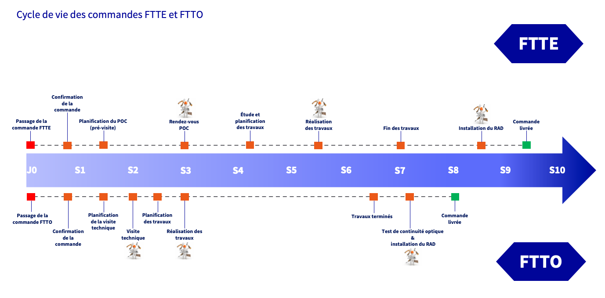

## Objectif

L’objectif de ce guide est de fournir une vision complète et structurée du traitement des commandes FTTE et FTTO chez OVHcloud. Il décrit chaque étape du processus pour faciliter le suivi, anticiper les actions nécessaires et assurer une gestion optimale des commandes.

## Prérequis

- Avoir commandé un accès [FTTE ou FTTO](/links/telecom/offre-internet) chez OVHcloud.

## En pratique

Une fois votre commande FTTE ou FTTO validée et payée, elle est confirmée dans les jours qui suivent. Une visite technique a ensuite lieu afin de réaliser un état des lieux et de planifier votre raccordement ou des travaux complémentaires si nécessaire. 
Suite à cela, un technicien assure la livraison et l'installation du **RAD** (équipement d'accès au service, équivalent à l'ONT sur un accès FTTH). 
Il est possible d'utiliser la box fournie par OVHcloud ou un [routeur personnel](/pages/web_cloud/internet/internet_access/advanced_config_router_manually).

La livraison de votre accès a lieu dans les jours suivant sa mise en service.

### Différences entre architectures FTTE et FTTO

Les architectures FTTE et FTTO diffèrent au niveau de l'infrastructure et du point de distribution optique :

| Offre | Infrastructure | Point de distribution optique |
| :--------- | :------------- | :------ |
| FTTE       | Fibre mutualisée entre le **N**oeud de **R**accordement **O**ptique (**NRO**) et le **P**oint de **M**utualisation (**PM**).  Fibre dédiée du PM au site client. | PTO dédié ou bandeau optique |
| FTTO       | Fibre entièrement dédiée du NRO au site client. | Bandeau optique |

Nos offres FTTE et FTTO permettent d'obtenir un débit symétrique garanti de 100 Mbps, 300 Mbps ou 1 Gbps.

### Vue d'ensemble du cycle de vie des commandes FTTE et FTTO

Retrouvez ci-dessous un schéma détaillé du déroulement d'une commande FTTE et FTTO :

{.thumbnail}

### Délais de livraison

Cliquez sur votre offre pour voir les détails du délai de livraison applicable.

> [!tabs]
> Commande FTTE
>>
>> Un accès FTTE est livré en moyenne sous 10 semaines.
>>
>> Cela comprend 2 ou 3 rendez-vous :
>>
>> - Pré-visite ou **P**lan d'**O**pération **C**lient (**POC**).
>> - Raccordement de votre accès (mise en service et installation du RAD) ou réalisation d'éventuels travaux complémentaires.
>> - Suite aux éventuels travaux, mise en service et installation du RAD.
>>
>> > [!success]
>> > Si votre commande ne nécessite pas de travaux complémentaires, le délai de mise en service sera moindre.
>>
>> Lors de la mise en service, le technicien assure le raccordement du RAD au PTO (ou au bandeau optique) grâce à une jarretière optique, connectée à la prise « NET 1 » du RAD, via un module SFP. 
>> La prise « NET 3 » du RAD est reliée à la prise « WAN » de la box OVHcloud ou d'un routeur personnel grâce à un câble Ethernet.
>>
> Commande FTTO
>> 
>> Un accès FTTO est livré en moyenne sous 8 semaines.
>>
>> Cela comprend 1 à 3 rendez-vous :
>>
>> - Visite technique et raccordement de votre accès (mise en service et installation du RAD), si possible le jour même.
>> - Réalisation d'éventuels travaux si nécessaire.
>> - Suite aux éventuels travaux, mise en service et installation du RAD.
>>
>> > [!success]
>> > Si votre commande ne nécessite pas de travaux complémentaires, le délai de mise en service sera moindre.
>>
>> Lors de la mise en service, le technicien assure le raccordement du RAD au PTO (ou au bandeau optique) grâce à une jarretière optique, connectée à la prise « NET 1 » du RAD, via un module SFP. 
>> La prise « NET 3 » du RAD est reliée à la prise « WAN » de la box OVHcloud ou d'un routeur personnel grâce à un câble Ethernet.

> [!primary]
> Le délai moyen de mise en service est plus élevé sur un accès FTTE, en raison d’une infrastructure qui n’est pas totalement dédiée et de la nécessité de coordonner une intervention avec une entité tierce au niveau du PM.
>
> Le délai d'une commande FTTE ou FTTO varie également en fonction de la complexité du site à raccorder.

## Aller plus loin

Échangez avec notre [communauté d'utilisateurs](/links/community).