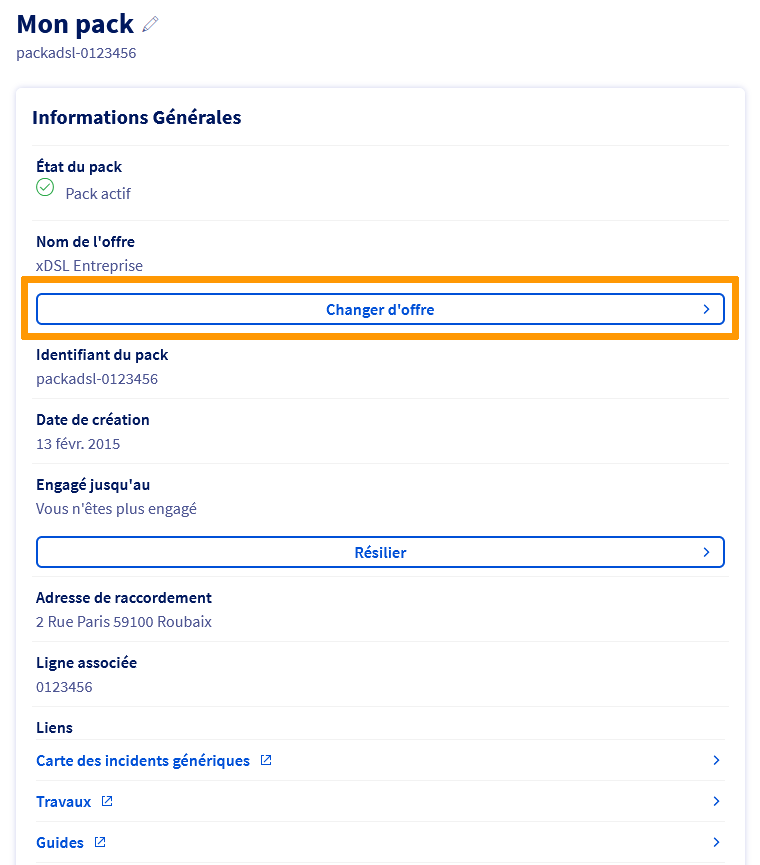

## Objectif

Le réseau téléphonique en cuivre, utilisé depuis des décennies pour fournir des services téléphoniques et internet via des offres xDSL (ADSL/VDSL), est progressivement remplacé par des technologies plus modernes et performantes, notamment la fibre optique. Cette transition vise à offrir aux utilisateurs une connectivité plus rapide et plus fiable. D'ici 2030, le réseau cuivre sera entièrement démantelé, rendant nécessaire la migration vers la fibre optique. Ce guide vous fournira les étapes clés pour assurer une transition en douceur vers la fibre optique, en tenant compte des spécificités de votre situation et des offres disponibles chez OVHcloud.

**Découvrez comment migrer votre connexion xDSL vers la fibre optique.**

## Prérequis

- Disposer d'un accès xDSL (ADSL/VDSL) actif.
- Disposer d'une offre éligible au changement d'offre.
- Être connecté à l'[espace client OVHcloud](/links/manager), partie `Télécom`.

## En pratique

### Pourquoi cette fermeture ?

- **Obsolescence du réseau cuivre** : entretien coûteux et infrastructures vieillissantes.
- **Amélioration des performances** : la fibre optique offre un débit plus stable et plus rapide.
- **Objectif de transition numérique** : l'ARCEP encourage le passage progressif vers des solutions plus modernes.

L'arrêt progressif du cuivre implique l'extinction des offres xDSL dans certaines zones, avec une migration vers la fibre lorsqu'elle est disponible.

### Vérifier les informations de migration dans l'espace client OVHcloud

1. Connectez-vous à votre [espace client OVHcloud](/links/manager) et accédez à l'onglet `Télécom`.
2. Cliquez sur `Accès Internet`.
3. Sélectionnez votre ligne xDSL concernée.
4. Cliquez sur `Changer d'offre`{.action} dans le cadre « Informations Générales ».

{.thumbnail}

Dans le tableau qui s'affiche, la première colonne récapitule votre offre actuelle (son nom, son prix et les services actifs). Les autres colonnes concernent les offres auxquelles vous pouvez souscrire, compte tenu de votre adresse actuelle.

### Souscrire une offre fibre OVHcloud

#### Cas 1 : Migration proposée directement dans l'espace client

Si, dans le tableau `Changement d'offre` une colonne intitulée `Fibre Pro` est présente avec en bas un bouton `Choisir cette offre`, cela indique que votre ligne est éligible à la migration vers la fibre OVHcloud.

Sélectionnez les options souhaitées (lignes téléphoniques, comptes e-mail, Garantie de Temps de Rétablissement) puis cliquez sur le bouton `Choisir cette offre`{.action} sous la colonne correspondant à l'offre `Fibre Pro`.

> [!primary]
> Si vous souhaitez conserver les lignes téléphoniques de votre offre actuelle, veillez à ajouter un nombre équivalent de lignes dans votre nouvelle offre.

Sélectionnez les informations requises.

{.thumbnail}

Indiquez les informations relatives à votre habitation, répondez à la question concernant votre boîtier fibre PTO et cliquez sur `Confirmer la sélection`{.action}.

{.thumbnail}

Cochez les cases des services à conserver et cliquez sur `Confirmer la sélection des services`{.action}.

À l'étape suivante, sélectionnez les informations du rendez-vous et cliquez sur `Confirmer la sélection`{.action}.

Lors de la dernière étape, une demande de confirmation apparaît afin de valider le changement d'offre.
Lisez les contrats, cochez la case afin de les accepter puis cliquez sur le bouton `Valider le changement d'offre`{.action}.

Un délai moyen de 10 à 30 jours est nécessaire à la réalisation de votre nouvel accès internet fibre. Dans ce cas précis nous créons, en parallèle de votre *packadsl*, un nouveau *packadsl* temporaire afin de pouvoir réaliser la commande fibre tout en continuant de garder votre accès cuivre fonctionnel et inchangé. Ce *packadsl* temporaire sera supprimé dès que l'accès fibre sera livré. L'accès fibre viendra remplacer votre accès cuivre dans votre *packadsl* originel.

> [!warning]
>
> Aucune action de modification ou de suppression de votre part n'est nécessaire. Le passage vers votre nouvel accès fibre se fera de manière entièrement automatisée.
> 

Suivant votre offre actuelle, un remplacement du modem peut s'avérer nécessaire. Cela vous sera indiqué lors du choix de votre nouvelle offre.

Les nouveaux services liés à votre nouvelle offre Pro seront accessibles une fois le changement effectif. 

#### Cas 2 : Aucune migration proposée

Si, dans le tableau `Changement d'offre` la colonne intitulée `Fibre Pro` n'est pas disponible, cela **ne veut pas obligatoirement dire** que vous n'êtes pas éligible à la migration vers la fibre OVHcloud.

[Vérifiez votre éligibilité fibre ici](https://order.isp.ovh.net/?referer=ENDXDSL#/){.external}, en recherchant par :

- Adresse postale.
- Numéro de téléphone.
- Référence OTP.
- Référence bâtiment.

> [!warning]
> Pour des raisons techniques, il se peut que le résultat de votre éligibilité ne soit pas fiable. Afin de confirmer avec certitude votre éligibilité à la fibre, vérifiez directement sur le [site officiel de l'ARCEP](https://cartefibre.arcep.fr/){.external}.

Une fois sur le site de l'ARCEP :

1. Recherchez votre adresse dans la barre de recherche.
2. Accédez à l'onglet **Déploiement fibre**.
3. Identifiez votre bâtiment. Si la pastille est de couleur verte, vous êtes éligible à la fibre (voir légende en bas à droite de la carte).
4. Cliquez sur votre bâtiment. Parmi les informations qui s'affichent, notez l'**Identifiant immeuble IPE** associé à votre adresse (ex: `HT-BAT-012AB`).
5. Contactez le support OVHcloud via un [ticket](/links/support) en précisant :
   - La référence de votre accès xDSL.
   - L'**Identifiant immeuble IPE**.

L'équipe OVHcloud vous aidera à finaliser votre migration vers la fibre.

### Si vous ne souhaitez pas souscrire une offre fibre chez OVHcloud

Si vous ne souhaitez pas migrer vers une offre fibre OVHcloud, votre ligne xDSL sera automatiquement résiliée lors de la fermeture du cuivre.

> [!warning]
> Cette résiliation est uniquement **technique**. Vous devez effectuer une **résiliation commerciale** en contactant le support OVHcloud pour finaliser la suppression de votre service et éviter toute facturation future.

## Aller plus loin

Échangez avec notre [communauté d'utilisateurs](/links/community).

