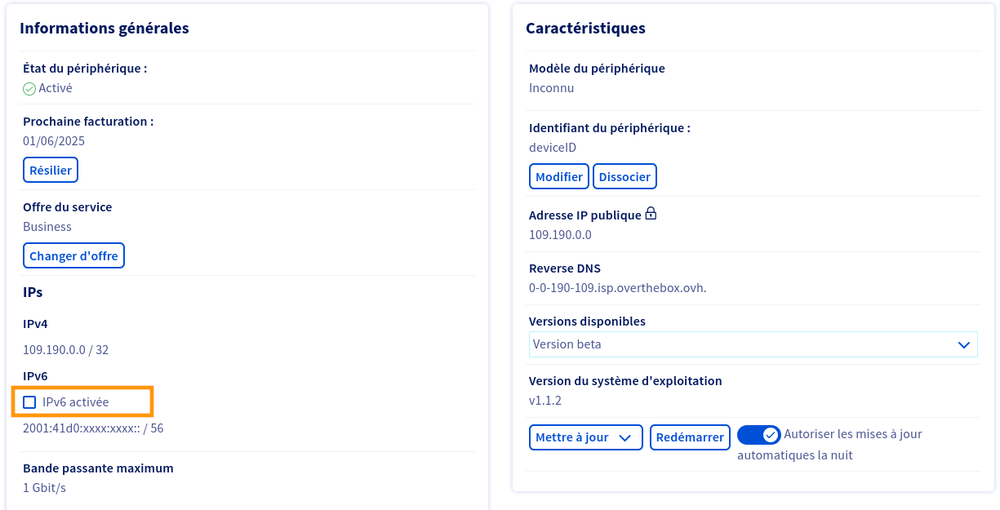
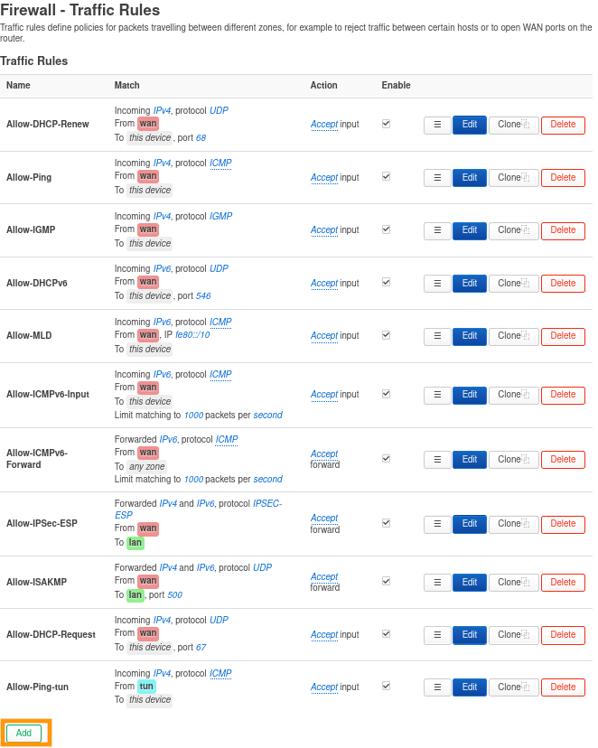
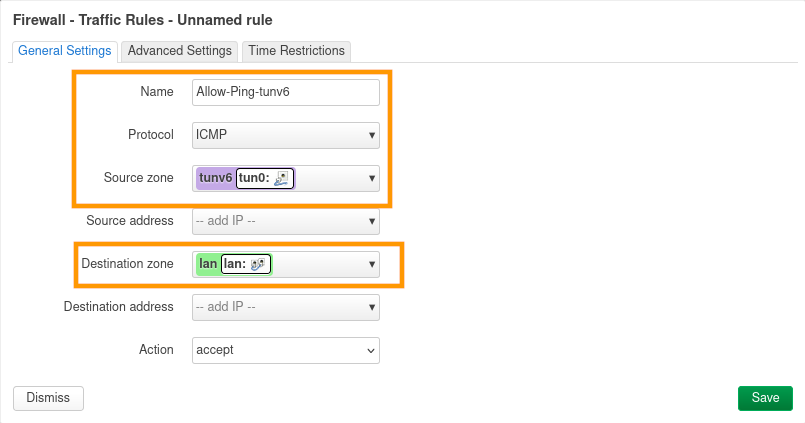
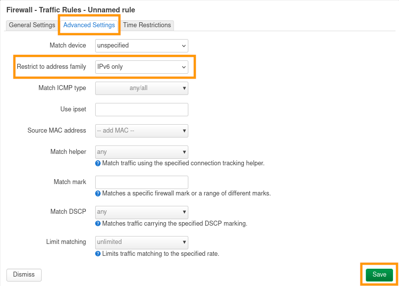
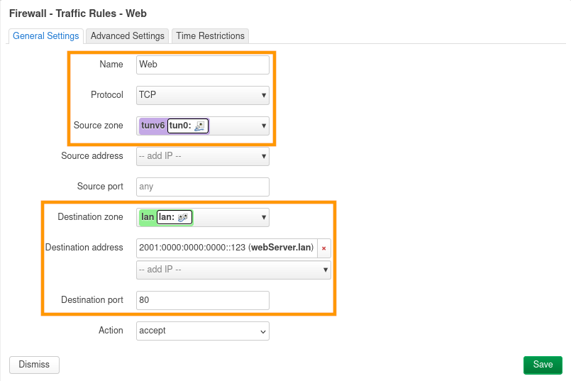
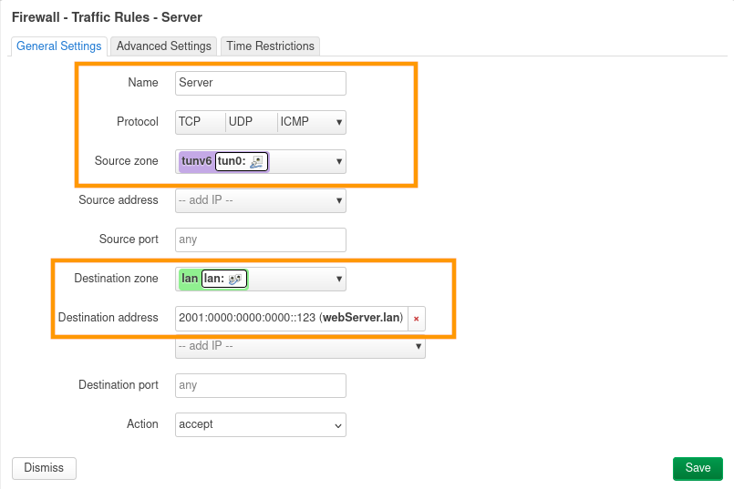
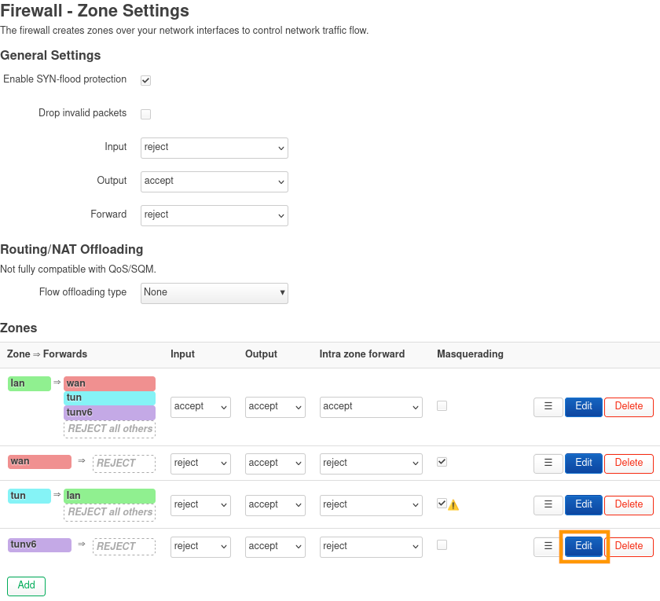
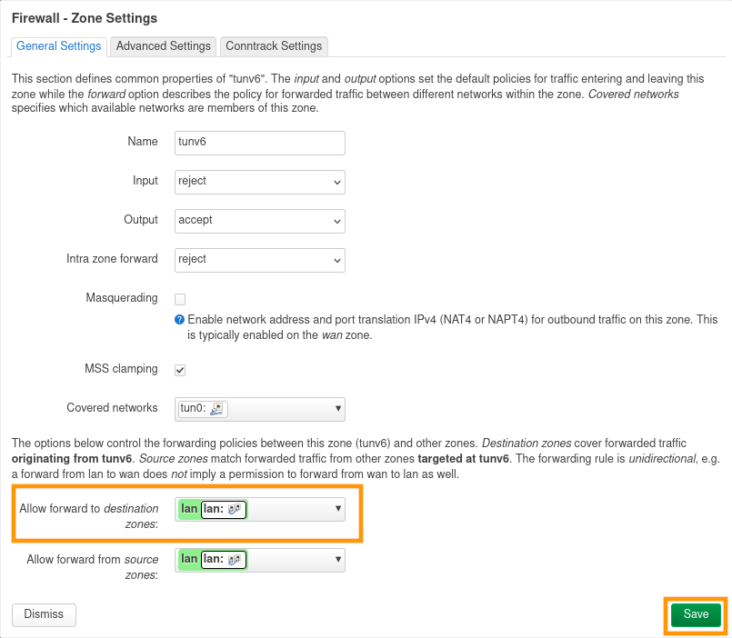

## Objectif

Découvrez comment configurer IPv6 sur un service OverTheBox.

## Prérequis

- Disposer d'un service **OverTheBox Starter** ou **OverTheBox Business** fourni par OVHcloud.
- Être connecté à l'[espace client OVHcloud](/links/manager) dans la partie `Telecom`{.action}.
- Une **OverTheBox** en version **v1.1.2 ou supérieur** fournie par OVHcloud ou une installation depuis le projet Open Source ([installer l'image overthebox sur votre matériel](/pages/web_cloud/internet/overthebox/advanced_installer_limage_overthebox_sur_votre_materiel))

> [!warning]
>
> L'IPv6 n'est pas disponible sur les anciennes offres OverTheBox, vous pouvez changer votre offre en consultant le guide « [Comment changer mon offre OverTheBox](/pages/web_cloud/internet/overthebox/offer_migration) ».
>

> [!warning]
>
> L'IPv6 est actuellement en phase beta, le boitier **OverTheBox** doit être en version **v1.1.2 ou supérieur**, pour mettre à jour votre équipement, consultez le guide « [Comment mettre à jour un appareil OverTheBox](/pages/web_cloud/internet/overthebox/config_upgrade) ».
>

## En pratique

### Fonctionnement de l'IPv6 avec OverTheBox

Chaque service dispose d'une plage /56 mais certaines restrictions s'appliquent :
- Un sous-réseau /64 est réservé pour le fonctionnement du service
- Seul le premier sous-réseau /60 est assigné à l'équipement, ce qui permet d'exploiter 16 sous-réseaux /64. Les autres sous-réseaux sont réservés pour des applications futures.

### Étape 1 : activer ou désactiver IPv6

- Connectez-vous à votre [espace client OVHcloud](/links/manager), partie `Telecom`{.action}. 
- Cliquez sur `OverThebox`{.action} dans la barre de services à gauche, puis sélectionnez le service OverTheBox sur lequel vous souhaitez configurer l'IPv6. 
- Pour **activer** IPv6, cochez la case `IPv6 activée`{.action}.
- Pour **désactiver** IPv6, décochez la case `IPv6 activée`{.action}.

{.thumbnail}

### Étape 2 : configuration du pare-feu

Par défaut le pare-feu du boitier **OverTheBox** est configuré pour permettre uniquement les communications sortantes en IPv6, du réseau local vers internet.

- Connectez-vous à l'interface web de l'**OverTheBox** depuis [overthebox.ovh](http://overthebox.ovh) ou [192.168.100.1](https://192.168.100.1).

#### Autoriser le ping depuis l'extérieur

Par défaut, le ping depuis l'extérieur n'est pas autorisé, vous pouvez ajouter une règle pare-feu pour l'autoriser.

- Rendez-vous dans l'onglet `Network > Firewall`{.action}.
- Rendez-vous dans la section `Traffic Rules`{.action}.
- Ajoutez une règle à l'aide du bouton `Add`{.action}.

{.thumbnail}

- Modifiez le paramètre `Name`{.action} pour donner un nom à la règle. Pour notre exemple, la règle se nomme `Allow-Ping-tunv6`.
- Modifiez le paramètre `Protocol`{.action} pour restreindre la règle sur une famille de protocole. Pour notre exemple, le ping utilise le protocole **ICMP**, nous renseignons donc `ICMP`.
- Modifiez le paramètre `Source zone`{.action} pour sélectionner la zone pare-feu d'où proviennent les paquets. La zone est `tunv6`.
- Modifiez le paramètre `Destination zone`{.action} pour sélectionner la zone pare-feu de destination. La zone est `lan`.

{.thumbnail}

- Rendez-vous dans la sous-section `Advanced Settings`{.action}.
- Dans le paramètre `Restrict to address family`{.action}, sélectionnez `IPv6 only`, pour limiter la règle uniquement au trafic **IPv6**.
- Confirmez vos changements avec le bouton `Save`{.action}.
- Appliquez vos changements avec le bouton `Save & Apply`{.action}.

{.thumbnail}

#### Ouverture de port

Il est possible de créer une règle pare-feu pour autoriser uniquement l'accès à un port spécifique depuis l'extérieur. Dans cet exemple, nous allons autoriser l'accès à un serveur **web** en **HTTP** sur le port **80**.

- Rendez-vous dans l'onglet `Network > Firewall`{.action}.
- Rendez-vous dans la section `Traffic Rules`{.action}.
- Ajoutez une règle à l'aide du bouton `Add`{.action}.

{.thumbnail}

- Modifiez le paramètre `Name`{.action} pour donner un nom à la règle. Pour notre exemple, la règle se nomme `web`.
- Modifiez le paramètre `Protocol`{.action} pour restreindre la redirection sur un protocole. Pour notre exemple, nous n'avons besoin que du protocole **HTTP** qui se base sur **TCP**, nous renseignons donc `TCP`.
- Modifiez le paramètre `Source zone`{.action} pour sélectionnner la zone pare-feu d'où proviennent les paquets. La zone est `tunv6`.
- Modifiez le paramètre `Destination zone`{.action} pour sélectionner la zone pare-feu de destination. La zone est `lan`.
- Modifiez le paramètre `Destination address`{.action} pour sélectionner l'équipement de destination. Dans notre exemple, notre équipement `webServer.lan`.
- Modifiez le paramètre `Destination port`{.action} pour sélectionner le port de destination sur l'équipement. Dans notre exemple, le protocole **HTTP** écoute sur le port **80**, nous renseignons donc `80`.

{.thumbnail}

- Rendez-vous dans la sous-section `Advanced Settings`{.action}.
- Dans le paramètre `Restrict to address family`{.action}, sélectionnez `IPv6 only`, pour limiter la règle uniquement au trafic **IPv6**.
- Confirmez vos changements avec le bouton `Save`{.action}.
- Appliquez vos changements avec le bouton `Save & Apply`{.action}.

{.thumbnail}

#### Désactiver le filtrage IPv6 sur un équipement en particulier
> [!warning]
>
> Cette configuration désactive le filtrage IPv6 par l'OverTheBox sur l'équipement client concerné. Il sera totalement exposé en IPv6, il devra assurer sa propre sécurité.
>

Il est possible de créer une règle pare-feu pour autoriser l'accès sans retriction à un équipement client depuis l'extérieur. Dans cet exemple, nous allons autoriser l'accès à tous les ports du serveur **webServer.lan**.

- Rendez-vous dans l'onglet `Network > Firewall`{.action}.
- Rendez-vous dans la section `Traffic Rules`{.action}.
- Ajoutez une règle à l'aide du bouton `Add`{.action}.

{.thumbnail}

- Modifiez le paramètre `Name`{.action} pour donner un nom à la règle. Pour notre exemple, la règle se nomme `server`.
- Modifiez le paramètre `Protocol`{.action} pour restreindre la redirection sur un protocole. Pour notre exemple, nous ne souhaitons pas de restrictions, nous renseignons donc `TCP`, `UDP` et `ICMP`.
- Modifiez le paramètre `Source zone`{.action} pour sélectionner la zone pare-feu d'où proviennent les paquets. La zone est `tunv6`.
- Modifiez le paramètre `Destination zone`{.action} pour sélectionner la zone pare-feu de destination. La zone est `lan`.
- Modifiez le paramètre `Destination address`{.action} pour sélectionner l'équipement de destination. Dans notre exemple, notre équipement `webServer.lan`.
- Le paramètre `Destination port`{.action} n'est pas renseigné pour autoriser la connexion sur tous les ports de l'équipement.

{.thumbnail}

- Rendez-vous dans la sous-section `Advanced Settings`{.action}.
- Dans le paramètre `Restrict to address family`{.action}, sélectionnez `IPv6 only`, pour limiter la règle uniquement au trafic **IPv6**.
- Confirmez vos changements avec le bouton `Save`{.action}.
- Appliquez vos changements avec le bouton `Save & Apply`{.action}.

{.thumbnail}

#### Désactiver complètement le filtrage IPv6 par l'OverTheBox
> [!warning]
>
> Cette configuration désactive le filtrage IPv6 par l'OverTheBox, les équipements clients seront totalement exposés en IPv6, ils devront assurer leur propre sécurité.
>

- Rendez-vous dans l'onglet `Network > Firewall`{.action}.
- Editez la zone `tunv6`{.action}.

{.thumbnail}

- Dans le paramètre `Allow forward to destination zones`{.action}, renseignez la zone `lan`.
- Confirmez vos changements avec le bouton `Save`{.action}.
- Appliquez vos changements avec le bouton `Save & Apply`{.action}.

{.thumbnail}

## Aller plus loin

Échangez avec notre [communauté d'utilisateurs](/links/community).
