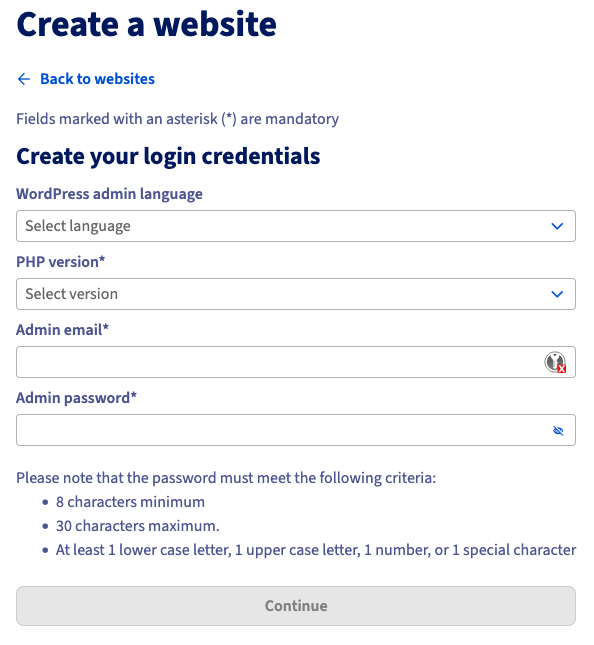
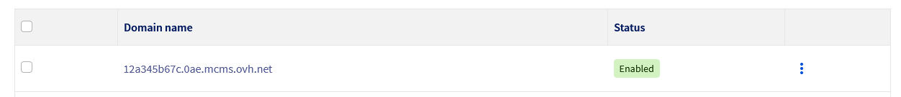
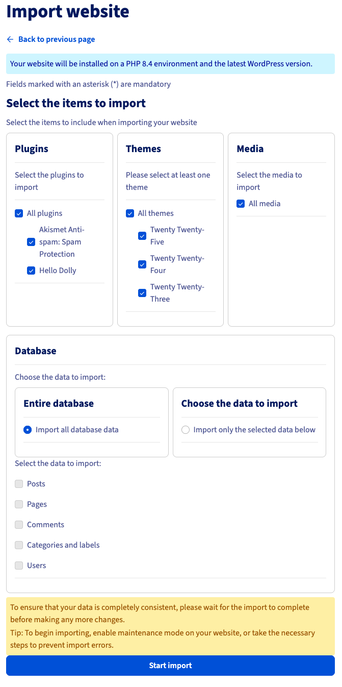
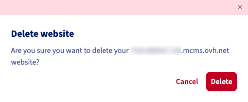
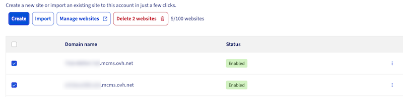
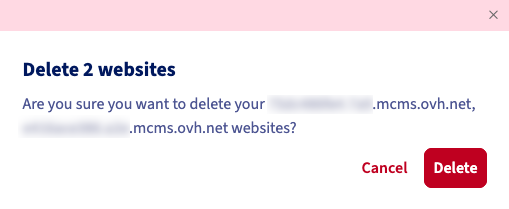
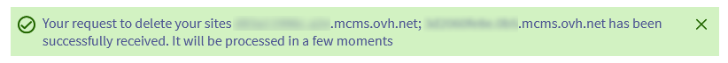

## Objective

**Managed Hosting for WordPress** is a new OVHcloud offer that allows you to host and manage your WordPress websites with ease. Designed for professionals, agencies, and freelancers, this service frees you from technical tasks related to infrastructure management and updates, so you can focus on your content and business. This guide presents the product concept, its main benefits, and the features available during the **Beta phase**.

## Requirements

- Access to the [OVHcloud Labs](https://labs.ovhcloud.com/en/managed-wp/) program for the Beta phase.
- Access to the [OVHcloud Control Panel](/links/manager).

## Instructions

### Product overview

#### 100% WordPress management by OVHcloud

With Managed Hosting for WordPress, **OVHcloud takes care of everything**:

- Hosting, infrastructure, cache, and security.
- Installation and maintenance of the CMS.
- Automatic backups and updates.
- Performance and availability monitoring.
- Simplified management of domains, plugins, and staging environments (Beta and General Availability phases).

No server knowledge is required: everything is **accessible from the OVHcloud Control Panel**. You can thus **create, import, and manage your WordPress sites in just a few clicks**, without ever having to use FTP, a database, or the command line.

#### A complete solution

Each website benefits from an optimized, ready-to-use environment:

- **Automatic WordPress installation** as soon as you place your order.
- **Managed infrastructure**: maintenance, patches, software updates, and security handled by OVHcloud.
- **Guaranteed performance**: integrated WordPress cache, optimised infrastructure hosting and continuous monitoring.
- **Built-in scalability**: monitor usage in real time across key metrics (storage, traffic, site count), and scale effortlessly as your needs evolve.
- **Full compatibility**: access via the OVHcloud Control Panel, allowing integration into your existing workflows.

#### A phased approach

The product is currently available in **Beta version** as part of the [OVHcloud Labs](https://labs.ovhcloud.com/en/managed-wp/) program. This first phase allows you to test the essential features:

- Creation and management of managed WordPress sites.
- Import of external sites.
- Automatic CMS and plugin updates.
- Display of your website status in a dashboard in your Control Panel.

> [!primary]
>
> Other features, such as advanced domain management, cloning, staging, and FTP/SSH access — will be gradually added during the **Beta** and **GA (General Availability)** phases.

### Features

Log in to the [OVHcloud Control Panel](/links/manager), go to the `Web Cloud`{.action} section, and click on `Managed hosting for WordPress`{.action}.

#### Create a website

To create a website, click the `Create`{.action} button. The following page appears:

{.thumbnail}

Fill in the form fields to define the credentials for your WordPress website:

- `WordPress admin language`{.action}: select the default language for the administration interface.
- `PHP version`{.action}: choose the desired PHP version for your WordPress environment.
- `Admin email`{.action}: enter the administrator's email address for the WordPress site.
- `Admin password`{.action}: set the password associated with this administrator account.

Click on `Continue`{.action} to validate the information.

You are redirected to the `My sites`{.action} tab. At the top of the screen, a confirmation message appears indicating that your website creation request has been processed.

{.thumbnail}

In the table, a new line appears for your new website:

- `Domain name`{.action} column: corresponds to the technical domain name of your website. It serves as the staging URL (pre-production), allowing you to access your website before associating it with your own domain name.
- `Status`{.action} column: indicates the progress of the website creation. The status initially appears as `In progress`{.action}, while the infrastructure is deployed and WordPress is installed. Once your website is operational, the status changes to `Enabled`{.action}, indicating that your WordPress site is now available online via its technical domain name.

{.thumbnail}

You can also track the progress of your website creation by clicking on the `Tasks`{.action} tab.

{.thumbnail}

#### Import a website

You can import an existing WordPress website into Managed Hosting for WordPress. The import can automatically transfer:

- WordPress content (plugins, themes, media, articles, pages, users).
- Files.
- Database.

> [!primary]
>
> Automatic import of a WordPress website hosted on an OVHcloud Web Hosting (shared) will be available during the Beta phase.

To import a WordPress website, click on the `Import`{.action} button. The following screen appears:

{.thumbnail}

> [!primary]
>
> An information message informs you that your website will be installed on an environment using a stable PHP version (PHP 8.4 in our example) and the latest version of WordPress, ensuring migration to an up-to-date, stable, and secure environment.

Fill in the form fields:

- `Website administration URL`{.action}: enter the address used to access the administration interface of your current WordPress website, for example `https://www.mywebsite.com/wp-admin`{.action}.
- `Admin account`{.action}: enter the WordPress administrator username.
- `Admin password`{.action}: enter the WordPress administrator password.

These details allow the system to access your existing website to automatically extract the files, database, and necessary configuration.

Once the required fields are filled in, click on `Continue`{.action} to start the import process.

You can then select the items to import, including plugins, themes, media, and databases.

> [!warning]
> To ensure perfect data consistency, make sure not to make any changes to your site until the import is complete.
>
> We recommend activating maintenance mode on the site to be imported or taking the necessary measures to avoid any data discrepancies during the import.

Once all items are selected, click on `Start import`{.action}.

{.thumbnail}

#### Delete a website

##### Delete a single website

To delete a website, go to the `My sites`{.action} tab and identify the row in the table corresponding to your website. Click on the `⋮`{.action} button and then on `Delete`{.action}.

{.thumbnail}

A confirmation message appears. Click on `Delete`{.action} to confirm the deletion of your website.

{.thumbnail}

You are redirected to the `My sites`{.action} tab. A confirmation message appears at the top of the screen, indicating that the deletion process of your website is in progress.

{.thumbnail}

When your website is permanently deleted, its corresponding row in the table disappears.

##### Delete multiple websites at once

To delete multiple websites at the same time, go to the `My sites`{.action} tab. Identify the rows in the table corresponding to the websites you want to delete and check the boxes on the left. Once the websites are selected, click on the `Delete X websites`{.action} button.

{.thumbnail}

A confirmation message appears. Click on `Delete`{.action} to confirm the deletion of your websites.

{.thumbnail}

You are redirected to the `My sites`{.action} tab. A confirmation message appears at the top of the screen, indicating that the deletion process of your websites is in progress.

{.thumbnail}

When your websites are permanently deleted, their corresponding rows in the table disappear.

#### Manage your websites

To manage all your websites, go to the `My sites`{.action} tab and click on `Manage websites`{.action}. This button automatically opens the fleet manager, integrated into Managed Hosting for WordPress. This space allows you to manage multiple WordPress websites simultaneously, from a unified interface.

##### Dashboard

The fleet manager is a centralized monitoring and management tool automatically provided with your offer. It allows you to manage your managed WordPress websites without having to log in to each website individually.

From this dashboard, you can:

- View the overall status of all your websites: available updates, alerts, performance, security.
- Manage WordPress updates (plugins, themes, etc.) centrally.
- Quickly access each website to check its status or take action.
- Monitor recent activities (changes, updates, synchronizations).
- Use the integrated security, monitoring, backup, and analysis features (in future phases).

## Go further

For specialized services (SEO, development, etc.), contact [OVHcloud partners](/links/partner).

Join our [community of users](/links/community).