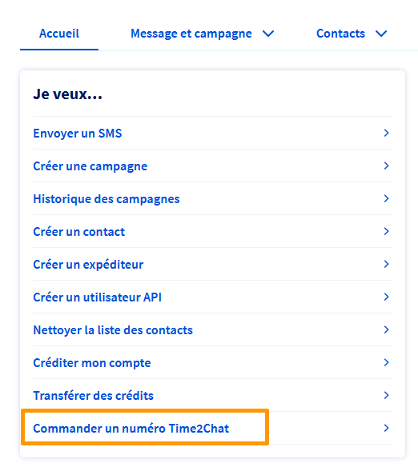
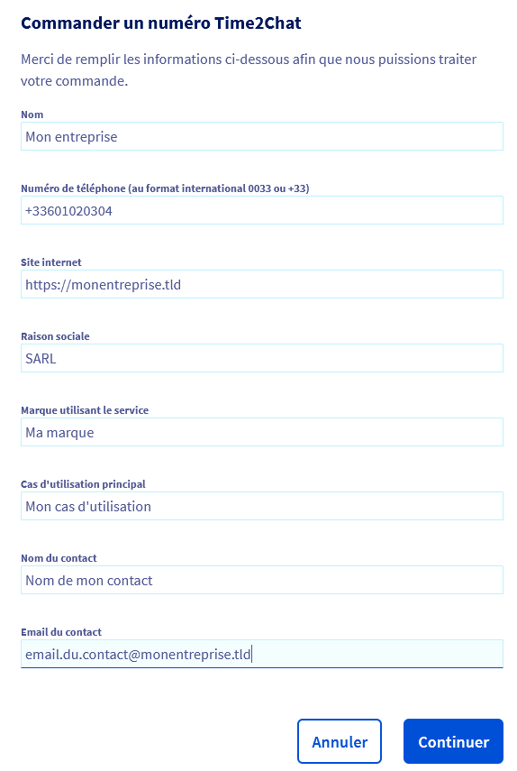
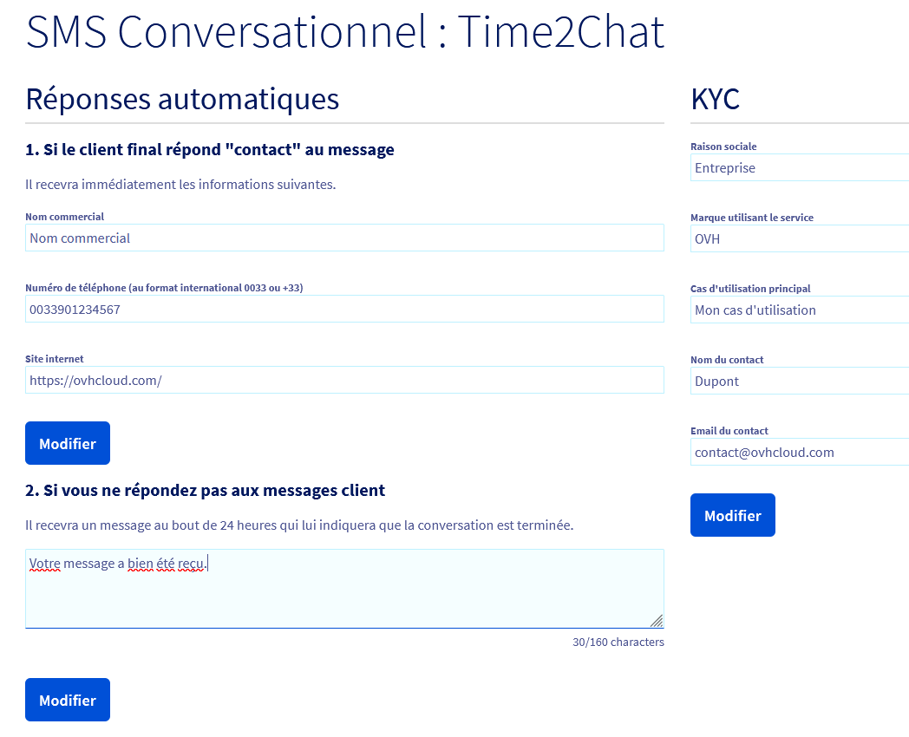

## Objectif

Time2Chat est une solution de messagerie conversationnelle par SMS. Elle permet à une entreprise d’envoyer et de recevoir des messages depuis un numéro unique commençant par « 09 », accessible partout en France métropolitaine.

Ce guide présente le principe de Time2Chat, ses avantages, les conditions d’accès et les premières étapes d’utilisation.

## Prérequis

- Disposer d’un [compte SMS OVHcloud](/links/telecom/sms).
- Être connecté à [l’espace client OVHcloud](/links/manager), partie `Télécom`{.action} puis `SMS`{.action}.

## En pratique

### Informations générales sur Time2Chat

Time2Chat est une solution de messagerie conversationnelle bidirectionnelle (marque ↔ utilisateur) permettant à une entreprise et à ses utilisateurs d’échanger par SMS en France.

Contrairement à un envoi de campagne classique, le service repose sur un numéro dédié commençant par « 09 », attribué spécifiquement à chaque entreprise. Ce numéro peut être utilisé à la fois pour envoyer et recevoir des SMS, mais aussi pour être joint directement par appel ou par SMS.

Une « session » de conversation débute dès qu’un premier message est envoyé — qu’il provienne de la marque ou du client. À partir de cet instant, la session reste active pendant 24 heures. Durant ce laps de temps, les deux interlocuteurs peuvent échanger un nombre illimité de SMS via le même canal. Une fois la période écoulée, tout nouveau message relance automatiquement une nouvelle session de 24 heures.

#### Exemples d’usage

- Prise ou confirmation de rendez-vous.
- Suivi de commande ou notification de livraison.
- Service après-vente et assistance client.
- Enquêtes de satisfaction ou sondages rapides.
- Interaction directe sans application à installer.

#### Avantages pour votre entreprise

- **Canal universel** : Le SMS reste accessible à tous les utilisateurs.
- **Numéro unique et identifiable** (en « 09 »), renforçant la reconnaissance de marque.
- **Expérience fluide** : Échanges naturels et continus, sans contrainte de format.
- **Conformité** : Respect de la réglementation française sur la messagerie professionnelle.

#### Différences avec l’offre SMS historique

Le service Time2Chat repose sur un modèle conversationnel, différent des envois de campagnes SMS classiques :

| Fonctionnalité | Campagne SMS classique | Time2Chat |
|----------------|------------------------|-----------|
| Canal utilisé | Numéro court mutualisé | Numéro dédié en 09 |
| Type d’usage | Envoi unidirectionnel (notification, alerte) | Conversation bidirectionnelle |
| Gestion des réponses | Réponses ponctuelles, sans fil de discussion | Fil de conversation de 24 heures entre la marque et le client |
| Facturation | Au message envoyé | Crédits SMS consommés sur les échanges durant les sessions |

> [!primary]
>
> Le client s’engage à utiliser le service de manière équilibrée, en visant un **ratio d’échange proche de 1:1** entre les messages envoyés et reçus.

#### Conditions d'accès

La première phase de lancement de Time2Chat est réservée aux clients déjà détenteurs d’un [compte SMS OVHcloud](/links/telecom/sms).

Si vous disposez déjà d’un compte SMS, vos crédits existants peuvent être utilisés sur Time2Chat.

Si besoin, vous pouvez également acheter un pack de crédits SMS depuis votre [espace client OVHcloud](/links/manager-telecom), rubrique `Télécom`{.action} puis section `SMS`{.action}. Choisissez l'un de vos comptes SMS et cliquez sur `Créditer mon compte`{.action} depuis l'onglet `Accueil`{.action}.

### Commander un numéro Time2Chat

Connectez-vous à votre [espace client OVHcloud](/links/manager) puis sélectionnez `Télécom`{.action}. Cliquez ensuite sur `SMS`{.action} et sur votre compte SMS. Dans l’onglet `Accueil`{.action}, cliquez sur le bouton `Commander un numéro Time2Chat`{.action}.

{.thumbnail}

Dans le formulaire qui s’affiche, remplissez tous les champs puis cliquez sur `Continuer`{.action}.

{.thumbnail}

> [!primary]
>
> Les informations saisies pourront être modifiées ultérieurement depuis l’espace client.

Suivez toutes les étapes avant de procéder au paiement.

### Configurer un expéditeur Time2Chat

Une fois votre numéro Time2Chat commandé, cliquez sur l’onglet `Expéditeurs`{.action} de votre compte SMS. Le numéro Time2Chat apparaît automatiquement dans la liste des expéditeurs avec le type « Numéro virtuel ». Pour le configurer, cliquez à droite du numéro sur le bouton `...`{.action} puis sélectionnez `Configurer`{.action}. Vous accédez alors à la page de configuration du SMS conversationnel Time2Chat.

{.thumbnail}

Dans cette interface, vous pouvez :

- définir les informations de réponse automatique : Si un client final répond par le mot-clé « contact », il recevra automatiquement un message contenant votre nom commercial, votre numéro de téléphone et votre site web.
- configurer la réponse en cas d’absence : Si vous ne répondez pas à un message client sous 24 heures, une réponse automatique (par exemple : « Votre message a bien été reçu ») sera envoyée pour indiquer la fin de la conversation.
- compléter les informations KYC (**K**now **Y**our **C**ustomer) : Renseignez la raison sociale, la marque utilisant le service, le cas d’utilisation principal, ainsi que les coordonnées du contact principal (nom et e-mail).

Ces éléments permettent de personnaliser votre numéro Time2Chat et de garantir le bon fonctionnement des échanges bidirectionnels entre votre marque et vos clients.

Dès que le client répond, la **session de 24 heures** démarre. Tous les échanges effectués durant cette période sont décomptés de vos **crédits SMS disponibles**, qu’ils proviennent de votre pack initial ou d’achats complémentaires.

## Aller plus loin

[Gérer les crédits SMS et activer la recharge automatique](/pages/web_cloud/messaging/sms/activer_la_recharge_automatique_du_credit_sms)

[Gérer l’historique des SMS](/pages/web_cloud/messaging/sms/gerer_l_historique_des_sms)

Échangez avec notre [communauté d'utilisateurs](/links/community).