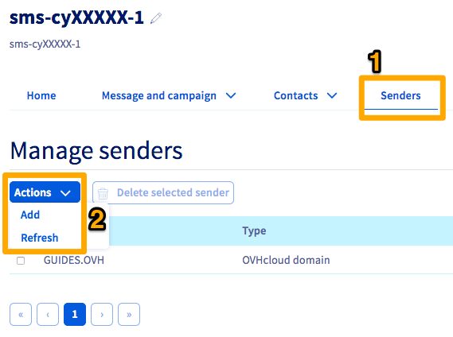
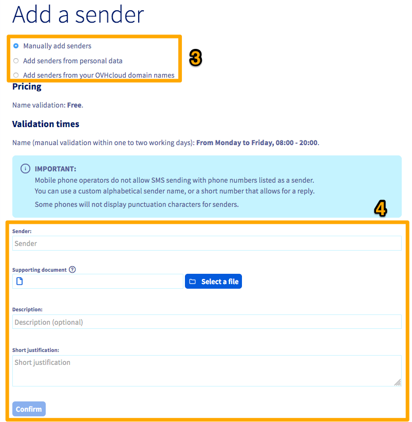

## Wprowadzenie

Ten przewodnik wyjaśnia, jak tworzyć i używać nadawców do wysyłania SMS.

## Wymagania początkowe

- Posiadanie [konta SMS OVHcloud](/links/telecom/sms).
- Zalogowanie się do [panelu klienta OVHcloud](/links/manager), sekcja `Telecom`{.action}, a następnie `SMS`{.action}.

{.thumbnail}

## W praktyce

Zaloguj się do swojego [panelu klienta OVHcloud](/links/manager) i wybierz `Telecom`{.action}.

Następnie kliknij `SMS`{.action}, a następnie swoje konto SMS.

### Dostępne typy nadawców

OVHcloud umożliwia wybór typu nadawcy do wysyłania SMS.

Nadawca „Numer krótki umożliwiający odpowiedź” jest domyślnie dostępny w naszych rozwiązaniach SMS. Możesz jednak również użyć nadawcy alfanumerycznego lub wirtualnego numeru komórkowego.

#### Numer krótki umożliwiający odpowiedź

**Tylko dla kont OVHcloud w Francji poza DOM-TOM.**

Umożliwia otrzymywanie odpowiedzi za pomocą zakładki „SMS otrzymane”.

> [!warning]
>
> **Wysyłanie SMS z URL**
>
> Nie można wysyłać SMS zawierających URL za pomocą numeru krótkiego umożliwiającego odpowiedź. Wszelkie wysyłki tego typu zostaną zablokowane.
>
> Jeśli chcesz wysyłać SMS zawierające URL, musisz użyć nadawcy alfanumerycznego.
>

#### Nadawca alfanumeryczny

Możesz spersonalizować swojego nadawcę. Nie będzie wtedy możliwe otrzymywanie odpowiedzi od odbiorcy SMS. Aby uzyskać dostęp do zarządzania nadawcami SMS, wybierz zakładkę `Nadawcy`{.action} (1), gdy jesteś na odpowiednim koncie SMS.

{.thumbnail}

Jeśli chcesz dodać dodatkowego nadawcę SMS, kliknij przycisk `Operacje`{.action} w centrum, a następnie `Dodaj`{.action} (2).

{.thumbnail}

Po wejściu na stronę dodawania, masz kilka opcji do skonfigurowania nowego nadawcy SMS (3):

- **Dodaj ręcznie nadawców**: Musisz wpisać żądanego nadawcę, opis oraz uzasadnienie dla użycia tego nadawcy (4). Potrzebny jest również dokument potwierdzający.

**Przykład**: jeśli chcesz wysłać swój SMS z nazwą swojej firmy jako nadawcą, zostanie żądany potwierdzający dokument firmy.

Weryfikacja nadawcy alfanumerycznego trwa średnio 72 godziny po jego utworzeniu.

> [!primary]
>
> Żądanie dokumentu potwierdzającego wynika z naszej polityki bezpieczeństwa. Domyślnie jest to papier firmowy firmy lub marki, zawierający autoryzację odpowiedzialnego osoby z podpisem i pieczątką tej samej firmy, dokument tożsamości, lub wyrys Kbis, jeśli to nie jest zarejestrowana marka.
>

- **Dodaj nadawców na podstawie danych osobowych**: Możesz zażądać nadawcy opartego na danych swojego konta OVHcloud. Wyświetlana będzie lista dostępnych nadawców.

- **Dodaj nadawców na podstawie swoich domen OVHcloud**: Możesz użyć domeny dostępnej w Twoim koncie OVHcloud jako nadawcę. Wyświetlana będzie lista dostępnych nadawców.

#### Wirtualny numer komórkowy

**Tylko dla kont OVHcloud w Francji.**

Jeśli masz ofertę SMS z wirtualnym numerem komórkowym, możesz podać ten numer jako nadawcę. Aby uzyskać więcej informacji, odwiedź naszą [stronę dotyczącą wirtualnego numeru komórkowego](/links/telecom/sms-vln).

> [!primary]
>
> Jeśli masz już konto SMS, nie możesz utworzyć wirtualnego numeru komórkowego dla istniejącego konta. Będzie konieczne zamówienie nowego konta SMS przez stronę oferty [wirtualnego numeru komórkowego](/links/telecom/sms-vln).
>

## Sprawdź również

Dołącz do [grona naszych użytkowników](/links/community).