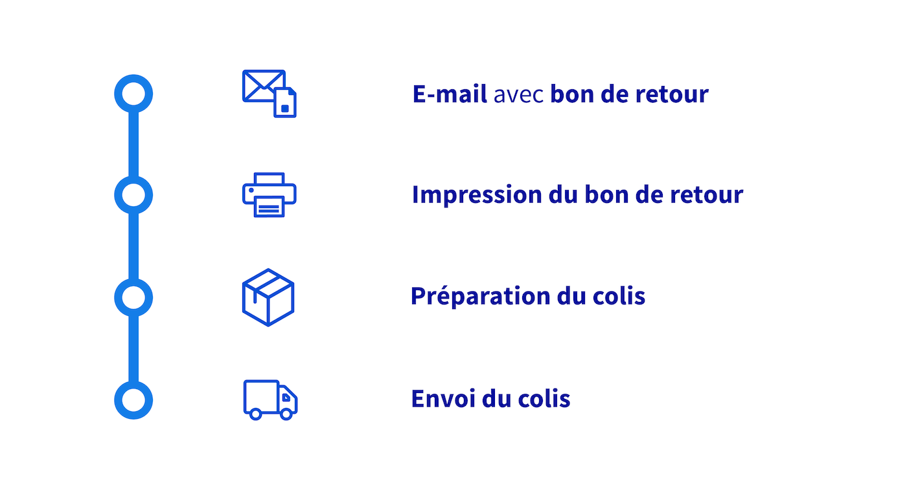
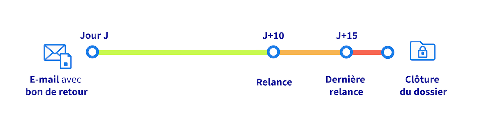
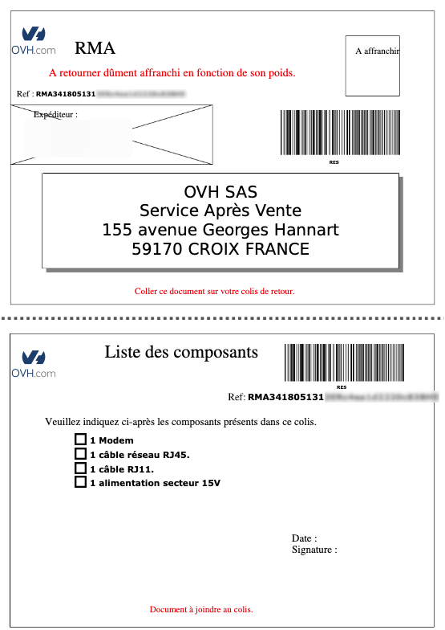
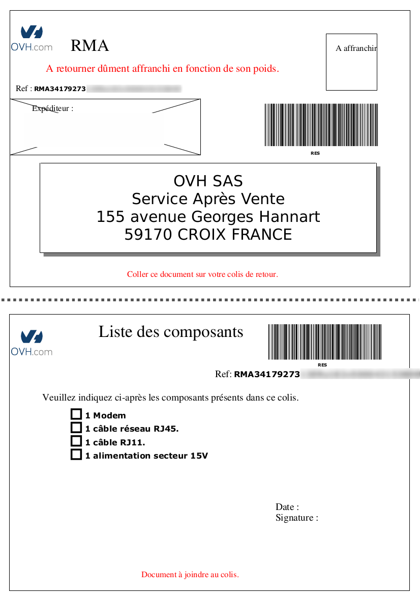
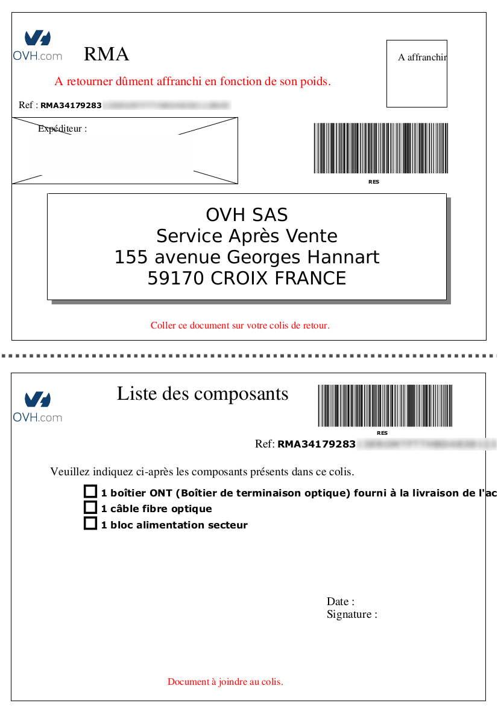

## Objectif

Lorsque vous changez de téléphone, vous restituez votre ancien matériel. Que notre support échange votre équipement ou que vous ayez résilié votre ligne, un RMA (pour *Return Merchandise Agreement* ou « autorisation de retour d'un équipement ») est généré. Ce RMA permet de tracer et valider l'arrivée de l'équipement dans nos locaux et de restituer la caution liée au matériel.

De même, lors d'un changement de modem suite à une migration vers la Fibre ou lors de la résiliation d'un accès à Internet xDSL, un RMA est généré afin de restituer le modem fourni par OVHcloud. Lors de la résiliation d'un accès Fibre, un second RMA est généré pour la restitution du boîtier fibre (ONT).

**Découvrez les étapes d'un RMA.**

## Prérequis

- Disposer d'un téléphone VoIP fourni sous caution par OVHcloud, d'un modem ou d'un ONT fournis en prêt par OVHcloud.
- Un retour du matériel est demandé, par exemple suite à un échange ou à une résiliation.

## En pratique

Retrouvez dans ce guide les étapes du déroulement d'un RMA pour la restitution d'un téléphone sous caution, d'un modem et d'un ONT fournis par OVHcloud.

Ce guide décrit 2 exemples de RMA (échange de téléphone ou de modem et résiliation) afin d'en comprendre le fonctionnement.
D'autres typologies de RMA existent, leur déroulement étant similaire (envoi d'un e-mail puis rappels et enfin clôture du RMA).

> [!primary]
>
> Pour plus d'informations sur l'échange de téléphones fournis par OVHcloud, consultez notre guide « [Gérer le téléphone Plug & Phone d’une ligne SIP](/pages/web_cloud/phone_and_fax/voip/commander_associer_ou_changer_un_telephone) ».

### Vue d'ensemble

Suite à la réception de l'e-mail contenant le bon de retour, vous disposez de 15 jours pour effectuer l'envoi du matériel, avant la clôture du dossier.

| Actions à réaliser | Délai de restitution du matériel |
| :---: | :---: |
| {.thumbnail width="400"} | {.thumbnail width="400"} |

### Réception du premier e-mail et impression du bon de retour

Lorsque votre RMA est créé, vous recevez un premier e-mail :

> [!primary]
>
> Cet e-mail est envoyé au contact facturation du service.
> Retrouvez plus d'informations sur la gestion des contacts dans notre guide « [Gérer les contacts de ses services](/pages/account_and_service_management/account_information/managing_contacts) ».

/// details | E-mail pour un échange de matériel

> [!tabs]
> Échange de téléphone
>>
>> > 
>> > Objet : [OVH-TELECOM] Bon de retour pour votre matériel : #MODEL# #IDENT#
>> >
>> > Bonjour,
>> >
>> > Vous avez demandé, en date du #DATE#, un matériel de remplacement à celui correspondant au modèle #MODEL# (Référence : #REFERENCE#). 
>> > Voici le bon de retour, au format PDF, pour le renvoi de ce matériel : #Lien vers le PDF du RMA#. 
>> > Veuillez imprimer ce bon svp, puis joindre la partie basse à votre colis, tandis que la partie haute devra être collée dessus, à l'extérieur. 
>> > Merci de bien vérifier que votre colis contienne tous les éléments d'origine. Vous disposez de 15 jours pour nous renvoyer ce matériel. 
>> > Après ce délai, vous pourrez être facturé de la caution et/ou des frais de pénalités. 
>> > Votre numéro de retour (RMA) est : #RMA#. Il vous sera demandé en cas d'échange avec notre support concernant ce dossier.  
>> > Adresse de retour : OVH SAS - 155, avenue Georges Hannart 59170 CROIX.
>>
> Échange de modem
>>
>> > Objet : [OVH-TELECOM] Bon de retour pour votre matériel : #MODEL# #LINE# (#DESCRIPTION#)
>> >
>> > Bonjour,
>> >
>> > Vous avez demandé, en date du #DATE#, un matériel de remplacement à celui correspondant au modèle #MODEL# (Référence : #REFERENCE#). 
>> > Voici le bon de retour, au format PDF, pour le renvoi de ce matériel : #Lien vers le PDF du RMA#. 
>> > Veuillez imprimer ce bon svp, puis joindre la partie basse à votre colis, tandis que la partie haute devra être collée dessus, à l'extérieur. 
>> > Merci de bien vérifier que votre matériel contienne tous les éléments d'origine. Vous disposez de 15 jours pour nous renvoyer ce matériel.
>> > Après ce délai, vous serez facturé de la caution de ce dernier #AMOUNT#. 
>> > La société OVH décline toute responsabilité en cas de non réception ou de perte du colis par le transporteur choisi. 
>> > Votre numéro de retour (RMA) est : #RMA#. Il vous sera demandé en cas d'échange avec notre support concernant ce dossier. 
>> > Adresse de retour : OVH SAS - Service Après Vente - 155, avenue Georges Hannart 59170 CROIX.

///

/// details | E-mail pour une résiliation

> [!tabs]
> Résiliation d'une ligne VoIP
>>
>> > 
>> > Objet : [OVH-TELECOM] Bon de retour pour votre matériel : #MODEL# #IDENT# 
>> >
>> > Bonjour,
>> >
>> > En date du #DATE#, un bon de renvoi du matériel, fourni par OVHcloud, a été créé.
>> > Modèle : #MODEL# Référence/Mac : #REFERENCE#
>> > Cette demande de retour a pu être générée, non sur votre demande, dans les cas suivants :
>> >
>> > - Résiliation d'un abonnement
>> > - Suspension prolongée d'un abonnement
>> > - Impayé d'un abonnement *
>> >
>> > Voici le bon de retour, au format PDF, pour le renvoi de ce matériel : #Lien vers le PDF du RMA#. 
>> > Veuillez imprimer ce bon svp, puis joindre la partie basse à votre colis, tandis que la partie haute devra être collée dessus, à l'extérieur. 
>> > Merci de bien vérifier que votre colis contienne tous les éléments d'origine. 
>> > Vous disposez de 15 jours pour nous renvoyer ce matériel. Après ce délai, vous pourrez être facturé de la caution et/ou des frais de pénalités. 
>> > Votre numéro de retour (RMA) est : #RMA#. Il vous sera demandé en cas d'échange avec notre support concernant ce dossier. 
>> > Adresse de retour : OVH SAS - Service Après Vente - 155, avenue Georges Hannart 59170 CROIX
>> > 
>> > * Cette demande de retour sera automatiquement annulée en cas de régularisation de votre situation dans les délais. À défaut, votre abonnement sera définitivement supprimé et les frais éventuels restants appliqués.
>> 
> Résiliation d'un accès Internet xDSL
>>
>> > Objet : [OVH] Demande de résiliation de l'accès Internet #PACKADSL# (#LINE# - #ACCESS#)
>> >
>> > Bonjour,
>> >
>> > La demande de résiliation de l'accès internet #LINE# (#ACCESS#) au nom de #NAME# a bien été prise en compte. 
>> > La résiliation sera effective au #DATE#. Votre accès internet reste opérationnel jusqu'à cette date. 
>> > Nous vous informons que vous serez redevable du mois en cours. 
>> > Vous avez la possibilité, si vous le souhaitez, d'annuler votre demande de résiliation. Pour ce faire, rendez-vous sur votre Espace Client par le biais de ce lien : #LINK#. 
>> > Vous recevrez un nouveau mail lorsque la résiliation sera effective. 
>> > Un bon de renvoi du modem #MODEL# a été créé avec la référence #RMA#. 
>> > Vous disposez de X jours, soit jusqu'au #DATE+15jours#, pour nous renvoyer ce matériel. Après ce délai, vous pourrez être facturé de la caution et/ou des frais de pénalités. 
>> > Vous pouvez retrouver le bon de retour pour le modem au format PDF à l'adresse suivante : #Lien vers le PDF du RMA#. 
>> > Après avoir imprimé votre bon, coupez la partie basse. Joignez-la au matériel, à l'intérieur du colis. La partie haute doit être collée à l'extérieur du colis et doit rester visible. 
>> > Nous vous prions de joindre l'intégralité des éléments d'origine du matériel. 
>> > Attention : Nous vous prions de bien vouloir retirer du matériel et de son emballage tout effet personnel, information ou élément qui n'aurait aucun lien avec le matériel retourné. Dans le cas contraire, OVHcloud tentera de prendre attache avec le client par courriel pour restituer les biens n'appartenant pas à OVHcloud. À compter de l'envoi de ce courriel et sans retour de la part du client dans un délai de 30 jours calendaires, OVHcloud procédera à la destruction dudit matériel. 
>> > La société OVH décline toute responsabilité en cas de non réception ou de perte du colis par le transporteur choisi. 
>> > L'adresse de retour est la suivante : OVH SAS - Service Après Vente - 155, avenue Georges Hannart 59170 CROIX
>>
> Résiliation d'un accès Internet Fibre
>>
>> Deux RMA sont générés, pour le retour du modem et pour le retour du boîtier fibre (ONT).
>>
>> > Objet : [OVH] Demande de résiliation de l'accès Internet #PACKADSL# (#PTO-REF# - #DESCRIPTION#)
>> >
>> > Bonjour,
>> >
>> > La demande de résiliation de l'accès internet #PTO-REF# (#DESCRIPTION#) au nom de #NAME# a bien été prise en compte. 
>> > La résiliation sera effective au #DATE#. Votre accès internet reste opérationnel jusqu'à cette date. 
>> > Nous vous informons que vous serez redevable du mois en cours. 
>> > Vous avez la possibilité, si vous le souhaitez, d'annuler votre demande de résiliation. Pour ce faire, rendez-vous sur votre Espace Client par le biais de ce lien : #LINK#. 
>> > Vous recevrez un nouveau mail lorsque la résiliation sera effective. 
>> > Un bon de renvoi du modem #MODEL# a été créé avec la référence #RMA#. 
>> > Ainsi qu'un bon de renvoi pour l'ONT avec la référence #RMA-ONT#. 
>> > Vous disposez de X jours, soit jusqu'au #DATE+15jours#, pour nous renvoyer ce matériel. Après ce délai, vous pourrez être facturé de la caution et/ou des frais de pénalités. 
>> > Vous pouvez retrouver le bon de retour pour le modem au format PDF à l'adresse suivante : #Lien vers le PDF du RMA#. 
>> > Celui de l'ONT au format PDF est à l'adresse suivante : #Lien vers le PDF du RMA-ONT#. 
>> > Vous avez la possibilité de renvoyer l'ONT et le modem dans le même colis, pensez bien à y joindre les deux bons de retour. 
>> > Après avoir imprimé votre bon, coupez la partie basse. Joignez-la au matériel, à l'intérieur du colis. La partie haute doit être collée à l'extérieur du colis et doit rester visible. 
>> > Nous vous prions de joindre l'intégralité des éléments d'origine du matériel. 
>> > Attention : Nous vous prions de bien vouloir retirer du matériel et de son emballage tout effet personnel, information ou élément qui n'aurait aucun lien avec le matériel retourné. Dans le cas contraire, OVHcloud tentera de prendre attache avec le client par courriel pour restituer les biens n'appartenant pas à OVHcloud. À compter de l'envoi de ce courriel et sans retour de la part du client dans un délai de 30 jours calendaires, OVHcloud procédera à la destruction dudit matériel. 
>> > La société OVH décline toute responsabilité en cas de non réception ou de perte du colis par le transporteur choisi. 
>> > L'adresse de retour est la suivante : OVH SAS - Service Après Vente - 155, avenue Georges Hannart 59170 CROIX

///

Lorsque vous recevez cet e-mail, le lien vers le bon de retour au format PDF est disponible dans le corps de l'e-mail. 
Suivez ce lien et imprimez le bon de retour.

> [!primary]
> L'ouverture du fichier PDF via le logiciel Adobe Reader peut ne pas aboutir. Dans ce cas, ouvrez ce fichier directement via un navigateur web ou via un autre lecteur de PDF.
>
> **L’impression du bon de retour doit être effectuée de façon claire et lisible afin que les codes-barres puissent être scannés lors de la réception.**

Pour la téléphonie, vous pourrez également télécharger le bon de retour depuis votre espace client OVHcloud en suivant les étapes ci-dessous :

1. Connectez-vous à votre [espace client OVHcloud](/links/manager) et cliquez sur `Télécom`{.action}.
1. Cliquez sur `VoIP & Fax`{.action} puis sur le groupe de facturation contenant votre ligne SIP.
1. Cliquez sur l'onglet `Services`{.action} puis sur la ligne SIP concernée (vous pouvez rechercher le numéro dans le champ prévu à cet effet).
1. Cliquez alors sur l'onglet `Assistance`{.action} puis sur `Suivi RMA`{.action}.
1. Les informations relatives au RMA sont alors visibles, ainsi qu'un bouton pour `Télécharger le bon de retour`{.action}.

Cliquez sur les onglets ci-dessous pour afficher des exemples de bons RMA :

> [!tabs]
> Bon RMA - VoIP
>>
>> {.thumbnail width="400"}
>>
> Bon RMA - xDSL
>>
>> {.thumbnail width="400"}
>>
> Bons RMA - Fibre
>>
>> Deux bons RMA sont générés, pour le retour du modem et pour le retour du boîtier fibre (ONT).
>>
>> | Bon de retour du modem | Bon de retour de l'ONT |
>> | :---: | :---: |
>> | {.thumbnail width="400"} | {.thumbnail width="400"} |
>>

### Envoi du colis

> [!tabs]
> Envoi d'un téléphone
>>
>> La partie basse du bon de retour est impérativement à joindre dans le colis et l'autre volet est à coller sur le colis pour l'affranchissement. 
>> Le volet à joindre dans le colis contient la liste des éléments à renvoyer. **N'oubliez aucun élément pour récupérer la totalité de la caution**. 
>>
>> Si vous disposez de plusieurs téléphones similaires, vérifiez que l'adresse MAC (une adresse unique par téléphone) du téléphone correspond bien à celle écrite dans l'e-mail reçu ou dans la référence du bon RMA avant la mention « 3BHE » (RMAxxxx**MAC**3BHE). 
>>
> Envoi d'un modem (xDSL et Fibre)
>>
>> La partie basse du bon de retour est impérativement à joindre dans le colis et l'autre volet est à coller sur le colis pour l'affranchissement. 
>> Le volet à joindre dans le colis contient la liste des éléments à renvoyer. **N'oubliez aucun élément pour éviter toute pénalité**. 
>>
>> **Modem Technicolor** : Si vous disposez de plusieurs modems similaires, vérifiez que l'adresse MAC (une adresse unique par modem) du modem correspond bien à celle écrite dans l'e-mail reçu ou dans la référence du bon RMA avant la mention « 3BHE » (RMAxxxx**MAC**3BHE). 
>>
>> **Modem Zyxel** : Si vous disposez de plusieurs modems similaires, vérifiez que le numéro de série (un numéro unique par modem) du modem correspond bien à celui écrit dans l'e-mail reçu ou dans la référence du bon RMA avant la mention « 3BHE » (RMAxxxx**SN**3BHE). 
>>
> Envoi d'un modem et d'un ONT (Fibre)
>>
>> La partie basse du bon de retour est impérativement à joindre dans le colis et l'autre volet est à coller sur le colis pour l'affranchissement. 
>> Le volet à joindre dans le colis contient la liste des éléments à renvoyer. **N'oubliez aucun élément pour éviter toute pénalité**. 
>>
>> Vous pouvez effectuer l'envoi du modem et de l'ONT en un seul colis. Dans ce cas, **glissez bien les 2 bons de retour dans le colis** et collez la partie haute d'un des bons de retour sur le colis pour l'affranchissement.
>>

#### Envoi de plusieurs équipements (téléphone(s) - modem(s) - ONT)

Si vous devez restituer plusieurs équipements (téléphone(s), modem(s) et ONT), vous pouvez les regrouper dans un seul colis. Dans ce cas, **glissez bien l'ensemble des bons de retour dans le colis** (un bon de retour par matériel) et collez la partie haute d'un des bons de retour sur le colis pour l'affranchissement.

> [!primary]
>
> Le colis doit être envoyé depuis un bureau de Poste.

Conservez le récépissé de dépôt du colis tant que vous n'avez pas eu confirmation de la bonne réception de celui-ci dans nos locaux.

> [!warning]
>
> Nous vous prions de bien vouloir retirer du matériel et de son emballage tout effet personnel, information ou élément qui n’aurait aucun lien avec le matériel retourné.
> 
> Dans le cas contraire, OVHcloud tentera de prendre contact avec le client par courriel pour restituer les biens n’appartenant pas à OVHcloud. À compter de l’envoi de ce courriel et sans retour de la part du client dans un délai de 30 jours calendaires, OVHcloud procédera à la destruction dudit matériel.

### Les rappels

Au bout de 10 et de 15 jours, si nous n'avons pas reçu votre colis avec le bon RMA, nous vous envoyons un rappel par e-mail sous cette forme :

/// details | E-mail de rappel

L'e-mail ci-dessous concerne un RMA pour un téléphone. Cet e-mail est similaire pour la non restitution d'un modem ou d'un ONT.

> 
> Objet : [OVH-TELECOM] Non réception de votre matériel : #MODEL# #IDENT#
>
>
> Bonjour,
>
> Sauf erreur de notre part, nous n'avons toujours pas reçu le matériel lié au retour ouvert en date du #DATE# : 
> Modèle : #MODEL# 
> Référence : #REFERENCE# 
> Voici le bon de retour, au format PDF, pour le renvoi de ce matériel : #Lien vers le PDF du RMA# 
> Veuillez imprimer ce bon svp, puis joindre la partie basse à votre colis, tandis que la partie haute devra être collée dessus, à l'extérieur. 
> Merci de bien vérifier que votre colis contienne tous les éléments d'origine. 
> Sans restitution de votre matériel dans les 3 jours, nous devrons procéder à la fermeture de ce dossier. 
> Adresse de retour : OVH SAS - 155, avenue Georges Hannart 59170 CROIX.
>

///

### La clôture

#### Le matériel est reçu

Lorsque nous avons reçu votre équipement, vous recevez cet e-mail :

/// details | E-mail d'accusé de réception d'un équipement

L'e-mail ci-dessous concerne un RMA pour un téléphone. Cet e-mail est similaire pour la réception d'un modem ou d'un ONT.

> 
> Objet : [OVH-TELECOM] Réception du retour de votre matériel : #MODEL# #IDENT#
> 
> 
> Bonjour,
>
> Nous avons réceptionné le matériel lié au RMA #RMA# correspondant à la référence #MODEL#, et nous vous en remercions. 
> Tout est en ordre et la totalité de votre caution vous sera restituée dans les jours qui suivent. 
> Elle sera créditée sur votre compte OVH, accessible à partir de votre espace Client Télécom > Facturation > Mon Compte OVH. 
> Vous pouvez à tout moment procéder à un transfert vers votre compte bancaire depuis votre espace client.
>

///

Si une caution est restituée (uniquement valable pour un téléphone, les modems et les ONT sont fournis en prêt par OVHcloud), elle sera disponible sous forme d'avoir sur votre compte prépayé OVHcloud et servira ainsi à régler vos prochaines factures de manière automatique. 
Si vous le souhaitez, vous pouvez en demander le remboursement sur votre compte bancaire via les étapes suivantes, **sous réserve d'avoir [enregistré un compte bancaire SEPA dans votre compte OVHcloud et de l'avoir défini en moyen de paiement par défaut](/pages/account_and_service_management/managing_billing_payments_and_services/manage-payment-methods) au préalable** :

1. Connectez-vous à votre [espace client OVHcloud](/links/manager) et cliquez sur `Télécom`{.action}.
1. Cliquez sur `VoIP & Fax`{.action} puis sur le groupe de facturation souhaité.
1. Cliquez sur l'onglet `Facturation`{.action} puis sur `Virement vers un compte bancaire`{.action}.
1. Dans le tableau, cliquez sur les `...`{.action} à droite de la ligne correspondant à la caution restituée, puis sur `Demander un remboursement`{.action}.
1. Cliquez sur `Valider la demande`{.action}.

Le montant du remboursement apparaîtra au crédit du compte bancaire SEPA défini dans votre espace client OVHcloud sous environ 10 jours.

> [!primary]
> Si le montant de l'avoir n'apparaît pas sur le solde du compte prépayé OVHcloud ou est incomplet, cela signifie que la totalité ou une partie de ce montant a été utilisée automatiquement pour le règlement de vos factures.

#### Le matériel n'est pas reçu

Vous recevez alors l'e-mail suivant :

/// details | E-mail de fermeture du RMA

L'e-mail ci-dessous concerne un RMA pour un téléphone. Cet e-mail est similaire pour la non restitution d'un modem ou d'un ONT.

> 
> Objet : [OVH-TELECOM] Fermeture du dossier retour : #RMA# #IDENT#
>
> Bonjour,
>
> Sauf erreur de notre part, nous n'avons pas reçu le matériel lié au retour ouvert en date du #DATE# : 
> Modèle : #MODEL# 
> Référence/Mac : #REFERENCE# 
> Le bon de retour, pour le renvoi de ce matériel, était le suivant : #Lien vers le PDF du RMA#. 
> Nous sommes donc dans l'obligation de fermer votre ticket.
>

///

**Facturation suite à la non réception du matériel**

> [!tabs]
> Facturation - VoIP
>>
>> Passé le délai de clôture du RMA, la caution n'est pas restituable. La caution étant Hors Taxes, la TVA correspondant au matériel non restitué est facturée.
>>
> Facturation - Accès Internet
>>
>> Passé le délai de clôture du RMA, une pénalité sera appliquée pour le matériel (modem et/ou ONT) non reçu. Une facture sera ainsi émise.
>> 

### Erreur d'envoi d'un téléphone, d'un modem ou d'un ONT

Si vous renvoyez à OVHcloud un matériel autre que celui concerné par le RMA, il est malgré tout indispensable de nous retourner le matériel réclamé sur le bon RMA. En effet, le délai de renvoi court toujours et le matériel correspondant au RMA doit nous être restitué. 

Nous vous conseillons de contacter le support, via un [ticket d'assistance depuis le centre d'aide](https://help.ovhcloud.com/csm?id=csm_get_help), pour indiquer votre erreur d'envoi afin qu'une solution soit étudiée concernant le matériel renvoyé par erreur.

## Aller plus loin

Échangez avec notre [communauté d'utilisateurs](/links/community).