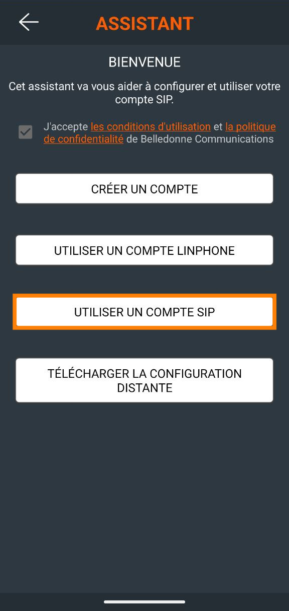
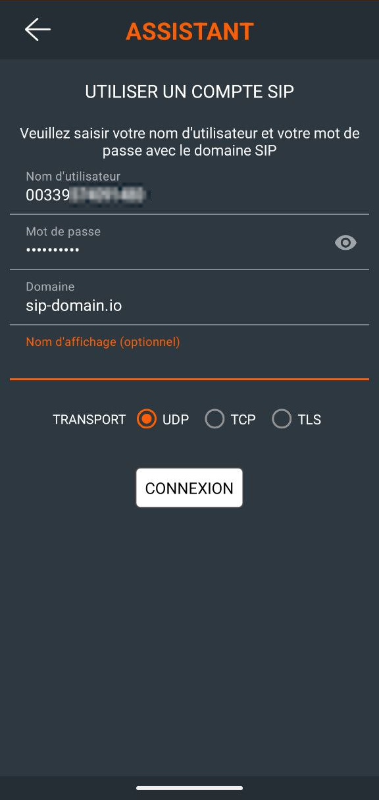
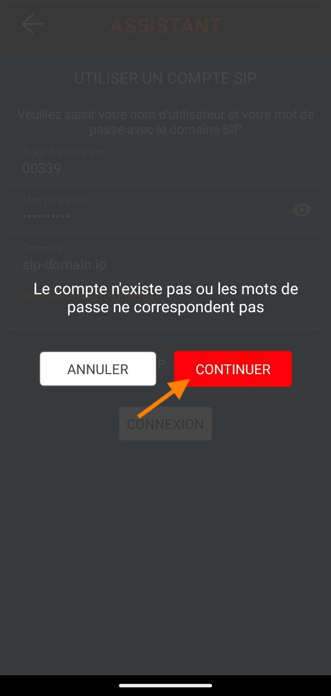
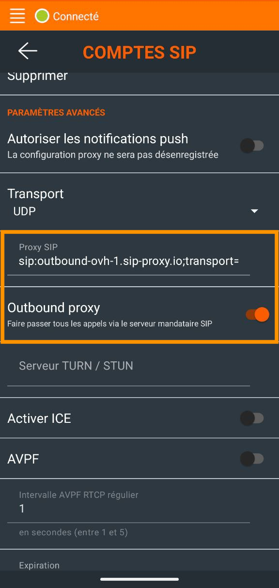

## Objectif

Le logiciel [Linphone](https://www.linphone.org/){.external} est un softphone (logiciel de téléphonie) open-source et gratuit permettant d'enregistrer une ligne SIP fixe OVHcloud, afin d'émettre et recevoir des appels via cette ligne, depuis un ordinateur ou un smartphone.

**Découvrez comment enregistrer votre ligne SIP OVHcloud sur Linphone**

> [!warning]
>
> OVHcloud met à votre disposition des services dont la configuration, la gestion et la responsabilité vous incombent. Il vous revient de ce fait d'en assurer le bon fonctionnement.
>
> Nous mettons à votre disposition ce tutoriel afin de vous accompagner au mieux sur des tâches courantes. Néanmoins, nous vous recommandons de faire appel à un [prestataire spécialisé](https://partner.ovhcloud.com/fr/) et/ou de contacter l'éditeur du service si vous éprouvez des difficultés. En effet, nous ne serons pas en mesure de vous fournir une assistance. Plus d'informations dans la section « Aller plus loin » de ce guide.
>

## Prérequis

- Disposer d'une [ligne SIP OVHcloud](/links/telecom/telephonie-voip){.external}
- [Disposer des identifiants de votre ligne SIP OVHcloud](/pages/web_cloud/phone_and_fax/voip/register-sip-softphone)
- Avoir installé le logiciel [Linphone](https://www.linphone.org/){.external} sur un smartphone ou un ordinateur

## En pratique

Ce tutoriel décrit la méthode pour enregistrer votre ligne sur la version Android de Linphone.
 La méthode d'enregistrement est similaire sur les autres systèmes d'exploitation.

### Enregistrer votre ligne SIP

Une fois Linphone ouvert, un assistant vous permet de configurer votre compte SIP. Sélectionnez `Utiliser un compte SIP`{.action}.

{.thumbnail}

Renseignez alors vos identifiants SIP OVHcloud dans les champs correspondants. Vous pouvez également définir un nom d'affichage qui sera présenté lors de vos émissions d'appels. 
Cochez `UDP`{.action} pour le transport et appuyez sur `Connexion`{.action}.

{.thumbnail}

/// details | Si votre **Proxy** est différent de votre **Domain**.

Dans ce cas, l'enregistrement de votre ligne SIP n'aboutit pas directement et un message d'erreur apparaît.  
Pour y remédier, il convient de renseigner le `Proxy SIP` pour finaliser la configuration de votre ligne SIP dans Linphone.  
Cliquez sur `Continuer`{.action}.

{.thumbnail}

Ouvrez le menu déroulant situé en haut à gauche et appuyez sur `Options`{.action}. Appuyez sur votre compte récemment créé et faites défiler les paramètres jusqu'à atteindre l'option `Proxy SIP`. Remplissez le formulaire avec votre `Proxy sortant`, dans notre exemple `outbound-ovh-1.sip-proxy.io`.  
**Activez ensuite l'option `Outbound proxy`.**

{.thumbnail}
///

Si la connexion aboutit, la notification `Connecté` apparaît en haut de l'application.

{.thumbnail}

Vous pouvez dès lors être joint et composer des appels depuis votre ligne SIP OVHcloud.

### Dépannage

Si l'enregistrement a échoué, vérifiez que vous avez bien saisi les identifiants SIP OVHcloud, notamment le mot de passe SIP. En cas d'échecs répétés, [modifiez votre mot de passe SIP depuis l'espace client OVHcloud](/pages/web_cloud/phone_and_fax/voip/modifier-mot-de-passe-ligne-sip) et refaites un essai d'enregistrement avec un nouveau mot de passe SIP.

Vérifiez également que l'adresse IP depuis laquelle vous utilisez Linphone fait partie des adresses IP autorisées à utiliser votre ligne SIP. Pour plus de détails, consultez le guide [Restreindre sa ligne SIP OVHcloud par IP](/pages/web_cloud/phone_and_fax/voip/secure-sip-line-ovh).

Vous pouvez aussi tester l'enregistrement de votre ligne [sur un autre softphone](/pages/web_cloud/phone_and_fax/voip/register-sip-softphone-zoiper).

## Aller plus loin

[Utiliser une ligne SIP OVHcloud sur un softphone](/pages/web_cloud/phone_and_fax/voip/register-sip-softphone)

[Enregistrer une ligne SIP OVHcloud sur Zoiper](/pages/web_cloud/phone_and_fax/voip/register-sip-softphone-zoiper)

Échangez avec notre [communauté d'utilisateurs](/links/community).
