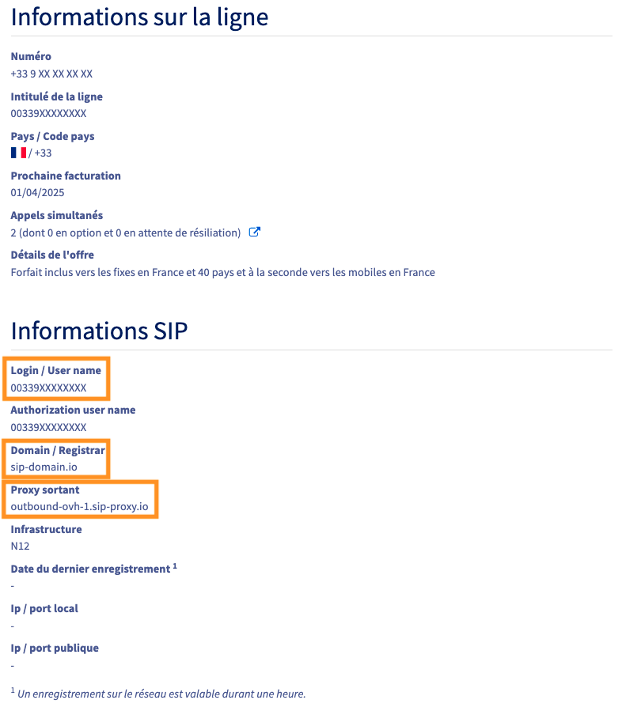

> [!success]
> Vous recherchez une solution de téléphonie fixe professionnelle flexible, que vous pouvez utiliser aussi bien en déplacement et au bureau ? 
> Découvrez [Softcall](https://www.ovhcloud.com/fr/phone/softphone/) », notre service softphone ! 
> Retrouvez plus d'informations sur notre guide « [Installer et configurer Softcall](/pages/web_cloud/phone_and_fax/voip/installer_configurer_softcall) ».

## Objectif

OVHcloud propose des lignes SIP sans matériel pouvant être enregistrées sur des téléphones compatibles SIP ou des *softphones*1 (logiciels de téléphonie). Vous pouvez également les enregistrer sur votre propre téléphone compatible SIP.

1 : _Le softphone est une application ou un logiciel qui vous permet d'enregistrer votre ligne SIP et de l'utiliser depuis un ordinateur, un smartphone ou une tablette._

**Découvrez comment enregistrer et utiliser votre ligne SIP OVHcloud sur un softphone ou sur votre téléphone personnel.**

> [!warning]
>
> OVHcloud met à votre disposition des services dont la configuration, la gestion et la responsabilité vous incombent. Il vous revient de ce fait d'en assurer le bon fonctionnement.
>
> Nous mettons à votre disposition ce tutoriel afin de vous accompagner au mieux sur des tâches courantes. Néanmoins, nous vous recommandons de faire appel à un [prestataire spécialisé](/links/partner) et/ou de contacter l'éditeur du service si vous éprouvez des difficultés. En effet, nous ne serons pas en mesure de vous fournir une assistance. Plus d'informations dans la section « Aller plus loin » de ce guide.
>

## Prérequis

- Disposer d'une [ligne SIP OVHcloud](/links/telecom/telephonie-voip) sans téléphone OVHcloud associé.
- Être connecté à l'[espace client OVHcloud](/links/manager), partie `Télécom`{.action}.

> [!primary]
> Une ligne SIP **fournie avec un téléphone OVHcloud** ne peut pas être enregistrée sur un softphone ou sur votre propre téléphone personnel. Si c'est le cas de votre ligne et que vous souhaitez utiliser un softphone ou votre propre téléphone, nous vous invitons à [commander une ligne SIP supplémentaire](/links/telecom/telephonie-voip), fournie sans téléphone OVHcloud.
>

## En pratique

Avant toute utilisation d'une ligne SIP sans matériel fournie par OVHcloud, nous vous recommandons de **sécuriser** celle-ci. Consultez notre guide pour [sécuriser une ligne SIP OVHcloud](/pages/web_cloud/phone_and_fax/voip/secure-sip-line).

Contrairement aux lignes pré-configurées sur des téléphones OVHcloud, vous avez accès, depuis l'espace client OVHcloud, à la gestion du **mot de passe SIP** d'une ligne sans matériel. Il est primordial de définir un mot de passe SIP **fort**. Retrouvez plus d'informations sur notre guide pour [Modifier le mot de passe d'une ligne SIP](/pages/web_cloud/phone_and_fax/voip/modifier-mot-de-passe-ligne-sip).

### Etape 1 : retrouver vos identifiants SIP

Vous devez **impérativement** disposer des quatre informations suivantes afin de pouvoir enregistrer votre ligne :

|Information|Description|
|---|---|
| Login / User name | Il s'agit du numéro de votre ligne, au format international.|
| Mot de passe SIP | Vous pouvez modifier ce mot de passe depuis votre espace client OVHcloud.|
| Domain / Registrar | Le nom du serveur de téléphonie qui héberge votre ligne.|
| Proxy sortant | C'est l'adresse du serveur qui reçevra les requêtes de votre ligne.|

#### Login, Domain et Proxy sortant

Afin de retrouver votre **Login**, **Domain** et **Proxy sortant**, suivez les étapes ci-dessous :

1. Connectez-vous à votre [espace client OVHcloud](/links/manager) et cliquez sur `Télécom`{.action}.
1. Cliquez sur `VoIP & Fax`{.action} puis sur le groupe de facturation contenant votre ligne SIP.
1. Cliquez sur l'onglet `Services`{.action} puis sur la ligne SIP concernée.
1. Dans l'onglet `Gestion`{.action}, cliquez sur `Informations générales`{.action}.

{.thumbnail}

Vous retrouvez alors, dans le cadre « Informations SIP », votre **Login**, **Domain** et **Proxy sortant**.

{.thumbnail}

> [!warning]
> Dans l'exemple ci-dessus, le **Domain** est `sip-domain.io`. Prenez soin de vérifier quel est le **Domain** de votre ligne SIP, celui-ci pouvant être différent.
> Le **Proxy sortant** est `outbound-ovh-1.sip-proxy.io`, mais il sera différent pour votre ligne SIP.
>

#### Mot de passe SIP

Si vous ne connaissez pas votre mot de passe SIP ou que vous ne l'avez jamais modifié au profit d'un **mot de passe fort**, consultez notre guide pour [Modifier le mot de passe d'une ligne SIP](/pages/web_cloud/phone_and_fax/voip/modifier-mot-de-passe-ligne-sip).

> [!success]
> Vous pouvez utiliser un coffre-fort de mots de passe, comme [KeePass](https://keepass.info/){.external} afin de sauvegarder en toute sécurité votre mot de passe SIP.

### Étape 2 : enregistrer la ligne SIP

Une fois vos identifiants connus, vous pouvez procéder à l'enregistrement de votre ligne sur votre propre téléphone ou sur le softphone de votre choix.

De nombreuses logiciels de ce type sont disponibles. Nous vous proposons de suivre des méthodes pour deux d'entre eux, **Linphone** et **Zoiper**. 
Cliquez sur les liens ci-dessous pour lire les tutoriels :

- [Tutoriel - Enregistrer une ligne SIP OVHcloud sur Linphone](/pages/web_cloud/phone_and_fax/voip/register-sip-softphone-linphone).
- [Tutoriel - Enregistrer une ligne SIP OVHcloud sur Zoiper](/pages/web_cloud/phone_and_fax/voip/register-sip-softphone-zoiper).

## Aller plus loin

Échangez avec notre [communauté d'utilisateurs](/links/community).
